# PRIMARY: POS enrichment partner table joined from hub (`dw_us.dwd_pub_common_order_header_extend`)

- artifact_type: etl_table
- artifact_id: dw_us.dwd_pub_common_order_header_extend
- domain: pos
- one_line_purpose: POS-domain table with load SQL under bitbucket-etl (see L3); prior contract narrative preserved below when present.
- layer_type: DWD
- source_kind: etl_sql
- evidence_source: source/contracts/pos/bitbucket-etl/dwd_pub_common_order_header_extend/dwd_pub_common_order_header_extend_df.sql
- bitbucket_etl_bundle: source/contracts/pos/bitbucket-etl/dwd_pub_common_order_header_extend/
- related_etl_scripts:
- None

---

## L1 Data Foundation

### Identity and physical mapping
- **Table:** `dw_us.dwd_pub_common_order_header_extend`
- **Layer type:** DWD
- **Canonical / derived:** Derived / ETL-loaded (see L3 from bitbucket-etl)
- **Owner team:** Not documented in repository

### Grain, scope, exclusions
- See preserved **Grain and keys** section below when present (POS contract narrative retained).
- Otherwise infer from SELECT / GROUP BY / INSERT column list in `source/contracts/pos/bitbucket-etl/dwd_pub_common_order_header_extend/dwd_pub_common_order_header_extend_df.sql`.

### Cross-engine presence
| Engine | Present | Notes |
|--------|---------|-------|
| Hive | yes | ETL load target |
| Vertica | yes when POS contract documents Vertica sync | See preserved Business query tables |

### Physical schema reference

| Field | Value |
|-------|-------|
| **entity_id** | `dw_us.dwd_pub_common_order_header_extend` |
| **l1_catalog_seed** | `target/storage/wkb/snapshots/_snapshot_id_template/l1_catalog/{engine}_{schema}_{table}.json` |
| **column_count** | pending (run ddl_seed_writer) |
| **partition_keys** | See preserved Grain / L4 / ETL PARTITION clause |
| **ddl_source** | pending |
| **retrieval** | `python -m tools.wkb.indexing.run_query --query "pos dwd_pub_common_order_header_extend schema" --intent find_table_schema` |

### Lineage

- **Primary load:** `source/contracts/pos/bitbucket-etl/dwd_pub_common_order_header_extend/dwd_pub_common_order_header_extend_df.sql`
- **upstream:** `ods_${country_code}.ods_etl_order_comments_all` — FROM/JOIN — `source/contracts/pos/bitbucket-etl/dwd_pub_common_order_header_extend/dwd_pub_common_order_header_extend_df.sql`
- **upstream:** `tmp_order_comments` — FROM/JOIN — `source/contracts/pos/bitbucket-etl/dwd_pub_common_order_header_extend/dwd_pub_common_order_header_extend_df.sql`
- **upstream:** `tmp_order_comments_col` — FROM/JOIN — `source/contracts/pos/bitbucket-etl/dwd_pub_common_order_header_extend/dwd_pub_common_order_header_extend_df.sql`
- **upstream:** `ods_${country_code}.ods_etl_eu_custom_all` — FROM/JOIN — `source/contracts/pos/bitbucket-etl/dwd_pub_common_order_header_extend/dwd_pub_common_order_header_extend_df.sql`
- **upstream:** `ods_${country_code}.ods_cis_corp_eu_custom_map` — FROM/JOIN — `source/contracts/pos/bitbucket-etl/dwd_pub_common_order_header_extend/dwd_pub_common_order_header_extend_df.sql`
- **upstream:** `ods_${country_code}.ods_cis_corp_list_box_detail` — FROM/JOIN — `source/contracts/pos/bitbucket-etl/dwd_pub_common_order_header_extend/dwd_pub_common_order_header_extend_df.sql`
- **upstream:** `ods_${country_code}.ods_etl_addr_xref_all` — FROM/JOIN — `source/contracts/pos/bitbucket-etl/dwd_pub_common_order_header_extend/dwd_pub_common_order_header_extend_df.sql`
- **upstream:** `ods_${country_code}.ods_etl_address_all` — FROM/JOIN — `source/contracts/pos/bitbucket-etl/dwd_pub_common_order_header_extend/dwd_pub_common_order_header_extend_df.sql`
- **upstream:** `ods_${country_code}.ods_etl_order_profile_all` — FROM/JOIN — `source/contracts/pos/bitbucket-etl/dwd_pub_common_order_header_extend/dwd_pub_common_order_header_extend_df.sql`
- **upstream:** `ods_${country_code}.ods_etl_order_exp_all` — FROM/JOIN — `source/contracts/pos/bitbucket-etl/dwd_pub_common_order_header_extend/dwd_pub_common_order_header_extend_df.sql`
- **upstream:** `dim_${country_code}.dim_pub_list_box_detail` — FROM/JOIN — `source/contracts/pos/bitbucket-etl/dwd_pub_common_order_header_extend/dwd_pub_common_order_header_extend_df.sql`
- **upstream:** `ods_${country_code}.ods_etl_carton_header_all` — FROM/JOIN — `source/contracts/pos/bitbucket-etl/dwd_pub_common_order_header_extend/dwd_pub_common_order_header_extend_df.sql`
- **upstream:** `tmp_extended_exp` — FROM/JOIN — `source/contracts/pos/bitbucket-etl/dwd_pub_common_order_header_extend/dwd_pub_common_order_header_extend_df.sql`
- **upstream:** `tmp_extended_exp_taxc_all` — FROM/JOIN — `source/contracts/pos/bitbucket-etl/dwd_pub_common_order_header_extend/dwd_pub_common_order_header_extend_df.sql`
- **upstream:** `tmp_etl_carton_header_all` — FROM/JOIN — `source/contracts/pos/bitbucket-etl/dwd_pub_common_order_header_extend/dwd_pub_common_order_header_extend_df.sql`
- **upstream:** `ods_${country_code}.ods_etl_order_header_all` — FROM/JOIN — `source/contracts/pos/bitbucket-etl/dwd_pub_common_order_header_extend/dwd_pub_common_order_header_extend_df.sql`
- **upstream:** `ods_${country_code}.ods_etl_order_eu_common_all` — FROM/JOIN — `source/contracts/pos/bitbucket-etl/dwd_pub_common_order_header_extend/dwd_pub_common_order_header_extend_df.sql`
- **upstream:** `ods_${country_code}.ods_cis_corp_order_header` — FROM/JOIN — `source/contracts/pos/bitbucket-etl/dwd_pub_common_order_header_extend/dwd_pub_common_order_header_extend_df.sql`
- **upstream:** `ods_${country_code}.ods_cis_corp_history_gv` — FROM/JOIN — `source/contracts/pos/bitbucket-etl/dwd_pub_common_order_header_extend/dwd_pub_common_order_header_extend_df.sql`
- **upstream:** `tmp_gv_po_bid_col` — FROM/JOIN — `source/contracts/pos/bitbucket-etl/dwd_pub_common_order_header_extend/dwd_pub_common_order_header_extend_df.sql`
- **downstream:** see L6 Downstream consumers
### Freshness and load path
- Parameters / date window: see ETL `${literal_*}` / `${date_flag}` / `${start_date}` in evidence script.
- Schedule: Not documented in repository

## L2 Declarative Knowledge

### Business purpose
See preserved **Business purpose** below when present (POS contract catalog + linked ETL).

### Audience and use cases
See preserved **Who it helps** section when present.

### Fact key resolution
See preserved **Grain and keys** when present.

### Time field semantics
- Prefer partition / `date_flag` filters documented in preserved sections and L3 Key filters from ETL.

### Metrics served
See preserved Metrics / column groups when present; otherwise L3 column derivations.

### Metric serving map
N/A unless multi-period wide table (see preserved content).

### etl_metrics
No new metric-index formulas appended in this bitbucket-etl upgrade pass.

## L3 Procedural Knowledge

### Query and routing rules
- Reporting: Vertica `dw_us.dwd_pub_common_order_header_extend` when synced (see preserved Business query tables).
- Load logic: bitbucket-etl evidence `source/contracts/pos/bitbucket-etl/dwd_pub_common_order_header_extend/dwd_pub_common_order_header_extend_df.sql`.

### Dimension join patterns
See Relationship map (ETL JOIN edges) and preserved contract join notes.

### Key filters and ETL business logic

| Predicate | Kind | Evidence |
|-----------|------|----------|
| `comment_type in ( 'WL', 'GE', 'II','EM','L1','SA'); CREATE TEMPORARY TABLE tmp_order_comments_col AS select order_no, order_type, max(case when comment_type = 'WL' AND comment_loc = '1' then commen...` | Business | `source/contracts/pos/bitbucket-etl/dwd_pub_common_order_header_extend/dwd_pub_common_order_header_extend_df.sql` |
| `b.map_data_desc='PBID' and a.delete_date is null and b.delete_date is null` | Business | `source/contracts/pos/bitbucket-etl/dwd_pub_common_order_header_extend/dwd_pub_common_order_header_extend_df.sql` |
| `profile_type='SPA_REF_NO' and order_line_no is null and active='Y'` | Business | `source/contracts/pos/bitbucket-etl/dwd_pub_common_order_header_extend/dwd_pub_common_order_header_extend_df.sql` |
| `b.exp_type = 'F' and b.delete_date is null and b.order_exp_type = 'HE' and b.exp_code in ('FRT','FADD','COD','FDS','MOF','TAX')` | Business | `source/contracts/pos/bitbucket-etl/dwd_pub_common_order_header_extend/dwd_pub_common_order_header_extend_df.sql` |
| `b.exp_type = 'F' and b.order_exp_type = 'HE' and b.delete_date is null AND exp_code IN ( SELECT code_value FROM dim_${country_code}.dim_pub_list_box_detail WHERE list_box_code = 'TAXC' )` | Business | `source/contracts/pos/bitbucket-etl/dwd_pub_common_order_header_extend/dwd_pub_common_order_header_extend_df.sql` |

### Standard time-filter SQL
```sql
-- Prefer date_flag / literal_start_date / literal_end_date as used in source/contracts/pos/bitbucket-etl/dwd_pub_common_order_header_extend/dwd_pub_common_order_header_extend_df.sql
```

### End-to-end flow

```mermaid
flowchart LR
  S0["ods_${country_code}.ods_etl_order_comments_all"] --> T["dw_us.dwd_pub_common_order_header_extend"]
  S1["tmp_order_comments"] --> T["dw_us.dwd_pub_common_order_header_extend"]
  S2["tmp_order_comments_col"] --> T["dw_us.dwd_pub_common_order_header_extend"]
  S3["ods_${country_code}.ods_etl_eu_custom_all"] --> T["dw_us.dwd_pub_common_order_header_extend"]
  S4["ods_${country_code}.ods_cis_corp_eu_custom_map"] --> T["dw_us.dwd_pub_common_order_header_extend"]
  S5["ods_${country_code}.ods_cis_corp_list_box_detail"] --> T["dw_us.dwd_pub_common_order_header_extend"]
  S6["ods_${country_code}.ods_etl_addr_xref_all"] --> T["dw_us.dwd_pub_common_order_header_extend"]
  S7["ods_${country_code}.ods_etl_address_all"] --> T["dw_us.dwd_pub_common_order_header_extend"]
  S8["ods_${country_code}.ods_etl_order_profile_all"] --> T["dw_us.dwd_pub_common_order_header_extend"]
  S9["ods_${country_code}.ods_etl_order_exp_all"] --> T["dw_us.dwd_pub_common_order_header_extend"]
  S10["dim_${country_code}.dim_pub_list_box_detail"] --> T["dw_us.dwd_pub_common_order_header_extend"]
  S11["ods_${country_code}.ods_etl_carton_header_all"] --> T["dw_us.dwd_pub_common_order_header_extend"]
```


### Base tables register
| Object | Role |
|--------|------|
| `ods_${country_code}.ods_etl_order_comments_all` | source / temp (FROM/JOIN) |
| `tmp_order_comments` | source / temp (FROM/JOIN) |
| `tmp_order_comments_col` | source / temp (FROM/JOIN) |
| `ods_${country_code}.ods_etl_eu_custom_all` | source / temp (FROM/JOIN) |
| `ods_${country_code}.ods_cis_corp_eu_custom_map` | source / temp (FROM/JOIN) |
| `ods_${country_code}.ods_cis_corp_list_box_detail` | source / temp (FROM/JOIN) |
| `ods_${country_code}.ods_etl_addr_xref_all` | source / temp (FROM/JOIN) |
| `ods_${country_code}.ods_etl_address_all` | source / temp (FROM/JOIN) |
| `ods_${country_code}.ods_etl_order_profile_all` | source / temp (FROM/JOIN) |
| `ods_${country_code}.ods_etl_order_exp_all` | source / temp (FROM/JOIN) |
| `dim_${country_code}.dim_pub_list_box_detail` | source / temp (FROM/JOIN) |
| `ods_${country_code}.ods_etl_carton_header_all` | source / temp (FROM/JOIN) |
| `tmp_extended_exp` | source / temp (FROM/JOIN) |
| `tmp_extended_exp_taxc_all` | source / temp (FROM/JOIN) |
| `tmp_etl_carton_header_all` | source / temp (FROM/JOIN) |
| `ods_${country_code}.ods_etl_order_header_all` | source / temp (FROM/JOIN) |
| `ods_${country_code}.ods_etl_order_eu_common_all` | source / temp (FROM/JOIN) |
| `ods_${country_code}.ods_cis_corp_order_header` | source / temp (FROM/JOIN) |
| `ods_${country_code}.ods_cis_corp_history_gv` | source / temp (FROM/JOIN) |
| `tmp_gv_po_bid_col` | source / temp (FROM/JOIN) |
| `ods_${country_code}.ods_cis_corp_gv_user_type` | source / temp (FROM/JOIN) |
| `ods_${country_code}.ods_etl_order_soldto_all` | source / temp (FROM/JOIN) |
| `ods_${country_code}.ods_etl_customer_header_all` | source / temp (FROM/JOIN) |
| `tmp_address` | source / temp (FROM/JOIN) |
| `ods_${country_code}.ods_cis_corp_manager` | source / temp (FROM/JOIN) |

### Step-by-step logic
1. Execute load SQL / python in `source/contracts/pos/bitbucket-etl/dwd_pub_common_order_header_extend/`.
2. Apply date / business filters from ETL (Key filters).
3. Write target `dw_us.dwd_pub_common_order_header_extend` (see INSERT/OVERWRITE in evidence).

### Relationship map (embedded)

| from_fqn | to_fqn | cardinality | join_keys | provenance |
|----------|--------|-------------|-----------|------------|
| `ods_${country_code}.ods_etl_order_header_all` | `ods_${country_code}.ods_cis_corp_eu_custom_map` | many:1 | `a.eu_map_id` = `b.eu_map_id`; `a.eu_map_line_no` = `b.eu_map_line_no` | etl_sql (`source/contracts/pos/bitbucket-etl/dwd_pub_common_order_header_extend/dwd_pub_common_order_header_extend_df.sql:47`) |
| `ods_${country_code}.ods_etl_eu_custom_all` | `ods_${country_code}.ods_cis_corp_eu_custom_map` | many:1 | `ec.eu_map_id` = `ecm.eu_map_id`; `ec.eu_map_line_no` = `ecm.eu_map_line_no` | etl_sql (`source/contracts/pos/bitbucket-etl/dwd_pub_common_order_header_extend/dwd_pub_common_order_header_extend_df.sql:62`) |
| `ods_${country_code}.ods_cis_corp_eu_custom_map` | `ods_${country_code}.ods_cis_corp_list_box_detail` | many:1 | `lbd.code_value` = `ecm.map_data_desc` | etl_sql (`source/contracts/pos/bitbucket-etl/dwd_pub_common_order_header_extend/dwd_pub_common_order_header_extend_df.sql:66`) |
| `ods_${country_code}.ods_etl_addr_xref_all` | `ods_${country_code}.ods_etl_address_all` | many:1 | `ax.addr_no` = `addr.addr_no` | etl_sql (`source/contracts/pos/bitbucket-etl/dwd_pub_common_order_header_extend/dwd_pub_common_order_header_extend_df.sql:84`) |
| `ods_${country_code}.ods_etl_order_header_all` | `tmp_extended_exp_taxc_all` | many:1 (LEFT) | `a.order_type` = `b.order_type`; `a.order_no` = `b.order_no` | etl_sql (`source/contracts/pos/bitbucket-etl/dwd_pub_common_order_header_extend/dwd_pub_common_order_header_extend_df.sql:156`) |
| `ods_${country_code}.ods_etl_order_header_all` | `tmp_etl_carton_header_all` | many:1 (LEFT) | `a.order_type` = `c.order_type`; `a.order_no` = `c.order_no` | etl_sql (`source/contracts/pos/bitbucket-etl/dwd_pub_common_order_header_extend/dwd_pub_common_order_header_extend_df.sql:159`) |
| `ods_${country_code}.ods_etl_order_header_all` | `ods_${country_code}.ods_etl_order_header_all` | many:1 (LEFT) | `a.int_ref_no` = `b.order_no`; `a.int_ref_type` = `b.order_type` | etl_sql (`source/contracts/pos/bitbucket-etl/dwd_pub_common_order_header_extend/dwd_pub_common_order_header_extend_df.sql:170`) |
| `ods_${country_code}.ods_cis_corp_order_header` | `ods_${country_code}.ods_cis_corp_history_gv` | many:1 (LEFT) | `h.order_no` = `g.order_no`; `h.order_type` = `g.order_type` | etl_sql (`source/contracts/pos/bitbucket-etl/dwd_pub_common_order_header_extend/dwd_pub_common_order_header_extend_df.sql:347`) |
| `ods_${country_code}.ods_cis_corp_order_header` | `tmp_gv_po_bid_col` | many:1 (LEFT) | `h.order_no` = `gpb.order_no`; `h.order_type` = `gpb.order_type` | etl_sql (`source/contracts/pos/bitbucket-etl/dwd_pub_common_order_header_extend/dwd_pub_common_order_header_extend_df.sql:351`) |
| `ods_${country_code}.ods_cis_corp_history_gv` | `ods_${country_code}.ods_cis_corp_gv_user_type` | many:1 (LEFT) | `gut.gv_user_type` = `g.gv_user_type` | etl_sql (`source/contracts/pos/bitbucket-etl/dwd_pub_common_order_header_extend/dwd_pub_common_order_header_extend_df.sql:355`) |
| `ods_${country_code}.ods_cis_corp_order_header` | `ods_${country_code}.ods_etl_order_soldto_all` | many:1 (LEFT) | `h.order_no` = `s.order_no`; `h.order_type` = `s.order_type` | etl_sql (`source/contracts/pos/bitbucket-etl/dwd_pub_common_order_header_extend/dwd_pub_common_order_header_extend_df.sql:358`) |
| `ods_${country_code}.ods_etl_order_soldto_all` | `ods_${country_code}.ods_etl_customer_header_all` | many:1 (LEFT) | `s.to_acct_no` = `ch.cust_no` | etl_sql (`source/contracts/pos/bitbucket-etl/dwd_pub_common_order_header_extend/dwd_pub_common_order_header_extend_df.sql:362`) |
| `ods_${country_code}.ods_etl_order_soldto_all` | `tmp_address` | many:1 (LEFT) | `s.to_acct_no` = `addr.xref_no`; `s.to_loc_no` = `addr.xref_seq` | etl_sql (`source/contracts/pos/bitbucket-etl/dwd_pub_common_order_header_extend/dwd_pub_common_order_header_extend_df.sql:365`) |
| `ods_${country_code}.ods_cis_corp_order_header` | `ods_${country_code}.ods_cis_corp_manager` | many:1 (LEFT) | `mgr.userid` = `h.entry_id` | etl_sql (`source/contracts/pos/bitbucket-etl/dwd_pub_common_order_header_extend/dwd_pub_common_order_header_extend_df.sql:368`) |
| `ods_${country_code}.ods_cis_corp_order_header` | `tmp_order_comments_col` | many:1 (LEFT) | `h.order_no` = `hc.order_no`; `h.order_type` = `hc.order_type` | etl_sql (`source/contracts/pos/bitbucket-etl/dwd_pub_common_order_header_extend/dwd_pub_common_order_header_extend_df.sql:371`) |
| `ods_${country_code}.ods_cis_corp_order_header` | `tmp_order_comments_contact` | many:1 (LEFT) | `h.order_no` = `ohc.order_no`; `h.order_type` = `ohc.order_type` | etl_sql (`source/contracts/pos/bitbucket-etl/dwd_pub_common_order_header_extend/dwd_pub_common_order_header_extend_df.sql:375`) |
| `ods_${country_code}.ods_etl_order_comments_all` | `ods_${country_code}.ods_etl_order_header_all` | many:1 (LEFT) | h2.order_no = (case when h.order_type = 1 and h.from_loc_no = 98 and h.from_inv_type in (100, 200) then h.int_ref_no else null end) and h2.order_type = 2 and... | etl_sql (`source/contracts/pos/bitbucket-etl/dwd_pub_common_order_header_extend/dwd_pub_common_order_header_extend_df.sql:379`) |
| `ods_${country_code}.ods_cis_corp_order_header` | `ods_${country_code}.ods_etl_order_eu_common_all` | many:1 (LEFT) | `h.order_no` = `hec.order_no`; `h.order_type` = `hec.order_type` | etl_sql (`source/contracts/pos/bitbucket-etl/dwd_pub_common_order_header_extend/dwd_pub_common_order_header_extend_df.sql:390`) |
| `ods_${country_code}.ods_cis_corp_order_header` | `tmp_history_deal_id` | many:1 (LEFT) | `h.order_no` = `hdi.order_no`; `h.order_type` = `hdi.order_type` | etl_sql (`source/contracts/pos/bitbucket-etl/dwd_pub_common_order_header_extend/dwd_pub_common_order_header_extend_df.sql:395`) |
| `ods_${country_code}.ods_cis_corp_order_header` | `tmp_profile_big_deal` | many:1 (LEFT) | `h.order_no` = `tpb.order_no`; `h.order_type` = `tpb.order_type` | etl_sql (`source/contracts/pos/bitbucket-etl/dwd_pub_common_order_header_extend/dwd_pub_common_order_header_extend_df.sql:399`) |
| `ods_${country_code}.ods_cis_corp_order_header` | `tmp_ext_exp_track_no` | many:1 (LEFT) | `h.order_type` = `exp.order_type`; `h.order_no` = `exp.order_no` | etl_sql (`source/contracts/pos/bitbucket-etl/dwd_pub_common_order_header_extend/dwd_pub_common_order_header_extend_df.sql:402`) |
| `ods_${country_code}.ods_cis_corp_order_header` | `temp_cpo_no` | many:1 (LEFT) | `h.order_no` = `cn.order_no`; `h.order_type` = `cn.order_type` | etl_sql (`source/contracts/pos/bitbucket-etl/dwd_pub_common_order_header_extend/dwd_pub_common_order_header_extend_df.sql:405`) |
| `ods_${country_code}.ods_cis_corp_order_header` | `temp_eu_contact` | many:1 (LEFT) | `h.order_no` = `tec.order_no`; `h.order_type` = `tec.order_type` | etl_sql (`source/contracts/pos/bitbucket-etl/dwd_pub_common_order_header_extend/dwd_pub_common_order_header_extend_df.sql:408`) |

### Special logic (embedded)

`source/ref/pos/special_logic.txt` exists but no rule naming this FQN/stem (`dw_us.dwd_pub_common_order_header_extend`).

Not documented in repository


### Column / field derivations (from ETL SQL)

| target_column | expression_sql | upstream_columns | upstream_tables | transform_kind | evidence |
|---------------|----------------|------------------|-----------------|----------------|----------|
| `order_type` | `h.order_type` | `order_type` | `ods_${country_code}.ods_cis_corp_order_header`, `ods_${country_code}.ods_cis_corp_history_gv`, `tmp_gv_po_bid_col`, `ods_${country_code}.ods_cis_corp_gv_user_type`, `ods_${country_code}.ods_etl_order_soldto_all`, `ods_${country_code}.ods_etl_customer_header_all`, `tmp_address`, `ods_${country_code}.ods_cis_corp_manager`, `tmp_order_comments_col`, `tmp_order_comments_contact`, `ods_${country_code}.ods_etl_order_header_all`, `ods_${country_code}.ods_etl_order_eu_common_all` | passthrough | `source/contracts/pos/bitbucket-etl/dwd_pub_common_order_header_extend/dwd_pub_common_order_header_extend_df.sql:192` |
| `order_no` | `h.order_no` | `order_no` | `ods_${country_code}.ods_cis_corp_order_header`, `ods_${country_code}.ods_cis_corp_history_gv`, `tmp_gv_po_bid_col`, `ods_${country_code}.ods_cis_corp_gv_user_type`, `ods_${country_code}.ods_etl_order_soldto_all`, `ods_${country_code}.ods_etl_customer_header_all`, `tmp_address`, `ods_${country_code}.ods_cis_corp_manager`, `tmp_order_comments_col`, `tmp_order_comments_contact`, `ods_${country_code}.ods_etl_order_header_all`, `ods_${country_code}.ods_etl_order_eu_common_all` | passthrough | `source/contracts/pos/bitbucket-etl/dwd_pub_common_order_header_extend/dwd_pub_common_order_header_extend_df.sql:193` |
| `from_acct_no` | `h.from_acct_no` | `from_acct_no` | `ods_${country_code}.ods_cis_corp_order_header`, `ods_${country_code}.ods_cis_corp_history_gv`, `tmp_gv_po_bid_col`, `ods_${country_code}.ods_cis_corp_gv_user_type`, `ods_${country_code}.ods_etl_order_soldto_all`, `ods_${country_code}.ods_etl_customer_header_all`, `tmp_address`, `ods_${country_code}.ods_cis_corp_manager`, `tmp_order_comments_col`, `tmp_order_comments_contact`, `ods_${country_code}.ods_etl_order_header_all`, `ods_${country_code}.ods_etl_order_eu_common_all` | passthrough | `source/contracts/pos/bitbucket-etl/dwd_pub_common_order_header_extend/dwd_pub_common_order_header_extend_df.sql:194` |
| `from_loc_no` | `h.from_loc_no` | `from_loc_no` | `ods_${country_code}.ods_cis_corp_order_header`, `ods_${country_code}.ods_cis_corp_history_gv`, `tmp_gv_po_bid_col`, `ods_${country_code}.ods_cis_corp_gv_user_type`, `ods_${country_code}.ods_etl_order_soldto_all`, `ods_${country_code}.ods_etl_customer_header_all`, `tmp_address`, `ods_${country_code}.ods_cis_corp_manager`, `tmp_order_comments_col`, `tmp_order_comments_contact`, `ods_${country_code}.ods_etl_order_header_all`, `ods_${country_code}.ods_etl_order_eu_common_all` | passthrough | `source/contracts/pos/bitbucket-etl/dwd_pub_common_order_header_extend/dwd_pub_common_order_header_extend_df.sql:195` |
| `from_contact_no` | `h.from_contact_no` | `from_contact_no` | `ods_${country_code}.ods_cis_corp_order_header`, `ods_${country_code}.ods_cis_corp_history_gv`, `tmp_gv_po_bid_col`, `ods_${country_code}.ods_cis_corp_gv_user_type`, `ods_${country_code}.ods_etl_order_soldto_all`, `ods_${country_code}.ods_etl_customer_header_all`, `tmp_address`, `ods_${country_code}.ods_cis_corp_manager`, `tmp_order_comments_col`, `tmp_order_comments_contact`, `ods_${country_code}.ods_etl_order_header_all`, `ods_${country_code}.ods_etl_order_eu_common_all` | passthrough | `source/contracts/pos/bitbucket-etl/dwd_pub_common_order_header_extend/dwd_pub_common_order_header_extend_df.sql:196` |
| `from_dept_no` | `h.from_dept_no` | `from_dept_no` | `ods_${country_code}.ods_cis_corp_order_header`, `ods_${country_code}.ods_cis_corp_history_gv`, `tmp_gv_po_bid_col`, `ods_${country_code}.ods_cis_corp_gv_user_type`, `ods_${country_code}.ods_etl_order_soldto_all`, `ods_${country_code}.ods_etl_customer_header_all`, `tmp_address`, `ods_${country_code}.ods_cis_corp_manager`, `tmp_order_comments_col`, `tmp_order_comments_contact`, `ods_${country_code}.ods_etl_order_header_all`, `ods_${country_code}.ods_etl_order_eu_common_all` | passthrough | `source/contracts/pos/bitbucket-etl/dwd_pub_common_order_header_extend/dwd_pub_common_order_header_extend_df.sql:197` |
| `from_inv_type` | `h.from_inv_type` | `from_inv_type` | `ods_${country_code}.ods_cis_corp_order_header`, `ods_${country_code}.ods_cis_corp_history_gv`, `tmp_gv_po_bid_col`, `ods_${country_code}.ods_cis_corp_gv_user_type`, `ods_${country_code}.ods_etl_order_soldto_all`, `ods_${country_code}.ods_etl_customer_header_all`, `tmp_address`, `ods_${country_code}.ods_cis_corp_manager`, `tmp_order_comments_col`, `tmp_order_comments_contact`, `ods_${country_code}.ods_etl_order_header_all`, `ods_${country_code}.ods_etl_order_eu_common_all` | passthrough | `source/contracts/pos/bitbucket-etl/dwd_pub_common_order_header_extend/dwd_pub_common_order_header_extend_df.sql:198` |
| `to_acct_no` | `h.to_acct_no` | `to_acct_no` | `ods_${country_code}.ods_cis_corp_order_header`, `ods_${country_code}.ods_cis_corp_history_gv`, `tmp_gv_po_bid_col`, `ods_${country_code}.ods_cis_corp_gv_user_type`, `ods_${country_code}.ods_etl_order_soldto_all`, `ods_${country_code}.ods_etl_customer_header_all`, `tmp_address`, `ods_${country_code}.ods_cis_corp_manager`, `tmp_order_comments_col`, `tmp_order_comments_contact`, `ods_${country_code}.ods_etl_order_header_all`, `ods_${country_code}.ods_etl_order_eu_common_all` | passthrough | `source/contracts/pos/bitbucket-etl/dwd_pub_common_order_header_extend/dwd_pub_common_order_header_extend_df.sql:199` |
| `to_loc_no` | `h.to_loc_no` | `to_loc_no` | `ods_${country_code}.ods_cis_corp_order_header`, `ods_${country_code}.ods_cis_corp_history_gv`, `tmp_gv_po_bid_col`, `ods_${country_code}.ods_cis_corp_gv_user_type`, `ods_${country_code}.ods_etl_order_soldto_all`, `ods_${country_code}.ods_etl_customer_header_all`, `tmp_address`, `ods_${country_code}.ods_cis_corp_manager`, `tmp_order_comments_col`, `tmp_order_comments_contact`, `ods_${country_code}.ods_etl_order_header_all`, `ods_${country_code}.ods_etl_order_eu_common_all` | passthrough | `source/contracts/pos/bitbucket-etl/dwd_pub_common_order_header_extend/dwd_pub_common_order_header_extend_df.sql:200` |
| `to_contact_no` | `h.to_contact_no` | `to_contact_no` | `ods_${country_code}.ods_cis_corp_order_header`, `ods_${country_code}.ods_cis_corp_history_gv`, `tmp_gv_po_bid_col`, `ods_${country_code}.ods_cis_corp_gv_user_type`, `ods_${country_code}.ods_etl_order_soldto_all`, `ods_${country_code}.ods_etl_customer_header_all`, `tmp_address`, `ods_${country_code}.ods_cis_corp_manager`, `tmp_order_comments_col`, `tmp_order_comments_contact`, `ods_${country_code}.ods_etl_order_header_all`, `ods_${country_code}.ods_etl_order_eu_common_all` | passthrough | `source/contracts/pos/bitbucket-etl/dwd_pub_common_order_header_extend/dwd_pub_common_order_header_extend_df.sql:201` |
| `to_dept_no` | `h.to_dept_no` | `to_dept_no` | `ods_${country_code}.ods_cis_corp_order_header`, `ods_${country_code}.ods_cis_corp_history_gv`, `tmp_gv_po_bid_col`, `ods_${country_code}.ods_cis_corp_gv_user_type`, `ods_${country_code}.ods_etl_order_soldto_all`, `ods_${country_code}.ods_etl_customer_header_all`, `tmp_address`, `ods_${country_code}.ods_cis_corp_manager`, `tmp_order_comments_col`, `tmp_order_comments_contact`, `ods_${country_code}.ods_etl_order_header_all`, `ods_${country_code}.ods_etl_order_eu_common_all` | passthrough | `source/contracts/pos/bitbucket-etl/dwd_pub_common_order_header_extend/dwd_pub_common_order_header_extend_df.sql:202` |
| `to_inv_type` | `h.to_inv_type` | `to_inv_type` | `ods_${country_code}.ods_cis_corp_order_header`, `ods_${country_code}.ods_cis_corp_history_gv`, `tmp_gv_po_bid_col`, `ods_${country_code}.ods_cis_corp_gv_user_type`, `ods_${country_code}.ods_etl_order_soldto_all`, `ods_${country_code}.ods_etl_customer_header_all`, `tmp_address`, `ods_${country_code}.ods_cis_corp_manager`, `tmp_order_comments_col`, `tmp_order_comments_contact`, `ods_${country_code}.ods_etl_order_header_all`, `ods_${country_code}.ods_etl_order_eu_common_all` | passthrough | `source/contracts/pos/bitbucket-etl/dwd_pub_common_order_header_extend/dwd_pub_common_order_header_extend_df.sql:203` |
| `ship_to_name` | `h.ship_to_name` | `ship_to_name` | `ods_${country_code}.ods_cis_corp_order_header`, `ods_${country_code}.ods_cis_corp_history_gv`, `tmp_gv_po_bid_col`, `ods_${country_code}.ods_cis_corp_gv_user_type`, `ods_${country_code}.ods_etl_order_soldto_all`, `ods_${country_code}.ods_etl_customer_header_all`, `tmp_address`, `ods_${country_code}.ods_cis_corp_manager`, `tmp_order_comments_col`, `tmp_order_comments_contact`, `ods_${country_code}.ods_etl_order_header_all`, `ods_${country_code}.ods_etl_order_eu_common_all` | passthrough | `source/contracts/pos/bitbucket-etl/dwd_pub_common_order_header_extend/dwd_pub_common_order_header_extend_df.sql:204` |
| `ship_to_addr` | `h.ship_to_addr` | `ship_to_addr` | `ods_${country_code}.ods_cis_corp_order_header`, `ods_${country_code}.ods_cis_corp_history_gv`, `tmp_gv_po_bid_col`, `ods_${country_code}.ods_cis_corp_gv_user_type`, `ods_${country_code}.ods_etl_order_soldto_all`, `ods_${country_code}.ods_etl_customer_header_all`, `tmp_address`, `ods_${country_code}.ods_cis_corp_manager`, `tmp_order_comments_col`, `tmp_order_comments_contact`, `ods_${country_code}.ods_etl_order_header_all`, `ods_${country_code}.ods_etl_order_eu_common_all` | passthrough | `source/contracts/pos/bitbucket-etl/dwd_pub_common_order_header_extend/dwd_pub_common_order_header_extend_df.sql:205` |
| `ship_to_po_box` | `h.ship_to_po_box` | `ship_to_po_box` | `ods_${country_code}.ods_cis_corp_order_header`, `ods_${country_code}.ods_cis_corp_history_gv`, `tmp_gv_po_bid_col`, `ods_${country_code}.ods_cis_corp_gv_user_type`, `ods_${country_code}.ods_etl_order_soldto_all`, `ods_${country_code}.ods_etl_customer_header_all`, `tmp_address`, `ods_${country_code}.ods_cis_corp_manager`, `tmp_order_comments_col`, `tmp_order_comments_contact`, `ods_${country_code}.ods_etl_order_header_all`, `ods_${country_code}.ods_etl_order_eu_common_all` | passthrough | `source/contracts/pos/bitbucket-etl/dwd_pub_common_order_header_extend/dwd_pub_common_order_header_extend_df.sql:206` |
| `ship_to_city` | `h.ship_to_city` | `ship_to_city` | `ods_${country_code}.ods_cis_corp_order_header`, `ods_${country_code}.ods_cis_corp_history_gv`, `tmp_gv_po_bid_col`, `ods_${country_code}.ods_cis_corp_gv_user_type`, `ods_${country_code}.ods_etl_order_soldto_all`, `ods_${country_code}.ods_etl_customer_header_all`, `tmp_address`, `ods_${country_code}.ods_cis_corp_manager`, `tmp_order_comments_col`, `tmp_order_comments_contact`, `ods_${country_code}.ods_etl_order_header_all`, `ods_${country_code}.ods_etl_order_eu_common_all` | passthrough | `source/contracts/pos/bitbucket-etl/dwd_pub_common_order_header_extend/dwd_pub_common_order_header_extend_df.sql:207` |
| `ship_to_state` | `h.ship_to_state` | `ship_to_state` | `ods_${country_code}.ods_cis_corp_order_header`, `ods_${country_code}.ods_cis_corp_history_gv`, `tmp_gv_po_bid_col`, `ods_${country_code}.ods_cis_corp_gv_user_type`, `ods_${country_code}.ods_etl_order_soldto_all`, `ods_${country_code}.ods_etl_customer_header_all`, `tmp_address`, `ods_${country_code}.ods_cis_corp_manager`, `tmp_order_comments_col`, `tmp_order_comments_contact`, `ods_${country_code}.ods_etl_order_header_all`, `ods_${country_code}.ods_etl_order_eu_common_all` | passthrough | `source/contracts/pos/bitbucket-etl/dwd_pub_common_order_header_extend/dwd_pub_common_order_header_extend_df.sql:208` |
| `ship_to_country` | `h.ship_to_country` | `ship_to_country` | `ods_${country_code}.ods_cis_corp_order_header`, `ods_${country_code}.ods_cis_corp_history_gv`, `tmp_gv_po_bid_col`, `ods_${country_code}.ods_cis_corp_gv_user_type`, `ods_${country_code}.ods_etl_order_soldto_all`, `ods_${country_code}.ods_etl_customer_header_all`, `tmp_address`, `ods_${country_code}.ods_cis_corp_manager`, `tmp_order_comments_col`, `tmp_order_comments_contact`, `ods_${country_code}.ods_etl_order_header_all`, `ods_${country_code}.ods_etl_order_eu_common_all` | passthrough | `source/contracts/pos/bitbucket-etl/dwd_pub_common_order_header_extend/dwd_pub_common_order_header_extend_df.sql:209` |
| `ship_to_zip` | `h.ship_to_zip` | `ship_to_zip` | `ods_${country_code}.ods_cis_corp_order_header`, `ods_${country_code}.ods_cis_corp_history_gv`, `tmp_gv_po_bid_col`, `ods_${country_code}.ods_cis_corp_gv_user_type`, `ods_${country_code}.ods_etl_order_soldto_all`, `ods_${country_code}.ods_etl_customer_header_all`, `tmp_address`, `ods_${country_code}.ods_cis_corp_manager`, `tmp_order_comments_col`, `tmp_order_comments_contact`, `ods_${country_code}.ods_etl_order_header_all`, `ods_${country_code}.ods_etl_order_eu_common_all` | passthrough | `source/contracts/pos/bitbucket-etl/dwd_pub_common_order_header_extend/dwd_pub_common_order_header_extend_df.sql:210` |
| `account_rep` | `h.account_rep` | `account_rep` | `ods_${country_code}.ods_cis_corp_order_header`, `ods_${country_code}.ods_cis_corp_history_gv`, `tmp_gv_po_bid_col`, `ods_${country_code}.ods_cis_corp_gv_user_type`, `ods_${country_code}.ods_etl_order_soldto_all`, `ods_${country_code}.ods_etl_customer_header_all`, `tmp_address`, `ods_${country_code}.ods_cis_corp_manager`, `tmp_order_comments_col`, `tmp_order_comments_contact`, `ods_${country_code}.ods_etl_order_header_all`, `ods_${country_code}.ods_etl_order_eu_common_all` | passthrough | `source/contracts/pos/bitbucket-etl/dwd_pub_common_order_header_extend/dwd_pub_common_order_header_extend_df.sql:211` |
| `mt_expense_code` | `trim(h.mt_expense_code)` | `mt_expense_code` | `ods_${country_code}.ods_cis_corp_order_header`, `ods_${country_code}.ods_cis_corp_history_gv`, `tmp_gv_po_bid_col`, `ods_${country_code}.ods_cis_corp_gv_user_type`, `ods_${country_code}.ods_etl_order_soldto_all`, `ods_${country_code}.ods_etl_customer_header_all`, `tmp_address`, `ods_${country_code}.ods_cis_corp_manager`, `tmp_order_comments_col`, `tmp_order_comments_contact`, `ods_${country_code}.ods_etl_order_header_all`, `ods_${country_code}.ods_etl_order_eu_common_all` | udf | `source/contracts/pos/bitbucket-etl/dwd_pub_common_order_header_extend/dwd_pub_common_order_header_extend_df.sql:212` |
| `int_ref_no` | `h.int_ref_no` | `int_ref_no` | `ods_${country_code}.ods_cis_corp_order_header`, `ods_${country_code}.ods_cis_corp_history_gv`, `tmp_gv_po_bid_col`, `ods_${country_code}.ods_cis_corp_gv_user_type`, `ods_${country_code}.ods_etl_order_soldto_all`, `ods_${country_code}.ods_etl_customer_header_all`, `tmp_address`, `ods_${country_code}.ods_cis_corp_manager`, `tmp_order_comments_col`, `tmp_order_comments_contact`, `ods_${country_code}.ods_etl_order_header_all`, `ods_${country_code}.ods_etl_order_eu_common_all` | passthrough | `source/contracts/pos/bitbucket-etl/dwd_pub_common_order_header_extend/dwd_pub_common_order_header_extend_df.sql:213` |
| `int_ref_type` | `h.int_ref_type` | `int_ref_type` | `ods_${country_code}.ods_cis_corp_order_header`, `ods_${country_code}.ods_cis_corp_history_gv`, `tmp_gv_po_bid_col`, `ods_${country_code}.ods_cis_corp_gv_user_type`, `ods_${country_code}.ods_etl_order_soldto_all`, `ods_${country_code}.ods_etl_customer_header_all`, `tmp_address`, `ods_${country_code}.ods_cis_corp_manager`, `tmp_order_comments_col`, `tmp_order_comments_contact`, `ods_${country_code}.ods_etl_order_header_all`, `ods_${country_code}.ods_etl_order_eu_common_all` | passthrough | `source/contracts/pos/bitbucket-etl/dwd_pub_common_order_header_extend/dwd_pub_common_order_header_extend_df.sql:214` |
| `ext_ref` | `h.ext_ref` | `ext_ref` | `ods_${country_code}.ods_cis_corp_order_header`, `ods_${country_code}.ods_cis_corp_history_gv`, `tmp_gv_po_bid_col`, `ods_${country_code}.ods_cis_corp_gv_user_type`, `ods_${country_code}.ods_etl_order_soldto_all`, `ods_${country_code}.ods_etl_customer_header_all`, `tmp_address`, `ods_${country_code}.ods_cis_corp_manager`, `tmp_order_comments_col`, `tmp_order_comments_contact`, `ods_${country_code}.ods_etl_order_header_all`, `ods_${country_code}.ods_etl_order_eu_common_all` | passthrough | `source/contracts/pos/bitbucket-etl/dwd_pub_common_order_header_extend/dwd_pub_common_order_header_extend_df.sql:215` |
| `issue_date` | `h.issue_date` | `issue_date` | `ods_${country_code}.ods_cis_corp_order_header`, `ods_${country_code}.ods_cis_corp_history_gv`, `tmp_gv_po_bid_col`, `ods_${country_code}.ods_cis_corp_gv_user_type`, `ods_${country_code}.ods_etl_order_soldto_all`, `ods_${country_code}.ods_etl_customer_header_all`, `tmp_address`, `ods_${country_code}.ods_cis_corp_manager`, `tmp_order_comments_col`, `tmp_order_comments_contact`, `ods_${country_code}.ods_etl_order_header_all`, `ods_${country_code}.ods_etl_order_eu_common_all` | passthrough | `source/contracts/pos/bitbucket-etl/dwd_pub_common_order_header_extend/dwd_pub_common_order_header_extend_df.sql:216` |
| `credit_rel_date` | `h.credit_rel_date` | `credit_rel_date` | `ods_${country_code}.ods_cis_corp_order_header`, `ods_${country_code}.ods_cis_corp_history_gv`, `tmp_gv_po_bid_col`, `ods_${country_code}.ods_cis_corp_gv_user_type`, `ods_${country_code}.ods_etl_order_soldto_all`, `ods_${country_code}.ods_etl_customer_header_all`, `tmp_address`, `ods_${country_code}.ods_cis_corp_manager`, `tmp_order_comments_col`, `tmp_order_comments_contact`, `ods_${country_code}.ods_etl_order_header_all`, `ods_${country_code}.ods_etl_order_eu_common_all` | passthrough | `source/contracts/pos/bitbucket-etl/dwd_pub_common_order_header_extend/dwd_pub_common_order_header_extend_df.sql:217` |
| `pick_date` | `h.pick_date` | `pick_date` | `ods_${country_code}.ods_cis_corp_order_header`, `ods_${country_code}.ods_cis_corp_history_gv`, `tmp_gv_po_bid_col`, `ods_${country_code}.ods_cis_corp_gv_user_type`, `ods_${country_code}.ods_etl_order_soldto_all`, `ods_${country_code}.ods_etl_customer_header_all`, `tmp_address`, `ods_${country_code}.ods_cis_corp_manager`, `tmp_order_comments_col`, `tmp_order_comments_contact`, `ods_${country_code}.ods_etl_order_header_all`, `ods_${country_code}.ods_etl_order_eu_common_all` | passthrough | `source/contracts/pos/bitbucket-etl/dwd_pub_common_order_header_extend/dwd_pub_common_order_header_extend_df.sql:218` |
| `manifest_date` | `h.manifest_date` | `manifest_date` | `ods_${country_code}.ods_cis_corp_order_header`, `ods_${country_code}.ods_cis_corp_history_gv`, `tmp_gv_po_bid_col`, `ods_${country_code}.ods_cis_corp_gv_user_type`, `ods_${country_code}.ods_etl_order_soldto_all`, `ods_${country_code}.ods_etl_customer_header_all`, `tmp_address`, `ods_${country_code}.ods_cis_corp_manager`, `tmp_order_comments_col`, `tmp_order_comments_contact`, `ods_${country_code}.ods_etl_order_header_all`, `ods_${country_code}.ods_etl_order_eu_common_all` | passthrough | `source/contracts/pos/bitbucket-etl/dwd_pub_common_order_header_extend/dwd_pub_common_order_header_extend_df.sql:219` |
| `ship_date` | `h.ship_date` | `ship_date` | `ods_${country_code}.ods_cis_corp_order_header`, `ods_${country_code}.ods_cis_corp_history_gv`, `tmp_gv_po_bid_col`, `ods_${country_code}.ods_cis_corp_gv_user_type`, `ods_${country_code}.ods_etl_order_soldto_all`, `ods_${country_code}.ods_etl_customer_header_all`, `tmp_address`, `ods_${country_code}.ods_cis_corp_manager`, `tmp_order_comments_col`, `tmp_order_comments_contact`, `ods_${country_code}.ods_etl_order_header_all`, `ods_${country_code}.ods_etl_order_eu_common_all` | passthrough | `source/contracts/pos/bitbucket-etl/dwd_pub_common_order_header_extend/dwd_pub_common_order_header_extend_df.sql:220` |
| `invoice_date` | `h.invoice_date` | `invoice_date` | `ods_${country_code}.ods_cis_corp_order_header`, `ods_${country_code}.ods_cis_corp_history_gv`, `tmp_gv_po_bid_col`, `ods_${country_code}.ods_cis_corp_gv_user_type`, `ods_${country_code}.ods_etl_order_soldto_all`, `ods_${country_code}.ods_etl_customer_header_all`, `tmp_address`, `ods_${country_code}.ods_cis_corp_manager`, `tmp_order_comments_col`, `tmp_order_comments_contact`, `ods_${country_code}.ods_etl_order_header_all`, `ods_${country_code}.ods_etl_order_eu_common_all` | passthrough | `source/contracts/pos/bitbucket-etl/dwd_pub_common_order_header_extend/dwd_pub_common_order_header_extend_df.sql:221` |
| `posting_date` | `h.posting_date` | `posting_date` | `ods_${country_code}.ods_cis_corp_order_header`, `ods_${country_code}.ods_cis_corp_history_gv`, `tmp_gv_po_bid_col`, `ods_${country_code}.ods_cis_corp_gv_user_type`, `ods_${country_code}.ods_etl_order_soldto_all`, `ods_${country_code}.ods_etl_customer_header_all`, `tmp_address`, `ods_${country_code}.ods_cis_corp_manager`, `tmp_order_comments_col`, `tmp_order_comments_contact`, `ods_${country_code}.ods_etl_order_header_all`, `ods_${country_code}.ods_etl_order_eu_common_all` | passthrough | `source/contracts/pos/bitbucket-etl/dwd_pub_common_order_header_extend/dwd_pub_common_order_header_extend_df.sql:222` |
| `expected_date` | `h.expected_date` | `expected_date` | `ods_${country_code}.ods_cis_corp_order_header`, `ods_${country_code}.ods_cis_corp_history_gv`, `tmp_gv_po_bid_col`, `ods_${country_code}.ods_cis_corp_gv_user_type`, `ods_${country_code}.ods_etl_order_soldto_all`, `ods_${country_code}.ods_etl_customer_header_all`, `tmp_address`, `ods_${country_code}.ods_cis_corp_manager`, `tmp_order_comments_col`, `tmp_order_comments_contact`, `ods_${country_code}.ods_etl_order_header_all`, `ods_${country_code}.ods_etl_order_eu_common_all` | passthrough | `source/contracts/pos/bitbucket-etl/dwd_pub_common_order_header_extend/dwd_pub_common_order_header_extend_df.sql:223` |
| `receiving_date` | `h.receiving_date` | `receiving_date` | `ods_${country_code}.ods_cis_corp_order_header`, `ods_${country_code}.ods_cis_corp_history_gv`, `tmp_gv_po_bid_col`, `ods_${country_code}.ods_cis_corp_gv_user_type`, `ods_${country_code}.ods_etl_order_soldto_all`, `ods_${country_code}.ods_etl_customer_header_all`, `tmp_address`, `ods_${country_code}.ods_cis_corp_manager`, `tmp_order_comments_col`, `tmp_order_comments_contact`, `ods_${country_code}.ods_etl_order_header_all`, `ods_${country_code}.ods_etl_order_eu_common_all` | passthrough | `source/contracts/pos/bitbucket-etl/dwd_pub_common_order_header_extend/dwd_pub_common_order_header_extend_df.sql:224` |
| `closed_date` | `h.closed_date` | `closed_date` | `ods_${country_code}.ods_cis_corp_order_header`, `ods_${country_code}.ods_cis_corp_history_gv`, `tmp_gv_po_bid_col`, `ods_${country_code}.ods_cis_corp_gv_user_type`, `ods_${country_code}.ods_etl_order_soldto_all`, `ods_${country_code}.ods_etl_customer_header_all`, `tmp_address`, `ods_${country_code}.ods_cis_corp_manager`, `tmp_order_comments_col`, `tmp_order_comments_contact`, `ods_${country_code}.ods_etl_order_header_all`, `ods_${country_code}.ods_etl_order_eu_common_all` | passthrough | `source/contracts/pos/bitbucket-etl/dwd_pub_common_order_header_extend/dwd_pub_common_order_header_extend_df.sql:225` |
| `printed_date` | `h.printed_date` | `printed_date` | `ods_${country_code}.ods_cis_corp_order_header`, `ods_${country_code}.ods_cis_corp_history_gv`, `tmp_gv_po_bid_col`, `ods_${country_code}.ods_cis_corp_gv_user_type`, `ods_${country_code}.ods_etl_order_soldto_all`, `ods_${country_code}.ods_etl_customer_header_all`, `tmp_address`, `ods_${country_code}.ods_cis_corp_manager`, `tmp_order_comments_col`, `tmp_order_comments_contact`, `ods_${country_code}.ods_etl_order_header_all`, `ods_${country_code}.ods_etl_order_eu_common_all` | passthrough | `source/contracts/pos/bitbucket-etl/dwd_pub_common_order_header_extend/dwd_pub_common_order_header_extend_df.sql:226` |
| `delete_date` | `h.delete_date` | `delete_date` | `ods_${country_code}.ods_cis_corp_order_header`, `ods_${country_code}.ods_cis_corp_history_gv`, `tmp_gv_po_bid_col`, `ods_${country_code}.ods_cis_corp_gv_user_type`, `ods_${country_code}.ods_etl_order_soldto_all`, `ods_${country_code}.ods_etl_customer_header_all`, `tmp_address`, `ods_${country_code}.ods_cis_corp_manager`, `tmp_order_comments_col`, `tmp_order_comments_contact`, `ods_${country_code}.ods_etl_order_header_all`, `ods_${country_code}.ods_etl_order_eu_common_all` | passthrough | `source/contracts/pos/bitbucket-etl/dwd_pub_common_order_header_extend/dwd_pub_common_order_header_extend_df.sql:227` |
| `terms_no` | `trim(h.terms_no)` | `terms_no` | `ods_${country_code}.ods_cis_corp_order_header`, `ods_${country_code}.ods_cis_corp_history_gv`, `tmp_gv_po_bid_col`, `ods_${country_code}.ods_cis_corp_gv_user_type`, `ods_${country_code}.ods_etl_order_soldto_all`, `ods_${country_code}.ods_etl_customer_header_all`, `tmp_address`, `ods_${country_code}.ods_cis_corp_manager`, `tmp_order_comments_col`, `tmp_order_comments_contact`, `ods_${country_code}.ods_etl_order_header_all`, `ods_${country_code}.ods_etl_order_eu_common_all` | udf | `source/contracts/pos/bitbucket-etl/dwd_pub_common_order_header_extend/dwd_pub_common_order_header_extend_df.sql:228` |
| `carrier_no` | `h.carrier_no` | `carrier_no` | `ods_${country_code}.ods_cis_corp_order_header`, `ods_${country_code}.ods_cis_corp_history_gv`, `tmp_gv_po_bid_col`, `ods_${country_code}.ods_cis_corp_gv_user_type`, `ods_${country_code}.ods_etl_order_soldto_all`, `ods_${country_code}.ods_etl_customer_header_all`, `tmp_address`, `ods_${country_code}.ods_cis_corp_manager`, `tmp_order_comments_col`, `tmp_order_comments_contact`, `ods_${country_code}.ods_etl_order_header_all`, `ods_${country_code}.ods_etl_order_eu_common_all` | passthrough | `source/contracts/pos/bitbucket-etl/dwd_pub_common_order_header_extend/dwd_pub_common_order_header_extend_df.sql:229` |
| `ship_method` | `trim(h.ship_method)` | `ship_method` | `ods_${country_code}.ods_cis_corp_order_header`, `ods_${country_code}.ods_cis_corp_history_gv`, `tmp_gv_po_bid_col`, `ods_${country_code}.ods_cis_corp_gv_user_type`, `ods_${country_code}.ods_etl_order_soldto_all`, `ods_${country_code}.ods_etl_customer_header_all`, `tmp_address`, `ods_${country_code}.ods_cis_corp_manager`, `tmp_order_comments_col`, `tmp_order_comments_contact`, `ods_${country_code}.ods_etl_order_header_all`, `ods_${country_code}.ods_etl_order_eu_common_all` | udf | `source/contracts/pos/bitbucket-etl/dwd_pub_common_order_header_extend/dwd_pub_common_order_header_extend_df.sql:230` |
| `freight` | `h.freight` | `freight` | `ods_${country_code}.ods_cis_corp_order_header`, `ods_${country_code}.ods_cis_corp_history_gv`, `tmp_gv_po_bid_col`, `ods_${country_code}.ods_cis_corp_gv_user_type`, `ods_${country_code}.ods_etl_order_soldto_all`, `ods_${country_code}.ods_etl_customer_header_all`, `tmp_address`, `ods_${country_code}.ods_cis_corp_manager`, `tmp_order_comments_col`, `tmp_order_comments_contact`, `ods_${country_code}.ods_etl_order_header_all`, `ods_${country_code}.ods_etl_order_eu_common_all` | passthrough | `source/contracts/pos/bitbucket-etl/dwd_pub_common_order_header_extend/dwd_pub_common_order_header_extend_df.sql:231` |
| `resale` | `h.resale` | `resale` | `ods_${country_code}.ods_cis_corp_order_header`, `ods_${country_code}.ods_cis_corp_history_gv`, `tmp_gv_po_bid_col`, `ods_${country_code}.ods_cis_corp_gv_user_type`, `ods_${country_code}.ods_etl_order_soldto_all`, `ods_${country_code}.ods_etl_customer_header_all`, `tmp_address`, `ods_${country_code}.ods_cis_corp_manager`, `tmp_order_comments_col`, `tmp_order_comments_contact`, `ods_${country_code}.ods_etl_order_header_all`, `ods_${country_code}.ods_etl_order_eu_common_all` | passthrough | `source/contracts/pos/bitbucket-etl/dwd_pub_common_order_header_extend/dwd_pub_common_order_header_extend_df.sql:232` |
| `sales_terr` | `h.sales_terr` | `sales_terr` | `ods_${country_code}.ods_cis_corp_order_header`, `ods_${country_code}.ods_cis_corp_history_gv`, `tmp_gv_po_bid_col`, `ods_${country_code}.ods_cis_corp_gv_user_type`, `ods_${country_code}.ods_etl_order_soldto_all`, `ods_${country_code}.ods_etl_customer_header_all`, `tmp_address`, `ods_${country_code}.ods_cis_corp_manager`, `tmp_order_comments_col`, `tmp_order_comments_contact`, `ods_${country_code}.ods_etl_order_header_all`, `ods_${country_code}.ods_etl_order_eu_common_all` | passthrough | `source/contracts/pos/bitbucket-etl/dwd_pub_common_order_header_extend/dwd_pub_common_order_header_extend_df.sql:233` |
| `credit_rel_code` | `h.credit_rel_code` | `credit_rel_code` | `ods_${country_code}.ods_cis_corp_order_header`, `ods_${country_code}.ods_cis_corp_history_gv`, `tmp_gv_po_bid_col`, `ods_${country_code}.ods_cis_corp_gv_user_type`, `ods_${country_code}.ods_etl_order_soldto_all`, `ods_${country_code}.ods_etl_customer_header_all`, `tmp_address`, `ods_${country_code}.ods_cis_corp_manager`, `tmp_order_comments_col`, `tmp_order_comments_contact`, `ods_${country_code}.ods_etl_order_header_all`, `ods_${country_code}.ods_etl_order_eu_common_all` | passthrough | `source/contracts/pos/bitbucket-etl/dwd_pub_common_order_header_extend/dwd_pub_common_order_header_extend_df.sql:234` |
| `it_cost_code` | `h.it_cost_code` | `it_cost_code` | `ods_${country_code}.ods_cis_corp_order_header`, `ods_${country_code}.ods_cis_corp_history_gv`, `tmp_gv_po_bid_col`, `ods_${country_code}.ods_cis_corp_gv_user_type`, `ods_${country_code}.ods_etl_order_soldto_all`, `ods_${country_code}.ods_etl_customer_header_all`, `tmp_address`, `ods_${country_code}.ods_cis_corp_manager`, `tmp_order_comments_col`, `tmp_order_comments_contact`, `ods_${country_code}.ods_etl_order_header_all`, `ods_${country_code}.ods_etl_order_eu_common_all` | passthrough | `source/contracts/pos/bitbucket-etl/dwd_pub_common_order_header_extend/dwd_pub_common_order_header_extend_df.sql:235` |
| `sales_tax` | `h.sales_tax` | `sales_tax` | `ods_${country_code}.ods_cis_corp_order_header`, `ods_${country_code}.ods_cis_corp_history_gv`, `tmp_gv_po_bid_col`, `ods_${country_code}.ods_cis_corp_gv_user_type`, `ods_${country_code}.ods_etl_order_soldto_all`, `ods_${country_code}.ods_etl_customer_header_all`, `tmp_address`, `ods_${country_code}.ods_cis_corp_manager`, `tmp_order_comments_col`, `tmp_order_comments_contact`, `ods_${country_code}.ods_etl_order_header_all`, `ods_${country_code}.ods_etl_order_eu_common_all` | passthrough | `source/contracts/pos/bitbucket-etl/dwd_pub_common_order_header_extend/dwd_pub_common_order_header_extend_df.sql:236` |
| `entry_datetime` | `h.entry_datetime` | `entry_datetime` | `ods_${country_code}.ods_cis_corp_order_header`, `ods_${country_code}.ods_cis_corp_history_gv`, `tmp_gv_po_bid_col`, `ods_${country_code}.ods_cis_corp_gv_user_type`, `ods_${country_code}.ods_etl_order_soldto_all`, `ods_${country_code}.ods_etl_customer_header_all`, `tmp_address`, `ods_${country_code}.ods_cis_corp_manager`, `tmp_order_comments_col`, `tmp_order_comments_contact`, `ods_${country_code}.ods_etl_order_header_all`, `ods_${country_code}.ods_etl_order_eu_common_all` | passthrough | `source/contracts/pos/bitbucket-etl/dwd_pub_common_order_header_extend/dwd_pub_common_order_header_extend_df.sql:237` |
| `entry_id` | `h.entry_id` | `entry_id` | `ods_${country_code}.ods_cis_corp_order_header`, `ods_${country_code}.ods_cis_corp_history_gv`, `tmp_gv_po_bid_col`, `ods_${country_code}.ods_cis_corp_gv_user_type`, `ods_${country_code}.ods_etl_order_soldto_all`, `ods_${country_code}.ods_etl_customer_header_all`, `tmp_address`, `ods_${country_code}.ods_cis_corp_manager`, `tmp_order_comments_col`, `tmp_order_comments_contact`, `ods_${country_code}.ods_etl_order_header_all`, `ods_${country_code}.ods_etl_order_eu_common_all` | passthrough | `source/contracts/pos/bitbucket-etl/dwd_pub_common_order_header_extend/dwd_pub_common_order_header_extend_df.sql:238` |
| `total_order` | `h.total_order` | `total_order` | `ods_${country_code}.ods_cis_corp_order_header`, `ods_${country_code}.ods_cis_corp_history_gv`, `tmp_gv_po_bid_col`, `ods_${country_code}.ods_cis_corp_gv_user_type`, `ods_${country_code}.ods_etl_order_soldto_all`, `ods_${country_code}.ods_etl_customer_header_all`, `tmp_address`, `ods_${country_code}.ods_cis_corp_manager`, `tmp_order_comments_col`, `tmp_order_comments_contact`, `ods_${country_code}.ods_etl_order_header_all`, `ods_${country_code}.ods_etl_order_eu_common_all` | passthrough | `source/contracts/pos/bitbucket-etl/dwd_pub_common_order_header_extend/dwd_pub_common_order_header_extend_df.sql:239` |
| `total_cost` | `h.total_cost` | `total_cost` | `ods_${country_code}.ods_cis_corp_order_header`, `ods_${country_code}.ods_cis_corp_history_gv`, `tmp_gv_po_bid_col`, `ods_${country_code}.ods_cis_corp_gv_user_type`, `ods_${country_code}.ods_etl_order_soldto_all`, `ods_${country_code}.ods_etl_customer_header_all`, `tmp_address`, `ods_${country_code}.ods_cis_corp_manager`, `tmp_order_comments_col`, `tmp_order_comments_contact`, `ods_${country_code}.ods_etl_order_header_all`, `ods_${country_code}.ods_etl_order_eu_common_all` | passthrough | `source/contracts/pos/bitbucket-etl/dwd_pub_common_order_header_extend/dwd_pub_common_order_header_extend_df.sql:240` |
| `sales_total` | `h.sales_total` | `sales_total` | `ods_${country_code}.ods_cis_corp_order_header`, `ods_${country_code}.ods_cis_corp_history_gv`, `tmp_gv_po_bid_col`, `ods_${country_code}.ods_cis_corp_gv_user_type`, `ods_${country_code}.ods_etl_order_soldto_all`, `ods_${country_code}.ods_etl_customer_header_all`, `tmp_address`, `ods_${country_code}.ods_cis_corp_manager`, `tmp_order_comments_col`, `tmp_order_comments_contact`, `ods_${country_code}.ods_etl_order_header_all`, `ods_${country_code}.ods_etl_order_eu_common_all` | passthrough | `source/contracts/pos/bitbucket-etl/dwd_pub_common_order_header_extend/dwd_pub_common_order_header_extend_df.sql:241` |
| `head_exp_total` | `h.head_exp_total` | `head_exp_total` | `ods_${country_code}.ods_cis_corp_order_header`, `ods_${country_code}.ods_cis_corp_history_gv`, `tmp_gv_po_bid_col`, `ods_${country_code}.ods_cis_corp_gv_user_type`, `ods_${country_code}.ods_etl_order_soldto_all`, `ods_${country_code}.ods_etl_customer_header_all`, `tmp_address`, `ods_${country_code}.ods_cis_corp_manager`, `tmp_order_comments_col`, `tmp_order_comments_contact`, `ods_${country_code}.ods_etl_order_header_all`, `ods_${country_code}.ods_etl_order_eu_common_all` | passthrough | `source/contracts/pos/bitbucket-etl/dwd_pub_common_order_header_extend/dwd_pub_common_order_header_extend_df.sql:242` |
| `sales_rel_date` | `h.sales_rel_date` | `sales_rel_date` | `ods_${country_code}.ods_cis_corp_order_header`, `ods_${country_code}.ods_cis_corp_history_gv`, `tmp_gv_po_bid_col`, `ods_${country_code}.ods_cis_corp_gv_user_type`, `ods_${country_code}.ods_etl_order_soldto_all`, `ods_${country_code}.ods_etl_customer_header_all`, `tmp_address`, `ods_${country_code}.ods_cis_corp_manager`, `tmp_order_comments_col`, `tmp_order_comments_contact`, `ods_${country_code}.ods_etl_order_header_all`, `ods_${country_code}.ods_etl_order_eu_common_all` | passthrough | `source/contracts/pos/bitbucket-etl/dwd_pub_common_order_header_extend/dwd_pub_common_order_header_extend_df.sql:243` |
| `delete_id` | `h.delete_id` | `delete_id` | `ods_${country_code}.ods_cis_corp_order_header`, `ods_${country_code}.ods_cis_corp_history_gv`, `tmp_gv_po_bid_col`, `ods_${country_code}.ods_cis_corp_gv_user_type`, `ods_${country_code}.ods_etl_order_soldto_all`, `ods_${country_code}.ods_etl_customer_header_all`, `tmp_address`, `ods_${country_code}.ods_cis_corp_manager`, `tmp_order_comments_col`, `tmp_order_comments_contact`, `ods_${country_code}.ods_etl_order_header_all`, `ods_${country_code}.ods_etl_order_eu_common_all` | passthrough | `source/contracts/pos/bitbucket-etl/dwd_pub_common_order_header_extend/dwd_pub_common_order_header_extend_df.sql:244` |
| `detail_exp_total` | `h.detail_exp_total` | `detail_exp_total` | `ods_${country_code}.ods_cis_corp_order_header`, `ods_${country_code}.ods_cis_corp_history_gv`, `tmp_gv_po_bid_col`, `ods_${country_code}.ods_cis_corp_gv_user_type`, `ods_${country_code}.ods_etl_order_soldto_all`, `ods_${country_code}.ods_etl_customer_header_all`, `tmp_address`, `ods_${country_code}.ods_cis_corp_manager`, `tmp_order_comments_col`, `tmp_order_comments_contact`, `ods_${country_code}.ods_etl_order_header_all`, `ods_${country_code}.ods_etl_order_eu_common_all` | passthrough | `source/contracts/pos/bitbucket-etl/dwd_pub_common_order_header_extend/dwd_pub_common_order_header_extend_df.sql:245` |
| `rma_disp_type` | `h.rma_disp_type` | `rma_disp_type` | `ods_${country_code}.ods_cis_corp_order_header`, `ods_${country_code}.ods_cis_corp_history_gv`, `tmp_gv_po_bid_col`, `ods_${country_code}.ods_cis_corp_gv_user_type`, `ods_${country_code}.ods_etl_order_soldto_all`, `ods_${country_code}.ods_etl_customer_header_all`, `tmp_address`, `ods_${country_code}.ods_cis_corp_manager`, `tmp_order_comments_col`, `tmp_order_comments_contact`, `ods_${country_code}.ods_etl_order_header_all`, `ods_${country_code}.ods_etl_order_eu_common_all` | passthrough | `source/contracts/pos/bitbucket-etl/dwd_pub_common_order_header_extend/dwd_pub_common_order_header_extend_df.sql:246` |
| `repick_id` | `h.repick_id` | `repick_id` | `ods_${country_code}.ods_cis_corp_order_header`, `ods_${country_code}.ods_cis_corp_history_gv`, `tmp_gv_po_bid_col`, `ods_${country_code}.ods_cis_corp_gv_user_type`, `ods_${country_code}.ods_etl_order_soldto_all`, `ods_${country_code}.ods_etl_customer_header_all`, `tmp_address`, `ods_${country_code}.ods_cis_corp_manager`, `tmp_order_comments_col`, `tmp_order_comments_contact`, `ods_${country_code}.ods_etl_order_header_all`, `ods_${country_code}.ods_etl_order_eu_common_all` | passthrough | `source/contracts/pos/bitbucket-etl/dwd_pub_common_order_header_extend/dwd_pub_common_order_header_extend_df.sql:247` |
| `repick_counter` | `h.repick_counter` | `repick_counter` | `ods_${country_code}.ods_cis_corp_order_header`, `ods_${country_code}.ods_cis_corp_history_gv`, `tmp_gv_po_bid_col`, `ods_${country_code}.ods_cis_corp_gv_user_type`, `ods_${country_code}.ods_etl_order_soldto_all`, `ods_${country_code}.ods_etl_customer_header_all`, `tmp_address`, `ods_${country_code}.ods_cis_corp_manager`, `tmp_order_comments_col`, `tmp_order_comments_contact`, `ods_${country_code}.ods_etl_order_header_all`, `ods_${country_code}.ods_etl_order_eu_common_all` | passthrough | `source/contracts/pos/bitbucket-etl/dwd_pub_common_order_header_extend/dwd_pub_common_order_header_extend_df.sql:248` |
| `invoice_id` | `h.invoice_id` | `invoice_id` | `ods_${country_code}.ods_cis_corp_order_header`, `ods_${country_code}.ods_cis_corp_history_gv`, `tmp_gv_po_bid_col`, `ods_${country_code}.ods_cis_corp_gv_user_type`, `ods_${country_code}.ods_etl_order_soldto_all`, `ods_${country_code}.ods_etl_customer_header_all`, `tmp_address`, `ods_${country_code}.ods_cis_corp_manager`, `tmp_order_comments_col`, `tmp_order_comments_contact`, `ods_${country_code}.ods_etl_order_header_all`, `ods_${country_code}.ods_etl_order_eu_common_all` | passthrough | `source/contracts/pos/bitbucket-etl/dwd_pub_common_order_header_extend/dwd_pub_common_order_header_extend_df.sql:249` |
| `invoice_counter` | `h.invoice_counter` | `invoice_counter` | `ods_${country_code}.ods_cis_corp_order_header`, `ods_${country_code}.ods_cis_corp_history_gv`, `tmp_gv_po_bid_col`, `ods_${country_code}.ods_cis_corp_gv_user_type`, `ods_${country_code}.ods_etl_order_soldto_all`, `ods_${country_code}.ods_etl_customer_header_all`, `tmp_address`, `ods_${country_code}.ods_cis_corp_manager`, `tmp_order_comments_col`, `tmp_order_comments_contact`, `ods_${country_code}.ods_etl_order_header_all`, `ods_${country_code}.ods_etl_order_eu_common_all` | passthrough | `source/contracts/pos/bitbucket-etl/dwd_pub_common_order_header_extend/dwd_pub_common_order_header_extend_df.sql:250` |
| `total_weight` | `h.total_weight` | `total_weight` | `ods_${country_code}.ods_cis_corp_order_header`, `ods_${country_code}.ods_cis_corp_history_gv`, `tmp_gv_po_bid_col`, `ods_${country_code}.ods_cis_corp_gv_user_type`, `ods_${country_code}.ods_etl_order_soldto_all`, `ods_${country_code}.ods_etl_customer_header_all`, `tmp_address`, `ods_${country_code}.ods_cis_corp_manager`, `tmp_order_comments_col`, `tmp_order_comments_contact`, `ods_${country_code}.ods_etl_order_header_all`, `ods_${country_code}.ods_etl_order_eu_common_all` | passthrough | `source/contracts/pos/bitbucket-etl/dwd_pub_common_order_header_extend/dwd_pub_common_order_header_extend_df.sql:251` |
| `hold_date` | `h.hold_date` | `hold_date` | `ods_${country_code}.ods_cis_corp_order_header`, `ods_${country_code}.ods_cis_corp_history_gv`, `tmp_gv_po_bid_col`, `ods_${country_code}.ods_cis_corp_gv_user_type`, `ods_${country_code}.ods_etl_order_soldto_all`, `ods_${country_code}.ods_etl_customer_header_all`, `tmp_address`, `ods_${country_code}.ods_cis_corp_manager`, `tmp_order_comments_col`, `tmp_order_comments_contact`, `ods_${country_code}.ods_etl_order_header_all`, `ods_${country_code}.ods_etl_order_eu_common_all` | passthrough | `source/contracts/pos/bitbucket-etl/dwd_pub_common_order_header_extend/dwd_pub_common_order_header_extend_df.sql:252` |
| `hold_id` | `h.hold_id` | `hold_id` | `ods_${country_code}.ods_cis_corp_order_header`, `ods_${country_code}.ods_cis_corp_history_gv`, `tmp_gv_po_bid_col`, `ods_${country_code}.ods_cis_corp_gv_user_type`, `ods_${country_code}.ods_etl_order_soldto_all`, `ods_${country_code}.ods_etl_customer_header_all`, `tmp_address`, `ods_${country_code}.ods_cis_corp_manager`, `tmp_order_comments_col`, `tmp_order_comments_contact`, `ods_${country_code}.ods_etl_order_header_all`, `ods_${country_code}.ods_etl_order_eu_common_all` | passthrough | `source/contracts/pos/bitbucket-etl/dwd_pub_common_order_header_extend/dwd_pub_common_order_header_extend_df.sql:253` |
| `drop_ship` | `trim(h.drop_ship)` | `drop_ship` | `ods_${country_code}.ods_cis_corp_order_header`, `ods_${country_code}.ods_cis_corp_history_gv`, `tmp_gv_po_bid_col`, `ods_${country_code}.ods_cis_corp_gv_user_type`, `ods_${country_code}.ods_etl_order_soldto_all`, `ods_${country_code}.ods_etl_customer_header_all`, `tmp_address`, `ods_${country_code}.ods_cis_corp_manager`, `tmp_order_comments_col`, `tmp_order_comments_contact`, `ods_${country_code}.ods_etl_order_header_all`, `ods_${country_code}.ods_etl_order_eu_common_all` | udf | `source/contracts/pos/bitbucket-etl/dwd_pub_common_order_header_extend/dwd_pub_common_order_header_extend_df.sql:254` |
| `detail_price_total` | `h.detail_price_total` | `detail_price_total` | `ods_${country_code}.ods_cis_corp_order_header`, `ods_${country_code}.ods_cis_corp_history_gv`, `tmp_gv_po_bid_col`, `ods_${country_code}.ods_cis_corp_gv_user_type`, `ods_${country_code}.ods_etl_order_soldto_all`, `ods_${country_code}.ods_etl_customer_header_all`, `tmp_address`, `ods_${country_code}.ods_cis_corp_manager`, `tmp_order_comments_col`, `tmp_order_comments_contact`, `ods_${country_code}.ods_etl_order_header_all`, `ods_${country_code}.ods_etl_order_eu_common_all` | passthrough | `source/contracts/pos/bitbucket-etl/dwd_pub_common_order_header_extend/dwd_pub_common_order_header_extend_df.sql:255` |
| `ship_to_loc` | `h.ship_to_loc` | `ship_to_loc` | `ods_${country_code}.ods_cis_corp_order_header`, `ods_${country_code}.ods_cis_corp_history_gv`, `tmp_gv_po_bid_col`, `ods_${country_code}.ods_cis_corp_gv_user_type`, `ods_${country_code}.ods_etl_order_soldto_all`, `ods_${country_code}.ods_etl_customer_header_all`, `tmp_address`, `ods_${country_code}.ods_cis_corp_manager`, `tmp_order_comments_col`, `tmp_order_comments_contact`, `ods_${country_code}.ods_etl_order_header_all`, `ods_${country_code}.ods_etl_order_eu_common_all` | passthrough | `source/contracts/pos/bitbucket-etl/dwd_pub_common_order_header_extend/dwd_pub_common_order_header_extend_df.sql:256` |
| `ship_to_loc_change` | `h.ship_to_loc_change` | `ship_to_loc_change` | `ods_${country_code}.ods_cis_corp_order_header`, `ods_${country_code}.ods_cis_corp_history_gv`, `tmp_gv_po_bid_col`, `ods_${country_code}.ods_cis_corp_gv_user_type`, `ods_${country_code}.ods_etl_order_soldto_all`, `ods_${country_code}.ods_etl_customer_header_all`, `tmp_address`, `ods_${country_code}.ods_cis_corp_manager`, `tmp_order_comments_col`, `tmp_order_comments_contact`, `ods_${country_code}.ods_etl_order_header_all`, `ods_${country_code}.ods_etl_order_eu_common_all` | passthrough | `source/contracts/pos/bitbucket-etl/dwd_pub_common_order_header_extend/dwd_pub_common_order_header_extend_df.sql:257` |
| `q_userid` | `h.q_userid` | `q_userid` | `ods_${country_code}.ods_cis_corp_order_header`, `ods_${country_code}.ods_cis_corp_history_gv`, `tmp_gv_po_bid_col`, `ods_${country_code}.ods_cis_corp_gv_user_type`, `ods_${country_code}.ods_etl_order_soldto_all`, `ods_${country_code}.ods_etl_customer_header_all`, `tmp_address`, `ods_${country_code}.ods_cis_corp_manager`, `tmp_order_comments_col`, `tmp_order_comments_contact`, `ods_${country_code}.ods_etl_order_header_all`, `ods_${country_code}.ods_etl_order_eu_common_all` | passthrough | `source/contracts/pos/bitbucket-etl/dwd_pub_common_order_header_extend/dwd_pub_common_order_header_extend_df.sql:258` |
| `label_printed` | `trim(h.label_printed)` | `label_printed` | `ods_${country_code}.ods_cis_corp_order_header`, `ods_${country_code}.ods_cis_corp_history_gv`, `tmp_gv_po_bid_col`, `ods_${country_code}.ods_cis_corp_gv_user_type`, `ods_${country_code}.ods_etl_order_soldto_all`, `ods_${country_code}.ods_etl_customer_header_all`, `tmp_address`, `ods_${country_code}.ods_cis_corp_manager`, `tmp_order_comments_col`, `tmp_order_comments_contact`, `ods_${country_code}.ods_etl_order_header_all`, `ods_${country_code}.ods_etl_order_eu_common_all` | udf | `source/contracts/pos/bitbucket-etl/dwd_pub_common_order_header_extend/dwd_pub_common_order_header_extend_df.sql:259` |
| `label_date` | `h.label_date` | `label_date` | `ods_${country_code}.ods_cis_corp_order_header`, `ods_${country_code}.ods_cis_corp_history_gv`, `tmp_gv_po_bid_col`, `ods_${country_code}.ods_cis_corp_gv_user_type`, `ods_${country_code}.ods_etl_order_soldto_all`, `ods_${country_code}.ods_etl_customer_header_all`, `tmp_address`, `ods_${country_code}.ods_cis_corp_manager`, `tmp_order_comments_col`, `tmp_order_comments_contact`, `ods_${country_code}.ods_etl_order_header_all`, `ods_${country_code}.ods_etl_order_eu_common_all` | passthrough | `source/contracts/pos/bitbucket-etl/dwd_pub_common_order_header_extend/dwd_pub_common_order_header_extend_df.sql:260` |
| `dist_exp_date` | `h.dist_exp_date` | `dist_exp_date` | `ods_${country_code}.ods_cis_corp_order_header`, `ods_${country_code}.ods_cis_corp_history_gv`, `tmp_gv_po_bid_col`, `ods_${country_code}.ods_cis_corp_gv_user_type`, `ods_${country_code}.ods_etl_order_soldto_all`, `ods_${country_code}.ods_etl_customer_header_all`, `tmp_address`, `ods_${country_code}.ods_cis_corp_manager`, `tmp_order_comments_col`, `tmp_order_comments_contact`, `ods_${country_code}.ods_etl_order_header_all`, `ods_${country_code}.ods_etl_order_eu_common_all` | passthrough | `source/contracts/pos/bitbucket-etl/dwd_pub_common_order_header_extend/dwd_pub_common_order_header_extend_df.sql:261` |
| `prod_exp_date` | `h.prod_exp_date` | `prod_exp_date` | `ods_${country_code}.ods_cis_corp_order_header`, `ods_${country_code}.ods_cis_corp_history_gv`, `tmp_gv_po_bid_col`, `ods_${country_code}.ods_cis_corp_gv_user_type`, `ods_${country_code}.ods_etl_order_soldto_all`, `ods_${country_code}.ods_etl_customer_header_all`, `tmp_address`, `ods_${country_code}.ods_cis_corp_manager`, `tmp_order_comments_col`, `tmp_order_comments_contact`, `ods_${country_code}.ods_etl_order_header_all`, `ods_${country_code}.ods_etl_order_eu_common_all` | passthrough | `source/contracts/pos/bitbucket-etl/dwd_pub_common_order_header_extend/dwd_pub_common_order_header_extend_df.sql:262` |
| `bol_date` | `h.bol_date` | `bol_date` | `ods_${country_code}.ods_cis_corp_order_header`, `ods_${country_code}.ods_cis_corp_history_gv`, `tmp_gv_po_bid_col`, `ods_${country_code}.ods_cis_corp_gv_user_type`, `ods_${country_code}.ods_etl_order_soldto_all`, `ods_${country_code}.ods_etl_customer_header_all`, `tmp_address`, `ods_${country_code}.ods_cis_corp_manager`, `tmp_order_comments_col`, `tmp_order_comments_contact`, `ods_${country_code}.ods_etl_order_header_all`, `ods_${country_code}.ods_etl_order_eu_common_all` | passthrough | `source/contracts/pos/bitbucket-etl/dwd_pub_common_order_header_extend/dwd_pub_common_order_header_extend_df.sql:263` |
| `bol_printed` | `trim(h.bol_printed)` | `bol_printed` | `ods_${country_code}.ods_cis_corp_order_header`, `ods_${country_code}.ods_cis_corp_history_gv`, `tmp_gv_po_bid_col`, `ods_${country_code}.ods_cis_corp_gv_user_type`, `ods_${country_code}.ods_etl_order_soldto_all`, `ods_${country_code}.ods_etl_customer_header_all`, `tmp_address`, `ods_${country_code}.ods_cis_corp_manager`, `tmp_order_comments_col`, `tmp_order_comments_contact`, `ods_${country_code}.ods_etl_order_header_all`, `ods_${country_code}.ods_etl_order_eu_common_all` | udf | `source/contracts/pos/bitbucket-etl/dwd_pub_common_order_header_extend/dwd_pub_common_order_header_extend_df.sql:264` |
| `qc_date` | `h.qc_date` | `qc_date` | `ods_${country_code}.ods_cis_corp_order_header`, `ods_${country_code}.ods_cis_corp_history_gv`, `tmp_gv_po_bid_col`, `ods_${country_code}.ods_cis_corp_gv_user_type`, `ods_${country_code}.ods_etl_order_soldto_all`, `ods_${country_code}.ods_etl_customer_header_all`, `tmp_address`, `ods_${country_code}.ods_cis_corp_manager`, `tmp_order_comments_col`, `tmp_order_comments_contact`, `ods_${country_code}.ods_etl_order_header_all`, `ods_${country_code}.ods_etl_order_eu_common_all` | passthrough | `source/contracts/pos/bitbucket-etl/dwd_pub_common_order_header_extend/dwd_pub_common_order_header_extend_df.sql:265` |
| `schedule_date` | `h.schedule_date` | `schedule_date` | `ods_${country_code}.ods_cis_corp_order_header`, `ods_${country_code}.ods_cis_corp_history_gv`, `tmp_gv_po_bid_col`, `ods_${country_code}.ods_cis_corp_gv_user_type`, `ods_${country_code}.ods_etl_order_soldto_all`, `ods_${country_code}.ods_etl_customer_header_all`, `tmp_address`, `ods_${country_code}.ods_cis_corp_manager`, `tmp_order_comments_col`, `tmp_order_comments_contact`, `ods_${country_code}.ods_etl_order_header_all`, `ods_${country_code}.ods_etl_order_eu_common_all` | passthrough | `source/contracts/pos/bitbucket-etl/dwd_pub_common_order_header_extend/dwd_pub_common_order_header_extend_df.sql:266` |
| `approval` | `h.approval` | `approval` | `ods_${country_code}.ods_cis_corp_order_header`, `ods_${country_code}.ods_cis_corp_history_gv`, `tmp_gv_po_bid_col`, `ods_${country_code}.ods_cis_corp_gv_user_type`, `ods_${country_code}.ods_etl_order_soldto_all`, `ods_${country_code}.ods_etl_customer_header_all`, `tmp_address`, `ods_${country_code}.ods_cis_corp_manager`, `tmp_order_comments_col`, `tmp_order_comments_contact`, `ods_${country_code}.ods_etl_order_header_all`, `ods_${country_code}.ods_etl_order_eu_common_all` | passthrough | `source/contracts/pos/bitbucket-etl/dwd_pub_common_order_header_extend/dwd_pub_common_order_header_extend_df.sql:267` |
| `fx_total_order` | `h.fx_total_order` | `fx_total_order` | `ods_${country_code}.ods_cis_corp_order_header`, `ods_${country_code}.ods_cis_corp_history_gv`, `tmp_gv_po_bid_col`, `ods_${country_code}.ods_cis_corp_gv_user_type`, `ods_${country_code}.ods_etl_order_soldto_all`, `ods_${country_code}.ods_etl_customer_header_all`, `tmp_address`, `ods_${country_code}.ods_cis_corp_manager`, `tmp_order_comments_col`, `tmp_order_comments_contact`, `ods_${country_code}.ods_etl_order_header_all`, `ods_${country_code}.ods_etl_order_eu_common_all` | passthrough | `source/contracts/pos/bitbucket-etl/dwd_pub_common_order_header_extend/dwd_pub_common_order_header_extend_df.sql:268` |
| `fx_total_cost` | `h.fx_total_cost` | `fx_total_cost` | `ods_${country_code}.ods_cis_corp_order_header`, `ods_${country_code}.ods_cis_corp_history_gv`, `tmp_gv_po_bid_col`, `ods_${country_code}.ods_cis_corp_gv_user_type`, `ods_${country_code}.ods_etl_order_soldto_all`, `ods_${country_code}.ods_etl_customer_header_all`, `tmp_address`, `ods_${country_code}.ods_cis_corp_manager`, `tmp_order_comments_col`, `tmp_order_comments_contact`, `ods_${country_code}.ods_etl_order_header_all`, `ods_${country_code}.ods_etl_order_eu_common_all` | passthrough | `source/contracts/pos/bitbucket-etl/dwd_pub_common_order_header_extend/dwd_pub_common_order_header_extend_df.sql:269` |
| `fx_sales_total` | `h.fx_sales_total` | `fx_sales_total` | `ods_${country_code}.ods_cis_corp_order_header`, `ods_${country_code}.ods_cis_corp_history_gv`, `tmp_gv_po_bid_col`, `ods_${country_code}.ods_cis_corp_gv_user_type`, `ods_${country_code}.ods_etl_order_soldto_all`, `ods_${country_code}.ods_etl_customer_header_all`, `tmp_address`, `ods_${country_code}.ods_cis_corp_manager`, `tmp_order_comments_col`, `tmp_order_comments_contact`, `ods_${country_code}.ods_etl_order_header_all`, `ods_${country_code}.ods_etl_order_eu_common_all` | passthrough | `source/contracts/pos/bitbucket-etl/dwd_pub_common_order_header_extend/dwd_pub_common_order_header_extend_df.sql:270` |
| `fx_head_exp_total` | `h.fx_head_exp_total` | `fx_head_exp_total` | `ods_${country_code}.ods_cis_corp_order_header`, `ods_${country_code}.ods_cis_corp_history_gv`, `tmp_gv_po_bid_col`, `ods_${country_code}.ods_cis_corp_gv_user_type`, `ods_${country_code}.ods_etl_order_soldto_all`, `ods_${country_code}.ods_etl_customer_header_all`, `tmp_address`, `ods_${country_code}.ods_cis_corp_manager`, `tmp_order_comments_col`, `tmp_order_comments_contact`, `ods_${country_code}.ods_etl_order_header_all`, `ods_${country_code}.ods_etl_order_eu_common_all` | passthrough | `source/contracts/pos/bitbucket-etl/dwd_pub_common_order_header_extend/dwd_pub_common_order_header_extend_df.sql:271` |

_Additional 64 columns parsed; see `python -m tools.ingest.sql_column_derivation` for full list._


### Sentinel and code values
See preserved content and ETL CASE expressions in column derivations.

## L4 Validation

### Resolved partition value
- Partition / date parameters from ETL literals — concrete calendar values Not documented in repository (resolve via Azkaban when flow evidence exists).

### Data quality checks
See preserved Validation SQL when present.

### Validation SQL
Prefer preserved Vertica validation bundle when present; MCP business SQL not re-run during documentation.

### Caveats for interpretation
- Document upgraded additively from POS **contract** MD + **bitbucket-etl** SQL. Prior contract text is under **Preserved pre-L1-L6 content** when present.

### Conflicts and open questions
- Companion loader scripts may also appear under other domain KB folders; see `target/knowledgebase/pos/readme.md` cross-links.

## L5 Runtime View

### Query path and engine preference
| Path | Engine | Evidence |
|------|--------|----------|
| Load | Hive/Spark | `source/contracts/pos/bitbucket-etl/dwd_pub_common_order_header_extend/dwd_pub_common_order_header_extend_df.sql` |
| Report | Vertica | preserved POS contract when present |

### Access constraints
Not documented in repository

### Query risk profile
- Always filter `date_flag` / documented partition keys before wide scans.

## L6 Access and Consumption

### Primary consumers and use cases
See preserved audience / POS report consumers when present.

### Representative query patterns
See preserved Validation SQL / contract examples when present.

### Dependencies and notes

#### Upstream objects (verified)
| Object | Usage | Evidence |
|--------|-------|----------|
| `ods_${country_code}.ods_etl_order_comments_all` | FROM/JOIN | `source/contracts/pos/bitbucket-etl/dwd_pub_common_order_header_extend/dwd_pub_common_order_header_extend_df.sql` |
| `tmp_order_comments` | FROM/JOIN | `source/contracts/pos/bitbucket-etl/dwd_pub_common_order_header_extend/dwd_pub_common_order_header_extend_df.sql` |
| `tmp_order_comments_col` | FROM/JOIN | `source/contracts/pos/bitbucket-etl/dwd_pub_common_order_header_extend/dwd_pub_common_order_header_extend_df.sql` |
| `ods_${country_code}.ods_etl_eu_custom_all` | FROM/JOIN | `source/contracts/pos/bitbucket-etl/dwd_pub_common_order_header_extend/dwd_pub_common_order_header_extend_df.sql` |
| `ods_${country_code}.ods_cis_corp_eu_custom_map` | FROM/JOIN | `source/contracts/pos/bitbucket-etl/dwd_pub_common_order_header_extend/dwd_pub_common_order_header_extend_df.sql` |
| `ods_${country_code}.ods_cis_corp_list_box_detail` | FROM/JOIN | `source/contracts/pos/bitbucket-etl/dwd_pub_common_order_header_extend/dwd_pub_common_order_header_extend_df.sql` |
| `ods_${country_code}.ods_etl_addr_xref_all` | FROM/JOIN | `source/contracts/pos/bitbucket-etl/dwd_pub_common_order_header_extend/dwd_pub_common_order_header_extend_df.sql` |
| `ods_${country_code}.ods_etl_address_all` | FROM/JOIN | `source/contracts/pos/bitbucket-etl/dwd_pub_common_order_header_extend/dwd_pub_common_order_header_extend_df.sql` |
| `ods_${country_code}.ods_etl_order_profile_all` | FROM/JOIN | `source/contracts/pos/bitbucket-etl/dwd_pub_common_order_header_extend/dwd_pub_common_order_header_extend_df.sql` |
| `ods_${country_code}.ods_etl_order_exp_all` | FROM/JOIN | `source/contracts/pos/bitbucket-etl/dwd_pub_common_order_header_extend/dwd_pub_common_order_header_extend_df.sql` |
| `dim_${country_code}.dim_pub_list_box_detail` | FROM/JOIN | `source/contracts/pos/bitbucket-etl/dwd_pub_common_order_header_extend/dwd_pub_common_order_header_extend_df.sql` |
| `ods_${country_code}.ods_etl_carton_header_all` | FROM/JOIN | `source/contracts/pos/bitbucket-etl/dwd_pub_common_order_header_extend/dwd_pub_common_order_header_extend_df.sql` |
| `tmp_extended_exp` | FROM/JOIN | `source/contracts/pos/bitbucket-etl/dwd_pub_common_order_header_extend/dwd_pub_common_order_header_extend_df.sql` |
| `tmp_extended_exp_taxc_all` | FROM/JOIN | `source/contracts/pos/bitbucket-etl/dwd_pub_common_order_header_extend/dwd_pub_common_order_header_extend_df.sql` |
| `tmp_etl_carton_header_all` | FROM/JOIN | `source/contracts/pos/bitbucket-etl/dwd_pub_common_order_header_extend/dwd_pub_common_order_header_extend_df.sql` |
| `ods_${country_code}.ods_etl_order_header_all` | FROM/JOIN | `source/contracts/pos/bitbucket-etl/dwd_pub_common_order_header_extend/dwd_pub_common_order_header_extend_df.sql` |
| `ods_${country_code}.ods_etl_order_eu_common_all` | FROM/JOIN | `source/contracts/pos/bitbucket-etl/dwd_pub_common_order_header_extend/dwd_pub_common_order_header_extend_df.sql` |
| `ods_${country_code}.ods_cis_corp_order_header` | FROM/JOIN | `source/contracts/pos/bitbucket-etl/dwd_pub_common_order_header_extend/dwd_pub_common_order_header_extend_df.sql` |
| `ods_${country_code}.ods_cis_corp_history_gv` | FROM/JOIN | `source/contracts/pos/bitbucket-etl/dwd_pub_common_order_header_extend/dwd_pub_common_order_header_extend_df.sql` |
| `tmp_gv_po_bid_col` | FROM/JOIN | `source/contracts/pos/bitbucket-etl/dwd_pub_common_order_header_extend/dwd_pub_common_order_header_extend_df.sql` |
| `ods_${country_code}.ods_cis_corp_gv_user_type` | FROM/JOIN | `source/contracts/pos/bitbucket-etl/dwd_pub_common_order_header_extend/dwd_pub_common_order_header_extend_df.sql` |
| `ods_${country_code}.ods_etl_order_soldto_all` | FROM/JOIN | `source/contracts/pos/bitbucket-etl/dwd_pub_common_order_header_extend/dwd_pub_common_order_header_extend_df.sql` |
| `ods_${country_code}.ods_etl_customer_header_all` | FROM/JOIN | `source/contracts/pos/bitbucket-etl/dwd_pub_common_order_header_extend/dwd_pub_common_order_header_extend_df.sql` |
| `tmp_address` | FROM/JOIN | `source/contracts/pos/bitbucket-etl/dwd_pub_common_order_header_extend/dwd_pub_common_order_header_extend_df.sql` |
| `ods_${country_code}.ods_cis_corp_manager` | FROM/JOIN | `source/contracts/pos/bitbucket-etl/dwd_pub_common_order_header_extend/dwd_pub_common_order_header_extend_df.sql` |

#### Downstream consumers (verified)

| Object / script | Evidence |
|-----------------|----------|
| POS / RDS reports (contract) | preserved sections when present |
| Related loaders | see related_etl_scripts header |
| KB / contract ref: `source/contracts/pos/bitbucket-etl/MANIFEST.md` | `source/contracts/pos/bitbucket-etl/MANIFEST.md:215` |
| KB / contract ref: `source/contracts/pos/tables/dwd_pub_common_order_header_extend.md` | `source/contracts/pos/tables/dwd_pub_common_order_header_extend.md:5` |
| KB / contract ref: `source/contracts/rds/domain-knowledge.md` | `source/contracts/rds/domain-knowledge.md:124` |
| ETL/script ref: `source/contracts/rds/vertica_inventory/etl/inv_rollover_witypestu_stock_rotation_rds_11722.sql` | `source/contracts/rds/vertica_inventory/etl/inv_rollover_witypestu_stock_rotation_rds_11722.sql:426` |
| FLOW ref: `source/etl/flows/public_order_scripts/public_order_dw/level1/public_order_dw_br_level1.flow` | `source/etl/flows/public_order_scripts/public_order_dw/level1/public_order_dw_br_level1.flow:473` |
| FLOW ref: `source/etl/flows/public_order_scripts/public_order_dw/level1/public_order_dw_ca_level1.flow` | `source/etl/flows/public_order_scripts/public_order_dw/level1/public_order_dw_ca_level1.flow:495` |
| FLOW ref: `source/etl/flows/public_order_scripts/public_order_dw/level1/public_order_dw_hycn_level1.flow` | `source/etl/flows/public_order_scripts/public_order_dw/level1/public_order_dw_hycn_level1.flow:425` |
| FLOW ref: `source/etl/flows/public_order_scripts/public_order_dw/level1/public_order_dw_hyuk_level1.flow` | `source/etl/flows/public_order_scripts/public_order_dw/level1/public_order_dw_hyuk_level1.flow:424` |
| FLOW ref: `source/etl/flows/public_order_scripts/public_order_dw/level1/public_order_dw_hyus_level1.flow` | `source/etl/flows/public_order_scripts/public_order_dw/level1/public_order_dw_hyus_level1.flow:432` |
| FLOW ref: `source/etl/flows/public_order_scripts/public_order_dw/level1/public_order_dw_hyww_level1.flow` | `source/etl/flows/public_order_scripts/public_order_dw/level1/public_order_dw_hyww_level1.flow:424` |
| FLOW ref: `source/etl/flows/public_order_scripts/public_order_dw/level1/public_order_dw_us_level1.flow` | `source/etl/flows/public_order_scripts/public_order_dw/level1/public_order_dw_us_level1.flow:544` |
| FLOW ref: `source/etl/flows/public_order_scripts/public_order_dw/level1/public_order_dw_wcla_level1.flow` | `source/etl/flows/public_order_scripts/public_order_dw/level1/public_order_dw_wcla_level1.flow:460` |
| KB / contract ref: `target/knowledgebase/RDS/vertica_inventory/inv_rollover_witypestu_stock_rotation_rds_11722.md` | `target/knowledgebase/RDS/vertica_inventory/inv_rollover_witypestu_stock_rotation_rds_11722.md:58` |
| KB / contract ref: `target/knowledgebase/pos/readme.md` | `target/knowledgebase/pos/readme.md:77` |

#### Operational detail (verified)
- Bundle: `source/contracts/pos/bitbucket-etl/dwd_pub_common_order_header_extend/`
- Manifest: `source/contracts/pos/bitbucket-etl/MANIFEST.md`

#### Not documented in repository
- Schedule, owner, SLA

---

## Preserved pre-L1-L6 content

> Retained verbatim from the prior POS contract knowledgebase document (nothing removed). ETL load evidence above supplements this catalog narrative.


**Domain:** pos  
**Source contract:** `C:\Users\T154858D.TDSNX\Desktop\git_repo_v1\data_analysis_agent_brpt\knowledge\POS\tables\dwd_pub_common_order_header_extend.md`  
**Knowledgebase path:** `target/knowledgebase/pos/dwd_pub_common_order_header_extend.md`

## Business purpose

POS enrichment partner table joined from hub

This document is derived from the POS table contract catalog. ETL script lineage for load jobs is **not documented in this repository** unless listed under verified dependencies below.

---

## What the process does (high level)

| Stage | Business meaning |
|-------|------------------|
| **Catalog object** | `dw_us.dwd_pub_common_order_header_extend` — PRIMARY layer table used in US POS reporting (`US POS baseline`). |
| **Consumption** | Queried from Vertica for POS/RDS reports, exports, and enrichment joins. |

**Parameters:** Country schema pattern `dw_us` (US baseline documented as `dw_us` / `dim_us`).

---

## Who it helps and how

| Audience | How they benefit |
|----------|-----------------|
| **POS / RDS reporting** | Vertica RDS POS custom reports (499 scripts scanned: US 367, CA 124, MX 7, BR 1) |
| **Sales analytics** | Order, customer, product, and margin attributes at documented grain. |
| **Data engineering** | Stable table contract for joins to POS hub and downstream exports. |

---

## Business query tables (Vertica)

| Role | Hive object | Vertica object | Sync mode | Evidence | MCP verified |
|------|-------------|----------------|-----------|----------|--------------|
| **Query for reporting** | `dw_us.dwd_pub_common_order_header_extend` | `dw_us.dwd_pub_common_order_header_extend` | overwrite / incremental | POS contract `dwd_pub_common_order_header_extend.md:L1` | yes (POS contract v2 — Vertica verified in source catalog) |
| **Hive alternative** | `dw_us.dwd_pub_common_order_header_extend` | same as reporting table | - | POS contract cross-engine note | - |
| **ETL internal** | n/a | n/a | - | ETL not in wiki repo | - |

Business users should query **`dw_us.dwd_pub_common_order_header_extend`** in Vertica for POS-domain reporting aligned to this contract.

---

## Grain and keys

- **Grain:** See natural key columns from POS contract column catalog.
- **Partition:** `date_flag` — daily business date filter for POS reporting (per POS contract).
- **Natural key:** `order_type`, `order_no`, `from_acct_no`, `from_loc_no`, `from_contact_no`, `from_dept_no`
- **Exclusions (reporting):** None documented in POS contract.

---

## Validation SQL (Vertica)

```sql
-- 1) Row count by partition
SELECT date_flag, COUNT(*) AS row_cnt
FROM dw_us.dwd_pub_common_order_header_extend
WHERE date_flag = '${partition_value}'
GROUP BY date_flag;

-- 2) Metric sum by business dimension (top N)
SELECT order_type, COUNT(*) AS row_cnt
FROM dw_us.dwd_pub_common_order_header_extend
WHERE date_flag = '${partition_value}'
GROUP BY order_type
ORDER BY COUNT(*) DESC
LIMIT 20;

-- 3) Grain duplicate check
SELECT order_type, order_no, from_acct_no, date_flag, COUNT(*) AS cnt
FROM dw_us.dwd_pub_common_order_header_extend
WHERE date_flag = '${partition_value}'
GROUP BY order_type, order_no, from_acct_no, date_flag
HAVING COUNT(*) > 1;
```

Replace `${partition_value}` with the resolved business date or period from the report scope.

---

## Data you can fetch and use downstream

### Core measures

- `it_cost_code` — it cost code
- `sales_tax` — sales tax
- `total_order` — total order
- `total_cost` — total cost
- `sales_total` — sales total
- `head_exp_total` — head exp total
- `detail_exp_total` — detail exp total
- `total_weight` — total weight
- `detail_price_total` — detail price total
- `fx_total_order` — fx total order
- `fx_total_cost` — fx total cost
- `fx_sales_total` — fx sales total
- `fx_head_exp_total` — fx head exp total
- `fx_detail_exp_total` — fx detail exp total
- `fx_detail_price_total` — fx detail price total
- `frt` — frt
- `fds` — fds
- `fadd` — fadd
- `mof` — mof
- `cod` — cod
- `tax` — tax
- `taxc_all` — taxc all

### Dimension and key columns

- `order_type` — order type
- `order_no` — order no
- `from_acct_no` — from acct no
- `from_loc_no` — from loc no
- `from_contact_no` — from contact no
- `from_dept_no` — from dept no
- `from_inv_type` — from inv type
- `to_acct_no` — to acct no
- `to_loc_no` — to loc no
- `to_contact_no` — to contact no
- `to_dept_no` — to dept no
- `to_inv_type` — to inv type
- `ship_to_name` — ship to name
- `ship_to_addr` — ship to addr
- `ship_to_po_box` — ship to po box
- `ship_to_city` — ship to city
- `ship_to_state` — ship to state
- `ship_to_country` — ship to country
- `ship_to_zip` — ship to zip
- `account_rep` — account rep
- `mt_expense_code` — mt expense code
- `int_ref_no` — int ref no
- `int_ref_type` — int ref type
- `ext_ref` — ext ref
- `issue_date` — issue date
- `credit_rel_date` — credit rel date
- `pick_date` — pick date
- `manifest_date` — manifest date
- `ship_date` — ship date
- `invoice_date` — invoice date

---

## Metrics business users typically care about

When exposing this table to the business, lead with measure and key columns from the POS contract catalog (see **Data you can fetch** above).

---

## End-to-end flow (summary)

**Target table:** `dw_us.dwd_pub_common_order_header_extend`  
**Load pattern:** Not documented in repository

1. Upstream: Curated DWD/DIM/ODS load jobs in disty common pipeline
2. Table available in Hive and Vertica for POS consumption.
3. Downstream: Vertica RDS POS report scripts (`rds_*_rtv`), ad-hoc POS exports


---

## Base tables register

| Object | Role in this job |
|--------|-----------------|
| `dw_us.dwd_pub_common_order_header_extend` | Primary catalog table documented from POS contract |

---

## Step-by-step logic

Not applicable — this Knowledgebase entry is a **table catalog** converted from POS contract v2. ETL step-by-step logic is not present in this wiki repository.

**Standard POS filters (from contract L3):**

- Standard POS filters inherited from domain-knowledge.md when joining to hub.

---

## Caveats for interpretation

- Derived from POS contract v2; ETL SQL and Azkaban flow names are not verified in this repository unless cited below.
- US schema `dw_us` documented as baseline; CA/MX/BR use same table names with regional scope.
- - Verify grain keys (`order_no`, `order_type`, `order_line_no`) not null for fact joins when applicable.
- For one-to-many partners (SPA/SCM, serial), validate row counts before joining to hub.
- Hub: `extend_net_price` should align with `(unit_net_price * ship_qty)` within rounding tolerance when both populated.
- Validate join cardinality to POS hub before production report use.

---

## Dependencies and notes (verified only)

### Upstream objects (verified)

| Object | Usage | Evidence |
|--------|-------|----------|
| POS contract source | Table metadata, grain, columns | `C:\Users\T154858D.TDSNX\Desktop\git_repo_v1\data_analysis_agent_brpt\knowledge\POS\tables\dwd_pub_common_order_header_extend.md` |

### Downstream consumers (verified)

| Object / script | Evidence |
|-----------------|----------|
| POS RDS / export consumers | `dwd_pub_common_order_header_extend.md:L6` — Vertica RDS POS report scripts (`rds_*_rtv`), ad-hoc POS exports |

### Operational detail (verified)

- Freshness: Not documented in repository
- Column count: 145 (POS contract catalog)

### Not documented in repository

- ETL SQL load script and Azkaban `.flow` for this table
- hive2vertica sync job file:line evidence
- Schedule, owner, SLA

### Related scripts (verified)

None identified in repository.

---

*Document generated from POS contract `C:\Users\T154858D.TDSNX\Desktop\git_repo_v1\data_analysis_agent_brpt\knowledge\POS\tables\dwd_pub_common_order_header_extend.md`.*