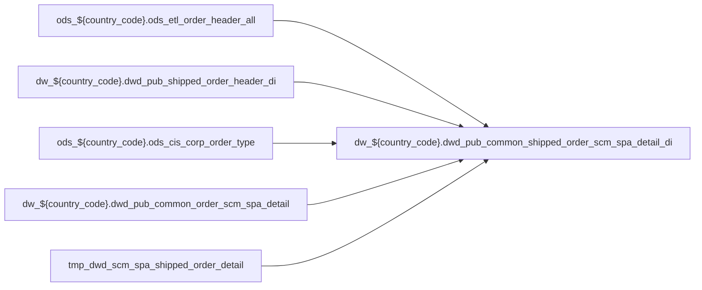

# DWD: `dwd_pub_common_shipped_order_scm_spa_detail_di`

- artifact_type: etl_table
- artifact_id: dw_${country_code}.dwd_pub_common_shipped_order_scm_spa_detail_di
- domain: pos
- one_line_purpose: ETL script `source/contracts/pos/bitbucket-etl/dwd_pub_common_shipped_order_scm_spa_detail_di/dwd_pub_common_shipped_order_scm_spa_detail_di.sql` loads `dw_${country_code}.dwd_pub_common_shipped_order_scm_spa_detail_di` (layer `DWD`). Purpose inferred from SQL only.
- layer_type: DWD
- source_kind: etl_sql
- evidence_source: source/contracts/pos/bitbucket-etl/dwd_pub_common_shipped_order_scm_spa_detail_di/dwd_pub_common_shipped_order_scm_spa_detail_di.sql
- bitbucket_etl_bundle: source/contracts/pos/bitbucket-etl/dwd_pub_common_shipped_order_scm_spa_detail_di/

---

## L1 Data Foundation

### Identity and physical mapping
- **Table:** `dw_${country_code}.dwd_pub_common_shipped_order_scm_spa_detail_di`
- **Layer type:** DWD
- **Canonical / derived:** Derived / ETL-loaded (see L3)
- **Owner team:** Not documented in repository

### Grain, scope, exclusions
- **Grain:** Not documented in repository (see SELECT/GROUP BY in `source/contracts/pos/bitbucket-etl/dwd_pub_common_shipped_order_scm_spa_detail_di/dwd_pub_common_shipped_order_scm_spa_detail_di.sql`)
- **Partition:** `date_flag`
- **Exclusions:** See L3 Key filters

### Cross-engine presence
| Engine | Present | Canonical FQN | Notes |
|--------|---------|---------------|-------|
| Hive | yes | `dw_${country_code}.dwd_pub_common_shipped_order_scm_spa_detail_di` | ETL target |
| Vertica | Not documented in repository | — | Confirm via hive2vertica flow |

### Physical schema reference

Pointer block only - full column catalog lives in WKB L1 storage JSON.

| Field | Value |
|-------|-------|
| **Authoritative catalog** | WKB L1 storage seed (not duplicated in this file) |
| **entity_id** | `dw_${country_code}.dwd_pub_common_shipped_order_scm_spa_detail_di` |
| **l1_catalog_seed** | `target/storage/wkb/snapshots/_snapshot_id_template/l1_catalog/{engine}_{schema}_{table}.json` |
| **column_count** | pending (run ddl_seed_writer) |
| **partition_keys** | `date_flag` |
| **ddl_source** | pending Bitbucket DDL / Vertica metadata ingest |
| **retrieval** | `python -m tools.wkb.indexing.run_query --query "pos dwd_pub_common_shipped_order_scm_spa_detail_di schema" --intent find_table_schema` |

### Lineage

- **Primary load:** `source/contracts/pos/bitbucket-etl/dwd_pub_common_shipped_order_scm_spa_detail_di/dwd_pub_common_shipped_order_scm_spa_detail_di.sql`
- **upstream:** `ods_${country_code}.ods_etl_order_header_all` — FROM/JOIN — `source/contracts/pos/bitbucket-etl/dwd_pub_common_shipped_order_scm_spa_detail_di/dwd_pub_common_shipped_order_scm_spa_detail_di.sql`
- **upstream:** `dw_${country_code}.dwd_pub_shipped_order_header_di` — FROM/JOIN — `source/contracts/pos/bitbucket-etl/dwd_pub_common_shipped_order_scm_spa_detail_di/dwd_pub_common_shipped_order_scm_spa_detail_di.sql`
- **upstream:** `ods_${country_code}.ods_cis_corp_order_type` — FROM/JOIN — `source/contracts/pos/bitbucket-etl/dwd_pub_common_shipped_order_scm_spa_detail_di/dwd_pub_common_shipped_order_scm_spa_detail_di.sql`
- **upstream:** `dw_${country_code}.dwd_pub_common_order_scm_spa_detail` — FROM/JOIN — `source/contracts/pos/bitbucket-etl/dwd_pub_common_shipped_order_scm_spa_detail_di/dwd_pub_common_shipped_order_scm_spa_detail_di.sql`
- **upstream:** `tmp_dwd_scm_spa_shipped_order_detail` — FROM/JOIN — `source/contracts/pos/bitbucket-etl/dwd_pub_common_shipped_order_scm_spa_detail_di/dwd_pub_common_shipped_order_scm_spa_detail_di.sql`
- **downstream:** see L6 Downstream consumers
### Freshness and load path
| Item | Value |
|------|-------|
| Load pattern | See L3 INSERT / OVERWRITE in evidence script |
| Schedule | Not documented in repository |
| Parameters | Parsed from ETL literals / `${...}` in `source/contracts/pos/bitbucket-etl/dwd_pub_common_shipped_order_scm_spa_detail_di/dwd_pub_common_shipped_order_scm_spa_detail_di.sql` |

## L2 Declarative Knowledge

### Business purpose
ETL script `source/contracts/pos/bitbucket-etl/dwd_pub_common_shipped_order_scm_spa_detail_di/dwd_pub_common_shipped_order_scm_spa_detail_di.sql` loads `dw_${country_code}.dwd_pub_common_shipped_order_scm_spa_detail_di` (layer `DWD`). Purpose inferred from SQL only.

### Audience and use cases
| Audience | How they benefit |
|----------|-----------------|
| Data / BI consumers | Use target table produced by this ETL |
| Data Engineering | Maintain load logic in evidence script |

### Fact key resolution
- Keys follow target INSERT column list / GROUP BY in evidence SQL.

### Time field semantics
- Partition / date fields: `date_flag`

### Metrics served
- See L3 column derivations for measure expressions when present.

### Metric serving map
N/A — not a multi-period wide serving table (or not documented).

### etl_metrics
No calculable business metrics registered in metric-index for this create run.

## L3 Procedural Knowledge

### Query and routing rules
- Prefer querying the target `dw_${country_code}.dwd_pub_common_shipped_order_scm_spa_detail_di` after successful ETL load.

### Dimension join patterns
- See Relationship map and Base tables register.

### Key filters and ETL business logic

| Predicate | Kind | Evidence |
|-----------|------|----------|
| `date_flag>= '${last_90_date}' and date_flag< '${end_date}') h inner join ods_${country_code}.ods_cis_corp_order_type ot on h.order_type = ot.order_type where ot.sales = 'Y'; --and h.ship_date>= '${...` | Technical (load only) / Business | `source/contracts/pos/bitbucket-etl/dwd_pub_common_shipped_order_scm_spa_detail_di/dwd_pub_common_shipped_order_scm_spa_detail_di.sql` |

### Standard time-filter SQL
```sql
-- See partition / date predicates in source/contracts/pos/bitbucket-etl/dwd_pub_common_shipped_order_scm_spa_detail_di/dwd_pub_common_shipped_order_scm_spa_detail_di.sql
```

### End-to-end flow



### Base tables register

| Object | Role |
|--------|------|
| `ods_${country_code}.ods_etl_order_header_all` | source / temp (from ETL FROM/JOIN) |
| `dw_${country_code}.dwd_pub_shipped_order_header_di` | source / temp (from ETL FROM/JOIN) |
| `ods_${country_code}.ods_cis_corp_order_type` | source / temp (from ETL FROM/JOIN) |
| `dw_${country_code}.dwd_pub_common_order_scm_spa_detail` | source / temp (from ETL FROM/JOIN) |
| `tmp_dwd_scm_spa_shipped_order_detail` | source / temp (from ETL FROM/JOIN) |

### Step-by-step logic
1. Read sources listed in Base tables register (`source/contracts/pos/bitbucket-etl/dwd_pub_common_shipped_order_scm_spa_detail_di/dwd_pub_common_shipped_order_scm_spa_detail_di.sql`).
2. Apply filters documented under Key filters.
3. INSERT OVERWRITE / write target `dw_${country_code}.dwd_pub_common_shipped_order_scm_spa_detail_di`.

### Relationship map (embedded)

| from_fqn | to_fqn | cardinality | join_keys | provenance |
|----------|--------|-------------|-----------|------------|
| `ods_${country_code}.ods_etl_order_header_all` | `ods_${country_code}.ods_cis_corp_order_type` | many:1 | `h.order_type` = `ot.order_type` | etl_sql (`source/contracts/pos/bitbucket-etl/dwd_pub_common_shipped_order_scm_spa_detail_di/dwd_pub_common_shipped_order_scm_spa_detail_di.sql:7`) |
| `dw_${country_code}.dwd_pub_common_order_scm_spa_detail` | `tmp_dwd_scm_spa_shipped_order_detail` | many:1 | `a.order_type` = `b.order_type`; `a.order_no` = `b.order_no` | etl_sql (`source/contracts/pos/bitbucket-etl/dwd_pub_common_shipped_order_scm_spa_detail_di/dwd_pub_common_shipped_order_scm_spa_detail_di.sql:33`) |

### Special logic (embedded)

Provenance: `source/ref/pos/special_logic.txt`

#### Applicable rule excerpt 1

```
# POS special logic reference

# Scope
# - Derived from existing Vertica POS rds_xxx_rtv.sp scripts.
# - POS scripts were identified by dw_*/dwd_disty_common_pos_di usage.
# - Vertica scripts were identified by rdsetl.rds_tmp output usage.
# - Scan result used for this file: 499 scripts; regions: BR=1, CA=124, MX=7, US=367.
# - Use xx as the region placeholder, matching table list.txt and table relationship.txt.

# 1. Order line type is not always a simple Comp exclusion
# Default POS reports normally exclude component lines:
#   order_line_type <> 'Comp'
#
# Historical exception patterns:
# - Some vendor/customer sales reports include order_line_type IN ('Comp', 'Single').
# - Some kit-level reports include order_line_type IN ('Comp', 'Kit', 'Single').
# - Component inclusion is usually intentional when the report needs kit components, bundle economics, or vendor/manufacturer line detail.
#
# Rule:
# - Default to excluding Comp unless the request mentions kit components, component detail, bundle detail, or the historical report pattern explicitly includes Comp.
# - Never include Kit, Single, and Comp together unless the report grain and business request require all sold and com...
```

### Column / field derivations (from ETL SQL)

| target_column | expression_sql | upstream_columns | upstream_tables | transform_kind | evidence |
|---------------|----------------|------------------|-----------------|----------------|----------|
| `order_type` | `a.order_type` | `order_type` | `dw_${country_code}.dwd_pub_common_order_scm_spa_detail`, `tmp_dwd_scm_spa_shipped_order_detail` | passthrough | `source/contracts/pos/bitbucket-etl/dwd_pub_common_shipped_order_scm_spa_detail_di/dwd_pub_common_shipped_order_scm_spa_detail_di.sql:16` |
| `order_no` | `a.order_no` | `order_no` | `dw_${country_code}.dwd_pub_common_order_scm_spa_detail`, `tmp_dwd_scm_spa_shipped_order_detail` | passthrough | `source/contracts/pos/bitbucket-etl/dwd_pub_common_shipped_order_scm_spa_detail_di/dwd_pub_common_shipped_order_scm_spa_detail_di.sql:17` |
| `order_line_no` | `a.order_line_no` | `order_line_no` | `dw_${country_code}.dwd_pub_common_order_scm_spa_detail`, `tmp_dwd_scm_spa_shipped_order_detail` | passthrough | `source/contracts/pos/bitbucket-etl/dwd_pub_common_shipped_order_scm_spa_detail_di/dwd_pub_common_shipped_order_scm_spa_detail_di.sql:18` |
| `scm_no` | `a.scm_no` | `scm_no` | `dw_${country_code}.dwd_pub_common_order_scm_spa_detail`, `tmp_dwd_scm_spa_shipped_order_detail` | passthrough | `source/contracts/pos/bitbucket-etl/dwd_pub_common_shipped_order_scm_spa_detail_di/dwd_pub_common_shipped_order_scm_spa_detail_di.sql:19` |
| `spa_no` | `a.spa_no` | `spa_no` | `dw_${country_code}.dwd_pub_common_order_scm_spa_detail`, `tmp_dwd_scm_spa_shipped_order_detail` | passthrough | `source/contracts/pos/bitbucket-etl/dwd_pub_common_shipped_order_scm_spa_detail_di/dwd_pub_common_shipped_order_scm_spa_detail_di.sql:20` |
| `spa_ref_no` | `a.spa_ref_no` | `spa_ref_no` | `dw_${country_code}.dwd_pub_common_order_scm_spa_detail`, `tmp_dwd_scm_spa_shipped_order_detail` | passthrough | `source/contracts/pos/bitbucket-etl/dwd_pub_common_shipped_order_scm_spa_detail_di/dwd_pub_common_shipped_order_scm_spa_detail_di.sql:21` |
| `exp_code` | `a.exp_code` | `exp_code` | `dw_${country_code}.dwd_pub_common_order_scm_spa_detail`, `tmp_dwd_scm_spa_shipped_order_detail` | passthrough | `source/contracts/pos/bitbucket-etl/dwd_pub_common_shipped_order_scm_spa_detail_di/dwd_pub_common_shipped_order_scm_spa_detail_di.sql:22` |
| `unit_exp` | `a.unit_exp` | `unit_exp` | `dw_${country_code}.dwd_pub_common_order_scm_spa_detail`, `tmp_dwd_scm_spa_shipped_order_detail` | passthrough | `source/contracts/pos/bitbucket-etl/dwd_pub_common_shipped_order_scm_spa_detail_di/dwd_pub_common_shipped_order_scm_spa_detail_di.sql:23` |
| `extend_exp` | `a.extend_exp` | `extend_exp` | `dw_${country_code}.dwd_pub_common_order_scm_spa_detail`, `tmp_dwd_scm_spa_shipped_order_detail` | passthrough | `source/contracts/pos/bitbucket-etl/dwd_pub_common_shipped_order_scm_spa_detail_di/dwd_pub_common_shipped_order_scm_spa_detail_di.sql:24` |
| `claim_type` | `a.claim_type` | `claim_type` | `dw_${country_code}.dwd_pub_common_order_scm_spa_detail`, `tmp_dwd_scm_spa_shipped_order_detail` | passthrough | `source/contracts/pos/bitbucket-etl/dwd_pub_common_shipped_order_scm_spa_detail_di/dwd_pub_common_shipped_order_scm_spa_detail_di.sql:25` |
| `approved_cost` | `a.approved_cost` | `approved_cost` | `dw_${country_code}.dwd_pub_common_order_scm_spa_detail`, `tmp_dwd_scm_spa_shipped_order_detail` | passthrough | `source/contracts/pos/bitbucket-etl/dwd_pub_common_shipped_order_scm_spa_detail_di/dwd_pub_common_shipped_order_scm_spa_detail_di.sql:26` |
| `rebate_amt` | `a.rebate_amt` | `rebate_amt` | `dw_${country_code}.dwd_pub_common_order_scm_spa_detail`, `tmp_dwd_scm_spa_shipped_order_detail` | passthrough | `source/contracts/pos/bitbucket-etl/dwd_pub_common_shipped_order_scm_spa_detail_di/dwd_pub_common_shipped_order_scm_spa_detail_di.sql:27` |
| `vendor_appr_ref_no` | `a.vendor_appr_ref_no` | `vendor_appr_ref_no` | `dw_${country_code}.dwd_pub_common_order_scm_spa_detail`, `tmp_dwd_scm_spa_shipped_order_detail` | passthrough | `source/contracts/pos/bitbucket-etl/dwd_pub_common_shipped_order_scm_spa_detail_di/dwd_pub_common_shipped_order_scm_spa_detail_di.sql:28` |
| `pm_claim_delete_date` | `a.pm_claim_delete_date` | `pm_claim_delete_date` | `dw_${country_code}.dwd_pub_common_order_scm_spa_detail`, `tmp_dwd_scm_spa_shipped_order_detail` | passthrough | `source/contracts/pos/bitbucket-etl/dwd_pub_common_shipped_order_scm_spa_detail_di/dwd_pub_common_shipped_order_scm_spa_detail_di.sql:29` |
| `date_flag` | `b.date_flag` | `date_flag` | `dw_${country_code}.dwd_pub_common_order_scm_spa_detail`, `tmp_dwd_scm_spa_shipped_order_detail` | passthrough | `source/contracts/pos/bitbucket-etl/dwd_pub_common_shipped_order_scm_spa_detail_di/dwd_pub_common_shipped_order_scm_spa_detail_di.sql:30` |

### Sentinel and code values
Not documented in repository beyond CASE/exp_code predicates in ETL SQL.

## L4 Validation

### Resolved partition value
- Partition expression from ETL: `date_flag`
- Runtime values: Not documented in repository (resolve via Azkaban params when flow evidence exists).

### Data quality checks
Not documented in repository

### Validation SQL
N/A — Vertica MCP not executed during documentation (Vertica no-run policy).

### Caveats for interpretation
- Generated from ETL SQL evidence only; business definitions may need `source/ref` enrichment.

### Conflicts and open questions
None identified in repository

## L5 Runtime View

### Query path and engine preference
| Path | Engine | Evidence |
|------|--------|----------|
| ETL load | Hive/Spark | `source/contracts/pos/bitbucket-etl/dwd_pub_common_shipped_order_scm_spa_detail_di/dwd_pub_common_shipped_order_scm_spa_detail_di.sql` |
| Serving | Vertica (when synced) | Not documented in repository |

### Access constraints
Not documented in repository

### Query risk profile
- Scan risk depends on partition pruning; always filter partition keys when present.

## L6 Access and Consumption

### Primary consumers and use cases
Not documented in repository

### Representative query patterns
Not documented in repository

### Dependencies and notes

#### Upstream objects (verified)
| Object | Usage | Evidence |
|--------|-------|----------|
| `ods_${country_code}.ods_etl_order_header_all` | FROM/JOIN | `source/contracts/pos/bitbucket-etl/dwd_pub_common_shipped_order_scm_spa_detail_di/dwd_pub_common_shipped_order_scm_spa_detail_di.sql` |
| `dw_${country_code}.dwd_pub_shipped_order_header_di` | FROM/JOIN | `source/contracts/pos/bitbucket-etl/dwd_pub_common_shipped_order_scm_spa_detail_di/dwd_pub_common_shipped_order_scm_spa_detail_di.sql` |
| `ods_${country_code}.ods_cis_corp_order_type` | FROM/JOIN | `source/contracts/pos/bitbucket-etl/dwd_pub_common_shipped_order_scm_spa_detail_di/dwd_pub_common_shipped_order_scm_spa_detail_di.sql` |
| `dw_${country_code}.dwd_pub_common_order_scm_spa_detail` | FROM/JOIN | `source/contracts/pos/bitbucket-etl/dwd_pub_common_shipped_order_scm_spa_detail_di/dwd_pub_common_shipped_order_scm_spa_detail_di.sql` |
| `tmp_dwd_scm_spa_shipped_order_detail` | FROM/JOIN | `source/contracts/pos/bitbucket-etl/dwd_pub_common_shipped_order_scm_spa_detail_di/dwd_pub_common_shipped_order_scm_spa_detail_di.sql` |

#### Downstream consumers (verified)

| Object / script | Evidence |
|-----------------|----------|
| KB / contract ref: `source/contracts/pos/bitbucket-etl/MANIFEST.md` | `source/contracts/pos/bitbucket-etl/MANIFEST.md:217` |
| KB / contract ref: `source/contracts/pos/golden-questions.md` | `source/contracts/pos/golden-questions.md:14` |
| KB / contract ref: `source/contracts/pos/metric-index.md` | `source/contracts/pos/metric-index.md:135` |
| KB / contract ref: `source/contracts/pos/tables/dwd_pub_common_shipped_order_scm_spa_detail_di.md` | `source/contracts/pos/tables/dwd_pub_common_shipped_order_scm_spa_detail_di.md:5` |
| ETL/script ref: `source/contracts/rds/vertica_pos/etl/pos_scm_reference_hierarchy_rds_17482.sql` | `source/contracts/rds/vertica_pos/etl/pos_scm_reference_hierarchy_rds_17482.sql:130` |
| ETL/script ref: `source/contracts/rds/vertica_pos/etl/pos_scm_reference_hierarchy_rds_8329.sql` | `source/contracts/rds/vertica_pos/etl/pos_scm_reference_hierarchy_rds_8329.sql:130` |
| ETL/script ref: `source/contracts/rds/vertica_pos/etl/pos_serial_authorization_rds_5378.sql` | `source/contracts/rds/vertica_pos/etl/pos_serial_authorization_rds_5378.sql:33` |
| ETL/script ref: `source/contracts/rds/vertica_pos/etl/pos_spa_horizontal_rds_16358.sql` | `source/contracts/rds/vertica_pos/etl/pos_spa_horizontal_rds_16358.sql:88` |
| ETL/script ref: `source/contracts/rds/vertica_pos/etl/pos_spa_scm_horizontal_rds_18213.sql` | `source/contracts/rds/vertica_pos/etl/pos_spa_scm_horizontal_rds_18213.sql:74` |
| ETL/script ref: `source/contracts/rds/vertica_pos/etl/pos_vendor_mso_po_rds_17785.sql` | `source/contracts/rds/vertica_pos/etl/pos_vendor_mso_po_rds_17785.sql:78` |
| ETL/script ref: `source/contracts/rds/vertica_vpo/etl/vpo_open_po_scm_spa_ref_rds_17736.sql` | `source/contracts/rds/vertica_vpo/etl/vpo_open_po_scm_spa_ref_rds_17736.sql:36` |
| ETL/script ref: `source/contracts/rds/vertica_vpo/etl/vpo_pos_doc_fallback_cedm_serial_rds_610.sql` | `source/contracts/rds/vertica_vpo/etl/vpo_pos_doc_fallback_cedm_serial_rds_610.sql:133` |
| FLOW ref: `source/etl/flows/public_order_scripts/public_order_dw/level1/public_order_dw_br_level1.flow` | `source/etl/flows/public_order_scripts/public_order_dw/level1/public_order_dw_br_level1.flow:326` |
| FLOW ref: `source/etl/flows/public_order_scripts/public_order_dw/level1/public_order_dw_ca_level1.flow` | `source/etl/flows/public_order_scripts/public_order_dw/level1/public_order_dw_ca_level1.flow:319` |
| FLOW ref: `source/etl/flows/public_order_scripts/public_order_dw/level1/public_order_dw_hycn_level1.flow` | `source/etl/flows/public_order_scripts/public_order_dw/level1/public_order_dw_hycn_level1.flow:303` |
| FLOW ref: `source/etl/flows/public_order_scripts/public_order_dw/level1/public_order_dw_hyuk_level1.flow` | `source/etl/flows/public_order_scripts/public_order_dw/level1/public_order_dw_hyuk_level1.flow:303` |
| FLOW ref: `source/etl/flows/public_order_scripts/public_order_dw/level1/public_order_dw_hyus_level1.flow` | `source/etl/flows/public_order_scripts/public_order_dw/level1/public_order_dw_hyus_level1.flow:311` |
| FLOW ref: `source/etl/flows/public_order_scripts/public_order_dw/level1/public_order_dw_hyww_level1.flow` | `source/etl/flows/public_order_scripts/public_order_dw/level1/public_order_dw_hyww_level1.flow:303` |
| FLOW ref: `source/etl/flows/public_order_scripts/public_order_dw/level1/public_order_dw_us_level1.flow` | `source/etl/flows/public_order_scripts/public_order_dw/level1/public_order_dw_us_level1.flow:333` |
| FLOW ref: `source/etl/flows/public_order_scripts/public_order_dw/level1/public_order_dw_wcla_level1.flow` | `source/etl/flows/public_order_scripts/public_order_dw/level1/public_order_dw_wcla_level1.flow:312` |
| FLOW ref: `source/etl/flows/public_order_scripts/public_order_dw/public_order_dw_br.flow` | `source/etl/flows/public_order_scripts/public_order_dw/public_order_dw_br.flow:93` |
| FLOW ref: `source/etl/flows/public_order_scripts/public_order_dw/public_order_dw_ca.flow` | `source/etl/flows/public_order_scripts/public_order_dw/public_order_dw_ca.flow:91` |
| FLOW ref: `source/etl/flows/public_order_scripts/public_order_dw/public_order_dw_hycn.flow` | `source/etl/flows/public_order_scripts/public_order_dw/public_order_dw_hycn.flow:91` |
| FLOW ref: `source/etl/flows/public_order_scripts/public_order_dw/public_order_dw_hyuk.flow` | `source/etl/flows/public_order_scripts/public_order_dw/public_order_dw_hyuk.flow:91` |
| FLOW ref: `source/etl/flows/public_order_scripts/public_order_dw/public_order_dw_hyus.flow` | `source/etl/flows/public_order_scripts/public_order_dw/public_order_dw_hyus.flow:91` |
| FLOW ref: `source/etl/flows/public_order_scripts/public_order_dw/public_order_dw_hyww.flow` | `source/etl/flows/public_order_scripts/public_order_dw/public_order_dw_hyww.flow:92` |
| FLOW ref: `source/etl/flows/public_order_scripts/public_order_dw/public_order_dw_us.flow` | `source/etl/flows/public_order_scripts/public_order_dw/public_order_dw_us.flow:91` |
| FLOW ref: `source/etl/flows/public_order_scripts/public_order_dw/public_order_dw_wcla.flow` | `source/etl/flows/public_order_scripts/public_order_dw/public_order_dw_wcla.flow:91` |
| ETL/script ref: `source/etl/sql/order/public_order_scripts/public_order_dw/script/dwd_pub_common_shipped_order_scm_spa_detail_di.sql` | `source/etl/sql/order/public_order_scripts/public_order_dw/script/dwd_pub_common_shipped_order_scm_spa_detail_di.sql:14` |
| KB / contract ref: `target/knowledgebase/RDS/vertica_pos/pos_scm_reference_hierarchy_rds_17482.md` | `target/knowledgebase/RDS/vertica_pos/pos_scm_reference_hierarchy_rds_17482.md:60` |
| KB / contract ref: `target/knowledgebase/RDS/vertica_pos/pos_scm_reference_hierarchy_rds_8329.md` | `target/knowledgebase/RDS/vertica_pos/pos_scm_reference_hierarchy_rds_8329.md:60` |
| KB / contract ref: `target/knowledgebase/RDS/vertica_pos/pos_serial_authorization_rds_5378.md` | `target/knowledgebase/RDS/vertica_pos/pos_serial_authorization_rds_5378.md:52` |
| KB / contract ref: `target/knowledgebase/RDS/vertica_pos/pos_spa_horizontal_rds_16358.md` | `target/knowledgebase/RDS/vertica_pos/pos_spa_horizontal_rds_16358.md:52` |
| KB / contract ref: `target/knowledgebase/RDS/vertica_pos/pos_spa_scm_horizontal_rds_18213.md` | `target/knowledgebase/RDS/vertica_pos/pos_spa_scm_horizontal_rds_18213.md:55` |
| KB / contract ref: `target/knowledgebase/RDS/vertica_pos/pos_vendor_mso_po_rds_17785.md` | `target/knowledgebase/RDS/vertica_pos/pos_vendor_mso_po_rds_17785.md:53` |
| KB / contract ref: `target/knowledgebase/RDS/vertica_vpo/vpo_open_po_scm_spa_ref_rds_17736.md` | `target/knowledgebase/RDS/vertica_vpo/vpo_open_po_scm_spa_ref_rds_17736.md:52` |
| KB / contract ref: `target/knowledgebase/RDS/vertica_vpo/vpo_pos_doc_fallback_cedm_serial_rds_610.md` | `target/knowledgebase/RDS/vertica_vpo/vpo_pos_doc_fallback_cedm_serial_rds_610.md:53` |
| KB / contract ref: `target/knowledgebase/order/dwd_pub_common_order_scm_spa_detail.md` | `target/knowledgebase/order/dwd_pub_common_order_scm_spa_detail.md:91` |
| KB / contract ref: `target/knowledgebase/order/dwd_pub_common_shipped_order_scm_spa_detail_di.md` | `target/knowledgebase/order/dwd_pub_common_shipped_order_scm_spa_detail_di.md:1` |
| KB / contract ref: `target/knowledgebase/pos/readme.md` | `target/knowledgebase/pos/readme.md:113` |

#### Operational detail (verified)
- Partition clause: `date_flag`

#### Not documented in repository
- Schedule, owner, SLA
