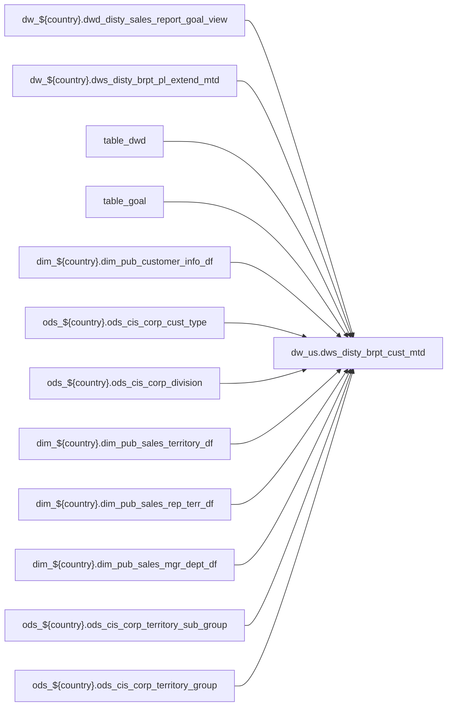

# FACT: Supplemental fact/context table used by select POS reports (`dw_us.dws_disty_brpt_cust_mtd`)

- artifact_type: etl_table
- artifact_id: dw_us.dws_disty_brpt_cust_mtd
- domain: pos
- one_line_purpose: POS-domain table with load SQL under bitbucket-etl (see L3); prior contract narrative preserved below when present.
- layer_type: DWS
- source_kind: etl_sql
- evidence_source: source/contracts/pos/bitbucket-etl/dws_disty_brpt_cust_mtd/dws_disty_brpt_cust_mtd.py
- bitbucket_etl_bundle: source/contracts/pos/bitbucket-etl/dws_disty_brpt_cust_mtd/
- related_etl_scripts:
- `source/contracts/pos/bitbucket-etl/dws_disty_brpt_cust_mtd/z_reload_data__dws_disty_brpt_cust_mtd.py`

---

## L1 Data Foundation

### Identity and physical mapping
- **Table:** `dw_us.dws_disty_brpt_cust_mtd`
- **Layer type:** DWS
- **Canonical / derived:** Derived / ETL-loaded (see L3 from bitbucket-etl)
- **Owner team:** Not documented in repository

### Grain, scope, exclusions
- See preserved **Grain and keys** section below when present (POS contract narrative retained).
- Otherwise infer from SELECT / GROUP BY / INSERT column list in `source/contracts/pos/bitbucket-etl/dws_disty_brpt_cust_mtd/dws_disty_brpt_cust_mtd.py`.

### Cross-engine presence
| Engine | Present | Notes |
|--------|---------|-------|
| Hive | yes | ETL load target |
| Vertica | yes when POS contract documents Vertica sync | See preserved Business query tables |

### Physical schema reference

| Field | Value |
|-------|-------|
| **entity_id** | `dw_us.dws_disty_brpt_cust_mtd` |
| **l1_catalog_seed** | `target/storage/wkb/snapshots/_snapshot_id_template/l1_catalog/{engine}_{schema}_{table}.json` |
| **column_count** | pending (run ddl_seed_writer) |
| **partition_keys** | See preserved Grain / L4 / ETL PARTITION clause |
| **ddl_source** | pending |
| **retrieval** | `python -m tools.wkb.indexing.run_query --query "pos dws_disty_brpt_cust_mtd schema" --intent find_table_schema` |

### Lineage

- **Primary load:** `source/contracts/pos/bitbucket-etl/dws_disty_brpt_cust_mtd/dws_disty_brpt_cust_mtd.py`
- **upstream:** `dw_${country}.dwd_disty_sales_report_goal_view` — FROM/JOIN — `source/contracts/pos/bitbucket-etl/dws_disty_brpt_cust_mtd/dws_disty_brpt_cust_mtd.py`
- **upstream:** `dw_${country}.dws_disty_brpt_pl_extend_mtd` — FROM/JOIN — `source/contracts/pos/bitbucket-etl/dws_disty_brpt_cust_mtd/dws_disty_brpt_cust_mtd.py`
- **upstream:** `table_dwd` — FROM/JOIN — `source/contracts/pos/bitbucket-etl/dws_disty_brpt_cust_mtd/dws_disty_brpt_cust_mtd.py`
- **upstream:** `table_goal` — FROM/JOIN — `source/contracts/pos/bitbucket-etl/dws_disty_brpt_cust_mtd/dws_disty_brpt_cust_mtd.py`
- **upstream:** `dim_${country}.dim_pub_customer_info_df` — FROM/JOIN — `source/contracts/pos/bitbucket-etl/dws_disty_brpt_cust_mtd/dws_disty_brpt_cust_mtd.py`
- **upstream:** `ods_${country}.ods_cis_corp_cust_type` — FROM/JOIN — `source/contracts/pos/bitbucket-etl/dws_disty_brpt_cust_mtd/dws_disty_brpt_cust_mtd.py`
- **upstream:** `ods_${country}.ods_cis_corp_division` — FROM/JOIN — `source/contracts/pos/bitbucket-etl/dws_disty_brpt_cust_mtd/dws_disty_brpt_cust_mtd.py`
- **upstream:** `dim_${country}.dim_pub_sales_territory_df` — FROM/JOIN — `source/contracts/pos/bitbucket-etl/dws_disty_brpt_cust_mtd/dws_disty_brpt_cust_mtd.py`
- **upstream:** `dim_${country}.dim_pub_sales_rep_terr_df` — FROM/JOIN — `source/contracts/pos/bitbucket-etl/dws_disty_brpt_cust_mtd/dws_disty_brpt_cust_mtd.py`
- **upstream:** `dim_${country}.dim_pub_sales_mgr_dept_df` — FROM/JOIN — `source/contracts/pos/bitbucket-etl/dws_disty_brpt_cust_mtd/dws_disty_brpt_cust_mtd.py`
- **upstream:** `ods_${country}.ods_cis_corp_territory_sub_group` — FROM/JOIN — `source/contracts/pos/bitbucket-etl/dws_disty_brpt_cust_mtd/dws_disty_brpt_cust_mtd.py`
- **upstream:** `ods_${country}.ods_cis_corp_territory_group` — FROM/JOIN — `source/contracts/pos/bitbucket-etl/dws_disty_brpt_cust_mtd/dws_disty_brpt_cust_mtd.py`
- **downstream:** see L6 Downstream consumers
### Freshness and load path
- Parameters / date window: see ETL `${literal_*}` / `${date_flag}` / `${start_date}` in evidence script.
- Schedule: Not documented in repository

## L2 Declarative Knowledge

### Business purpose
See preserved **Business purpose** below when present (POS contract catalog + linked ETL).

### Audience and use cases
See preserved **Who it helps** section when present.

### Fact key resolution
See preserved **Grain and keys** when present.

### Time field semantics
- Prefer partition / `date_flag` filters documented in preserved sections and L3 Key filters from ETL.

### Metrics served
See preserved Metrics / column groups when present; otherwise L3 column derivations.

### Metric serving map
N/A unless multi-period wide table (see preserved content).

### etl_metrics
No new metric-index formulas appended in this bitbucket-etl upgrade pass.

## L3 Procedural Knowledge

### Query and routing rules
- Reporting: Vertica `dw_us.dws_disty_brpt_cust_mtd` when synced (see preserved Business query tables).
- Load logic: bitbucket-etl evidence `source/contracts/pos/bitbucket-etl/dws_disty_brpt_cust_mtd/dws_disty_brpt_cust_mtd.py`.

### Dimension join patterns
See Relationship map (ETL JOIN edges) and preserved contract join notes.

### Key filters and ETL business logic

| Predicate | Kind | Evidence |
|-----------|------|----------|
| `period = ${month_no} and goal_type = 'NORMAL' and cust_no <> 0` | Business | `source/contracts/pos/bitbucket-etl/dws_disty_brpt_cust_mtd/dws_disty_brpt_cust_mtd.py` |
| `date_flag = '${date_flag}'` | Technical (load only) / Business | `source/contracts/pos/bitbucket-etl/dws_disty_brpt_cust_mtd/dws_disty_brpt_cust_mtd.py` |
| `date_flag = '${date_flag}') as table_customer -- unique id: cust_no on nvl(table_dwd.cust_no,table_goal.cust_no) = table_customer.cust_no left join (select *,replace(cust_name,'\\\\','/') as cust_n...` | Technical (load only) / Business | `source/contracts/pos/bitbucket-etl/dws_disty_brpt_cust_mtd/dws_disty_brpt_cust_mtd.py` |

### Standard time-filter SQL
```sql
-- Prefer date_flag / literal_start_date / literal_end_date as used in source/contracts/pos/bitbucket-etl/dws_disty_brpt_cust_mtd/dws_disty_brpt_cust_mtd.py
```

### End-to-end flow


### Base tables register
| Object | Role |
|--------|------|
| `dw_${country}.dwd_disty_sales_report_goal_view` | source / temp (FROM/JOIN) |
| `dw_${country}.dws_disty_brpt_pl_extend_mtd` | source / temp (FROM/JOIN) |
| `table_dwd` | source / temp (FROM/JOIN) |
| `table_goal` | source / temp (FROM/JOIN) |
| `dim_${country}.dim_pub_customer_info_df` | source / temp (FROM/JOIN) |
| `ods_${country}.ods_cis_corp_cust_type` | source / temp (FROM/JOIN) |
| `ods_${country}.ods_cis_corp_division` | source / temp (FROM/JOIN) |
| `dim_${country}.dim_pub_sales_territory_df` | source / temp (FROM/JOIN) |
| `dim_${country}.dim_pub_sales_rep_terr_df` | source / temp (FROM/JOIN) |
| `dim_${country}.dim_pub_sales_mgr_dept_df` | source / temp (FROM/JOIN) |
| `ods_${country}.ods_cis_corp_territory_sub_group` | source / temp (FROM/JOIN) |
| `ods_${country}.ods_cis_corp_territory_group` | source / temp (FROM/JOIN) |

### Step-by-step logic
1. Execute load SQL / python in `source/contracts/pos/bitbucket-etl/dws_disty_brpt_cust_mtd/`.
2. Apply date / business filters from ETL (Key filters).
3. Write target `dw_us.dws_disty_brpt_cust_mtd` (see INSERT/OVERWRITE in evidence).

### Relationship map (embedded)

| from_fqn | to_fqn | cardinality | join_keys | provenance |
|----------|--------|-------------|-----------|------------|
| `dw_${country}.dwd_disty_sales_report_goal_view` | `table_goal` | many:many (FULL) | — | etl_sql (`source/contracts/pos/bitbucket-etl/dws_disty_brpt_cust_mtd/dws_disty_brpt_cust_mtd.py:338`) |
| `dw_${country}.dwd_disty_sales_report_goal_view` | `ods_${country}.ods_cis_corp_cust_type` | many:1 (LEFT) | nvl(table_dwd.cust_type,table_goal.cust_type) = table_cust_type.cust_type | etl_sql (`source/contracts/pos/bitbucket-etl/dws_disty_brpt_cust_mtd/dws_disty_brpt_cust_mtd.py:356`) |
| `dw_${country}.dwd_disty_sales_report_goal_view` | `ods_${country}.ods_cis_corp_division` | many:1 (LEFT) | nvl(table_dwd.division,table_goal.division) = table_div.division | etl_sql (`source/contracts/pos/bitbucket-etl/dws_disty_brpt_cust_mtd/dws_disty_brpt_cust_mtd.py:359`) |
| `dw_${country}.dwd_disty_sales_report_goal_view` | `ods_${country}.ods_cis_corp_territory_sub_group` | many:1 (LEFT) | nvl(table_dwd.terr_sub_group,table_terr.sub_group_id) = table_sub_group.sub_group_id | etl_sql (`source/contracts/pos/bitbucket-etl/dws_disty_brpt_cust_mtd/dws_disty_brpt_cust_mtd.py:404`) |
| `dw_${country}.dwd_disty_sales_report_goal_view` | `ods_${country}.ods_cis_corp_territory_group` | many:1 (LEFT) | nvl(table_dwd.terr_group,table_terr.group_id) = table_group.group_id | etl_sql (`source/contracts/pos/bitbucket-etl/dws_disty_brpt_cust_mtd/dws_disty_brpt_cust_mtd.py:407`) |

### Special logic (embedded)

`source/ref/pos/special_logic.txt` exists but no rule naming this FQN/stem (`dw_us.dws_disty_brpt_cust_mtd`).

Not documented in repository


### Column / field derivations (from ETL SQL)

| target_column | expression_sql | upstream_columns | upstream_tables | transform_kind | evidence |
|---------------|----------------|------------------|-----------------|----------------|----------|
| `month_no` | `${month_no}` | `month_no` | `table_dwd`, `table_goal`, `dim_${country}.dim_pub_customer_info_df`, `ods_${country}.ods_cis_corp_cust_type`, `ods_${country}.ods_cis_corp_division`, `dim_${country}.dim_pub_sales_territory_df`, `dim_${country}.dim_pub_sales_rep_terr_df`, `dim_${country}.dim_pub_sales_mgr_dept_df`, `ods_${country}.ods_cis_corp_territory_sub_group`, `ods_${country}.ods_cis_corp_territory_group` | partial | `source/contracts/pos/bitbucket-etl/dws_disty_brpt_cust_mtd/dws_disty_brpt_cust_mtd.py:48` |
| `cust_no` | `coalesce(table_dwd.cust_no,table_goal.cust_no,-3)` | `cust_no` | `table_dwd`, `table_goal`, `dim_${country}.dim_pub_customer_info_df`, `ods_${country}.ods_cis_corp_cust_type`, `ods_${country}.ods_cis_corp_division`, `dim_${country}.dim_pub_sales_territory_df`, `dim_${country}.dim_pub_sales_rep_terr_df`, `dim_${country}.dim_pub_sales_mgr_dept_df`, `ods_${country}.ods_cis_corp_territory_sub_group`, `ods_${country}.ods_cis_corp_territory_group` | coalesce | `source/contracts/pos/bitbucket-etl/dws_disty_brpt_cust_mtd/dws_disty_brpt_cust_mtd.py:212` |
| `cust_name` | `table_customer.cust_name_replace` | `cust_name_replace` | `table_dwd`, `table_goal`, `dim_${country}.dim_pub_customer_info_df`, `ods_${country}.ods_cis_corp_cust_type`, `ods_${country}.ods_cis_corp_division`, `dim_${country}.dim_pub_sales_territory_df`, `dim_${country}.dim_pub_sales_rep_terr_df`, `dim_${country}.dim_pub_sales_mgr_dept_df`, `ods_${country}.ods_cis_corp_territory_sub_group`, `ods_${country}.ods_cis_corp_territory_group` | rename | `source/contracts/pos/bitbucket-etl/dws_disty_brpt_cust_mtd/dws_disty_brpt_cust_mtd.py:213` |
| `mcust_no` | `coalesce(table_dwd.mcust_no,table_customer.mcust_no,-3)` | `mcust_no` | `table_dwd`, `table_goal`, `dim_${country}.dim_pub_customer_info_df`, `ods_${country}.ods_cis_corp_cust_type`, `ods_${country}.ods_cis_corp_division`, `dim_${country}.dim_pub_sales_territory_df`, `dim_${country}.dim_pub_sales_rep_terr_df`, `dim_${country}.dim_pub_sales_mgr_dept_df`, `ods_${country}.ods_cis_corp_territory_sub_group`, `ods_${country}.ods_cis_corp_territory_group` | coalesce | `source/contracts/pos/bitbucket-etl/dws_disty_brpt_cust_mtd/dws_disty_brpt_cust_mtd.py:214` |
| `mcust_name` | `table_mcust.cust_name_replace` | `cust_name_replace` | `table_dwd`, `table_goal`, `dim_${country}.dim_pub_customer_info_df`, `ods_${country}.ods_cis_corp_cust_type`, `ods_${country}.ods_cis_corp_division`, `dim_${country}.dim_pub_sales_territory_df`, `dim_${country}.dim_pub_sales_rep_terr_df`, `dim_${country}.dim_pub_sales_mgr_dept_df`, `ods_${country}.ods_cis_corp_territory_sub_group`, `ods_${country}.ods_cis_corp_territory_group` | rename | `source/contracts/pos/bitbucket-etl/dws_disty_brpt_cust_mtd/dws_disty_brpt_cust_mtd.py:215` |
| `cust_terr` | `coalesce(table_dwd.cust_terr,table_goal.cust_terr,-3)` | `cust_terr` | `table_dwd`, `table_goal`, `dim_${country}.dim_pub_customer_info_df`, `ods_${country}.ods_cis_corp_cust_type`, `ods_${country}.ods_cis_corp_division`, `dim_${country}.dim_pub_sales_territory_df`, `dim_${country}.dim_pub_sales_rep_terr_df`, `dim_${country}.dim_pub_sales_mgr_dept_df`, `ods_${country}.ods_cis_corp_territory_sub_group`, `ods_${country}.ods_cis_corp_territory_group` | coalesce | `source/contracts/pos/bitbucket-etl/dws_disty_brpt_cust_mtd/dws_disty_brpt_cust_mtd.py:216` |
| `terr_name` | `table_terr.terr_name` | `terr_name` | `table_dwd`, `table_goal`, `dim_${country}.dim_pub_customer_info_df`, `ods_${country}.ods_cis_corp_cust_type`, `ods_${country}.ods_cis_corp_division`, `dim_${country}.dim_pub_sales_territory_df`, `dim_${country}.dim_pub_sales_rep_terr_df`, `dim_${country}.dim_pub_sales_mgr_dept_df`, `ods_${country}.ods_cis_corp_territory_sub_group`, `ods_${country}.ods_cis_corp_territory_group` | passthrough | `source/contracts/pos/bitbucket-etl/dws_disty_brpt_cust_mtd/dws_disty_brpt_cust_mtd.py:217` |
| `cust_type` | `coalesce(table_dwd.cust_type,table_goal.cust_type,-3)` | `cust_type` | `table_dwd`, `table_goal`, `dim_${country}.dim_pub_customer_info_df`, `ods_${country}.ods_cis_corp_cust_type`, `ods_${country}.ods_cis_corp_division`, `dim_${country}.dim_pub_sales_territory_df`, `dim_${country}.dim_pub_sales_rep_terr_df`, `dim_${country}.dim_pub_sales_mgr_dept_df`, `ods_${country}.ods_cis_corp_territory_sub_group`, `ods_${country}.ods_cis_corp_territory_group` | coalesce | `source/contracts/pos/bitbucket-etl/dws_disty_brpt_cust_mtd/dws_disty_brpt_cust_mtd.py:218` |
| `cust_type_desc` | `table_cust_type.cust_type_descr` | `cust_type_descr` | `table_dwd`, `table_goal`, `dim_${country}.dim_pub_customer_info_df`, `ods_${country}.ods_cis_corp_cust_type`, `ods_${country}.ods_cis_corp_division`, `dim_${country}.dim_pub_sales_territory_df`, `dim_${country}.dim_pub_sales_rep_terr_df`, `dim_${country}.dim_pub_sales_mgr_dept_df`, `ods_${country}.ods_cis_corp_territory_sub_group`, `ods_${country}.ods_cis_corp_territory_group` | rename | `source/contracts/pos/bitbucket-etl/dws_disty_brpt_cust_mtd/dws_disty_brpt_cust_mtd.py:219` |
| `division` | `coalesce(table_dwd.division,table_goal.division,-3)` | `division` | `table_dwd`, `table_goal`, `dim_${country}.dim_pub_customer_info_df`, `ods_${country}.ods_cis_corp_cust_type`, `ods_${country}.ods_cis_corp_division`, `dim_${country}.dim_pub_sales_territory_df`, `dim_${country}.dim_pub_sales_rep_terr_df`, `dim_${country}.dim_pub_sales_mgr_dept_df`, `ods_${country}.ods_cis_corp_territory_sub_group`, `ods_${country}.ods_cis_corp_territory_group` | coalesce | `source/contracts/pos/bitbucket-etl/dws_disty_brpt_cust_mtd/dws_disty_brpt_cust_mtd.py:220` |
| `division_desc` | `table_div.division_desc` | `division_desc` | `table_dwd`, `table_goal`, `dim_${country}.dim_pub_customer_info_df`, `ods_${country}.ods_cis_corp_cust_type`, `ods_${country}.ods_cis_corp_division`, `dim_${country}.dim_pub_sales_territory_df`, `dim_${country}.dim_pub_sales_rep_terr_df`, `dim_${country}.dim_pub_sales_mgr_dept_df`, `ods_${country}.ods_cis_corp_territory_sub_group`, `ods_${country}.ods_cis_corp_territory_group` | passthrough | `source/contracts/pos/bitbucket-etl/dws_disty_brpt_cust_mtd/dws_disty_brpt_cust_mtd.py:221` |
| `terr_sub_group` | `coalesce(table_dwd.terr_sub_group, table_terr.sub_group_id,-3)` | `terr_sub_group`, `sub_group_id` | `table_dwd`, `table_goal`, `dim_${country}.dim_pub_customer_info_df`, `ods_${country}.ods_cis_corp_cust_type`, `ods_${country}.ods_cis_corp_division`, `dim_${country}.dim_pub_sales_territory_df`, `dim_${country}.dim_pub_sales_rep_terr_df`, `dim_${country}.dim_pub_sales_mgr_dept_df`, `ods_${country}.ods_cis_corp_territory_sub_group`, `ods_${country}.ods_cis_corp_territory_group` | coalesce | `source/contracts/pos/bitbucket-etl/dws_disty_brpt_cust_mtd/dws_disty_brpt_cust_mtd.py:222` |
| `sub_group_desc` | `table_sub_group.sub_group_desc` | `sub_group_desc` | `table_dwd`, `table_goal`, `dim_${country}.dim_pub_customer_info_df`, `ods_${country}.ods_cis_corp_cust_type`, `ods_${country}.ods_cis_corp_division`, `dim_${country}.dim_pub_sales_territory_df`, `dim_${country}.dim_pub_sales_rep_terr_df`, `dim_${country}.dim_pub_sales_mgr_dept_df`, `ods_${country}.ods_cis_corp_territory_sub_group`, `ods_${country}.ods_cis_corp_territory_group` | passthrough | `source/contracts/pos/bitbucket-etl/dws_disty_brpt_cust_mtd/dws_disty_brpt_cust_mtd.py:223` |
| `terr_group` | `coalesce(table_dwd.terr_group,table_terr.group_id,-3)` | `terr_group`, `group_id` | `table_dwd`, `table_goal`, `dim_${country}.dim_pub_customer_info_df`, `ods_${country}.ods_cis_corp_cust_type`, `ods_${country}.ods_cis_corp_division`, `dim_${country}.dim_pub_sales_territory_df`, `dim_${country}.dim_pub_sales_rep_terr_df`, `dim_${country}.dim_pub_sales_mgr_dept_df`, `ods_${country}.ods_cis_corp_territory_sub_group`, `ods_${country}.ods_cis_corp_territory_group` | coalesce | `source/contracts/pos/bitbucket-etl/dws_disty_brpt_cust_mtd/dws_disty_brpt_cust_mtd.py:224` |
| `terr_group_desc` | `table_group.group_desc` | `group_desc` | `table_dwd`, `table_goal`, `dim_${country}.dim_pub_customer_info_df`, `ods_${country}.ods_cis_corp_cust_type`, `ods_${country}.ods_cis_corp_division`, `dim_${country}.dim_pub_sales_territory_df`, `dim_${country}.dim_pub_sales_rep_terr_df`, `dim_${country}.dim_pub_sales_mgr_dept_df`, `ods_${country}.ods_cis_corp_territory_sub_group`, `ods_${country}.ods_cis_corp_territory_group` | rename | `source/contracts/pos/bitbucket-etl/dws_disty_brpt_cust_mtd/dws_disty_brpt_cust_mtd.py:225` |
| `3` | `coalesce(table_dwd.sales_rep_id ,table1.sales_rep_id, -3)` | `sales_rep_id` | `table_dwd`, `table_goal`, `dim_${country}.dim_pub_customer_info_df`, `ods_${country}.ods_cis_corp_cust_type`, `ods_${country}.ods_cis_corp_division`, `dim_${country}.dim_pub_sales_territory_df`, `dim_${country}.dim_pub_sales_rep_terr_df`, `dim_${country}.dim_pub_sales_mgr_dept_df`, `ods_${country}.ods_cis_corp_territory_sub_group`, `ods_${country}.ods_cis_corp_territory_group` | coalesce | `source/contracts/pos/bitbucket-etl/dws_disty_brpt_cust_mtd/dws_disty_brpt_cust_mtd.py:178` |
| `3` | `coalesce(table_dwd.sales_sup_id ,table2.manager_id, -3)` | `sales_sup_id`, `manager_id` | `table_dwd`, `table_goal`, `dim_${country}.dim_pub_customer_info_df`, `ods_${country}.ods_cis_corp_cust_type`, `ods_${country}.ods_cis_corp_division`, `dim_${country}.dim_pub_sales_territory_df`, `dim_${country}.dim_pub_sales_rep_terr_df`, `dim_${country}.dim_pub_sales_mgr_dept_df`, `ods_${country}.ods_cis_corp_territory_sub_group`, `ods_${country}.ods_cis_corp_territory_group` | coalesce | `source/contracts/pos/bitbucket-etl/dws_disty_brpt_cust_mtd/dws_disty_brpt_cust_mtd.py:178` |
| `3` | `coalesce(table_dwd.sales_mgr_id ,table3.manager_id, -3)` | `sales_mgr_id`, `manager_id` | `table_dwd`, `table_goal`, `dim_${country}.dim_pub_customer_info_df`, `ods_${country}.ods_cis_corp_cust_type`, `ods_${country}.ods_cis_corp_division`, `dim_${country}.dim_pub_sales_territory_df`, `dim_${country}.dim_pub_sales_rep_terr_df`, `dim_${country}.dim_pub_sales_mgr_dept_df`, `ods_${country}.ods_cis_corp_territory_sub_group`, `ods_${country}.ods_cis_corp_territory_group` | coalesce | `source/contracts/pos/bitbucket-etl/dws_disty_brpt_cust_mtd/dws_disty_brpt_cust_mtd.py:178` |
| `3` | `coalesce(table_dwd.sales_dir_id ,table4.manager_id, -3)` | `sales_dir_id`, `manager_id` | `table_dwd`, `table_goal`, `dim_${country}.dim_pub_customer_info_df`, `ods_${country}.ods_cis_corp_cust_type`, `ods_${country}.ods_cis_corp_division`, `dim_${country}.dim_pub_sales_territory_df`, `dim_${country}.dim_pub_sales_rep_terr_df`, `dim_${country}.dim_pub_sales_mgr_dept_df`, `ods_${country}.ods_cis_corp_territory_sub_group`, `ods_${country}.ods_cis_corp_territory_group` | coalesce | `source/contracts/pos/bitbucket-etl/dws_disty_brpt_cust_mtd/dws_disty_brpt_cust_mtd.py:178` |
| `3` | `coalesce(table_dwd.sales_vp_id ,table5.manager_id, 3)` | `sales_vp_id`, `manager_id` | `table_dwd`, `table_goal`, `dim_${country}.dim_pub_customer_info_df`, `ods_${country}.ods_cis_corp_cust_type`, `ods_${country}.ods_cis_corp_division`, `dim_${country}.dim_pub_sales_territory_df`, `dim_${country}.dim_pub_sales_rep_terr_df`, `dim_${country}.dim_pub_sales_mgr_dept_df`, `ods_${country}.ods_cis_corp_territory_sub_group`, `ods_${country}.ods_cis_corp_territory_group` | coalesce | `source/contracts/pos/bitbucket-etl/dws_disty_brpt_cust_mtd/dws_disty_brpt_cust_mtd.py:178` |
| `company_no` | `coalesce(table_dwd.company_no,table_goal.company_no)` | `company_no` | `table_dwd`, `table_goal`, `dim_${country}.dim_pub_customer_info_df`, `ods_${country}.ods_cis_corp_cust_type`, `ods_${country}.ods_cis_corp_division`, `dim_${country}.dim_pub_sales_territory_df`, `dim_${country}.dim_pub_sales_rep_terr_df`, `dim_${country}.dim_pub_sales_mgr_dept_df`, `ods_${country}.ods_cis_corp_territory_sub_group`, `ods_${country}.ods_cis_corp_territory_group` | coalesce | `source/contracts/pos/bitbucket-etl/dws_disty_brpt_cust_mtd/dws_disty_brpt_cust_mtd.py:231` |
| `0` | `nvl(table_dwd.gross_sales,0)` | `gross_sales` | `table_dwd`, `table_goal`, `dim_${country}.dim_pub_customer_info_df`, `ods_${country}.ods_cis_corp_cust_type`, `ods_${country}.ods_cis_corp_division`, `dim_${country}.dim_pub_sales_territory_df`, `dim_${country}.dim_pub_sales_rep_terr_df`, `dim_${country}.dim_pub_sales_mgr_dept_df`, `ods_${country}.ods_cis_corp_territory_sub_group`, `ods_${country}.ods_cis_corp_territory_group` | coalesce | `source/contracts/pos/bitbucket-etl/dws_disty_brpt_cust_mtd/dws_disty_brpt_cust_mtd.py:233` |
| `0` | `nvl(table_dwd.net_sales,0)` | `net_sales` | `table_dwd`, `table_goal`, `dim_${country}.dim_pub_customer_info_df`, `ods_${country}.ods_cis_corp_cust_type`, `ods_${country}.ods_cis_corp_division`, `dim_${country}.dim_pub_sales_territory_df`, `dim_${country}.dim_pub_sales_rep_terr_df`, `dim_${country}.dim_pub_sales_mgr_dept_df`, `ods_${country}.ods_cis_corp_territory_sub_group`, `ods_${country}.ods_cis_corp_territory_group` | coalesce | `source/contracts/pos/bitbucket-etl/dws_disty_brpt_cust_mtd/dws_disty_brpt_cust_mtd.py:234` |
| `0` | `nvl(table_dwd.gross_cost,0)` | `gross_cost` | `table_dwd`, `table_goal`, `dim_${country}.dim_pub_customer_info_df`, `ods_${country}.ods_cis_corp_cust_type`, `ods_${country}.ods_cis_corp_division`, `dim_${country}.dim_pub_sales_territory_df`, `dim_${country}.dim_pub_sales_rep_terr_df`, `dim_${country}.dim_pub_sales_mgr_dept_df`, `ods_${country}.ods_cis_corp_territory_sub_group`, `ods_${country}.ods_cis_corp_territory_group` | coalesce | `source/contracts/pos/bitbucket-etl/dws_disty_brpt_cust_mtd/dws_disty_brpt_cust_mtd.py:235` |
| `0` | `nvl(table_dwd.net_cost,0)` | `net_cost` | `table_dwd`, `table_goal`, `dim_${country}.dim_pub_customer_info_df`, `ods_${country}.ods_cis_corp_cust_type`, `ods_${country}.ods_cis_corp_division`, `dim_${country}.dim_pub_sales_territory_df`, `dim_${country}.dim_pub_sales_rep_terr_df`, `dim_${country}.dim_pub_sales_mgr_dept_df`, `ods_${country}.ods_cis_corp_territory_sub_group`, `ods_${country}.ods_cis_corp_territory_group` | coalesce | `source/contracts/pos/bitbucket-etl/dws_disty_brpt_cust_mtd/dws_disty_brpt_cust_mtd.py:236` |
| `0` | `nvl(table_dwd.scm_usage,0)` | `scm_usage` | `table_dwd`, `table_goal`, `dim_${country}.dim_pub_customer_info_df`, `ods_${country}.ods_cis_corp_cust_type`, `ods_${country}.ods_cis_corp_division`, `dim_${country}.dim_pub_sales_territory_df`, `dim_${country}.dim_pub_sales_rep_terr_df`, `dim_${country}.dim_pub_sales_mgr_dept_df`, `ods_${country}.ods_cis_corp_territory_sub_group`, `ods_${country}.ods_cis_corp_territory_group` | coalesce | `source/contracts/pos/bitbucket-etl/dws_disty_brpt_cust_mtd/dws_disty_brpt_cust_mtd.py:237` |
| `0` | `nvl(table_dwd.ds_sales,0)` | `ds_sales` | `table_dwd`, `table_goal`, `dim_${country}.dim_pub_customer_info_df`, `ods_${country}.ods_cis_corp_cust_type`, `ods_${country}.ods_cis_corp_division`, `dim_${country}.dim_pub_sales_territory_df`, `dim_${country}.dim_pub_sales_rep_terr_df`, `dim_${country}.dim_pub_sales_mgr_dept_df`, `ods_${country}.ods_cis_corp_territory_sub_group`, `ods_${country}.ods_cis_corp_territory_group` | coalesce | `source/contracts/pos/bitbucket-etl/dws_disty_brpt_cust_mtd/dws_disty_brpt_cust_mtd.py:238` |
| `0` | `nvl(table_dwd.stock_sales,0)` | `stock_sales` | `table_dwd`, `table_goal`, `dim_${country}.dim_pub_customer_info_df`, `ods_${country}.ods_cis_corp_cust_type`, `ods_${country}.ods_cis_corp_division`, `dim_${country}.dim_pub_sales_territory_df`, `dim_${country}.dim_pub_sales_rep_terr_df`, `dim_${country}.dim_pub_sales_mgr_dept_df`, `ods_${country}.ods_cis_corp_territory_sub_group`, `ods_${country}.ods_cis_corp_territory_group` | coalesce | `source/contracts/pos/bitbucket-etl/dws_disty_brpt_cust_mtd/dws_disty_brpt_cust_mtd.py:239` |
| `0` | `nvl(table_dwd.ds_cost,0)` | `ds_cost` | `table_dwd`, `table_goal`, `dim_${country}.dim_pub_customer_info_df`, `ods_${country}.ods_cis_corp_cust_type`, `ods_${country}.ods_cis_corp_division`, `dim_${country}.dim_pub_sales_territory_df`, `dim_${country}.dim_pub_sales_rep_terr_df`, `dim_${country}.dim_pub_sales_mgr_dept_df`, `ods_${country}.ods_cis_corp_territory_sub_group`, `ods_${country}.ods_cis_corp_territory_group` | coalesce | `source/contracts/pos/bitbucket-etl/dws_disty_brpt_cust_mtd/dws_disty_brpt_cust_mtd.py:240` |
| `0` | `nvl(table_dwd.stock_cost,0)` | `stock_cost` | `table_dwd`, `table_goal`, `dim_${country}.dim_pub_customer_info_df`, `ods_${country}.ods_cis_corp_cust_type`, `ods_${country}.ods_cis_corp_division`, `dim_${country}.dim_pub_sales_territory_df`, `dim_${country}.dim_pub_sales_rep_terr_df`, `dim_${country}.dim_pub_sales_mgr_dept_df`, `ods_${country}.ods_cis_corp_territory_sub_group`, `ods_${country}.ods_cis_corp_territory_group` | coalesce | `source/contracts/pos/bitbucket-etl/dws_disty_brpt_cust_mtd/dws_disty_brpt_cust_mtd.py:241` |
| `0` | `nvl(table_dwd.ds_scm_usage,0)` | `ds_scm_usage` | `table_dwd`, `table_goal`, `dim_${country}.dim_pub_customer_info_df`, `ods_${country}.ods_cis_corp_cust_type`, `ods_${country}.ods_cis_corp_division`, `dim_${country}.dim_pub_sales_territory_df`, `dim_${country}.dim_pub_sales_rep_terr_df`, `dim_${country}.dim_pub_sales_mgr_dept_df`, `ods_${country}.ods_cis_corp_territory_sub_group`, `ods_${country}.ods_cis_corp_territory_group` | coalesce | `source/contracts/pos/bitbucket-etl/dws_disty_brpt_cust_mtd/dws_disty_brpt_cust_mtd.py:242` |
| `0` | `nvl(table_dwd.stock_scm_usage,0)` | `stock_scm_usage` | `table_dwd`, `table_goal`, `dim_${country}.dim_pub_customer_info_df`, `ods_${country}.ods_cis_corp_cust_type`, `ods_${country}.ods_cis_corp_division`, `dim_${country}.dim_pub_sales_territory_df`, `dim_${country}.dim_pub_sales_rep_terr_df`, `dim_${country}.dim_pub_sales_mgr_dept_df`, `ods_${country}.ods_cis_corp_territory_sub_group`, `ods_${country}.ods_cis_corp_territory_group` | coalesce | `source/contracts/pos/bitbucket-etl/dws_disty_brpt_cust_mtd/dws_disty_brpt_cust_mtd.py:243` |
| `0` | `nvl(table_dwd.total_unit,0)` | `total_unit` | `table_dwd`, `table_goal`, `dim_${country}.dim_pub_customer_info_df`, `ods_${country}.ods_cis_corp_cust_type`, `ods_${country}.ods_cis_corp_division`, `dim_${country}.dim_pub_sales_territory_df`, `dim_${country}.dim_pub_sales_rep_terr_df`, `dim_${country}.dim_pub_sales_mgr_dept_df`, `ods_${country}.ods_cis_corp_territory_sub_group`, `ods_${country}.ods_cis_corp_territory_group` | coalesce | `source/contracts/pos/bitbucket-etl/dws_disty_brpt_cust_mtd/dws_disty_brpt_cust_mtd.py:244` |
| `0` | `nvl(table_dwd.total_weight,0)` | `total_weight` | `table_dwd`, `table_goal`, `dim_${country}.dim_pub_customer_info_df`, `ods_${country}.ods_cis_corp_cust_type`, `ods_${country}.ods_cis_corp_division`, `dim_${country}.dim_pub_sales_territory_df`, `dim_${country}.dim_pub_sales_rep_terr_df`, `dim_${country}.dim_pub_sales_mgr_dept_df`, `ods_${country}.ods_cis_corp_territory_sub_group`, `ods_${country}.ods_cis_corp_territory_group` | coalesce | `source/contracts/pos/bitbucket-etl/dws_disty_brpt_cust_mtd/dws_disty_brpt_cust_mtd.py:245` |
| `0` | `nvl(table_dwd.net_income,0)` | `net_income` | `table_dwd`, `table_goal`, `dim_${country}.dim_pub_customer_info_df`, `ods_${country}.ods_cis_corp_cust_type`, `ods_${country}.ods_cis_corp_division`, `dim_${country}.dim_pub_sales_territory_df`, `dim_${country}.dim_pub_sales_rep_terr_df`, `dim_${country}.dim_pub_sales_mgr_dept_df`, `ods_${country}.ods_cis_corp_territory_sub_group`, `ods_${country}.ods_cis_corp_territory_group` | coalesce | `source/contracts/pos/bitbucket-etl/dws_disty_brpt_cust_mtd/dws_disty_brpt_cust_mtd.py:247` |
| `0` | `nvl(table_dwd.invest_capital,0)` | `invest_capital` | `table_dwd`, `table_goal`, `dim_${country}.dim_pub_customer_info_df`, `ods_${country}.ods_cis_corp_cust_type`, `ods_${country}.ods_cis_corp_division`, `dim_${country}.dim_pub_sales_territory_df`, `dim_${country}.dim_pub_sales_rep_terr_df`, `dim_${country}.dim_pub_sales_mgr_dept_df`, `ods_${country}.ods_cis_corp_territory_sub_group`, `ods_${country}.ods_cis_corp_territory_group` | coalesce | `source/contracts/pos/bitbucket-etl/dws_disty_brpt_cust_mtd/dws_disty_brpt_cust_mtd.py:248` |
| `0` | `nvl(table_dwd.cgp,0)` | `cgp` | `table_dwd`, `table_goal`, `dim_${country}.dim_pub_customer_info_df`, `ods_${country}.ods_cis_corp_cust_type`, `ods_${country}.ods_cis_corp_division`, `dim_${country}.dim_pub_sales_territory_df`, `dim_${country}.dim_pub_sales_rep_terr_df`, `dim_${country}.dim_pub_sales_mgr_dept_df`, `ods_${country}.ods_cis_corp_territory_sub_group`, `ods_${country}.ods_cis_corp_territory_group` | coalesce | `source/contracts/pos/bitbucket-etl/dws_disty_brpt_cust_mtd/dws_disty_brpt_cust_mtd.py:250` |
| `0` | `nvl(table_dwd.total_btl,0)` | `total_btl` | `table_dwd`, `table_goal`, `dim_${country}.dim_pub_customer_info_df`, `ods_${country}.ods_cis_corp_cust_type`, `ods_${country}.ods_cis_corp_division`, `dim_${country}.dim_pub_sales_territory_df`, `dim_${country}.dim_pub_sales_rep_terr_df`, `dim_${country}.dim_pub_sales_mgr_dept_df`, `ods_${country}.ods_cis_corp_territory_sub_group`, `ods_${country}.ods_cis_corp_territory_group` | coalesce | `source/contracts/pos/bitbucket-etl/dws_disty_brpt_cust_mtd/dws_disty_brpt_cust_mtd.py:251` |
| `0` | `nvl(table_dwd.tgm_amt,0)` | `tgm_amt` | `table_dwd`, `table_goal`, `dim_${country}.dim_pub_customer_info_df`, `ods_${country}.ods_cis_corp_cust_type`, `ods_${country}.ods_cis_corp_division`, `dim_${country}.dim_pub_sales_territory_df`, `dim_${country}.dim_pub_sales_rep_terr_df`, `dim_${country}.dim_pub_sales_mgr_dept_df`, `ods_${country}.ods_cis_corp_territory_sub_group`, `ods_${country}.ods_cis_corp_territory_group` | coalesce | `source/contracts/pos/bitbucket-etl/dws_disty_brpt_cust_mtd/dws_disty_brpt_cust_mtd.py:252` |
| `0` | `nvl(table_dwd.gm_amt,0)` | `gm_amt` | `table_dwd`, `table_goal`, `dim_${country}.dim_pub_customer_info_df`, `ods_${country}.ods_cis_corp_cust_type`, `ods_${country}.ods_cis_corp_division`, `dim_${country}.dim_pub_sales_territory_df`, `dim_${country}.dim_pub_sales_rep_terr_df`, `dim_${country}.dim_pub_sales_mgr_dept_df`, `ods_${country}.ods_cis_corp_territory_sub_group`, `ods_${country}.ods_cis_corp_territory_group` | coalesce | `source/contracts/pos/bitbucket-etl/dws_disty_brpt_cust_mtd/dws_disty_brpt_cust_mtd.py:253` |
| `0` | `nvl(table_dwd.ngm_amt,0)` | `ngm_amt` | `table_dwd`, `table_goal`, `dim_${country}.dim_pub_customer_info_df`, `ods_${country}.ods_cis_corp_cust_type`, `ods_${country}.ods_cis_corp_division`, `dim_${country}.dim_pub_sales_territory_df`, `dim_${country}.dim_pub_sales_rep_terr_df`, `dim_${country}.dim_pub_sales_mgr_dept_df`, `ods_${country}.ods_cis_corp_territory_sub_group`, `ods_${country}.ods_cis_corp_territory_group` | coalesce | `source/contracts/pos/bitbucket-etl/dws_disty_brpt_cust_mtd/dws_disty_brpt_cust_mtd.py:254` |
| `0` | `nvl(table_dwd.oplgm_amt,0)` | `oplgm_amt` | `table_dwd`, `table_goal`, `dim_${country}.dim_pub_customer_info_df`, `ods_${country}.ods_cis_corp_cust_type`, `ods_${country}.ods_cis_corp_division`, `dim_${country}.dim_pub_sales_territory_df`, `dim_${country}.dim_pub_sales_rep_terr_df`, `dim_${country}.dim_pub_sales_mgr_dept_df`, `ods_${country}.ods_cis_corp_territory_sub_group`, `ods_${country}.ods_cis_corp_territory_group` | coalesce | `source/contracts/pos/bitbucket-etl/dws_disty_brpt_cust_mtd/dws_disty_brpt_cust_mtd.py:255` |
| `0` | `nvl(table_dwd.bo_gross_sales,0)` | `bo_gross_sales` | `table_dwd`, `table_goal`, `dim_${country}.dim_pub_customer_info_df`, `ods_${country}.ods_cis_corp_cust_type`, `ods_${country}.ods_cis_corp_division`, `dim_${country}.dim_pub_sales_territory_df`, `dim_${country}.dim_pub_sales_rep_terr_df`, `dim_${country}.dim_pub_sales_mgr_dept_df`, `ods_${country}.ods_cis_corp_territory_sub_group`, `ods_${country}.ods_cis_corp_territory_group` | coalesce | `source/contracts/pos/bitbucket-etl/dws_disty_brpt_cust_mtd/dws_disty_brpt_cust_mtd.py:257` |
| `0` | `nvl(table_dwd.bo_gross_cost,0)` | `bo_gross_cost` | `table_dwd`, `table_goal`, `dim_${country}.dim_pub_customer_info_df`, `ods_${country}.ods_cis_corp_cust_type`, `ods_${country}.ods_cis_corp_division`, `dim_${country}.dim_pub_sales_territory_df`, `dim_${country}.dim_pub_sales_rep_terr_df`, `dim_${country}.dim_pub_sales_mgr_dept_df`, `ods_${country}.ods_cis_corp_territory_sub_group`, `ods_${country}.ods_cis_corp_territory_group` | coalesce | `source/contracts/pos/bitbucket-etl/dws_disty_brpt_cust_mtd/dws_disty_brpt_cust_mtd.py:258` |
| `0` | `nvl(table_dwd.bo_total_unit,0)` | `bo_total_unit` | `table_dwd`, `table_goal`, `dim_${country}.dim_pub_customer_info_df`, `ods_${country}.ods_cis_corp_cust_type`, `ods_${country}.ods_cis_corp_division`, `dim_${country}.dim_pub_sales_territory_df`, `dim_${country}.dim_pub_sales_rep_terr_df`, `dim_${country}.dim_pub_sales_mgr_dept_df`, `ods_${country}.ods_cis_corp_territory_sub_group`, `ods_${country}.ods_cis_corp_territory_group` | coalesce | `source/contracts/pos/bitbucket-etl/dws_disty_brpt_cust_mtd/dws_disty_brpt_cust_mtd.py:259` |
| `0` | `nvl(table_dwd.bo_gm_amt,0)` | `bo_gm_amt` | `table_dwd`, `table_goal`, `dim_${country}.dim_pub_customer_info_df`, `ods_${country}.ods_cis_corp_cust_type`, `ods_${country}.ods_cis_corp_division`, `dim_${country}.dim_pub_sales_territory_df`, `dim_${country}.dim_pub_sales_rep_terr_df`, `dim_${country}.dim_pub_sales_mgr_dept_df`, `ods_${country}.ods_cis_corp_territory_sub_group`, `ods_${country}.ods_cis_corp_territory_group` | coalesce | `source/contracts/pos/bitbucket-etl/dws_disty_brpt_cust_mtd/dws_disty_brpt_cust_mtd.py:260` |
| `0` | `nvl(table_dwd.so_gross_sales,0)` | `so_gross_sales` | `table_dwd`, `table_goal`, `dim_${country}.dim_pub_customer_info_df`, `ods_${country}.ods_cis_corp_cust_type`, `ods_${country}.ods_cis_corp_division`, `dim_${country}.dim_pub_sales_territory_df`, `dim_${country}.dim_pub_sales_rep_terr_df`, `dim_${country}.dim_pub_sales_mgr_dept_df`, `ods_${country}.ods_cis_corp_territory_sub_group`, `ods_${country}.ods_cis_corp_territory_group` | coalesce | `source/contracts/pos/bitbucket-etl/dws_disty_brpt_cust_mtd/dws_disty_brpt_cust_mtd.py:261` |
| `0` | `nvl(table_dwd.so_gross_cost,0)` | `so_gross_cost` | `table_dwd`, `table_goal`, `dim_${country}.dim_pub_customer_info_df`, `ods_${country}.ods_cis_corp_cust_type`, `ods_${country}.ods_cis_corp_division`, `dim_${country}.dim_pub_sales_territory_df`, `dim_${country}.dim_pub_sales_rep_terr_df`, `dim_${country}.dim_pub_sales_mgr_dept_df`, `ods_${country}.ods_cis_corp_territory_sub_group`, `ods_${country}.ods_cis_corp_territory_group` | coalesce | `source/contracts/pos/bitbucket-etl/dws_disty_brpt_cust_mtd/dws_disty_brpt_cust_mtd.py:262` |
| `0` | `nvl(table_dwd.so_total_unit,0)` | `so_total_unit` | `table_dwd`, `table_goal`, `dim_${country}.dim_pub_customer_info_df`, `ods_${country}.ods_cis_corp_cust_type`, `ods_${country}.ods_cis_corp_division`, `dim_${country}.dim_pub_sales_territory_df`, `dim_${country}.dim_pub_sales_rep_terr_df`, `dim_${country}.dim_pub_sales_mgr_dept_df`, `ods_${country}.ods_cis_corp_territory_sub_group`, `ods_${country}.ods_cis_corp_territory_group` | coalesce | `source/contracts/pos/bitbucket-etl/dws_disty_brpt_cust_mtd/dws_disty_brpt_cust_mtd.py:263` |
| `0` | `nvl(table_dwd.so_gm_amt,0)` | `so_gm_amt` | `table_dwd`, `table_goal`, `dim_${country}.dim_pub_customer_info_df`, `ods_${country}.ods_cis_corp_cust_type`, `ods_${country}.ods_cis_corp_division`, `dim_${country}.dim_pub_sales_territory_df`, `dim_${country}.dim_pub_sales_rep_terr_df`, `dim_${country}.dim_pub_sales_mgr_dept_df`, `ods_${country}.ods_cis_corp_territory_sub_group`, `ods_${country}.ods_cis_corp_territory_group` | coalesce | `source/contracts/pos/bitbucket-etl/dws_disty_brpt_cust_mtd/dws_disty_brpt_cust_mtd.py:264` |
| `0` | `nvl(table_dwd.bo_age0_7,0)` | `bo_age0_7` | `table_dwd`, `table_goal`, `dim_${country}.dim_pub_customer_info_df`, `ods_${country}.ods_cis_corp_cust_type`, `ods_${country}.ods_cis_corp_division`, `dim_${country}.dim_pub_sales_territory_df`, `dim_${country}.dim_pub_sales_rep_terr_df`, `dim_${country}.dim_pub_sales_mgr_dept_df`, `ods_${country}.ods_cis_corp_territory_sub_group`, `ods_${country}.ods_cis_corp_territory_group` | coalesce | `source/contracts/pos/bitbucket-etl/dws_disty_brpt_cust_mtd/dws_disty_brpt_cust_mtd.py:265` |
| `0` | `nvl(table_dwd.bo_age8_14,0)` | `bo_age8_14` | `table_dwd`, `table_goal`, `dim_${country}.dim_pub_customer_info_df`, `ods_${country}.ods_cis_corp_cust_type`, `ods_${country}.ods_cis_corp_division`, `dim_${country}.dim_pub_sales_territory_df`, `dim_${country}.dim_pub_sales_rep_terr_df`, `dim_${country}.dim_pub_sales_mgr_dept_df`, `ods_${country}.ods_cis_corp_territory_sub_group`, `ods_${country}.ods_cis_corp_territory_group` | coalesce | `source/contracts/pos/bitbucket-etl/dws_disty_brpt_cust_mtd/dws_disty_brpt_cust_mtd.py:266` |
| `0` | `nvl(table_dwd.bo_age15_21,0)` | `bo_age15_21` | `table_dwd`, `table_goal`, `dim_${country}.dim_pub_customer_info_df`, `ods_${country}.ods_cis_corp_cust_type`, `ods_${country}.ods_cis_corp_division`, `dim_${country}.dim_pub_sales_territory_df`, `dim_${country}.dim_pub_sales_rep_terr_df`, `dim_${country}.dim_pub_sales_mgr_dept_df`, `ods_${country}.ods_cis_corp_territory_sub_group`, `ods_${country}.ods_cis_corp_territory_group` | coalesce | `source/contracts/pos/bitbucket-etl/dws_disty_brpt_cust_mtd/dws_disty_brpt_cust_mtd.py:267` |
| `0` | `nvl(table_dwd.bo_age21_up,0)` | `bo_age21_up` | `table_dwd`, `table_goal`, `dim_${country}.dim_pub_customer_info_df`, `ods_${country}.ods_cis_corp_cust_type`, `ods_${country}.ods_cis_corp_division`, `dim_${country}.dim_pub_sales_territory_df`, `dim_${country}.dim_pub_sales_rep_terr_df`, `dim_${country}.dim_pub_sales_mgr_dept_df`, `ods_${country}.ods_cis_corp_territory_sub_group`, `ods_${country}.ods_cis_corp_territory_group` | coalesce | `source/contracts/pos/bitbucket-etl/dws_disty_brpt_cust_mtd/dws_disty_brpt_cust_mtd.py:268` |
| `0` | `nvl(table_dwd.so_age0_7,0)` | `so_age0_7` | `table_dwd`, `table_goal`, `dim_${country}.dim_pub_customer_info_df`, `ods_${country}.ods_cis_corp_cust_type`, `ods_${country}.ods_cis_corp_division`, `dim_${country}.dim_pub_sales_territory_df`, `dim_${country}.dim_pub_sales_rep_terr_df`, `dim_${country}.dim_pub_sales_mgr_dept_df`, `ods_${country}.ods_cis_corp_territory_sub_group`, `ods_${country}.ods_cis_corp_territory_group` | coalesce | `source/contracts/pos/bitbucket-etl/dws_disty_brpt_cust_mtd/dws_disty_brpt_cust_mtd.py:269` |
| `0` | `nvl(table_dwd.so_age8_14,0)` | `so_age8_14` | `table_dwd`, `table_goal`, `dim_${country}.dim_pub_customer_info_df`, `ods_${country}.ods_cis_corp_cust_type`, `ods_${country}.ods_cis_corp_division`, `dim_${country}.dim_pub_sales_territory_df`, `dim_${country}.dim_pub_sales_rep_terr_df`, `dim_${country}.dim_pub_sales_mgr_dept_df`, `ods_${country}.ods_cis_corp_territory_sub_group`, `ods_${country}.ods_cis_corp_territory_group` | coalesce | `source/contracts/pos/bitbucket-etl/dws_disty_brpt_cust_mtd/dws_disty_brpt_cust_mtd.py:270` |
| `0` | `nvl(table_dwd.so_age15_21,0)` | `so_age15_21` | `table_dwd`, `table_goal`, `dim_${country}.dim_pub_customer_info_df`, `ods_${country}.ods_cis_corp_cust_type`, `ods_${country}.ods_cis_corp_division`, `dim_${country}.dim_pub_sales_territory_df`, `dim_${country}.dim_pub_sales_rep_terr_df`, `dim_${country}.dim_pub_sales_mgr_dept_df`, `ods_${country}.ods_cis_corp_territory_sub_group`, `ods_${country}.ods_cis_corp_territory_group` | coalesce | `source/contracts/pos/bitbucket-etl/dws_disty_brpt_cust_mtd/dws_disty_brpt_cust_mtd.py:271` |
| `0` | `nvl(table_dwd.so_age21_up,0)` | `so_age21_up` | `table_dwd`, `table_goal`, `dim_${country}.dim_pub_customer_info_df`, `ods_${country}.ods_cis_corp_cust_type`, `ods_${country}.ods_cis_corp_division`, `dim_${country}.dim_pub_sales_territory_df`, `dim_${country}.dim_pub_sales_rep_terr_df`, `dim_${country}.dim_pub_sales_mgr_dept_df`, `ods_${country}.ods_cis_corp_territory_sub_group`, `ods_${country}.ods_cis_corp_territory_group` | coalesce | `source/contracts/pos/bitbucket-etl/dws_disty_brpt_cust_mtd/dws_disty_brpt_cust_mtd.py:272` |
| `0` | `nvl(table_dwd.rr_unit,0)` | `rr_unit` | `table_dwd`, `table_goal`, `dim_${country}.dim_pub_customer_info_df`, `ods_${country}.ods_cis_corp_cust_type`, `ods_${country}.ods_cis_corp_division`, `dim_${country}.dim_pub_sales_territory_df`, `dim_${country}.dim_pub_sales_rep_terr_df`, `dim_${country}.dim_pub_sales_mgr_dept_df`, `ods_${country}.ods_cis_corp_territory_sub_group`, `ods_${country}.ods_cis_corp_territory_group` | coalesce | `source/contracts/pos/bitbucket-etl/dws_disty_brpt_cust_mtd/dws_disty_brpt_cust_mtd.py:274` |
| `0` | `nvl(table_dwd.rr_sales,0)` | `rr_sales` | `table_dwd`, `table_goal`, `dim_${country}.dim_pub_customer_info_df`, `ods_${country}.ods_cis_corp_cust_type`, `ods_${country}.ods_cis_corp_division`, `dim_${country}.dim_pub_sales_territory_df`, `dim_${country}.dim_pub_sales_rep_terr_df`, `dim_${country}.dim_pub_sales_mgr_dept_df`, `ods_${country}.ods_cis_corp_territory_sub_group`, `ods_${country}.ods_cis_corp_territory_group` | coalesce | `source/contracts/pos/bitbucket-etl/dws_disty_brpt_cust_mtd/dws_disty_brpt_cust_mtd.py:275` |
| `0` | `nvl(table_dwd.rr_cost,0)` | `rr_cost` | `table_dwd`, `table_goal`, `dim_${country}.dim_pub_customer_info_df`, `ods_${country}.ods_cis_corp_cust_type`, `ods_${country}.ods_cis_corp_division`, `dim_${country}.dim_pub_sales_territory_df`, `dim_${country}.dim_pub_sales_rep_terr_df`, `dim_${country}.dim_pub_sales_mgr_dept_df`, `ods_${country}.ods_cis_corp_territory_sub_group`, `ods_${country}.ods_cis_corp_territory_group` | coalesce | `source/contracts/pos/bitbucket-etl/dws_disty_brpt_cust_mtd/dws_disty_brpt_cust_mtd.py:276` |
| `0` | `nvl(table_dwd.rr_gm,0)` | `rr_gm` | `table_dwd`, `table_goal`, `dim_${country}.dim_pub_customer_info_df`, `ods_${country}.ods_cis_corp_cust_type`, `ods_${country}.ods_cis_corp_division`, `dim_${country}.dim_pub_sales_territory_df`, `dim_${country}.dim_pub_sales_rep_terr_df`, `dim_${country}.dim_pub_sales_mgr_dept_df`, `ods_${country}.ods_cis_corp_territory_sub_group`, `ods_${country}.ods_cis_corp_territory_group` | coalesce | `source/contracts/pos/bitbucket-etl/dws_disty_brpt_cust_mtd/dws_disty_brpt_cust_mtd.py:277` |
| `0` | `nvl(table_dwd.rr_ngm,0)` | `rr_ngm` | `table_dwd`, `table_goal`, `dim_${country}.dim_pub_customer_info_df`, `ods_${country}.ods_cis_corp_cust_type`, `ods_${country}.ods_cis_corp_division`, `dim_${country}.dim_pub_sales_territory_df`, `dim_${country}.dim_pub_sales_rep_terr_df`, `dim_${country}.dim_pub_sales_mgr_dept_df`, `ods_${country}.ods_cis_corp_territory_sub_group`, `ods_${country}.ods_cis_corp_territory_group` | coalesce | `source/contracts/pos/bitbucket-etl/dws_disty_brpt_cust_mtd/dws_disty_brpt_cust_mtd.py:278` |
| `0` | `nvl(table_dwd.rr_opl,0)` | `rr_opl` | `table_dwd`, `table_goal`, `dim_${country}.dim_pub_customer_info_df`, `ods_${country}.ods_cis_corp_cust_type`, `ods_${country}.ods_cis_corp_division`, `dim_${country}.dim_pub_sales_territory_df`, `dim_${country}.dim_pub_sales_rep_terr_df`, `dim_${country}.dim_pub_sales_mgr_dept_df`, `ods_${country}.ods_cis_corp_territory_sub_group`, `ods_${country}.ods_cis_corp_territory_group` | coalesce | `source/contracts/pos/bitbucket-etl/dws_disty_brpt_cust_mtd/dws_disty_brpt_cust_mtd.py:279` |
| `0` | `nvl(table_dwd.rr_cgp,0)` | `rr_cgp` | `table_dwd`, `table_goal`, `dim_${country}.dim_pub_customer_info_df`, `ods_${country}.ods_cis_corp_cust_type`, `ods_${country}.ods_cis_corp_division`, `dim_${country}.dim_pub_sales_territory_df`, `dim_${country}.dim_pub_sales_rep_terr_df`, `dim_${country}.dim_pub_sales_mgr_dept_df`, `ods_${country}.ods_cis_corp_territory_sub_group`, `ods_${country}.ods_cis_corp_territory_group` | coalesce | `source/contracts/pos/bitbucket-etl/dws_disty_brpt_cust_mtd/dws_disty_brpt_cust_mtd.py:280` |
| `0` | `nvl(table_dwd.rr_total_btl,0)` | `rr_total_btl` | `table_dwd`, `table_goal`, `dim_${country}.dim_pub_customer_info_df`, `ods_${country}.ods_cis_corp_cust_type`, `ods_${country}.ods_cis_corp_division`, `dim_${country}.dim_pub_sales_territory_df`, `dim_${country}.dim_pub_sales_rep_terr_df`, `dim_${country}.dim_pub_sales_mgr_dept_df`, `ods_${country}.ods_cis_corp_territory_sub_group`, `ods_${country}.ods_cis_corp_territory_group` | coalesce | `source/contracts/pos/bitbucket-etl/dws_disty_brpt_cust_mtd/dws_disty_brpt_cust_mtd.py:281` |
| `0` | `nvl(table_dwd.rr_tgm,0)` | `rr_tgm` | `table_dwd`, `table_goal`, `dim_${country}.dim_pub_customer_info_df`, `ods_${country}.ods_cis_corp_cust_type`, `ods_${country}.ods_cis_corp_division`, `dim_${country}.dim_pub_sales_territory_df`, `dim_${country}.dim_pub_sales_rep_terr_df`, `dim_${country}.dim_pub_sales_mgr_dept_df`, `ods_${country}.ods_cis_corp_territory_sub_group`, `ods_${country}.ods_cis_corp_territory_group` | coalesce | `source/contracts/pos/bitbucket-etl/dws_disty_brpt_cust_mtd/dws_disty_brpt_cust_mtd.py:282` |
| `0` | `nvl(table_dwd.ap_finance,0)` | `ap_finance` | `table_dwd`, `table_goal`, `dim_${country}.dim_pub_customer_info_df`, `ods_${country}.ods_cis_corp_cust_type`, `ods_${country}.ods_cis_corp_division`, `dim_${country}.dim_pub_sales_territory_df`, `dim_${country}.dim_pub_sales_rep_terr_df`, `dim_${country}.dim_pub_sales_mgr_dept_df`, `ods_${country}.ods_cis_corp_territory_sub_group`, `ods_${country}.ods_cis_corp_territory_group` | coalesce | `source/contracts/pos/bitbucket-etl/dws_disty_brpt_cust_mtd/dws_disty_brpt_cust_mtd.py:284` |
| `0` | `nvl(table_dwd.inv_cost,0)` | `inv_cost` | `table_dwd`, `table_goal`, `dim_${country}.dim_pub_customer_info_df`, `ods_${country}.ods_cis_corp_cust_type`, `ods_${country}.ods_cis_corp_division`, `dim_${country}.dim_pub_sales_territory_df`, `dim_${country}.dim_pub_sales_rep_terr_df`, `dim_${country}.dim_pub_sales_mgr_dept_df`, `ods_${country}.ods_cis_corp_territory_sub_group`, `ods_${country}.ods_cis_corp_territory_group` | coalesce | `source/contracts/pos/bitbucket-etl/dws_disty_brpt_cust_mtd/dws_disty_brpt_cust_mtd.py:285` |
| `0` | `nvl(table_dwd.inv_reserve,0)` | `inv_reserve` | `table_dwd`, `table_goal`, `dim_${country}.dim_pub_customer_info_df`, `ods_${country}.ods_cis_corp_cust_type`, `ods_${country}.ods_cis_corp_division`, `dim_${country}.dim_pub_sales_territory_df`, `dim_${country}.dim_pub_sales_rep_terr_df`, `dim_${country}.dim_pub_sales_mgr_dept_df`, `ods_${country}.ods_cis_corp_territory_sub_group`, `ods_${country}.ods_cis_corp_territory_group` | coalesce | `source/contracts/pos/bitbucket-etl/dws_disty_brpt_cust_mtd/dws_disty_brpt_cust_mtd.py:286` |
| `0` | `nvl(table_dwd.cr_risk_cterm,0)` | `cr_risk_cterm` | `table_dwd`, `table_goal`, `dim_${country}.dim_pub_customer_info_df`, `ods_${country}.ods_cis_corp_cust_type`, `ods_${country}.ods_cis_corp_division`, `dim_${country}.dim_pub_sales_territory_df`, `dim_${country}.dim_pub_sales_rep_terr_df`, `dim_${country}.dim_pub_sales_mgr_dept_df`, `ods_${country}.ods_cis_corp_territory_sub_group`, `ods_${country}.ods_cis_corp_territory_group` | coalesce | `source/contracts/pos/bitbucket-etl/dws_disty_brpt_cust_mtd/dws_disty_brpt_cust_mtd.py:287` |
| `0` | `nvl(table_dwd.flr_synnex,0)` | `flr_synnex` | `table_dwd`, `table_goal`, `dim_${country}.dim_pub_customer_info_df`, `ods_${country}.ods_cis_corp_cust_type`, `ods_${country}.ods_cis_corp_division`, `dim_${country}.dim_pub_sales_territory_df`, `dim_${country}.dim_pub_sales_rep_terr_df`, `dim_${country}.dim_pub_sales_mgr_dept_df`, `ods_${country}.ods_cis_corp_territory_sub_group`, `ods_${country}.ods_cis_corp_territory_group` | coalesce | `source/contracts/pos/bitbucket-etl/dws_disty_brpt_cust_mtd/dws_disty_brpt_cust_mtd.py:288` |
| `0` | `nvl(table_dwd.direct_credit,0)` | `direct_credit` | `table_dwd`, `table_goal`, `dim_${country}.dim_pub_customer_info_df`, `ods_${country}.ods_cis_corp_cust_type`, `ods_${country}.ods_cis_corp_division`, `dim_${country}.dim_pub_sales_territory_df`, `dim_${country}.dim_pub_sales_rep_terr_df`, `dim_${country}.dim_pub_sales_mgr_dept_df`, `ods_${country}.ods_cis_corp_territory_sub_group`, `ods_${country}.ods_cis_corp_territory_group` | coalesce | `source/contracts/pos/bitbucket-etl/dws_disty_brpt_cust_mtd/dws_disty_brpt_cust_mtd.py:289` |
| `0` | `nvl(table_dwd.csgn_edi_fee,0)` | `csgn_edi_fee` | `table_dwd`, `table_goal`, `dim_${country}.dim_pub_customer_info_df`, `ods_${country}.ods_cis_corp_cust_type`, `ods_${country}.ods_cis_corp_division`, `dim_${country}.dim_pub_sales_territory_df`, `dim_${country}.dim_pub_sales_rep_terr_df`, `dim_${country}.dim_pub_sales_mgr_dept_df`, `ods_${country}.ods_cis_corp_territory_sub_group`, `ods_${country}.ods_cis_corp_territory_group` | coalesce | `source/contracts/pos/bitbucket-etl/dws_disty_brpt_cust_mtd/dws_disty_brpt_cust_mtd.py:290` |
| `0` | `nvl(table_dwd.corporate,0)` | `corporate` | `table_dwd`, `table_goal`, `dim_${country}.dim_pub_customer_info_df`, `ods_${country}.ods_cis_corp_cust_type`, `ods_${country}.ods_cis_corp_division`, `dim_${country}.dim_pub_sales_territory_df`, `dim_${country}.dim_pub_sales_rep_terr_df`, `dim_${country}.dim_pub_sales_mgr_dept_df`, `ods_${country}.ods_cis_corp_territory_sub_group`, `ods_${country}.ods_cis_corp_territory_group` | coalesce | `source/contracts/pos/bitbucket-etl/dws_disty_brpt_cust_mtd/dws_disty_brpt_cust_mtd.py:291` |
| `0` | `nvl(table_dwd.sfs,0)` | `sfs` | `table_dwd`, `table_goal`, `dim_${country}.dim_pub_customer_info_df`, `ods_${country}.ods_cis_corp_cust_type`, `ods_${country}.ods_cis_corp_division`, `dim_${country}.dim_pub_sales_territory_df`, `dim_${country}.dim_pub_sales_rep_terr_df`, `dim_${country}.dim_pub_sales_mgr_dept_df`, `ods_${country}.ods_cis_corp_territory_sub_group`, `ods_${country}.ods_cis_corp_territory_group` | coalesce | `source/contracts/pos/bitbucket-etl/dws_disty_brpt_cust_mtd/dws_disty_brpt_cust_mtd.py:292` |
| `0` | `nvl(table_dwd.scm_risk,0)` | `scm_risk` | `table_dwd`, `table_goal`, `dim_${country}.dim_pub_customer_info_df`, `ods_${country}.ods_cis_corp_cust_type`, `ods_${country}.ods_cis_corp_division`, `dim_${country}.dim_pub_sales_territory_df`, `dim_${country}.dim_pub_sales_rep_terr_df`, `dim_${country}.dim_pub_sales_mgr_dept_df`, `ods_${country}.ods_cis_corp_territory_sub_group`, `ods_${country}.ods_cis_corp_territory_group` | coalesce | `source/contracts/pos/bitbucket-etl/dws_disty_brpt_cust_mtd/dws_disty_brpt_cust_mtd.py:293` |
| `0` | `nvl(table_dwd.flr_vendor,0)` | `flr_vendor` | `table_dwd`, `table_goal`, `dim_${country}.dim_pub_customer_info_df`, `ods_${country}.ods_cis_corp_cust_type`, `ods_${country}.ods_cis_corp_division`, `dim_${country}.dim_pub_sales_territory_df`, `dim_${country}.dim_pub_sales_rep_terr_df`, `dim_${country}.dim_pub_sales_mgr_dept_df`, `ods_${country}.ods_cis_corp_territory_sub_group`, `ods_${country}.ods_cis_corp_territory_group` | coalesce | `source/contracts/pos/bitbucket-etl/dws_disty_brpt_cust_mtd/dws_disty_brpt_cust_mtd.py:294` |
| `0` | `nvl(table_dwd.cust_finance_sales,0)` | `cust_finance_sales` | `table_dwd`, `table_goal`, `dim_${country}.dim_pub_customer_info_df`, `ods_${country}.ods_cis_corp_cust_type`, `ods_${country}.ods_cis_corp_division`, `dim_${country}.dim_pub_sales_territory_df`, `dim_${country}.dim_pub_sales_rep_terr_df`, `dim_${country}.dim_pub_sales_mgr_dept_df`, `ods_${country}.ods_cis_corp_territory_sub_group`, `ods_${country}.ods_cis_corp_territory_group` | coalesce | `source/contracts/pos/bitbucket-etl/dws_disty_brpt_cust_mtd/dws_disty_brpt_cust_mtd.py:295` |
| `0` | `nvl(table_dwd.cust_pmt_disc,0)` | `cust_pmt_disc` | `table_dwd`, `table_goal`, `dim_${country}.dim_pub_customer_info_df`, `ods_${country}.ods_cis_corp_cust_type`, `ods_${country}.ods_cis_corp_division`, `dim_${country}.dim_pub_sales_territory_df`, `dim_${country}.dim_pub_sales_rep_terr_df`, `dim_${country}.dim_pub_sales_mgr_dept_df`, `ods_${country}.ods_cis_corp_territory_sub_group`, `ods_${country}.ods_cis_corp_territory_group` | coalesce | `source/contracts/pos/bitbucket-etl/dws_disty_brpt_cust_mtd/dws_disty_brpt_cust_mtd.py:296` |

_Additional 64 columns parsed; see `python -m tools.ingest.sql_column_derivation` for full list._


### Sentinel and code values
See preserved content and ETL CASE expressions in column derivations.

## L4 Validation

### Resolved partition value
- Partition / date parameters from ETL literals — concrete calendar values Not documented in repository (resolve via Azkaban when flow evidence exists).

### Data quality checks
See preserved Validation SQL when present.

### Validation SQL
Prefer preserved Vertica validation bundle when present; MCP business SQL not re-run during documentation.

### Caveats for interpretation
- Document upgraded additively from POS **contract** MD + **bitbucket-etl** SQL. Prior contract text is under **Preserved pre-L1-L6 content** when present.

### Conflicts and open questions
- Companion loader scripts may also appear under other domain KB folders; see `target/knowledgebase/pos/readme.md` cross-links.

## L5 Runtime View

### Query path and engine preference
| Path | Engine | Evidence |
|------|--------|----------|
| Load | Hive/Spark | `source/contracts/pos/bitbucket-etl/dws_disty_brpt_cust_mtd/dws_disty_brpt_cust_mtd.py` |
| Report | Vertica | preserved POS contract when present |

### Access constraints
Not documented in repository

### Query risk profile
- Always filter `date_flag` / documented partition keys before wide scans.

## L6 Access and Consumption

### Primary consumers and use cases
See preserved audience / POS report consumers when present.

### Representative query patterns
See preserved Validation SQL / contract examples when present.

### Dependencies and notes

#### Upstream objects (verified)
| Object | Usage | Evidence |
|--------|-------|----------|
| `dw_${country}.dwd_disty_sales_report_goal_view` | FROM/JOIN | `source/contracts/pos/bitbucket-etl/dws_disty_brpt_cust_mtd/dws_disty_brpt_cust_mtd.py` |
| `dw_${country}.dws_disty_brpt_pl_extend_mtd` | FROM/JOIN | `source/contracts/pos/bitbucket-etl/dws_disty_brpt_cust_mtd/dws_disty_brpt_cust_mtd.py` |
| `table_dwd` | FROM/JOIN | `source/contracts/pos/bitbucket-etl/dws_disty_brpt_cust_mtd/dws_disty_brpt_cust_mtd.py` |
| `table_goal` | FROM/JOIN | `source/contracts/pos/bitbucket-etl/dws_disty_brpt_cust_mtd/dws_disty_brpt_cust_mtd.py` |
| `dim_${country}.dim_pub_customer_info_df` | FROM/JOIN | `source/contracts/pos/bitbucket-etl/dws_disty_brpt_cust_mtd/dws_disty_brpt_cust_mtd.py` |
| `ods_${country}.ods_cis_corp_cust_type` | FROM/JOIN | `source/contracts/pos/bitbucket-etl/dws_disty_brpt_cust_mtd/dws_disty_brpt_cust_mtd.py` |
| `ods_${country}.ods_cis_corp_division` | FROM/JOIN | `source/contracts/pos/bitbucket-etl/dws_disty_brpt_cust_mtd/dws_disty_brpt_cust_mtd.py` |
| `dim_${country}.dim_pub_sales_territory_df` | FROM/JOIN | `source/contracts/pos/bitbucket-etl/dws_disty_brpt_cust_mtd/dws_disty_brpt_cust_mtd.py` |
| `dim_${country}.dim_pub_sales_rep_terr_df` | FROM/JOIN | `source/contracts/pos/bitbucket-etl/dws_disty_brpt_cust_mtd/dws_disty_brpt_cust_mtd.py` |
| `dim_${country}.dim_pub_sales_mgr_dept_df` | FROM/JOIN | `source/contracts/pos/bitbucket-etl/dws_disty_brpt_cust_mtd/dws_disty_brpt_cust_mtd.py` |
| `ods_${country}.ods_cis_corp_territory_sub_group` | FROM/JOIN | `source/contracts/pos/bitbucket-etl/dws_disty_brpt_cust_mtd/dws_disty_brpt_cust_mtd.py` |
| `ods_${country}.ods_cis_corp_territory_group` | FROM/JOIN | `source/contracts/pos/bitbucket-etl/dws_disty_brpt_cust_mtd/dws_disty_brpt_cust_mtd.py` |

#### Downstream consumers (verified)

| Object / script | Evidence |
|-----------------|----------|
| POS / RDS reports (contract) | preserved sections when present |
| Related loaders | see related_etl_scripts header |
| ETL/script ref: `source/contracts/b-report-us/bitbicket_etl/dm_disty_brpt_sales_mtd/Customer/python/dm_disty_brpt_sales_mtd.py` | `source/contracts/b-report-us/bitbicket_etl/dm_disty_brpt_sales_mtd/Customer/python/dm_disty_brpt_sales_mtd.py:28` |
| ETL/script ref: `source/contracts/b-report-us/bitbicket_etl/dws_disty_brpt_cust_comb_mtd/Customer/python/dws_disty_brpt_cust_comb_mtd.py` | `source/contracts/b-report-us/bitbicket_etl/dws_disty_brpt_cust_comb_mtd/Customer/python/dws_disty_brpt_cust_comb_mtd.py:9` |
| ETL/script ref: `source/contracts/b-report-us/bitbicket_etl/dws_disty_brpt_cust_mtd/Customer/python/dws_disty_brpt_cust_mtd.py` | `source/contracts/b-report-us/bitbicket_etl/dws_disty_brpt_cust_mtd/Customer/python/dws_disty_brpt_cust_mtd.py:4` |
| ETL/script ref: `source/contracts/b-report-us/bitbicket_etl/dws_disty_brpt_terr_mtd/Customer/python/dws_disty_brpt_terr_mtd.py` | `source/contracts/b-report-us/bitbicket_etl/dws_disty_brpt_terr_mtd/Customer/python/dws_disty_brpt_terr_mtd.py:12` |
| KB / contract ref: `source/contracts/b-report-us/bitbicket_etl/readme.md` | `source/contracts/b-report-us/bitbicket_etl/readme.md:107` |
| KB / contract ref: `source/contracts/b-report-us/domain-knowledge.md` | `source/contracts/b-report-us/domain-knowledge.md:74` |
| KB / contract ref: `source/contracts/b-report-us/eval/golden_cases.md` | `source/contracts/b-report-us/eval/golden_cases.md:18` |
| KB / contract ref: `source/contracts/b-report-us/golden-questions.md` | `source/contracts/b-report-us/golden-questions.md:12` |
| KB / contract ref: `source/contracts/b-report-us/metric-index.md` | `source/contracts/b-report-us/metric-index.md:184` |
| KB / contract ref: `source/contracts/b-report-us/tables/dim_pub_customer_info.md` | `source/contracts/b-report-us/tables/dim_pub_customer_info.md:171` |
| KB / contract ref: `source/contracts/b-report-us/tables/dim_pub_sales_hierarchy_primary_role_by_terr_view.md` | `source/contracts/b-report-us/tables/dim_pub_sales_hierarchy_primary_role_by_terr_view.md:85` |
| KB / contract ref: `source/contracts/b-report-us/tables/dim_pub_sales_territory.md` | `source/contracts/b-report-us/tables/dim_pub_sales_territory.md:98` |
| KB / contract ref: `source/contracts/b-report-us/tables/dws_disty_brpt_cust_mtd.md` | `source/contracts/b-report-us/tables/dws_disty_brpt_cust_mtd.md:1` |
| KB / contract ref: `source/contracts/pos/bitbucket-etl/MANIFEST.md` | `source/contracts/pos/bitbucket-etl/MANIFEST.md:221` |
| KB / contract ref: `source/contracts/pos/tables/dws_disty_brpt_cust_mtd.md` | `source/contracts/pos/tables/dws_disty_brpt_cust_mtd.md:5` |
| ETL/script ref: `source/contracts/rds/vertica_ar/etl/ar_open_aging_customer_activity_credit_limit_rds_11417.sql` | `source/contracts/rds/vertica_ar/etl/ar_open_aging_customer_activity_credit_limit_rds_11417.sql:20` |
| KB / contract ref: `target/knowledgebase/RDS/vertica_ar/ar_open_aging_customer_activity_credit_limit_rds_11417.md` | `target/knowledgebase/RDS/vertica_ar/ar_open_aging_customer_activity_credit_limit_rds_11417.md:52` |
| KB / contract ref: `target/knowledgebase/b-report-us/dim_pub_customer_info.md` | `target/knowledgebase/b-report-us/dim_pub_customer_info.md:70` |
| KB / contract ref: `target/knowledgebase/b-report-us/dim_pub_sales_territory.md` | `target/knowledgebase/b-report-us/dim_pub_sales_territory.md:108` |
| KB / contract ref: `target/knowledgebase/b-report-us/dm_disty_brpt_sales_mtd.md` | `target/knowledgebase/b-report-us/dm_disty_brpt_sales_mtd.md:48` |
| KB / contract ref: `target/knowledgebase/b-report-us/dws_disty_brpt_cust_mtd.md` | `target/knowledgebase/b-report-us/dws_disty_brpt_cust_mtd.md:1` |
| KB / contract ref: `target/knowledgebase/b-report-us/dws_disty_brpt_terr_mtd.md` | `target/knowledgebase/b-report-us/dws_disty_brpt_terr_mtd.md:48` |
| KB / contract ref: `target/knowledgebase/pos/readme.md` | `target/knowledgebase/pos/readme.md:79` |

#### Operational detail (verified)
- Bundle: `source/contracts/pos/bitbucket-etl/dws_disty_brpt_cust_mtd/`
- Manifest: `source/contracts/pos/bitbucket-etl/MANIFEST.md`

#### Not documented in repository
- Schedule, owner, SLA

---

## Preserved pre-L1-L6 content

> Retained verbatim from the prior POS contract knowledgebase document (nothing removed). ETL load evidence above supplements this catalog narrative.


**Domain:** pos  
**Source contract:** `C:\Users\T154858D.TDSNX\Desktop\git_repo_v1\data_analysis_agent_brpt\knowledge\POS\tables\dws_disty_brpt_cust_mtd.md`  
**Knowledgebase path:** `target/knowledgebase/pos/dws_disty_brpt_cust_mtd.md`

## Business purpose

Supplemental fact/context table used by select POS reports

This document is derived from the POS table contract catalog. ETL script lineage for load jobs is **not documented in this repository** unless listed under verified dependencies below.

---

## What the process does (high level)

| Stage | Business meaning |
|-------|------------------|
| **Catalog object** | `dw_us.dws_disty_brpt_cust_mtd` — FACT layer table used in US POS reporting (`US POS baseline`). |
| **Consumption** | Queried from Vertica for POS/RDS reports, exports, and enrichment joins. |

**Parameters:** Country schema pattern `dw_us` (US baseline documented as `dw_us` / `dim_us`).

---

## Who it helps and how

| Audience | How they benefit |
|----------|-----------------|
| **POS / RDS reporting** | Vertica RDS POS custom reports (499 scripts scanned: US 367, CA 124, MX 7, BR 1) |
| **Sales analytics** | Order, customer, product, and margin attributes at documented grain. |
| **Data engineering** | Stable table contract for joins to POS hub and downstream exports. |

---

## Business query tables (Vertica)

| Role | Hive object | Vertica object | Sync mode | Evidence | MCP verified |
|------|-------------|----------------|-----------|----------|--------------|
| **Query for reporting** | `dw_us.dws_disty_brpt_cust_mtd` | `dw_us.dws_disty_brpt_cust_mtd` | overwrite / incremental | POS contract `dws_disty_brpt_cust_mtd.md:L1` | yes (POS contract v2 — Vertica verified in source catalog) |
| **Hive alternative** | `dw_us.dws_disty_brpt_cust_mtd` | same as reporting table | - | POS contract cross-engine note | - |
| **ETL internal** | n/a | n/a | - | ETL not in wiki repo | - |

Business users should query **`dw_us.dws_disty_brpt_cust_mtd`** in Vertica for POS-domain reporting aligned to this contract.

---

## Grain and keys

- **Grain:** See natural key columns from POS contract column catalog.
- **Partition:** `month_no` — daily business date filter for POS reporting (per POS contract).
- **Natural key:** `cust_no`, `mcust_no`, `sales_rep_id`, `sales_sup_id`, `sales_mgr_id`, `sales_dir_id`
- **Exclusions (reporting):** None documented in POS contract.

---

## Validation SQL (Vertica)

```sql
-- 1) Row count by partition
SELECT month_no, COUNT(*) AS row_cnt
FROM dw_us.dws_disty_brpt_cust_mtd
WHERE month_no = '${partition_value}'
GROUP BY month_no;

-- 2) Metric sum by business dimension (top N)
SELECT cust_no, COUNT(*) AS row_cnt
FROM dw_us.dws_disty_brpt_cust_mtd
WHERE month_no = '${partition_value}'
GROUP BY cust_no
ORDER BY COUNT(*) DESC
LIMIT 20;

-- 3) Grain duplicate check
SELECT cust_no, mcust_no, sales_rep_id, month_no, COUNT(*) AS cnt
FROM dw_us.dws_disty_brpt_cust_mtd
WHERE month_no = '${partition_value}'
GROUP BY cust_no, mcust_no, sales_rep_id, month_no
HAVING COUNT(*) > 1;
```

Replace `${partition_value}` with the resolved business date or period from the report scope.

---

## Data you can fetch and use downstream

### Core measures

- `gross_sales` — gross sales
- `net_sales` — net sales
- `gross_cost` — gross cost
- `net_cost` — net cost
- `scm_usage` — scm usage
- `ds_sales` — ds sales
- `stock_sales` — stock sales
- `ds_cost` — ds cost
- `stock_cost` — stock cost
- `ds_scm_usage` — ds scm usage
- `stock_scm_usage` — stock scm usage
- `total_weight` — total weight
- `net_income` — net income
- `invest_capital` — invest capital
- `cgp` — cgp
- `total_btl` — total btl
- `tgm_amt` — tgm amt
- `gm_amt` — gm amt
- `ngm_amt` — ngm amt
- `oplgm_amt` — oplgm amt
- `bo_gross_sales` — bo gross sales
- `bo_gross_cost` — bo gross cost
- `bo_gm_amt` — bo gm amt
- `so_gross_sales` — so gross sales
- `so_gross_cost` — so gross cost
- ... and 92 additional measure columns (see column register)

### Dimension and key columns

- `month_no` — month no
- `cust_no` — cust no
- `cust_name` — cust name
- `mcust_no` — mcust no
- `mcust_name` — mcust name
- `cust_terr` — cust terr
- `terr_name` — terr name
- `cust_type` — cust type
- `cust_type_desc` — cust type desc
- `division` — division
- `division_desc` — division desc
- `terr_sub_group` — terr sub group
- `sub_group_desc` — sub group desc
- `terr_group` — terr group
- `terr_group_desc` — terr group desc
- `sales_rep_id` — sales rep id
- `sales_sup_id` — sales sup id
- `sales_mgr_id` — sales mgr id
- `sales_dir_id` — sales dir id
- `sales_vp_id` — sales vp id
- `company_no` — company no
- `total_unit` — total unit
- `bo_total_unit` — bo total unit
- `so_total_unit` — so total unit
- `rr_unit` — rr unit
- `etl_timestamp` — etl timestamp
- `goal_cust_cnt` — goal cust cnt
- `date_flag` — date flag

---

## Metrics business users typically care about

When exposing this table to the business, lead with measure and key columns from the POS contract catalog (see **Data you can fetch** above).

---

## End-to-end flow (summary)

**Target table:** `dw_us.dws_disty_brpt_cust_mtd`  
**Load pattern:** Not documented in repository

1. Upstream: Curated DWD/DIM/ODS load jobs in disty common pipeline
2. Table available in Hive and Vertica for POS consumption.
3. Downstream: Vertica RDS POS report scripts (`rds_*_rtv`), ad-hoc POS exports


---

## Base tables register

| Object | Role in this job |
|--------|-----------------|
| `dw_us.dws_disty_brpt_cust_mtd` | Primary catalog table documented from POS contract |

---

## Step-by-step logic

Not applicable — this Knowledgebase entry is a **table catalog** converted from POS contract v2. ETL step-by-step logic is not present in this wiki repository.

**Standard POS filters (from contract L3):**

- Standard POS filters inherited from domain-knowledge.md when joining to hub.

---

## Caveats for interpretation

- Derived from POS contract v2; ETL SQL and Azkaban flow names are not verified in this repository unless cited below.
- US schema `dw_us` documented as baseline; CA/MX/BR use same table names with regional scope.
- - Verify grain keys (`order_no`, `order_type`, `order_line_no`) not null for fact joins when applicable.
- For one-to-many partners (SPA/SCM, serial), validate row counts before joining to hub.
- Hub: `extend_net_price` should align with `(unit_net_price * ship_qty)` within rounding tolerance when both populated.
- Validate join cardinality to POS hub before production report use.

---

## Dependencies and notes (verified only)

### Upstream objects (verified)

| Object | Usage | Evidence |
|--------|-------|----------|
| POS contract source | Table metadata, grain, columns | `C:\Users\T154858D.TDSNX\Desktop\git_repo_v1\data_analysis_agent_brpt\knowledge\POS\tables\dws_disty_brpt_cust_mtd.md` |

### Downstream consumers (verified)

| Object / script | Evidence |
|-----------------|----------|
| POS RDS / export consumers | `dws_disty_brpt_cust_mtd.md:L6` — Vertica RDS POS report scripts (`rds_*_rtv`), ad-hoc POS exports |

### Operational detail (verified)

- Freshness: Not documented in repository
- Column count: 145 (POS contract catalog)

### Not documented in repository

- ETL SQL load script and Azkaban `.flow` for this table
- hive2vertica sync job file:line evidence
- Schedule, owner, SLA

### Related scripts (verified)

None identified in repository.

---

*Document generated from POS contract `C:\Users\T154858D.TDSNX\Desktop\git_repo_v1\data_analysis_agent_brpt\knowledge\POS\tables\dws_disty_brpt_cust_mtd.md`.*