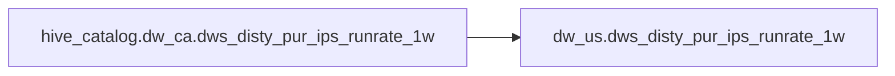

# FACT: Supplemental fact/context table used by select POS reports (`dw_us.dws_disty_pur_ips_runrate_1w`)

- artifact_type: etl_table
- artifact_id: dw_us.dws_disty_pur_ips_runrate_1w
- domain: pos
- one_line_purpose: POS-domain table with load SQL under bitbucket-etl (see L3); prior contract narrative preserved below when present.
- layer_type: DWS
- source_kind: etl_sql
- evidence_source: source/contracts/pos/bitbucket-etl/dws_disty_pur_ips_runrate_1w/dws_disty_pur_ips_runrate_1w.sql
- bitbucket_etl_bundle: source/contracts/pos/bitbucket-etl/dws_disty_pur_ips_runrate_1w/
- related_etl_scripts:
- None

---

## L1 Data Foundation

### Identity and physical mapping
- **Table:** `dw_us.dws_disty_pur_ips_runrate_1w`
- **Layer type:** DWS
- **Canonical / derived:** Derived / ETL-loaded (see L3 from bitbucket-etl)
- **Owner team:** Not documented in repository

### Grain, scope, exclusions
- See preserved **Grain and keys** section below when present (POS contract narrative retained).
- Otherwise infer from SELECT / GROUP BY / INSERT column list in `source/contracts/pos/bitbucket-etl/dws_disty_pur_ips_runrate_1w/dws_disty_pur_ips_runrate_1w.sql`.

### Cross-engine presence
| Engine | Present | Notes |
|--------|---------|-------|
| Hive | yes | ETL load target |
| Vertica | yes when POS contract documents Vertica sync | See preserved Business query tables |

### Physical schema reference

| Field | Value |
|-------|-------|
| **entity_id** | `dw_us.dws_disty_pur_ips_runrate_1w` |
| **l1_catalog_seed** | `target/storage/wkb/snapshots/_snapshot_id_template/l1_catalog/{engine}_{schema}_{table}.json` |
| **column_count** | pending (run ddl_seed_writer) |
| **partition_keys** | See preserved Grain / L4 / ETL PARTITION clause |
| **ddl_source** | pending |
| **retrieval** | `python -m tools.wkb.indexing.run_query --query "pos dws_disty_pur_ips_runrate_1w schema" --intent find_table_schema` |

### Lineage

- **Primary load:** `source/contracts/pos/bitbucket-etl/dws_disty_pur_ips_runrate_1w/dws_disty_pur_ips_runrate_1w.sql`
- **upstream:** `hive_catalog.dw_ca.dws_disty_pur_ips_runrate_1w` — FROM/JOIN — `source/contracts/pos/bitbucket-etl/dws_disty_pur_ips_runrate_1w/dws_disty_pur_ips_runrate_1w.sql`
- **downstream:** see L6 Downstream consumers
### Freshness and load path
- Parameters / date window: see ETL `${literal_*}` / `${date_flag}` / `${start_date}` in evidence script.
- Schedule: Not documented in repository

## L2 Declarative Knowledge

### Business purpose
See preserved **Business purpose** below when present (POS contract catalog + linked ETL).

### Audience and use cases
See preserved **Who it helps** section when present.

### Fact key resolution
See preserved **Grain and keys** when present.

### Time field semantics
- Prefer partition / `date_flag` filters documented in preserved sections and L3 Key filters from ETL.

### Metrics served
See preserved Metrics / column groups when present; otherwise L3 column derivations.

### Metric serving map
N/A unless multi-period wide table (see preserved content).

### etl_metrics
No new metric-index formulas appended in this bitbucket-etl upgrade pass.

## L3 Procedural Knowledge

### Query and routing rules
- Reporting: Vertica `dw_us.dws_disty_pur_ips_runrate_1w` when synced (see preserved Business query tables).
- Load logic: bitbucket-etl evidence `source/contracts/pos/bitbucket-etl/dws_disty_pur_ips_runrate_1w/dws_disty_pur_ips_runrate_1w.sql`.

### Dimension join patterns
See Relationship map (ETL JOIN edges) and preserved contract join notes.

### Key filters and ETL business logic

| Predicate | Kind | Evidence |
|-----------|------|----------|
| — | — | No WHERE clause parsed from `source/contracts/pos/bitbucket-etl/dws_disty_pur_ips_runrate_1w/dws_disty_pur_ips_runrate_1w.sql` |

### Standard time-filter SQL
```sql
-- Prefer date_flag / literal_start_date / literal_end_date as used in source/contracts/pos/bitbucket-etl/dws_disty_pur_ips_runrate_1w/dws_disty_pur_ips_runrate_1w.sql
```

### End-to-end flow


### Base tables register
| Object | Role |
|--------|------|
| `hive_catalog.dw_ca.dws_disty_pur_ips_runrate_1w` | source / temp (FROM/JOIN) |

### Step-by-step logic
1. Execute load SQL / python in `source/contracts/pos/bitbucket-etl/dws_disty_pur_ips_runrate_1w/`.
2. Apply date / business filters from ETL (Key filters).
3. Write target `dw_us.dws_disty_pur_ips_runrate_1w` (see INSERT/OVERWRITE in evidence).

### Relationship map (embedded)

| from_fqn | to_fqn | cardinality | join_keys | provenance |
|----------|--------|-------------|-----------|------------|
| — | — | — | — | No JOIN edges parsed from ETL (`source/contracts/pos/bitbucket-etl/dws_disty_pur_ips_runrate_1w/dws_disty_pur_ips_runrate_1w.sql`); see Base tables register / step-by-step |

### Special logic (embedded)

`source/ref/pos/special_logic.txt` exists but no rule naming this FQN/stem (`dw_us.dws_disty_pur_ips_runrate_1w`).

Not documented in repository


### Column / field derivations (from ETL SQL)

| target_column | expression_sql | upstream_columns | upstream_tables | transform_kind | evidence |
|---------------|----------------|------------------|-----------------|----------------|----------|
| `sum_type` | ``sum_type`` | `sum_type` | `hive_catalog.dw_ca.dws_disty_pur_ips_runrate_1w` | rename | `source/contracts/pos/bitbucket-etl/dws_disty_pur_ips_runrate_1w/dws_disty_pur_ips_runrate_1w.sql:5` |
| `vend_no` | ``vend_no`` | `vend_no` | `hive_catalog.dw_ca.dws_disty_pur_ips_runrate_1w` | rename | `source/contracts/pos/bitbucket-etl/dws_disty_pur_ips_runrate_1w/dws_disty_pur_ips_runrate_1w.sql:5` |
| `vpl_no` | ``vpl_no`` | `vpl_no` | `hive_catalog.dw_ca.dws_disty_pur_ips_runrate_1w` | rename | `source/contracts/pos/bitbucket-etl/dws_disty_pur_ips_runrate_1w/dws_disty_pur_ips_runrate_1w.sql:5` |
| `prod_code` | ``prod_code`` | `prod_code` | `hive_catalog.dw_ca.dws_disty_pur_ips_runrate_1w` | rename | `source/contracts/pos/bitbucket-etl/dws_disty_pur_ips_runrate_1w/dws_disty_pur_ips_runrate_1w.sql:5` |
| `sku_no` | ``sku_no`` | `sku_no` | `hive_catalog.dw_ca.dws_disty_pur_ips_runrate_1w` | rename | `source/contracts/pos/bitbucket-etl/dws_disty_pur_ips_runrate_1w/dws_disty_pur_ips_runrate_1w.sql:5` |
| `inv_type` | ``inv_type`` | `inv_type` | `hive_catalog.dw_ca.dws_disty_pur_ips_runrate_1w` | rename | `source/contracts/pos/bitbucket-etl/dws_disty_pur_ips_runrate_1w/dws_disty_pur_ips_runrate_1w.sql:5` |
| `loc_no` | ``loc_no`` | `loc_no` | `hive_catalog.dw_ca.dws_disty_pur_ips_runrate_1w` | rename | `source/contracts/pos/bitbucket-etl/dws_disty_pur_ips_runrate_1w/dws_disty_pur_ips_runrate_1w.sql:5` |
| `week` | ``week`` | `week` | `hive_catalog.dw_ca.dws_disty_pur_ips_runrate_1w` | rename | `source/contracts/pos/bitbucket-etl/dws_disty_pur_ips_runrate_1w/dws_disty_pur_ips_runrate_1w.sql:5` |
| `runrate_qty` | ``runrate_qty`` | `runrate_qty` | `hive_catalog.dw_ca.dws_disty_pur_ips_runrate_1w` | rename | `source/contracts/pos/bitbucket-etl/dws_disty_pur_ips_runrate_1w/dws_disty_pur_ips_runrate_1w.sql:5` |
| `runrate_sales` | ``runrate_sales`` | `runrate_sales` | `hive_catalog.dw_ca.dws_disty_pur_ips_runrate_1w` | rename | `source/contracts/pos/bitbucket-etl/dws_disty_pur_ips_runrate_1w/dws_disty_pur_ips_runrate_1w.sql:5` |
| `runrate_cost` | ``runrate_cost`` | `runrate_cost` | `hive_catalog.dw_ca.dws_disty_pur_ips_runrate_1w` | rename | `source/contracts/pos/bitbucket-etl/dws_disty_pur_ips_runrate_1w/dws_disty_pur_ips_runrate_1w.sql:5` |
| `etl_timestamp` | ``etl_timestamp`` | `etl_timestamp` | `hive_catalog.dw_ca.dws_disty_pur_ips_runrate_1w` | rename | `source/contracts/pos/bitbucket-etl/dws_disty_pur_ips_runrate_1w/dws_disty_pur_ips_runrate_1w.sql:5` |
| `date_flag` | ``date_flag`` | `date_flag` | `hive_catalog.dw_ca.dws_disty_pur_ips_runrate_1w` | rename | `source/contracts/pos/bitbucket-etl/dws_disty_pur_ips_runrate_1w/dws_disty_pur_ips_runrate_1w.sql:5` |
| `additional_level` | ``additional_level`` | `additional_level` | `hive_catalog.dw_ca.dws_disty_pur_ips_runrate_1w` | rename | `source/contracts/pos/bitbucket-etl/dws_disty_pur_ips_runrate_1w/dws_disty_pur_ips_runrate_1w.sql:5` |
| `dt_week2` | ``dt_week2`` | `dt_week2` | `hive_catalog.dw_ca.dws_disty_pur_ips_runrate_1w` | rename | `source/contracts/pos/bitbucket-etl/dws_disty_pur_ips_runrate_1w/dws_disty_pur_ips_runrate_1w.sql:5` |

### Sentinel and code values
See preserved content and ETL CASE expressions in column derivations.

## L4 Validation

### Resolved partition value
- Partition / date parameters from ETL literals — concrete calendar values Not documented in repository (resolve via Azkaban when flow evidence exists).

### Data quality checks
See preserved Validation SQL when present.

### Validation SQL
Prefer preserved Vertica validation bundle when present; MCP business SQL not re-run during documentation.

### Caveats for interpretation
- Document upgraded additively from POS **contract** MD + **bitbucket-etl** SQL. Prior contract text is under **Preserved pre-L1-L6 content** when present.

### Conflicts and open questions
- Companion loader scripts may also appear under other domain KB folders; see `target/knowledgebase/pos/readme.md` cross-links.

## L5 Runtime View

### Query path and engine preference
| Path | Engine | Evidence |
|------|--------|----------|
| Load | Hive/Spark | `source/contracts/pos/bitbucket-etl/dws_disty_pur_ips_runrate_1w/dws_disty_pur_ips_runrate_1w.sql` |
| Report | Vertica | preserved POS contract when present |

### Access constraints
Not documented in repository

### Query risk profile
- Always filter `date_flag` / documented partition keys before wide scans.

## L6 Access and Consumption

### Primary consumers and use cases
See preserved audience / POS report consumers when present.

### Representative query patterns
See preserved Validation SQL / contract examples when present.

### Dependencies and notes

#### Upstream objects (verified)
| Object | Usage | Evidence |
|--------|-------|----------|
| `hive_catalog.dw_ca.dws_disty_pur_ips_runrate_1w` | FROM/JOIN | `source/contracts/pos/bitbucket-etl/dws_disty_pur_ips_runrate_1w/dws_disty_pur_ips_runrate_1w.sql` |

#### Downstream consumers (verified)

| Object / script | Evidence |
|-----------------|----------|
| POS / RDS reports (contract) | preserved sections when present |
| Related loaders | see related_etl_scripts header |
| KB / contract ref: `source/contracts/pos/bitbucket-etl/MANIFEST.md` | `source/contracts/pos/bitbucket-etl/MANIFEST.md:224` |
| KB / contract ref: `source/contracts/pos/tables/dws_disty_pur_ips_runrate_1w.md` | `source/contracts/pos/tables/dws_disty_pur_ips_runrate_1w.md:5` |
| ETL/script ref: `source/contracts/rds/starrocks_inventory/etl/inv_aging_eta_rio_open_po_rds_7806.sql` | `source/contracts/rds/starrocks_inventory/etl/inv_aging_eta_rio_open_po_rds_7806.sql:228` |
| ETL/script ref: `source/contracts/rds/starrocks_inventory/etl/inv_multisheet_dos_bo_rds_14059.sql` | `source/contracts/rds/starrocks_inventory/etl/inv_multisheet_dos_bo_rds_14059.sql:92` |
| ETL/script ref: `source/contracts/rds/starrocks_inventory/etl/inv_qty_aging_runrate_rio_location_rds_5501.sql` | `source/contracts/rds/starrocks_inventory/etl/inv_qty_aging_runrate_rio_location_rds_5501.sql:257` |
| ETL/script ref: `source/contracts/rds/starrocks_vpo/etl/vpo_inventory_open_po_eta_rio_runrate_rds_7806.sql` | `source/contracts/rds/starrocks_vpo/etl/vpo_inventory_open_po_eta_rio_runrate_rds_7806.sql:228` |
| ETL/script ref: `source/contracts/rds/vertica_b_report/etl/b_report_lightweight_orders_inventory_rio_rds_7500.sql` | `source/contracts/rds/vertica_b_report/etl/b_report_lightweight_orders_inventory_rio_rds_7500.sql:207` |
| ETL/script ref: `source/contracts/rds/vertica_inventory/etl/inv_aging_qty_runrate_rio_alloc_rds_18605.sql` | `source/contracts/rds/vertica_inventory/etl/inv_aging_qty_runrate_rio_alloc_rds_18605.sql:54` |
| ETL/script ref: `source/contracts/rds/vertica_inventory/etl/inv_aging_qty_runrate_so_alloc_rds_17343.sql` | `source/contracts/rds/vertica_inventory/etl/inv_aging_qty_runrate_so_alloc_rds_17343.sql:57` |
| ETL/script ref: `source/contracts/rds/vertica_inventory/etl/inv_aging_qty_runrate_so_alloc_rds_17345.sql` | `source/contracts/rds/vertica_inventory/etl/inv_aging_qty_runrate_so_alloc_rds_17345.sql:50` |
| ETL/script ref: `source/contracts/rds/vertica_inventory/etl/inv_qty_aging_runrate_rio_alloc_customer_rds_us13208.sql` | `source/contracts/rds/vertica_inventory/etl/inv_qty_aging_runrate_rio_alloc_customer_rds_us13208.sql:217` |
| ETL/script ref: `source/contracts/rds/vertica_inventory/etl/inv_rio_cws_location_rds_6800.sql` | `source/contracts/rds/vertica_inventory/etl/inv_rio_cws_location_rds_6800.sql:152` |
| ETL/script ref: `source/contracts/rds/vertica_inventory/etl/inv_rollover_witypestu_stock_rotation_rds_11722.sql` | `source/contracts/rds/vertica_inventory/etl/inv_rollover_witypestu_stock_rotation_rds_11722.sql:472` |
| ETL/script ref: `source/contracts/rds/vertica_open_so_bo/etl/open_so_bo_inventory_rio_runrate_rds_7500.sql` | `source/contracts/rds/vertica_open_so_bo/etl/open_so_bo_inventory_rio_runrate_rds_7500.sql:207` |
| FLOW ref: `source/etl/flows/public_order_scripts/ods_etl/ods_data_load_ca_01.flow` | `source/etl/flows/public_order_scripts/ods_etl/ods_data_load_ca_01.flow:448` |
| FLOW ref: `source/etl/flows/public_order_scripts/ods_etl/ods_data_load_us_2.flow` | `source/etl/flows/public_order_scripts/ods_etl/ods_data_load_us_2.flow:56` |
| KB / contract ref: `target/knowledgebase/RDS/starrocks_inventory/inv_aging_eta_rio_open_po_rds_7806.md` | `target/knowledgebase/RDS/starrocks_inventory/inv_aging_eta_rio_open_po_rds_7806.md:60` |
| KB / contract ref: `target/knowledgebase/RDS/starrocks_inventory/inv_multisheet_dos_bo_rds_14059.md` | `target/knowledgebase/RDS/starrocks_inventory/inv_multisheet_dos_bo_rds_14059.md:54` |
| KB / contract ref: `target/knowledgebase/RDS/starrocks_inventory/inv_qty_aging_runrate_rio_location_rds_5501.md` | `target/knowledgebase/RDS/starrocks_inventory/inv_qty_aging_runrate_rio_location_rds_5501.md:55` |
| KB / contract ref: `target/knowledgebase/RDS/starrocks_vpo/vpo_inventory_open_po_eta_rio_runrate_rds_7806.md` | `target/knowledgebase/RDS/starrocks_vpo/vpo_inventory_open_po_eta_rio_runrate_rds_7806.md:60` |
| KB / contract ref: `target/knowledgebase/RDS/vertica_b_report/b_report_lightweight_orders_inventory_rio_rds_7500.md` | `target/knowledgebase/RDS/vertica_b_report/b_report_lightweight_orders_inventory_rio_rds_7500.md:60` |
| KB / contract ref: `target/knowledgebase/RDS/vertica_inventory/inv_aging_qty_runrate_rio_alloc_rds_18605.md` | `target/knowledgebase/RDS/vertica_inventory/inv_aging_qty_runrate_rio_alloc_rds_18605.md:54` |
| KB / contract ref: `target/knowledgebase/RDS/vertica_inventory/inv_aging_qty_runrate_so_alloc_rds_17343.md` | `target/knowledgebase/RDS/vertica_inventory/inv_aging_qty_runrate_so_alloc_rds_17343.md:54` |
| KB / contract ref: `target/knowledgebase/RDS/vertica_inventory/inv_aging_qty_runrate_so_alloc_rds_17345.md` | `target/knowledgebase/RDS/vertica_inventory/inv_aging_qty_runrate_so_alloc_rds_17345.md:54` |
| KB / contract ref: `target/knowledgebase/RDS/vertica_inventory/inv_qty_aging_runrate_rio_alloc_customer_rds_us13208.md` | `target/knowledgebase/RDS/vertica_inventory/inv_qty_aging_runrate_rio_alloc_customer_rds_us13208.md:56` |
| KB / contract ref: `target/knowledgebase/RDS/vertica_inventory/inv_rio_cws_location_rds_6800.md` | `target/knowledgebase/RDS/vertica_inventory/inv_rio_cws_location_rds_6800.md:56` |
| KB / contract ref: `target/knowledgebase/RDS/vertica_inventory/inv_rollover_witypestu_stock_rotation_rds_11722.md` | `target/knowledgebase/RDS/vertica_inventory/inv_rollover_witypestu_stock_rotation_rds_11722.md:176` |
| KB / contract ref: `target/knowledgebase/RDS/vertica_open_so_bo/open_so_bo_inventory_rio_runrate_rds_7500.md` | `target/knowledgebase/RDS/vertica_open_so_bo/open_so_bo_inventory_rio_runrate_rds_7500.md:60` |
| KB / contract ref: `target/knowledgebase/pos/readme.md` | `target/knowledgebase/pos/readme.md:80` |

#### Operational detail (verified)
- Bundle: `source/contracts/pos/bitbucket-etl/dws_disty_pur_ips_runrate_1w/`
- Manifest: `source/contracts/pos/bitbucket-etl/MANIFEST.md`

#### Not documented in repository
- Schedule, owner, SLA

---

## Preserved pre-L1-L6 content

> Retained verbatim from the prior POS contract knowledgebase document (nothing removed). ETL load evidence above supplements this catalog narrative.


**Domain:** pos  
**Source contract:** `C:\Users\T154858D.TDSNX\Desktop\git_repo_v1\data_analysis_agent_brpt\knowledge\POS\tables\dws_disty_pur_ips_runrate_1w.md`  
**Knowledgebase path:** `target/knowledgebase/pos/dws_disty_pur_ips_runrate_1w.md`

## Business purpose

Supplemental fact/context table used by select POS reports

This document is derived from the POS table contract catalog. ETL script lineage for load jobs is **not documented in this repository** unless listed under verified dependencies below.

---

## What the process does (high level)

| Stage | Business meaning |
|-------|------------------|
| **Catalog object** | `dw_us.dws_disty_pur_ips_runrate_1w` — FACT layer table used in US POS reporting (`US POS baseline`). |
| **Consumption** | Queried from Vertica for POS/RDS reports, exports, and enrichment joins. |

**Parameters:** Country schema pattern `dw_us` (US baseline documented as `dw_us` / `dim_us`).

---

## Who it helps and how

| Audience | How they benefit |
|----------|-----------------|
| **POS / RDS reporting** | Vertica RDS POS custom reports (499 scripts scanned: US 367, CA 124, MX 7, BR 1) |
| **Sales analytics** | Order, customer, product, and margin attributes at documented grain. |
| **Data engineering** | Stable table contract for joins to POS hub and downstream exports. |

---

## Business query tables (Vertica)

| Role | Hive object | Vertica object | Sync mode | Evidence | MCP verified |
|------|-------------|----------------|-----------|----------|--------------|
| **Query for reporting** | `dw_us.dws_disty_pur_ips_runrate_1w` | `dw_us.dws_disty_pur_ips_runrate_1w` | overwrite / incremental | POS contract `dws_disty_pur_ips_runrate_1w.md:L1` | yes (POS contract v2 — Vertica verified in source catalog) |
| **Hive alternative** | `dw_us.dws_disty_pur_ips_runrate_1w` | same as reporting table | - | POS contract cross-engine note | - |
| **ETL internal** | n/a | n/a | - | ETL not in wiki repo | - |

Business users should query **`dw_us.dws_disty_pur_ips_runrate_1w`** in Vertica for POS-domain reporting aligned to this contract.

---

## Grain and keys

- **Grain:** See natural key columns from POS contract column catalog.
- **Partition:** `week` — daily business date filter for POS reporting (per POS contract).
- **Natural key:** `vend_no`, `vpl_no`, `sku_no`, `loc_no`, `date_flag`
- **Exclusions (reporting):** None documented in POS contract.

---

## Validation SQL (Vertica)

```sql
-- 1) Row count by partition
SELECT week, COUNT(*) AS row_cnt
FROM dw_us.dws_disty_pur_ips_runrate_1w
WHERE week = '${partition_value}'
GROUP BY week;

-- 2) Metric sum by business dimension (top N)
SELECT vend_no, COUNT(*) AS row_cnt
FROM dw_us.dws_disty_pur_ips_runrate_1w
WHERE week = '${partition_value}'
GROUP BY vend_no
ORDER BY COUNT(*) DESC
LIMIT 20;

-- 3) Grain duplicate check
SELECT vend_no, vpl_no, sku_no, week, COUNT(*) AS cnt
FROM dw_us.dws_disty_pur_ips_runrate_1w
WHERE week = '${partition_value}'
GROUP BY vend_no, vpl_no, sku_no, week
HAVING COUNT(*) > 1;
```

Replace `${partition_value}` with the resolved business date or period from the report scope.

---

## Data you can fetch and use downstream

### Core measures

- `runrate_qty` — runrate qty
- `runrate_sales` — runrate sales
- `runrate_cost` — runrate cost

### Dimension and key columns

- `sum_type` — sum type
- `vend_no` — vend no
- `vpl_no` — vpl no
- `prod_code` — prod code
- `sku_no` — sku no
- `inv_type` — inv type
- `loc_no` — loc no
- `week` — week
- `etl_timestamp` — etl timestamp
- `date_flag` — date flag
- `dt_week2` — dt week2
- `additional_level` — additional level

---

## Metrics business users typically care about

When exposing this table to the business, lead with measure and key columns from the POS contract catalog (see **Data you can fetch** above).

---

## End-to-end flow (summary)

**Target table:** `dw_us.dws_disty_pur_ips_runrate_1w`  
**Load pattern:** Not documented in repository

1. Upstream: Curated DWD/DIM/ODS load jobs in disty common pipeline
2. Table available in Hive and Vertica for POS consumption.
3. Downstream: Vertica RDS POS report scripts (`rds_*_rtv`), ad-hoc POS exports


---

## Base tables register

| Object | Role in this job |
|--------|-----------------|
| `dw_us.dws_disty_pur_ips_runrate_1w` | Primary catalog table documented from POS contract |

---

## Step-by-step logic

Not applicable — this Knowledgebase entry is a **table catalog** converted from POS contract v2. ETL step-by-step logic is not present in this wiki repository.

**Standard POS filters (from contract L3):**

- Standard POS filters inherited from domain-knowledge.md when joining to hub.

---

## Caveats for interpretation

- Derived from POS contract v2; ETL SQL and Azkaban flow names are not verified in this repository unless cited below.
- US schema `dw_us` documented as baseline; CA/MX/BR use same table names with regional scope.
- - Verify grain keys (`order_no`, `order_type`, `order_line_no`) not null for fact joins when applicable.
- For one-to-many partners (SPA/SCM, serial), validate row counts before joining to hub.
- Hub: `extend_net_price` should align with `(unit_net_price * ship_qty)` within rounding tolerance when both populated.
- Validate join cardinality to POS hub before production report use.

---

## Dependencies and notes (verified only)

### Upstream objects (verified)

| Object | Usage | Evidence |
|--------|-------|----------|
| POS contract source | Table metadata, grain, columns | `C:\Users\T154858D.TDSNX\Desktop\git_repo_v1\data_analysis_agent_brpt\knowledge\POS\tables\dws_disty_pur_ips_runrate_1w.md` |

### Downstream consumers (verified)

| Object / script | Evidence |
|-----------------|----------|
| POS RDS / export consumers | `dws_disty_pur_ips_runrate_1w.md:L6` — Vertica RDS POS report scripts (`rds_*_rtv`), ad-hoc POS exports |

### Operational detail (verified)

- Freshness: Not documented in repository
- Column count: 15 (POS contract catalog)

### Not documented in repository

- ETL SQL load script and Azkaban `.flow` for this table
- hive2vertica sync job file:line evidence
- Schedule, owner, SLA

### Related scripts (verified)

None identified in repository.

---

*Document generated from POS contract `C:\Users\T154858D.TDSNX\Desktop\git_repo_v1\data_analysis_agent_brpt\knowledge\POS\tables\dws_disty_pur_ips_runrate_1w.md`.*