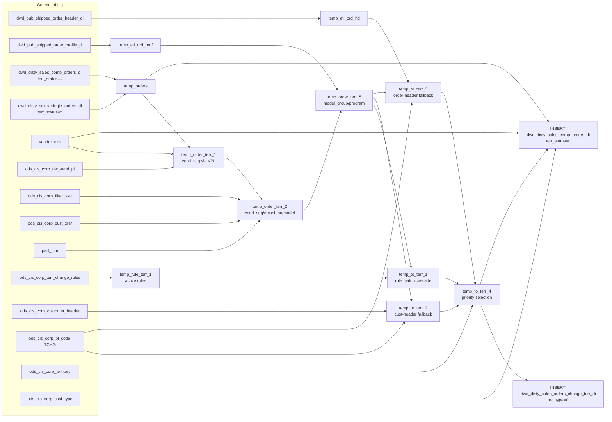

# DWD: Apply Territory Change Rules to Component/Kit Orders (`dwd_disty_sales_comp_orders_di`)

- artifact_type: etl_table
- artifact_id: dwd_disty_sales_comp_orders_di
- domain: pos
- one_line_purpose: Territory-change application ETL for POS order lines (see preserved business sections below).
- layer_type: DWD
- source_kind: etl_sql
- evidence_source: source/etl/sql/pos/data_service/pos/sql/load_comp_orders_apply_terr_change.sql

---

## L1 Data Foundation

### Identity and physical mapping
- **Table / job:** `dwd_disty_sales_comp_orders_di` / `load_comp_orders_apply_terr_change`
- **Layer type:** DWD
- **Canonical / derived:** Derived / ETL-loaded (see preserved lineage below)
- **Owner team:** Not documented in repository

### Grain, scope, exclusions
- See preserved **Grain and keys** section below (content retained from prior documentation).

### Cross-engine presence
| Engine | Present | Notes |
|--------|---------|-------|
| Hive | yes | ETL target / intermediate |
| Vertica | See preserved Business query tables section |

### Physical schema reference

| Field | Value |
|-------|-------|
| **entity_id** | `dwd_disty_sales_comp_orders_di` |
| **l1_catalog_seed** | `target/storage/wkb/snapshots/_snapshot_id_template/l1_catalog/{engine}_{schema}_{table}.json` |
| **column_count** | pending |
| **ddl_source** | pending |
| **retrieval** | `python -m tools.wkb.indexing.run_query --query "pos load_comp_orders_apply_terr_change schema" --intent find_table_schema` |

### Lineage
- Primary upstream/downstream details are retained in the preserved sections below; L3 Relationship map summarizes ETL JOIN edges.

### Freshness and load path
- Parameters and load pattern: see preserved content (`date_flag`, target/source/dim DB literals).

## L2 Declarative Knowledge

### Business purpose
See preserved **Business purpose** section below (not removed).

### Audience and use cases
See preserved **Who it helps** section below.

### Fact key resolution
See preserved **Grain and keys**.

### Time field semantics
- `date_flag` partition semantics documented in preserved sections.

### Metrics served
N/A / see preserved content.

### Metric serving map
N/A

### etl_metrics
No new metric-index formulas added in this enrichment pass.

## L3 Procedural Knowledge

### Query and routing rules
See preserved processing / stage tables below.

### Dimension join patterns
See Relationship map and preserved join narrative.

### Key filters and ETL business logic
See preserved stage/filter narrative; SQL predicates also reflected in Relationship map evidence.

### Standard time-filter SQL
```sql
-- Prefer date_flag = '${date_flag}' as documented in ETL parameters
```

### End-to-end flow


### Base tables register
| Object | Role |
|--------|------|
| See preserved lineage / stage tables | retained below |

### Step-by-step logic
See preserved **What the process does** stages (retained below).

### Relationship map (embedded)

| from_fqn | to_fqn | cardinality | join_keys | provenance |
|----------|--------|-------------|-----------|------------|
| `dw_xx.dwd_disty_sales_comp_orders_di` | `dw_xx.dwd_disty_sales_single_orders_di` | many:1 | `k.date_flag = c.date_flag and k.order_type = c.order_type and k.order_no = c.order_no and k.order_line_no = c.kit_no and k.terr_status = 'o'` | etl_sql (source/etl/sql/pos/data_service/pos/sql/load_comp_orders_apply_terr_change.sql:1) |
| `dw_xx.dwd_pub_shipped_order_header_di` | `ods_xx.ods_cis_corp_dw_vend_pl` | many:1 | `a.pm_code = b.vpl_no; --DROP TABLE IF EXISTS temp_order_terr_2; CREATE TEMPORARY TABLE temp_order_terr_2 AS` | etl_sql (source/etl/sql/pos/data_service/pos/sql/load_comp_orders_apply_terr_change.sql:1) |
| `dw_xx.dwd_pub_shipped_order_header_di` | `ods_xx.ods_cis_corp_filter_sku` | many:1 | `a.sku_no = b.sku_no` | etl_sql (source/etl/sql/pos/data_service/pos/sql/load_comp_orders_apply_terr_change.sql:1) |
| `dw_xx.dwd_pub_shipped_order_header_di` | `ods_xx.ods_cis_corp_cust_xref` | many:1 | `a.cust_no = cx.cust_no and cx.xref_type = 'MASTER_SUB' and nvl(cx.active, 'Y') = 'Y'` | etl_sql (source/etl/sql/pos/data_service/pos/sql/load_comp_orders_apply_terr_change.sql:1) |
| `dw_xx.dwd_pub_shipped_order_header_di` | `temp_etl_ord_prof` | many:1 | `a.order_type = b.order_type AND a.order_no = b.order_no AND a.kit_no = b.profile_no AND b.profile_type = 'MODELGROUP' AND b.profile_cat = 'ORDL' AND b.active...` | etl_sql (source/etl/sql/pos/data_service/pos/sql/load_comp_orders_apply_terr_change.sql:1) |
| `dw_xx.dwd_pub_shipped_order_header_di` | `temp_etl_ord_prof` | many:1 | `a.order_type = c.order_type AND a.order_no = c.order_no AND c.profile_type = 'PROG_NAME' AND c.profile_cat = 'ORDR' AND c.active = 'Y'; --DROP TABLE IF EXIST...` | etl_sql (source/etl/sql/pos/data_service/pos/sql/load_comp_orders_apply_terr_change.sql:1) |
| `temp_orders` | `temp_rule_terr_1` | many:1 | `dwo.cust_no = t.cust_no AND ( t.mcust_no IS NULL OR dwo.mcust_no = t.mcust_no ) AND ( t.cust_terr IS NULL OR dwo.cust_terr = t.cust_terr ) AND ( t.cust_type ...` | etl_sql (source/etl/sql/pos/data_service/pos/sql/load_comp_orders_apply_terr_change.sql:1) |
| `temp_orders` | `ods_xx.ods_cis_corp_customer_header` | many:1 | `dwo.cust_no = b.cust_no` | etl_sql (source/etl/sql/pos/data_service/pos/sql/load_comp_orders_apply_terr_change.sql:1) |
| `temp_orders` | `ods_xx.ods_cis_corp_cust_type` | many:1 | `dwo.cust_type = c.cust_type` | etl_sql (source/etl/sql/pos/data_service/pos/sql/load_comp_orders_apply_terr_change.sql:1) |
| `temp_orders` | `temp_etl_ord_hd` | many:1 | `dwo.order_no = b.order_no AND dwo.order_type = b.order_type` | etl_sql (source/etl/sql/pos/data_service/pos/sql/load_comp_orders_apply_terr_change.sql:1) |
| `dw_xx.dwd_pub_shipped_order_header_di` | `ods_xx.ods_cis_corp_territory` | many:1 | `a.to_terr = te.sales_terr` | etl_sql (source/etl/sql/pos/data_service/pos/sql/load_comp_orders_apply_terr_change.sql:1) |
| `dw_xx.dwd_pub_shipped_order_header_di` | `ods_xx.ods_cis_corp_cust_type` | many:1 | `a.cust_type = c.cust_type` | etl_sql (source/etl/sql/pos/data_service/pos/sql/load_comp_orders_apply_terr_change.sql:1) |

`table relationship.txt` edges naming this FQN: none found — Not documented in repository.

### Special logic (embedded)

Provenance file: `source/ref/pos/special_logic.txt` (applicable rules only).

Domain `special_logic.txt` present, but no numbered rules name this artifact FQN / stem — Not documented in repository for this artifact.

### Column / field derivations (from ETL SQL)

| target_column | expression_sql | upstream_columns | upstream_tables | transform_kind | evidence |
|---------------|----------------|------------------|-----------------|----------------|----------|
| `order_type` | `order_type` | `order_type` | `temp_to_terr_4`, `temp_orders`, `${target_db}.dwd_disty_sales_orders_change_terr_di`, `${source_db}.ods_cis_corp_cust_type`, `${dim_db}.${vendor_table_name}` | passthrough | `source/etl/sql/pos/data_service/pos/sql/load_comp_orders_apply_terr_change.sql:16` |
| `order_no` | `order_no` | `order_no` | `temp_to_terr_4`, `temp_orders`, `${target_db}.dwd_disty_sales_orders_change_terr_di`, `${source_db}.ods_cis_corp_cust_type`, `${dim_db}.${vendor_table_name}` | passthrough | `source/etl/sql/pos/data_service/pos/sql/load_comp_orders_apply_terr_change.sql:17` |
| `order_line_no` | `order_line_no` | `order_line_no` | `temp_to_terr_4`, `temp_orders`, `${target_db}.dwd_disty_sales_orders_change_terr_di`, `${source_db}.ods_cis_corp_cust_type`, `${dim_db}.${vendor_table_name}` | passthrough | `source/etl/sql/pos/data_service/pos/sql/load_comp_orders_apply_terr_change.sql:18` |
| `kit_sku_no` | `kit_sku_no` | `kit_sku_no` | `temp_to_terr_4`, `temp_orders`, `${target_db}.dwd_disty_sales_orders_change_terr_di`, `${source_db}.ods_cis_corp_cust_type`, `${dim_db}.${vendor_table_name}` | passthrough | `source/etl/sql/pos/data_service/pos/sql/load_comp_orders_apply_terr_change.sql:73` |
| `rule_no` | `rule_no` | `rule_no` | `temp_to_terr_4`, `temp_orders`, `${target_db}.dwd_disty_sales_orders_change_terr_di`, `${source_db}.ods_cis_corp_cust_type`, `${dim_db}.${vendor_table_name}` | passthrough | `source/etl/sql/pos/data_service/pos/sql/load_comp_orders_apply_terr_change.sql:208` |
| `seq` | `seq` | `seq` | `temp_to_terr_4`, `temp_orders`, `${target_db}.dwd_disty_sales_orders_change_terr_di`, `${source_db}.ods_cis_corp_cust_type`, `${dim_db}.${vendor_table_name}` | passthrough | `source/etl/sql/pos/data_service/pos/sql/load_comp_orders_apply_terr_change.sql:50` |
| `to_terr` | `to_terr` | `to_terr` | `temp_to_terr_4`, `temp_orders`, `${target_db}.dwd_disty_sales_orders_change_terr_di`, `${source_db}.ods_cis_corp_cust_type`, `${dim_db}.${vendor_table_name}` | passthrough | `source/etl/sql/pos/data_service/pos/sql/load_comp_orders_apply_terr_change.sql:214` |
| `to_cust_type` | `to_cust_type` | `to_cust_type` | `temp_to_terr_4`, `temp_orders`, `${target_db}.dwd_disty_sales_orders_change_terr_di`, `${source_db}.ods_cis_corp_cust_type`, `${dim_db}.${vendor_table_name}` | passthrough | `source/etl/sql/pos/data_service/pos/sql/load_comp_orders_apply_terr_change.sql:576` |
| `vend_seq_ord` | `vend_seq_ord` | `vend_seq_ord` | `temp_to_terr_4`, `temp_orders`, `${target_db}.dwd_disty_sales_orders_change_terr_di`, `${source_db}.ods_cis_corp_cust_type`, `${dim_db}.${vendor_table_name}` | passthrough | `source/etl/sql/pos/data_service/pos/sql/load_comp_orders_apply_terr_change.sql:50` |
| `date_flag` | `'${date_flag}'` | `date_flag` | `temp_to_terr_4`, `temp_orders`, `${target_db}.dwd_disty_sales_orders_change_terr_di`, `${source_db}.ods_cis_corp_cust_type`, `${dim_db}.${vendor_table_name}` | literal | `source/etl/sql/pos/data_service/pos/sql/load_comp_orders_apply_terr_change.sql:4` |
| `rec_type` | `'C'` | `C` | `temp_to_terr_4`, `temp_orders`, `${target_db}.dwd_disty_sales_orders_change_terr_di`, `${source_db}.ods_cis_corp_cust_type`, `${dim_db}.${vendor_table_name}` | literal | `source/etl/sql/pos/data_service/pos/sql/load_comp_orders_apply_terr_change.sql:594` |

### Sentinel and code values
See preserved content for `terr_status`, `to_terr = -1`, `order_type = 20` and related sentinels.

## L4 Validation

### Resolved partition value
- `date_flag` from Azkaban / job parameters — Not documented as a concrete calendar value in repository.

### Data quality checks
Not documented in repository

### Validation SQL
N/A — Vertica MCP not executed during documentation.

### Caveats for interpretation
- This file was upgraded additively to L1–L6; all prior narrative was preserved under **Preserved pre-L1-L6 content**.

### Conflicts and open questions
None identified in repository

## L5 Runtime View

### Query path and engine preference
| Path | Engine | Evidence |
|------|--------|----------|
| ETL | Hive/Spark | `source/etl/sql/pos/data_service/pos/sql/load_comp_orders_apply_terr_change.sql` |

### Access constraints
Not documented in repository

### Query risk profile
- Partition on `date_flag`; filter before wide scans.

## L6 Access and Consumption

### Primary consumers and use cases
See preserved audience section.

### Representative query patterns
Not documented in repository

### Dependencies and notes

#### Upstream objects (verified)
| Object | Usage | Evidence |
|--------|-------|----------|
| See preserved lineage | — | `source/etl/sql/pos/data_service/pos/sql/load_comp_orders_apply_terr_change.sql` |

#### Downstream consumers (verified)
| Object / script | Evidence |
|-----------------|----------|
| Not documented in repository | — |

#### Operational detail (verified)
- See preserved parameters list.

#### Not documented in repository
- Schedule, owner, SLA

---

## Preserved pre-L1-L6 content

> The following sections are retained verbatim from the prior knowledgebase document (nothing removed).


## Business purpose

This job resolves territory assignment for component (kit) order lines that have not yet had their territory evaluated (`terr_status = 'o'`). It matches each order line against a prioritized set of territory-change rules and, where a rule fires, overwrites the customer territory (`cust_terr`) and vendor sequence (`vend_seq_ord`) on the comp-order record. The territory-change audit record is simultaneously written to a shared change-tracking table so downstream jobs can trace which rule triggered each reassignment.

---

## What the process does (high level)

| Stage | Business meaning |
|-------|-----------------|
| **Stage data** | Pull comp orders pending territory evaluation and their shipped-order header/profile metadata for the current date |
| **Enrich key attributes** | Resolve vendor segment code through vendor PL and filter-SKU tables; resolve master customer number via cross-reference; attach part model and SKU profile |
| **Append model/program** | Join order profile records to tag each order line with its model group and program name |
| **Load rules** | Snapshot active territory-change rules valid on the processing date |
| **Match orders to rules** | Four-priority cascade (by cust_no → mcust_no → vpl_no → attribute-only) produces a candidate set of `(order, rule, to_terr)` triples |
| **Fallback territory resolution** | Two safety-net paths: customer-header `sales_terr` marked TCHG but not already TCHG, and order-header `sales_terr` similarly marked |
| **Priority selection** | Keep highest `seq`, break ties by highest `rule_no`, exclude sentinel `to_terr = -1` and `order_type = 20` |
| **Write audit record** | INSERT into territory-change audit table with `rec_type = 'C'` |
| **Write updated orders** | INSERT comp orders back with applied territory (`terr_status = 'n'`), updating `cust_type`, `cust_terr`, `vend_seq_ord` where a rule fired |

**Parameters:** `${date_flag}`, `${target_db}`, `${source_db}`, `${dim_db}`, `${vendor_table_name}`, `${part_table_name}`, `${etl_timestamp}`

---

## Who it helps and how

| Audience | How they benefit |
|----------|-----------------|
| **Sales Operations / Territory Management** | Ensures every shipped comp-order line carries the correct territory assignment before downstream reporting; the audit table provides traceability to the firing rule |
| **Sales Reporting & BI** | `cust_terr` and `vend_seq_ord` on the output table are the authoritative territory fields used in revenue attribution dashboards |
| **Data Engineering** | `terr_status = 'n'` flags records as territory-resolved, signalling readiness for downstream DWS or DM aggregation jobs |

---

## Business query tables (Vertica)

| Role | Hive object | Vertica object | Sync mode | Evidence | MCP verified |
|------|-------------|----------------|-----------|----------|--------------|
| **Not in Vertica** | *See script lineage* | *No Vertica mapping identified in repository* | - | *Add flow evidence when found* | no |

No queryable Vertica table has been confirmed for this script from current repository evidence.

## Grain and keys

- **Grain:** one row per comp-order line (`order_type`, `order_no`, `order_line_no`) within a partition.
- **Partition:** `date_flag` — the ship/processing date; `terr_status` — status after this job writes `'n'` (done).
- **Natural key:** `order_type`, `order_no`, `order_line_no` within `date_flag`.

---

## Data you can fetch and use downstream

### Identifiers and relationships

- **Order:** `order_type`, `order_no`, `order_line_no`
- **Kit relationship:** `kit_no`, `kit_line_no`, `kit_sku_no` (links to the parent single-order line)
- **Customer:** `cust_no`, `mcust_no`, `cust_loc_no`, `company_no`
- **Vendor / Product:** `vend_no`, `sku_no`, `part_no`, `pm_code`

### Dimension columns (reporting-ready, pre-computed from source)

- `cust_terr` — territory assigned after rule evaluation (updated from original if a rule fired)
- `cust_type` — customer type, updated to `to_cust_type` when a rule fires (else original)
- `vend_seg` — vendor segment after priority resolution through vendor PL, filter-SKU, and vendor dim
- `vend_seq_ord` — vendor sequence order, replaced by `to_terr` when a territory rule fires
- `division` — resolved via `ods_cis_corp_cust_type` at INSERT time; falls back to original division
- `sales_team`, `ship_method`, `from_loc_no`, `to_zip`, `cust_region`, `cust_zip` — geography / channel dims

### Quantity, pricing, and cost building blocks

- `ship_qty` — shipped units
- `u_cost`, `u_price`, `base_cost`, `sales_cost`, `vpo_cost` — unit-level cost/price components
- `grid_price`, `retail_price`, `std_whls_price` — catalogue price reference fields
- `u_sum_expense`, `sales_total` — line-level revenue and expense totals

### Core derived metrics

| Column | Formula | Business reading |
|--------|---------|-----------------|
| `cust_terr` (updated) | `CASE WHEN rule matched THEN t.to_terr ELSE dwo.cust_terr END` | Territory to which revenue is attributed after correction |
| `vend_seq_ord` (updated) | `CASE WHEN rule matched THEN t.to_terr ELSE dwo.vend_seq_ord END` | Vendor sequencing order after territory realignment |
| `rule_no` | Highest-priority rule number that fired (`99000` = customer-header fallback; `99001` = order-header fallback) | Audit field identifying which rule caused the territory change |

---

## Metrics business users typically care about

When exposing this table to the business, lead with:

1. **Revenue attribution:** `sales_total`, `u_price`, `ship_qty` grouped by the corrected `cust_terr`
2. **Cost analysis:** `u_cost`, `base_cost`, `sales_cost`, `vpo_cost` per territory/vendor
3. **Territory audit:** `rule_no` to identify which rule drove a reassignment

---

## End-to-end flow (summary)

**Runtime parameters:** `${date_flag}`, `${target_db}`, `${source_db}`, `${dim_db}`, `${vendor_table_name}`, `${part_table_name}`, `${etl_timestamp}`
**Target tables:**
- `${target_db}.dwd_disty_sales_orders_change_terr_di` partitioned by **`date_flag`**, **`rec_type`**
- `${target_db}.dwd_disty_sales_comp_orders_di` partitioned by **`date_flag`**, **`terr_status`**

1. Read shipped order header and profile into temp tables for the date.
2. Pull comp orders with `terr_status = 'o'` and join to single orders to retrieve the kit parent's `sku_no` as `kit_sku_no`; tag `rec_flag = 'CO'`.
3. Enrich vendor segment: apply `vend_seg_code` from vendor dim, then override with `alt_seg_code` from vendor PL.
4. Further enrich: override `vend_seg` from filter-SKU, resolve `mcust_no` via customer cross-reference, attach `model` and `sku_profile` from part dim.
5. Attach `model_group` (profile type MODELGROUP, cat ORDL, keyed on `kit_no`) and `program` (profile type PROG_NAME, cat ORDR).
6. Load active territory-change rules valid on `date_flag`.
7. Match orders to rules via four cascading INNER JOINs (cust_no priority → mcust_no → vpl_no → attribute-only).
8. Compute fallback assignment from customer-header `sales_terr` (TCHG codes, `rule_no=99000, seq=99`).
9. Compute fallback assignment from order-header `sales_terr` (TCHG codes, `rule_no=99001, seq=100`).
10. UNION all candidates; select highest `seq`, break ties by highest `rule_no`; filter out `to_terr = -1` and `order_type = 20`; join territory table for `to_cust_type`.
11. **INSERT** audit records into `dwd_disty_sales_orders_change_terr_di` with `rec_type = 'C'`.
12. **INSERT** updated comp orders into `dwd_disty_sales_comp_orders_di` with `terr_status = 'n'`, applying `to_terr`/`to_cust_type` where matched; enrich `division` and `vend_seg` from dims.



---

## Base tables register

| Object | Role in this job |
|--------|-----------------|
| `${target_db}.dwd_pub_shipped_order_header_di` | Shipped order header; used to look up header-level `sales_terr` for fallback territory assignment |
| `${target_db}.dwd_pub_shipped_order_profile_di` | Order profile attributes; provides `model_group` (MODELGROUP/ORDL) and `program` (PROG_NAME/ORDR) per order line |
| `${target_db}.dwd_disty_sales_comp_orders_di` | Primary source — comp/kit order lines awaiting territory resolution (`terr_status = 'o'`) |
| `${target_db}.dwd_disty_sales_single_orders_di` | Joined to retrieve kit parent `sku_no` as `kit_sku_no`; filtered to `terr_status = 'o'` |
| `${dim_db}.${vendor_table_name}` | Vendor dimension; provides `vend_seg_code` and final `vend_segment` for INSERT enrichment |
| `${source_db}.ods_cis_corp_dw_vend_pl` | Vendor PL table; provides `alt_seg_code` override for `vend_seg` keyed on `pm_code` |
| `${source_db}.ods_cis_corp_filter_sku` | SKU filter table; provides SKU-level `seg_code` override for `vend_seg` |
| `${source_db}.ods_cis_corp_cust_xref` | Customer cross-reference (`MASTER_SUB` type); resolves `mcust_no` from `cust_no` |
| `${dim_db}.${part_table_name}` | Part dimension; provides `model` and `jv_business` (as `sku_profile`) per SKU |
| `${source_db}.ods_cis_corp_terr_change_rules` | Territory-change rule definitions; effective-dated by `beg_date`/`end_date` |
| `${source_db}.ods_cis_corp_customer_header` | Customer master; provides `sales_terr` for fallback territory (`temp_to_terr_2`) |
| `${source_db}.ods_cis_corp_cust_type` | Customer type dimension; provides `division` at final INSERT |
| `${source_db}.ods_cis_corp_pl_code` | Platform code list; `code_type = 'TCHG'` defines territories eligible for reassignment |
| `${source_db}.ods_cis_corp_territory` | Territory master; provides `cust_type` (`to_cust_type`) for the resolved territory |
| `${target_db}.dwd_disty_sales_orders_change_terr_di` | Written with `rec_type = 'C'`; also read back at INSERT #2 to join resolved `to_terr` onto orders |

**Temporary tables (inside the job only):**
`temp_etl_ord_hd` → `temp_etl_ord_prof` → `temp_orders` → `temp_order_terr_1` → `temp_order_terr_2` → `temp_order_terr_5` → `temp_rule_terr_1` → `temp_to_terr_1` + `temp_to_terr_2` + `temp_to_terr_3` → `temp_to_terr_4` → (INSERT #1) → (INSERT #2)

---

## Step-by-step logic

### Step 1 — `temp_etl_ord_hd`

**Source:** `${target_db}.dwd_pub_shipped_order_header_di`

**Filter:**
- `date_flag = '${date_flag}'`

**What happens to columns:**
- All columns passed through as-is (SELECT *); this is a staging snapshot of the order header for the target date.

---

### Step 2 — `temp_etl_ord_prof`

**Source:** `${target_db}.dwd_pub_shipped_order_profile_di`

**Filter:**
- `date_flag = '${date_flag}'`

**What happens to columns:**
- All columns passed through as-is; used later to look up `model_group` and `program` by `order_type`, `order_no`, and `profile_no`.

---

### Step 3 — `temp_orders`

**Source:** `${target_db}.dwd_disty_sales_comp_orders_di` (aliased `c`) LEFT JOIN `${target_db}.dwd_disty_sales_single_orders_di` (aliased `k`)

**Filter:**
- `c.date_flag = '${date_flag}' AND c.terr_status = 'o'`
- `k.date_flag = '${date_flag}' AND k.terr_status = 'o'`
- JOIN keys: `k.order_type = c.order_type AND k.order_no = c.order_no AND k.order_line_no = c.kit_no AND k.terr_status = 'o'`

**What happens to columns:**
- Most columns come directly from the comp order (`c.*`).
- `company_no` — sourced from the matched single-order parent (`k.company_no`).
- `kit_sku_no` — `k.sku_no` (the parent kit line's SKU, from the single order).

**Derived columns in this step:**

| Column | Formula | Plain language |
|--------|---------|----------------|
| `rec_flag` | `'CO'` (literal) | Marks this record as a comp/kit order throughout the pipeline |
| `kit_sku_no` | `k.sku_no` | The SKU of the parent single-order line (the kit header) |

---

### Step 4 — `temp_order_terr_1`

**Structure:** CTE `ot1` then final SELECT

**Source:** `temp_orders` (inner CTE `ot1`) LEFT JOIN `${dim_db}.${vendor_table_name}` → then LEFT JOIN `${source_db}.ods_cis_corp_dw_vend_pl`

**Filter:**
- `ot1`: `date_flag = '${date_flag}'`
- Vendor dim: `date_flag = '${date_flag}'`

**What happens to columns:**
- All key fields passed through; `vend_seg` is refined in two stages.

**Derived columns in this step:**

| Column | Formula | Plain language |
|--------|---------|----------------|
| `vend_seg` (CTE ot1) | `CASE WHEN vp.vend_no IS NOT NULL AND vp.vend_seg_code IS NOT NULL THEN vp.vend_seg_code ELSE a.vend_seg END` | Override vendor segment from vendor dim if a match exists |
| `vend_seg` (final) | `CASE WHEN b.vpl_no IS NOT NULL AND b.vpl_no <> -1 AND b.alt_seg_code IS NOT NULL AND b.alt_seg_code <> '' THEN b.alt_seg_code ELSE a.vend_seg END` | Second override via vendor PL `alt_seg_code` if a valid entry exists |

---

### Step 5 — `temp_order_terr_2`

**Source:** `temp_order_terr_1` LEFT JOIN `ods_cis_corp_filter_sku` + `ods_cis_corp_cust_xref` + `${dim_db}.${part_table_name}`

**Filter:**
- `cx.xref_type = 'MASTER_SUB' AND nvl(cx.active, 'Y') = 'Y'`
- Part dim: `date_flag = '${date_flag}'`

**Derived columns in this step:**

| Column | Formula | Plain language |
|--------|---------|----------------|
| `vend_seg` | `CASE WHEN b.sku_no IS NOT NULL THEN b.seg_code ELSE a.vend_seg END` | Override vendor segment from SKU-level filter table |
| `mcust_no` | `CASE WHEN cx.cust_no IS NOT NULL THEN cx.xref_no ELSE a.mcust_no END` | Resolve master customer number through MASTER_SUB xref |
| `customer_po` | `a.ext_ref` | Renamed for downstream rule matching |
| `model` | `table_part.model` | SKU-level model from part dimension |
| `sku_profile` | `table_part.jv_business` | JV business classification from part dimension |

---

### Step 6 — `temp_order_terr_5`

**Source:** `temp_order_terr_2` LEFT JOIN `temp_etl_ord_prof` (twice)

**JOIN conditions:**
- `model_group` join: `order_type`, `order_no`; `profile_no = kit_no`; `profile_type = 'MODELGROUP'`; `profile_cat = 'ORDL'`; `active = 'Y'`
- `program` join: `order_type`, `order_no`; `profile_type = 'PROG_NAME'`; `profile_cat = 'ORDR'`; `active = 'Y'`

**Derived columns in this step:**

| Column | Formula | Plain language |
|--------|---------|----------------|
| `model_group` | `b.profile_c` | Model group code from the MODELGROUP profile entry keyed on `kit_no` |
| `program` | `c.profile_c` | Program name from the PROG_NAME order-level profile |

---

### Step 7 — `temp_rule_terr_1`

**Source:** `${source_db}.ods_cis_corp_terr_change_rules`

**Filter:**
- `'${date_flag}' >= nvl(t.beg_date, '${date_flag}')` — rule has started
- `'${date_flag}' <= nvl(t.end_date, '${date_flag}')` — rule has not expired
- `t.to_terr IS NOT NULL` — rule has a defined target territory

**What happens to columns:**
- All rule criteria columns passed through; `vend_seg` explicitly cast to string.

---

### Step 8 — `temp_to_terr_1` (four-branch UNION ALL)

**Source:** `temp_order_terr_5` INNER JOIN `temp_rule_terr_1`

This temp table applies four cascading match strategies in order of specificity. Each branch uses all nullable rule criteria (if a criterion is NULL on the rule, it matches any order value):

| Branch | Required anchor | Description |
|--------|----------------|-------------|
| 1 | `t.cust_no IS NOT NULL` | Match by specific customer number; all other criteria are optional wildcards |
| 2 | `t.cust_no IS NULL AND t.mcust_no IS NOT NULL` | Match by master customer number when no specific customer is set |
| 3 | `t.cust_no IS NULL AND t.mcust_no IS NULL AND t.vpl_no IS NOT NULL` | Match by vendor PL number when no customer anchor exists |
| 4 | `t.cust_no IS NULL AND t.mcust_no IS NULL AND t.vpl_no IS NULL` | Attribute-only match (territory, type, vendor, SKU, etc.) |

**Output columns:** `order_type`, `order_no`, `order_line_no`, `rule_no`, `seq`, `to_terr`, `kit_sku_no`, `vend_seq_ord`

---

### Step 9 — `temp_to_terr_2`

**Source:** `temp_order_terr_5` INNER JOIN `ods_cis_corp_customer_header` + `ods_cis_corp_cust_type`

**Filter:**
- `b.sales_terr` is in `ods_cis_corp_pl_code` where `code_type = 'TCHG'` (customer's home territory is a change-eligible code)
- `dwo.cust_terr` is NOT in the same 'TCHG' set (the order's current territory is not already a change territory)

**Derived columns in this step:**

| Column | Formula | Plain language |
|--------|---------|----------------|
| `rule_no` | `99000` | Fallback synthetic rule number for customer-header-based territory override |
| `seq` | `99` | Priority sequence lower than explicit rule matches (seq 99 < 100) |
| `to_terr` | `b.sales_terr` | Target territory taken from the customer master header |

---

### Step 10 — `temp_to_terr_3`

**Source:** `temp_order_terr_5` INNER JOIN `temp_etl_ord_hd`

**Filter:**
- `b.sales_terr` is in `ods_cis_corp_pl_code` where `code_type = 'TCHG'` (order header's territory is a change-eligible code)

**Derived columns in this step:**

| Column | Formula | Plain language |
|--------|---------|----------------|
| `rule_no` | `99001` | Synthetic rule number for order-header-based territory override (higher than customer-header fallback) |
| `seq` | `100` | Highest sequence — this fallback wins over both rule matches and customer-header fallback |
| `to_terr` | `b.sales_terr` | Target territory taken from the order header |

---

### Step 11 — `temp_to_terr_4`

**Structure:** Three CTEs — `to_terr_0` → `to_terr_1` → `to_terr_2` → `to_terr_3`, then final SELECT

**Source:** UNION ALL of `temp_to_terr_1`, `temp_to_terr_2`, `temp_to_terr_3`

**Priority resolution logic:**

| CTE | What it selects |
|-----|----------------|
| `to_terr_0` | All candidates (union all three sources) |
| `to_terr_1` | Keep only rows where `seq = max(seq)` for that order line — highest seq wins |
| `to_terr_2` | Among `to_terr_1`, keep only rows where `rule_no = max(rule_no)` — highest rule wins on seq tie |
| `to_terr_3` | Remove rows where `to_terr = -1` (sentinel: "do not change") |

**Final SELECT** joins `ods_cis_corp_territory` on `to_terr = sales_terr` to get `to_cust_type`.
Additional filter: `order_type != 20` (excludes order type 20 from territory changes).

---

### Step 12 — Final INSERT #1: `dwd_disty_sales_orders_change_terr_di` (rec_type = 'C')

**From:** `temp_to_terr_4`

**Written columns:** `order_type`, `order_no`, `order_line_no`, `kit_sku_no`, `rule_no`, `seq`, `to_terr`, `to_cust_type`, `vend_seq_ord`, `date_flag` (= `${date_flag}`), `rec_type` (= `'C'`)

**Purpose:** Audit/lookup table recording which comp order lines had their territory changed and what rule drove it. Read back immediately in INSERT #2.

---

### Step 13 — Final INSERT #2: `dwd_disty_sales_comp_orders_di` (terr_status = 'n')

**From:** `temp_orders` LEFT JOIN `dwd_disty_sales_orders_change_terr_di` (rec_type='C', date_flag) → LEFT JOIN `ods_cis_corp_cust_type` → LEFT JOIN `${dim_db}.${vendor_table_name}`

**Left joins on insert:**

| Join | Keys | Purpose |
|------|------|---------|
| `dwd_disty_sales_orders_change_terr_di` (t) | `order_type`, `order_no`, `order_line_no` | Retrieve the resolved `to_terr` and `to_cust_type` for this order line |
| `ods_cis_corp_cust_type` (c) | `cust_type` | Provides final `division` value |
| `${dim_db}.${vendor_table_name}` (v) | `vend_no` | Provides final `vend_segment` |

**Filter:** `a.rec_flag = 'CO'` (ensures only comp orders are written)

**Pass-through columns:** All order attributes from `temp_orders` except fields overridden below.

**Derived columns computed at INSERT:**

| Column | Formula | Plain language |
|--------|---------|----------------|
| `u_version` | `'!'` (literal) | Marks the record as territory-updated |
| `cust_type` | `CASE WHEN t matched THEN nvl(t.to_cust_type, dwo.cust_type) ELSE dwo.cust_type END` | Apply the rule-derived customer type if a rule fired |
| `cust_terr` | `CASE WHEN t matched THEN t.to_terr ELSE dwo.cust_terr END` | Apply resolved territory if a rule fired |
| `vend_seq_ord` | `CASE WHEN t matched THEN t.to_terr ELSE dwo.vend_seq_ord END` | Vendor sequence is set equal to the resolved territory when a rule fires |
| `division` | `nvl(c.division, a.division)` | Final division from customer-type lookup; falls back to order's own division |
| `vend_seg` | `nvl(v.vend_segment, a.vend_seg)` | Final vendor segment from vendor dim; falls back to pipeline-enriched value |
| `etl_timestamp` | `'${etl_timestamp}'` | ETL run timestamp |
| `date_flag` | `'${date_flag}'` | Processing date partition value |
| `terr_status` | `'n'` | Marks record as territory-resolved (done) |

---

## Sentinel and code values

| Value | Meaning |
|-------|---------|
| `terr_status = 'o'` | Input filter: only records awaiting territory evaluation are processed |
| `terr_status = 'n'` | Output: territory evaluation has been applied |
| `rec_flag = 'CO'` | Internal pipeline tag identifying comp/kit order records |
| `rec_type = 'C'` | Partition value in the audit table for comp order territory changes |
| `u_version = '!'` | Marks records that have been updated by this ETL job |
| `to_terr = -1` | Sentinel meaning "do not change territory"; explicitly filtered out in `temp_to_terr_4` |
| `rule_no = 99000` | Synthetic rule: customer-header `sales_terr` is a TCHG territory |
| `rule_no = 99001` | Synthetic rule: order-header `sales_terr` is a TCHG territory (highest fallback priority) |
| `code_type = 'TCHG'` | Platform code category identifying territories eligible for change-territory routing |
| `order_type != 20` | Order type 20 is excluded from territory change processing |
| `xref_type = 'MASTER_SUB'` | Cross-reference type used to resolve master customer numbers |
| `profile_type = 'MODELGROUP', profile_cat = 'ORDL'` | Selects the model-group profile keyed on `kit_no` |
| `profile_type = 'PROG_NAME', profile_cat = 'ORDR'` | Selects the order-level program name profile |

---

## Source and dependencies

| Object | Role |
|--------|------|
| `${target_db}.dwd_disty_sales_comp_orders_di` | Primary source (terr_status='o') and output target (terr_status='n') |
| `${target_db}.dwd_disty_sales_single_orders_di` | Joined at Step 3 to retrieve `kit_sku_no` and `company_no` from the kit parent line |
| `${target_db}.dwd_pub_shipped_order_header_di` | Staged for order-header territory fallback |
| `${target_db}.dwd_pub_shipped_order_profile_di` | Staged for model_group and program lookup |
| `${target_db}.dwd_disty_sales_orders_change_terr_di` | Output (rec_type='C') and immediate read-back for final INSERT |
| `${source_db}.ods_cis_corp_terr_change_rules` | Territory change rule definitions |
| `${source_db}.ods_cis_corp_dw_vend_pl` | Vendor PL for vend_seg and pm_code resolution |
| `${source_db}.ods_cis_corp_filter_sku` | SKU-level segment code override |
| `${source_db}.ods_cis_corp_cust_xref` | MASTER_SUB customer cross-reference |
| `${source_db}.ods_cis_corp_customer_header` | Customer master for fallback territory |
| `${source_db}.ods_cis_corp_cust_type` | Customer type dimension for division lookup |
| `${source_db}.ods_cis_corp_pl_code` | TCHG code list for fallback eligibility checks |
| `${source_db}.ods_cis_corp_territory` | Territory master for `to_cust_type` resolution |
| `${dim_db}.${vendor_table_name}` | Vendor dimension for `vend_seg_code` and `vend_segment` |
| `${dim_db}.${part_table_name}` | Part dimension for `model` and `sku_profile` |

---

## Caveats for interpretation

- The `kit_no` / `kit_line_no` join from single orders uses `terr_status = 'o'` on both sides; if the parent single order line has already been territory-resolved (`terr_status = 'n'`), the comp order will not find a kit parent and `kit_sku_no` / `company_no` will be NULL.
- `vend_seg` is resolved through three cascading overrides (vendor dim → vendor PL `alt_seg_code` → filter-SKU `seg_code`); the final value at INSERT adds a fourth override from the vendor dim's `vend_segment`. The order of precedence matters for troubleshooting segment mismatches.
- `vend_seq_ord` is overwritten with `to_terr` (a territory code) when a rule fires. This is intentional — the vendor sequence order field carries the resolved territory value in this context.
- `model_group` in `temp_order_terr_5` uses `a.kit_no` (not `a.order_line_no`) as the profile key; for comp orders the kit reference determines the model group.
- Rules with `to_terr = -1` are used to explicitly suppress territory changes for specific order patterns — they are loaded into the candidate set but purged in `temp_to_terr_4`.
- `rule_no = 99001 / seq = 100` (order-header fallback) always wins over explicit rule matches (all explicit rules have `seq < 100` and `rule_no < 99000`).

---

## Dependencies and notes (verified only)

### Upstream objects (verified)

| Object | Usage | Evidence |
|--------|-------|----------|
| `${target_db}.dwd_disty_sales_comp_orders_di` | Primary source filtered to `terr_status = 'o'` | `load_comp_orders_apply_terr_change.sql:75,82-84` |
| `${target_db}.dwd_disty_sales_single_orders_di` | JOIN to get `kit_sku_no` and `company_no` | `load_comp_orders_apply_terr_change.sql:76-83` |
| `${target_db}.dwd_pub_shipped_order_header_di` | Staged into `temp_etl_ord_hd` | `load_comp_orders_apply_terr_change.sql:3-4` |
| `${target_db}.dwd_pub_shipped_order_profile_di` | Staged into `temp_etl_ord_prof` | `load_comp_orders_apply_terr_change.sql:9-10` |
| `${source_db}.ods_cis_corp_terr_change_rules` | Territory change rules | `load_comp_orders_apply_terr_change.sql:226-229` |
| `${source_db}.ods_cis_corp_dw_vend_pl` | Vendor PL joins in `temp_order_terr_1` | `load_comp_orders_apply_terr_change.sql:141-142` |
| `${source_db}.ods_cis_corp_filter_sku` | SKU segment override in `temp_order_terr_2` | `load_comp_orders_apply_terr_change.sql:172-173` |
| `${source_db}.ods_cis_corp_cust_xref` | Master customer xref in `temp_order_terr_2` | `load_comp_orders_apply_terr_change.sql:175-178` |
| `${source_db}.ods_cis_corp_customer_header` | Fallback territory in `temp_to_terr_2` | `load_comp_orders_apply_terr_change.sql:506-507` |
| `${source_db}.ods_cis_corp_cust_type` | Division enrichment at INSERT | `load_comp_orders_apply_terr_change.sql:737-738` |
| `${source_db}.ods_cis_corp_pl_code` | TCHG code list for fallback eligibility | `load_comp_orders_apply_terr_change.sql:510-518` |
| `${source_db}.ods_cis_corp_territory` | `to_cust_type` resolution in `temp_to_terr_4` | `load_comp_orders_apply_terr_change.sql:578-579` |
| `${dim_db}.${vendor_table_name}` | Vendor dim for `vend_seg_code` and `vend_segment` | `load_comp_orders_apply_terr_change.sql:113-114, 741-742` |
| `${dim_db}.${part_table_name}` | Part dim for `model` and `sku_profile` | `load_comp_orders_apply_terr_change.sql:180-182` |

### Downstream consumers (verified)

| Object / script | Evidence |
|-----------------|----------|
| `${target_db}.dwd_disty_sales_orders_change_terr_di` (rec_type='C') | Written at line 583; read back at line 731 in the same script |
| `${target_db}.dwd_disty_sales_comp_orders_di` (terr_status='n') | Written at line 598 |

### Operational detail (verified)

- `INSERT OVERWRITE ... PARTITION (date_flag, terr_status)` — full overwrite of the `date_flag + terr_status='n'` partition on each run.
- `INSERT OVERWRITE ... PARTITION (date_flag, rec_type)` — full overwrite of the `date_flag + rec_type='C'` partition on each run.

### Not documented in repository

- Schedule, owner, SLA — not in scripts or configs
- Downstream DWS/DM jobs that consume `dwd_disty_sales_comp_orders_di` (terr_status='n') — not identified in this script
- Runtime parameter values (`${target_db}`, `${source_db}`, `${dim_db}`, `${vendor_table_name}`, `${part_table_name}`) — injected at execution time

### Related scripts (verified)

- `load_single_orders_apply_terr_change.sql` — parallel script applying the same territory-change logic to single (non-kit) orders; writes `rec_type='S'` to the same audit table — `source/etl/sql/pos/data_service/pos/sql/load_single_orders_apply_terr_change.sql`

---

*Document generated from `source/etl/sql/pos/data_service/pos/sql/load_comp_orders_apply_terr_change.sql`.*