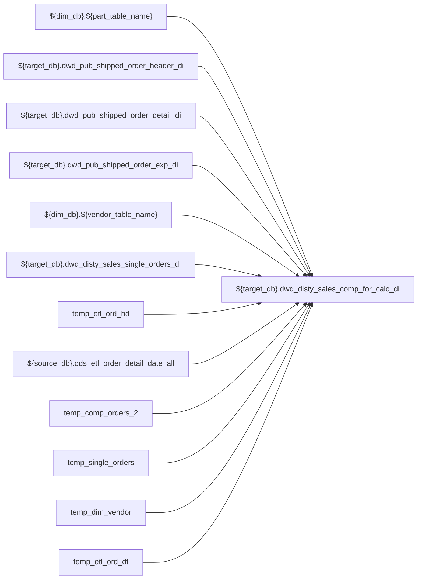

# ETL: `load_comp_orders_di`

- artifact_type: etl_table
- artifact_id: ${target_db}.dwd_disty_sales_comp_for_calc_di
- domain: pos
- one_line_purpose: ETL script `source/etl/sql/pos/data_service/pos/python/load_comp_orders_di.py` loads `${target_db}.dwd_disty_sales_comp_for_calc_di` (layer `ETL`). Purpose inferred from SQL only.
- layer_type: ETL
- source_kind: etl_sql
- evidence_source: source/etl/sql/pos/data_service/pos/python/load_comp_orders_di.py

---

## L1 Data Foundation

### Identity and physical mapping
- **Table:** `${target_db}.dwd_disty_sales_comp_for_calc_di`
- **Layer type:** ETL
- **Canonical / derived:** Derived / ETL-loaded (see L3)
- **Owner team:** Not documented in repository

### Grain, scope, exclusions
- **Grain:** Not documented in repository (see SELECT/GROUP BY in `source/etl/sql/pos/data_service/pos/python/load_comp_orders_di.py`)
- **Partition:** `date_flag`
- **Exclusions:** See L3 Key filters

### Cross-engine presence
| Engine | Present | Canonical FQN | Notes |
|--------|---------|---------------|-------|
| Hive | yes | `${target_db}.dwd_disty_sales_comp_for_calc_di` | ETL target |
| Vertica | Not documented in repository | — | Confirm via hive2vertica flow |

### Physical schema reference

Pointer block only - full column catalog lives in WKB L1 storage JSON.

| Field | Value |
|-------|-------|
| **Authoritative catalog** | WKB L1 storage seed (not duplicated in this file) |
| **entity_id** | `${target_db}.dwd_disty_sales_comp_for_calc_di` |
| **l1_catalog_seed** | `target/storage/wkb/snapshots/_snapshot_id_template/l1_catalog/{engine}_{schema}_{table}.json` |
| **column_count** | pending (run ddl_seed_writer) |
| **partition_keys** | `date_flag` |
| **ddl_source** | pending Bitbucket DDL / Vertica metadata ingest |
| **retrieval** | `python -m tools.wkb.indexing.run_query --query "pos load_comp_orders_di schema" --intent find_table_schema` |

### Lineage
| Object | Role |
|--------|------|
| `${dim_db}.${part_table_name}` | upstream (ETL FROM/JOIN) |
| `${target_db}.dwd_pub_shipped_order_header_di` | upstream (ETL FROM/JOIN) |
| `${target_db}.dwd_pub_shipped_order_detail_di` | upstream (ETL FROM/JOIN) |
| `${target_db}.dwd_pub_shipped_order_exp_di` | upstream (ETL FROM/JOIN) |
| `${dim_db}.${vendor_table_name}` | upstream (ETL FROM/JOIN) |
| `${target_db}.dwd_disty_sales_single_orders_di` | upstream (ETL FROM/JOIN) |
| `temp_etl_ord_hd` | upstream (ETL FROM/JOIN) |
| `${source_db}.ods_etl_order_detail_date_all` | upstream (ETL FROM/JOIN) |
| `temp_comp_orders_2` | upstream (ETL FROM/JOIN) |
| `temp_single_orders` | upstream (ETL FROM/JOIN) |
| `temp_dim_vendor` | upstream (ETL FROM/JOIN) |
| `temp_etl_ord_dt` | upstream (ETL FROM/JOIN) |
| `${source_db}.ods_cis_corp_order_type` | upstream (ETL FROM/JOIN) |
| `temp_comp_for_calc_1a` | upstream (ETL FROM/JOIN) |
| `temp_comp_for_calc_1b` | upstream (ETL FROM/JOIN) |
| `comp_1` | upstream (ETL FROM/JOIN) |
| `temp_comp_for_calc_1` | upstream (ETL FROM/JOIN) |
| `temp_comp_for_calc_2` | upstream (ETL FROM/JOIN) |
| `comp_2` | upstream (ETL FROM/JOIN) |
| `comp_3` | upstream (ETL FROM/JOIN) |
| `${target_db}.dwd_disty_sales_comp_for_calc_di` | **Target** |

### Freshness and load path
| Item | Value |
|------|-------|
| Load pattern | See L3 INSERT / OVERWRITE in evidence script |
| Schedule | Not documented in repository |
| Parameters | Parsed from ETL literals / `${...}` in `source/etl/sql/pos/data_service/pos/python/load_comp_orders_di.py` |

## L2 Declarative Knowledge

### Business purpose
ETL script `source/etl/sql/pos/data_service/pos/python/load_comp_orders_di.py` loads `${target_db}.dwd_disty_sales_comp_for_calc_di` (layer `ETL`). Purpose inferred from SQL only.

### Audience and use cases
| Audience | How they benefit |
|----------|-----------------|
| Data / BI consumers | Use target table produced by this ETL |
| Data Engineering | Maintain load logic in evidence script |

### Fact key resolution
- Keys follow target INSERT column list / GROUP BY in evidence SQL.

### Time field semantics
- Partition / date fields: `date_flag`

### Metrics served
- See L3 column derivations for measure expressions when present.

### Metric serving map
N/A — not a multi-period wide serving table (or not documented).

### etl_metrics
No calculable business metrics registered in metric-index for this create run.

## L3 Procedural Knowledge

### Query and routing rules
- Prefer querying the target `${target_db}.dwd_disty_sales_comp_for_calc_di` after successful ETL load.

### Dimension join patterns
- See Relationship map and Base tables register.

### Key filters and ETL business logic

| Predicate | Kind | Evidence |
|-----------|------|----------|
| `date_flag = '${date_flag}' CREATE TEMPORARY TABLE temp_etl_ord_hd AS select * from ${target_db}.dwd_pub_shipped_order_header_di oh where oh.date_flag = '${date_flag}' CREATE TEMPORARY TABLE temp_et...` | Technical (load only) / Business | `source/etl/sql/pos/data_service/pos/python/load_comp_orders_di.py` |
| `a.date_flag = '${date_flag}' AND a.sku_no = b.sku_no AND b.prod_type = 'A' AND a.sku_no = c.sku_no AND not EXISTS ( SELECT 1 FROM temp_dim_vendor d WHERE b.vend_no = d.vend_no and d.n_comp_brp_flag...` | Technical (load only) / Business | `source/etl/sql/pos/data_service/pos/python/load_comp_orders_di.py` |
| `a.delete_date IS NULL AND a.order_type = c.order_type AND a.order_no = c.order_no AND a.kit_line_no = c.kit_line_no AND EXISTS ( SELECT 1 FROM temp_single_orders b WHERE b.date_flag = '${date_flag}...` | Technical (load only) / Business | `source/etl/sql/pos/data_service/pos/python/load_comp_orders_di.py` |
| `a.date_flag = '${date_flag}' AND a.order_no = b.order_no AND a.order_type = b.order_type AND a.order_line_no = b.kit_no` | Technical (load only) / Business | `source/etl/sql/pos/data_service/pos/python/load_comp_orders_di.py` |
| `part_flag = 'K') b on a.order_type = b.order_type AND a.order_no = b.order_no AND a.kit_no = b.order_line_no), comp_3 as (select a.* ,case when a.part_flag = 'A' then b.order_line_no else cast(null...` | Business | `source/etl/sql/pos/data_service/pos/python/load_comp_orders_di.py` |

### Standard time-filter SQL
```sql
-- See partition / date predicates in source/etl/sql/pos/data_service/pos/python/load_comp_orders_di.py
```

### End-to-end flow



### Base tables register

| Object | Role |
|--------|------|
| `${dim_db}.${part_table_name}` | source / temp (from ETL FROM/JOIN) |
| `${target_db}.dwd_pub_shipped_order_header_di` | source / temp (from ETL FROM/JOIN) |
| `${target_db}.dwd_pub_shipped_order_detail_di` | source / temp (from ETL FROM/JOIN) |
| `${target_db}.dwd_pub_shipped_order_exp_di` | source / temp (from ETL FROM/JOIN) |
| `${dim_db}.${vendor_table_name}` | source / temp (from ETL FROM/JOIN) |
| `${target_db}.dwd_disty_sales_single_orders_di` | source / temp (from ETL FROM/JOIN) |
| `temp_etl_ord_hd` | source / temp (from ETL FROM/JOIN) |
| `${source_db}.ods_etl_order_detail_date_all` | source / temp (from ETL FROM/JOIN) |
| `temp_comp_orders_2` | source / temp (from ETL FROM/JOIN) |
| `temp_single_orders` | source / temp (from ETL FROM/JOIN) |
| `temp_dim_vendor` | source / temp (from ETL FROM/JOIN) |
| `temp_etl_ord_dt` | source / temp (from ETL FROM/JOIN) |
| `${source_db}.ods_cis_corp_order_type` | source / temp (from ETL FROM/JOIN) |
| `temp_comp_for_calc_1a` | source / temp (from ETL FROM/JOIN) |
| `temp_comp_for_calc_1b` | source / temp (from ETL FROM/JOIN) |
| `comp_1` | source / temp (from ETL FROM/JOIN) |
| `temp_comp_for_calc_1` | source / temp (from ETL FROM/JOIN) |
| `temp_comp_for_calc_2` | source / temp (from ETL FROM/JOIN) |
| `comp_2` | source / temp (from ETL FROM/JOIN) |
| `comp_3` | source / temp (from ETL FROM/JOIN) |
| `comp_4` | source / temp (from ETL FROM/JOIN) |
| `temp_comp_for_calc_3` | source / temp (from ETL FROM/JOIN) |
| `temp_dim_part` | source / temp (from ETL FROM/JOIN) |
| `t_cost` | source / temp (from ETL FROM/JOIN) |
| `temp_comp_for_calc_4` | source / temp (from ETL FROM/JOIN) |
| `temp_etl_ord_exp` | source / temp (from ETL FROM/JOIN) |
| `temp_comp_for_calc_5` | source / temp (from ETL FROM/JOIN) |
| `exp1` | source / temp (from ETL FROM/JOIN) |
| `exp2` | source / temp (from ETL FROM/JOIN) |
| `${source_db}.ods_cis_corp_project_info` | source / temp (from ETL FROM/JOIN) |
| `exp3` | source / temp (from ETL FROM/JOIN) |
| `temp_exp_all` | source / temp (from ETL FROM/JOIN) |
| `vend1` | source / temp (from ETL FROM/JOIN) |
| `temp_exp_vend` | source / temp (from ETL FROM/JOIN) |
| `temp_comp_for_calc_6` | source / temp (from ETL FROM/JOIN) |
| `cmdm_1` | source / temp (from ETL FROM/JOIN) |
| `cmdm_2` | source / temp (from ETL FROM/JOIN) |
| `cmdm_3` | source / temp (from ETL FROM/JOIN) |
| `temp_cmdm_1` | source / temp (from ETL FROM/JOIN) |
| `temp_kit_cost` | source / temp (from ETL FROM/JOIN) |
| `temp_cmdm_2` | source / temp (from ETL FROM/JOIN) |
| `${source_db}.ods_cis_corp_no_ctrl` | source / temp (from ETL FROM/JOIN) |
| `temp_comp_for_calc_7` | source / temp (from ETL FROM/JOIN) |
| `${source_db}.ods_cis_corp_list_box_detail` | source / temp (from ETL FROM/JOIN) |
| `temp_comp_for_calc_8` | source / temp (from ETL FROM/JOIN) |
| `temp_exp_all_2` | source / temp (from ETL FROM/JOIN) |
| `temp_exp_vend_2` | source / temp (from ETL FROM/JOIN) |
| `comp1` | source / temp (from ETL FROM/JOIN) |
| `comp2` | source / temp (from ETL FROM/JOIN) |
| `temp_comp_for_calc_9` | source / temp (from ETL FROM/JOIN) |
| `temp_comp_for_calc_10` | source / temp (from ETL FROM/JOIN) |
| `sku1` | source / temp (from ETL FROM/JOIN) |
| `${source_db}.ods_etl_pocv_detail_cost_all` | source / temp (from ETL FROM/JOIN) |
| `sku2` | source / temp (from ETL FROM/JOIN) |
| `temp_sku_cost` | source / temp (from ETL FROM/JOIN) |
| `temp_comp_for_calc_11` | source / temp (from ETL FROM/JOIN) |
| `temp_pslv_kit` | source / temp (from ETL FROM/JOIN) |
| `temp_pslv_comp` | source / temp (from ETL FROM/JOIN) |
| `${source_db}.ods_cis_corp_simple_lan_contract_meter` | source / temp (from ETL FROM/JOIN) |
| `${source_db}.ods_cis_corp_simple_lan_contract` | source / temp (from ETL FROM/JOIN) |
| `temp_printsolve_1a` | source / temp (from ETL FROM/JOIN) |
| `temp_printsolve_1b` | source / temp (from ETL FROM/JOIN) |
| `sol1` | source / temp (from ETL FROM/JOIN) |
| `sol2` | source / temp (from ETL FROM/JOIN) |
| `temp_printsolve_1` | source / temp (from ETL FROM/JOIN) |
| `sol3` | source / temp (from ETL FROM/JOIN) |
| `sol4` | source / temp (from ETL FROM/JOIN) |
| `temp_printsolve_2` | source / temp (from ETL FROM/JOIN) |
| `${target_db}.dwd_disty_sales_comp_for_calc_di` | source / temp (from ETL FROM/JOIN) |
| `temp_comp_orders_1` | source / temp (from ETL FROM/JOIN) |
| `c_order_1` | source / temp (from ETL FROM/JOIN) |
| `${source_db}.ods_cis_corp_customer_header` | source / temp (from ETL FROM/JOIN) |
| `c_order_2` | source / temp (from ETL FROM/JOIN) |
| `${source_db}.ods_cis_corp_territory` | source / temp (from ETL FROM/JOIN) |
| `${source_db}.ods_cis_corp_cust_type` | source / temp (from ETL FROM/JOIN) |
| `c_order_3` | source / temp (from ETL FROM/JOIN) |
| `temp_sku` | source / temp (from ETL FROM/JOIN) |
| `temp_sku1` | source / temp (from ETL FROM/JOIN) |
| `temp_sku2` | source / temp (from ETL FROM/JOIN) |
| `temp_pocv_sku1` | source / temp (from ETL FROM/JOIN) |
| `temp_comp_orders_3` | source / temp (from ETL FROM/JOIN) |
| `t_main1` | source / temp (from ETL FROM/JOIN) |
| `temp_t_98_1` | source / temp (from ETL FROM/JOIN) |
| `${source_db}.ods_etl_order_detail_all` | source / temp (from ETL FROM/JOIN) |
| `temp_t_98_2` | source / temp (from ETL FROM/JOIN) |
| `temp_t_98` | source / temp (from ETL FROM/JOIN) |

### Step-by-step logic
1. Read sources listed in Base tables register (`source/etl/sql/pos/data_service/pos/python/load_comp_orders_di.py`).
2. Apply filters documented under Key filters.
3. INSERT OVERWRITE / write target `${target_db}.dwd_disty_sales_comp_for_calc_di`.

### Relationship map (embedded)

| from_fqn | to_fqn | cardinality | join_keys | provenance |
|----------|--------|-------------|-----------|------------|
| `temp_etl_ord_hd` | `ods_xx.ods_etl_order_detail_date_all` | many:1 | `oh.order_type = od.order_type AND oh.order_no = od.order_no` | etl_sql (source/etl/sql/pos/data_service/pos/python/load_comp_orders_di.py:1536) |
| `temp_etl_ord_hd` | `temp_etl_ord_dt` | many:1 | `a.order_type = b.order_type AND a.order_no = b.order_no` | etl_sql (source/etl/sql/pos/data_service/pos/python/load_comp_orders_di.py:95) |
| `temp_etl_ord_hd` | `ods_xx.ods_cis_corp_order_type` | many:1 | `a.order_type = c.order_type` | etl_sql (source/etl/sql/pos/data_service/pos/python/load_comp_orders_di.py:95) |
| `temp_comp_for_calc_3` | `temp_dim_part` | many:1 | `a.sku_no = pm.sku_no), t_cost as (` | etl_sql (source/etl/sql/pos/data_service/pos/python/load_comp_orders_di.py:333) |
| `temp_comp_for_calc_3` | `temp_dim_part` | many:1 | `a.sku_no = b.sku_no)` | etl_sql (source/etl/sql/pos/data_service/pos/python/load_comp_orders_di.py:333) |
| `temp_etl_ord_exp` | `temp_comp_for_calc_5` | many:1 | `a.order_type = b.order_type AND a.order_no = b.order_no AND a.order_line_no = b.order_line_no AND b.part_flag = 'M'), exp3 as (` | etl_sql (source/etl/sql/pos/data_service/pos/python/load_comp_orders_di.py:522) |
| `temp_etl_ord_exp` | `ods_xx.ods_cis_corp_project_info` | many:1 | `a.project_no = b.proj_no)` | etl_sql (source/etl/sql/pos/data_service/pos/python/load_comp_orders_di.py:522) |
| `temp_comp_for_calc_5` | `temp_exp_vend` | many:1 | `a.order_type = b.order_type AND a.order_no = b.order_no AND a.kit_no = b.top_kit_no AND a.vend_no = b.vend_no), comp_2 as (` | etl_sql (source/etl/sql/pos/data_service/pos/python/load_comp_orders_di.py:638) |
| `temp_comp_for_calc_6` | `temp_etl_ord_hd` | many:1 | `a.order_type = h.order_type AND a.order_no = h.order_no` | etl_sql (source/etl/sql/pos/data_service/pos/python/load_comp_orders_di.py:782) |
| `temp_comp_for_calc_6` | `temp_dim_part` | many:1 | `a.sku_no = pm.sku_no)` | etl_sql (source/etl/sql/pos/data_service/pos/python/load_comp_orders_di.py:782) |
| `temp_cmdm_1` | `temp_kit_cost` | many:1 | `a.order_type = b.order_type and a.order_no = b.order_no and a.kit_no = b.kit_no)` | etl_sql (source/etl/sql/pos/data_service/pos/python/load_comp_orders_di.py:847) |
| `temp_comp_for_calc_6` | `temp_cmdm_2` | many:1 | `a.order_type = b.order_type AND a.order_no = b.order_no AND a.order_line_no = b.order_line_no` | etl_sql (source/etl/sql/pos/data_service/pos/python/load_comp_orders_di.py:864) |
| `temp_comp_for_calc_8` | `temp_exp_vend_2` | many:1 | `a.order_type = b.order_type AND a.order_no = b.order_no AND a.kit_no = b.order_line_no AND a.vend_no = b.vend_no), comp2 as (` | etl_sql (source/etl/sql/pos/data_service/pos/python/load_comp_orders_di.py:1031) |
| `temp_comp_for_calc_10` | `temp_sku_cost` | many:1 | `a.sku_no = b.sku_no` | etl_sql (source/etl/sql/pos/data_service/pos/python/load_comp_orders_di.py:1229) |
| `temp_comp_for_calc_11` | `temp_etl_ord_dt` | many:1 | `a.order_type = o.order_type AND a.order_no = o.order_no AND a.order_line_no = o.order_line_no` | etl_sql (source/etl/sql/pos/data_service/pos/python/load_comp_orders_di.py:1263) |
| `temp_pslv_comp` | `ods_xx.ods_cis_corp_simple_lan_contract_meter` | many:1 | `c.sku_no = m.sku_no` | etl_sql (source/etl/sql/pos/data_service/pos/python/load_comp_orders_di.py:1304) |
| `temp_pslv_comp` | `temp_dim_part` | many:1 | `cc.sku_no = p.sku_no` | etl_sql (source/etl/sql/pos/data_service/pos/python/load_comp_orders_di.py:1304) |
| `temp_dim_part` | `ods_xx.ods_cis_corp_simple_lan_contract` | many:1 | `p.vend_no = sc.service_provider` | etl_sql (source/etl/sql/pos/data_service/pos/python/load_comp_orders_di.py:1304) |
| `temp_pslv_comp` | `temp_printsolve_1a` | many:1 | `c.order_no = k.order_no AND c.order_type = k.order_type AND c.kit_line_no = k.order_line_no` | etl_sql (source/etl/sql/pos/data_service/pos/python/load_comp_orders_di.py:1339) |
| `temp_comp_for_calc_11` | `temp_printsolve_2` | many:1 | `a.order_type = b.order_type AND a.order_no = b.order_no AND a.order_line_no = b.order_line_no and b.kit_line_no is not null` | etl_sql (source/etl/sql/pos/data_service/pos/python/load_comp_orders_di.py:1493) |
| `temp_comp_orders_1` | `temp_dim_part` | many:1 | `a.sku_no = pm.sku_no` | etl_sql (source/etl/sql/pos/data_service/pos/python/load_comp_orders_di.py:1605) |
| `temp_dim_part` | `temp_dim_vendor` | many:1 | `pm.vend_no = vm.vend_no` | etl_sql (source/etl/sql/pos/data_service/pos/python/load_comp_orders_di.py:1605) |
| `temp_comp_orders_1` | `temp_etl_ord_hd` | many:1 | `a.order_type = b.order_type AND a.order_no = b.order_no), c_order_2 as (` | etl_sql (source/etl/sql/pos/data_service/pos/python/load_comp_orders_di.py:1605) |
| `temp_comp_orders_1` | `ods_xx.ods_cis_corp_customer_header` | many:1 | `a.cust_no = b.cust_no), c_order_3 as (` | etl_sql (source/etl/sql/pos/data_service/pos/python/load_comp_orders_di.py:1605) |
| `temp_comp_orders_1` | `ods_xx.ods_cis_corp_territory` | many:1 | `a.cust_terr = b.sales_terr` | etl_sql (source/etl/sql/pos/data_service/pos/python/load_comp_orders_di.py:1605) |
| `ods_xx.ods_cis_corp_territory` | `ods_xx.ods_cis_corp_cust_type` | many:1 | `b.cust_type = c.cust_type)` | etl_sql (source/etl/sql/pos/data_service/pos/python/load_comp_orders_di.py:1605) |
| `ods_xx.ods_etl_pocv_detail_cost_all` | `temp_sku` | many:1 | `a.sku_no = b.sku_no` | etl_sql (source/etl/sql/pos/data_service/pos/python/load_comp_orders_di.py:1859) |
| `ods_xx.ods_etl_pocv_detail_cost_all` | `temp_sku1` | many:1 | `a.process_date = b.close_date AND a.sku_no = b.sku_no` | etl_sql (source/etl/sql/pos/data_service/pos/python/load_comp_orders_di.py:1870) |
| `ods_xx.ods_etl_pocv_detail_cost_all` | `temp_sku2` | many:1 | `a.sku_no = b.sku_no AND a.process_date = b.close_date` | etl_sql (source/etl/sql/pos/data_service/pos/python/load_comp_orders_di.py:1893) |
| `temp_comp_orders_2` | `temp_pocv_sku1` | many:1 | `a.sku_no = b.sku_no)` | etl_sql (source/etl/sql/pos/data_service/pos/python/load_comp_orders_di.py:1905) |
| `temp_comp_orders_2` | `temp_dim_part` | many:1 | `a.sku_no = b.sku_no` | etl_sql (source/etl/sql/pos/data_service/pos/python/load_comp_orders_di.py:1905) |
| `temp_comp_orders_3` | `temp_etl_ord_dt` | many:1 | `a.order_no=b.order_no and a.order_line_no=b.order_line_no and a.order_type = b.order_type` | etl_sql (source/etl/sql/pos/data_service/pos/python/load_comp_orders_di.py:1973) |
| `temp_t_98_1` | `ods_xx.ods_etl_order_detail_all` | many:1 | `a.int_ref_no=b.order_no and a.int_ref_line_no=b.order_line_no and a.int_ref_type = b.order_type` | etl_sql (source/etl/sql/pos/data_service/pos/python/load_comp_orders_di.py:2006) |
| `temp_t_98_2` | `ods_xx.ods_etl_order_detail_date_all` | many:1 | `a.int_ref_no=b.order_no and a.int_ref_line_no=b.order_line_no and a.int_ref_type = b.order_type` | etl_sql (source/etl/sql/pos/data_service/pos/python/load_comp_orders_di.py:2021) |
| `temp_comp_orders_3` | `temp_t_98` | many:1 | `a.order_no=b.order_no and a.order_type = b.order_type and a.order_line_no=b.order_line_no` | etl_sql (source/etl/sql/pos/data_service/pos/python/load_comp_orders_di.py:2042) |
| `temp_comp_orders_3` | `temp_single_orders` | many:1 | `k.order_type = a.order_type and k.order_no = a.order_no and k.order_line_no = a.kit_no` | etl_sql (source/etl/sql/pos/data_service/pos/python/load_comp_orders_di.py:2042) |

`table relationship.txt` edges naming this FQN: none found — Not documented in repository.

### Special logic (embedded)

Provenance file: `source/ref/pos/special_logic.txt` (applicable rules only).

Domain `special_logic.txt` present, but no numbered rules name this artifact FQN / stem — Not documented in repository for this artifact.

### Column / field derivations (from ETL SQL)

| target_column | expression_sql | upstream_columns | upstream_tables | transform_kind | evidence |
|---------------|----------------|------------------|-----------------|----------------|----------|
| `order_type` | `a.order_type` | `order_type` | `temp_comp_orders_3`, `temp_t_98`, `temp_single_orders` | passthrough | `source/etl/sql/pos/data_service/pos/python/load_comp_orders_di.py:62` |
| `order_no` | `a.order_no` | `order_no` | `temp_comp_orders_3`, `temp_t_98`, `temp_single_orders` | passthrough | `source/etl/sql/pos/data_service/pos/python/load_comp_orders_di.py:63` |
| `order_line_no` | `a.order_line_no` | `order_line_no` | `temp_comp_orders_3`, `temp_t_98`, `temp_single_orders` | passthrough | `source/etl/sql/pos/data_service/pos/python/load_comp_orders_di.py:72` |
| `u_version` | `'!'` | — | `temp_comp_orders_3`, `temp_t_98`, `temp_single_orders` | literal | `source/etl/sql/pos/data_service/pos/python/load_comp_orders_di.py:2046` |
| `ship_date` | `a.ship_date` | `ship_date` | `temp_comp_orders_3`, `temp_t_98`, `temp_single_orders` | passthrough | `source/etl/sql/pos/data_service/pos/python/load_comp_orders_di.py:107` |
| `sales_team` | `a.sales_team` | `sales_team` | `temp_comp_orders_3`, `temp_t_98`, `temp_single_orders` | passthrough | `source/etl/sql/pos/data_service/pos/python/load_comp_orders_di.py:1613` |
| `terms` | `a.terms` | `terms` | `temp_comp_orders_3`, `temp_t_98`, `temp_single_orders` | passthrough | `source/etl/sql/pos/data_service/pos/python/load_comp_orders_di.py:1614` |
| `ship_method` | `a.ship_method` | `ship_method` | `temp_comp_orders_3`, `temp_t_98`, `temp_single_orders` | passthrough | `source/etl/sql/pos/data_service/pos/python/load_comp_orders_di.py:1615` |
| `from_loc_no` | `a.from_loc_no` | `from_loc_no` | `temp_comp_orders_3`, `temp_t_98`, `temp_single_orders` | passthrough | `source/etl/sql/pos/data_service/pos/python/load_comp_orders_di.py:1616` |
| `to_zip` | `a.to_zip` | `to_zip` | `temp_comp_orders_3`, `temp_t_98`, `temp_single_orders` | passthrough | `source/etl/sql/pos/data_service/pos/python/load_comp_orders_di.py:1617` |
| `cust_no` | `a.cust_no` | `cust_no` | `temp_comp_orders_3`, `temp_t_98`, `temp_single_orders` | passthrough | `source/etl/sql/pos/data_service/pos/python/load_comp_orders_di.py:1618` |
| `cust_name` | `a.cust_name` | `cust_name` | `temp_comp_orders_3`, `temp_t_98`, `temp_single_orders` | passthrough | `source/etl/sql/pos/data_service/pos/python/load_comp_orders_di.py:1619` |
| `cust_loc_no` | `a.cust_loc_no` | `cust_loc_no` | `temp_comp_orders_3`, `temp_t_98`, `temp_single_orders` | passthrough | `source/etl/sql/pos/data_service/pos/python/load_comp_orders_di.py:1620` |
| `cust_type` | `a.cust_type` | `cust_type` | `temp_comp_orders_3`, `temp_t_98`, `temp_single_orders` | passthrough | `source/etl/sql/pos/data_service/pos/python/load_comp_orders_di.py:1621` |
| `cust_region` | `a.cust_region` | `cust_region` | `temp_comp_orders_3`, `temp_t_98`, `temp_single_orders` | passthrough | `source/etl/sql/pos/data_service/pos/python/load_comp_orders_di.py:1622` |
| `cust_terr` | `a.cust_terr` | `cust_terr` | `temp_comp_orders_3`, `temp_t_98`, `temp_single_orders` | passthrough | `source/etl/sql/pos/data_service/pos/python/load_comp_orders_di.py:1625` |
| `cust_zip` | `a.cust_zip` | `cust_zip` | `temp_comp_orders_3`, `temp_t_98`, `temp_single_orders` | passthrough | `source/etl/sql/pos/data_service/pos/python/load_comp_orders_di.py:1626` |
| `vend_no` | `a.vend_no` | `vend_no` | `temp_comp_orders_3`, `temp_t_98`, `temp_single_orders` | passthrough | `source/etl/sql/pos/data_service/pos/python/load_comp_orders_di.py:160` |
| `vend_name` | `a.vend_name` | `vend_name` | `temp_comp_orders_3`, `temp_t_98`, `temp_single_orders` | passthrough | `source/etl/sql/pos/data_service/pos/python/load_comp_orders_di.py:1630` |
| `vend_type` | `a.vend_type` | `vend_type` | `temp_comp_orders_3`, `temp_t_98`, `temp_single_orders` | passthrough | `source/etl/sql/pos/data_service/pos/python/load_comp_orders_di.py:1631` |
| `sku_no` | `a.sku_no` | `sku_no` | `temp_comp_orders_3`, `temp_t_98`, `temp_single_orders` | passthrough | `source/etl/sql/pos/data_service/pos/python/load_comp_orders_di.py:84` |
| `part_no` | `a.part_no` | `part_no` | `temp_comp_orders_3`, `temp_t_98`, `temp_single_orders` | passthrough | `source/etl/sql/pos/data_service/pos/python/load_comp_orders_di.py:1635` |
| `inv_type` | `a.inv_type` | `inv_type` | `temp_comp_orders_3`, `temp_t_98`, `temp_single_orders` | passthrough | `source/etl/sql/pos/data_service/pos/python/load_comp_orders_di.py:1636` |
| `division` | `a.division` | `division` | `temp_comp_orders_3`, `temp_t_98`, `temp_single_orders` | passthrough | `source/etl/sql/pos/data_service/pos/python/load_comp_orders_di.py:1637` |
| `pm_code` | `a.pm_code` | `pm_code` | `temp_comp_orders_3`, `temp_t_98`, `temp_single_orders` | passthrough | `source/etl/sql/pos/data_service/pos/python/load_comp_orders_di.py:1640` |
| `super_prod_code` | `a.super_prod_code` | `super_prod_code` | `temp_comp_orders_3`, `temp_t_98`, `temp_single_orders` | passthrough | `source/etl/sql/pos/data_service/pos/python/load_comp_orders_di.py:1643` |
| `prod_code` | `a.prod_code` | `prod_code` | `temp_comp_orders_3`, `temp_t_98`, `temp_single_orders` | passthrough | `source/etl/sql/pos/data_service/pos/python/load_comp_orders_di.py:1646` |
| `vend_code` | `a.vend_code` | `vend_code` | `temp_comp_orders_3`, `temp_t_98`, `temp_single_orders` | passthrough | `source/etl/sql/pos/data_service/pos/python/load_comp_orders_di.py:1649` |
| `issue_date` | `a.issue_date` | `issue_date` | `temp_comp_orders_3`, `temp_t_98`, `temp_single_orders` | passthrough | `source/etl/sql/pos/data_service/pos/python/load_comp_orders_di.py:1655` |
| `entry_datetime` | `a.entry_datetime` | `entry_datetime` | `temp_comp_orders_3`, `temp_t_98`, `temp_single_orders` | passthrough | `source/etl/sql/pos/data_service/pos/python/load_comp_orders_di.py:1656` |
| `sales_rep` | `a.sales_rep` | `sales_rep` | `temp_comp_orders_3`, `temp_t_98`, `temp_single_orders` | passthrough | `source/etl/sql/pos/data_service/pos/python/load_comp_orders_di.py:1657` |
| `gv_user_type` | `a.gv_user_type` | `gv_user_type` | `temp_comp_orders_3`, `temp_t_98`, `temp_single_orders` | passthrough | `source/etl/sql/pos/data_service/pos/python/load_comp_orders_di.py:1664` |
| `lead_id` | `a.lead_id` | `lead_id` | `temp_comp_orders_3`, `temp_t_98`, `temp_single_orders` | passthrough | `source/etl/sql/pos/data_service/pos/python/load_comp_orders_di.py:1654` |
| `vend_seg` | `cast(null as int)` | — | `temp_comp_orders_3`, `temp_t_98`, `temp_single_orders` | cast | `source/etl/sql/pos/data_service/pos/python/load_comp_orders_di.py:66` |
| `vend_seq_ord` | `cast(null as int)` | — | `temp_comp_orders_3`, `temp_t_98`, `temp_single_orders` | cast | `source/etl/sql/pos/data_service/pos/python/load_comp_orders_di.py:66` |
| `cust_seg` | `cast(null as int)` | — | `temp_comp_orders_3`, `temp_t_98`, `temp_single_orders` | cast | `source/etl/sql/pos/data_service/pos/python/load_comp_orders_di.py:66` |
| `mcust_no` | `cast(null as int)` | — | `temp_comp_orders_3`, `temp_t_98`, `temp_single_orders` | cast | `source/etl/sql/pos/data_service/pos/python/load_comp_orders_di.py:66` |
| `from_ref_type` | `a.from_ref_type` | `from_ref_type` | `temp_comp_orders_3`, `temp_t_98`, `temp_single_orders` | passthrough | `source/etl/sql/pos/data_service/pos/python/load_comp_orders_di.py:1661` |
| `kit_line_no` | `a.kit_line_no` | `kit_line_no` | `temp_comp_orders_3`, `temp_t_98`, `temp_single_orders` | passthrough | `source/etl/sql/pos/data_service/pos/python/load_comp_orders_di.py:140` |
| `kit_no` | `a.kit_no` | `kit_no` | `temp_comp_orders_3`, `temp_t_98`, `temp_single_orders` | passthrough | `source/etl/sql/pos/data_service/pos/python/load_comp_orders_di.py:172` |
| `company_no` | `k.company_no` | `company_no` | `temp_comp_orders_3`, `temp_t_98`, `temp_single_orders` | passthrough | `source/etl/sql/pos/data_service/pos/python/load_comp_orders_di.py:2083` |
| `price_source` | `a.price_source` | `price_source` | `temp_comp_orders_3`, `temp_t_98`, `temp_single_orders` | passthrough | `source/etl/sql/pos/data_service/pos/python/load_comp_orders_di.py:1663` |
| `grid_price` | `a.grid_price` | `grid_price` | `temp_comp_orders_3`, `temp_t_98`, `temp_single_orders` | passthrough | `source/etl/sql/pos/data_service/pos/python/load_comp_orders_di.py:1662` |
| `retail_price` | `a.retail_price` | `retail_price` | `temp_comp_orders_3`, `temp_t_98`, `temp_single_orders` | passthrough | `source/etl/sql/pos/data_service/pos/python/load_comp_orders_di.py:1963` |
| `std_whls_price` | `a.std_whls_price` | `std_whls_price` | `temp_comp_orders_3`, `temp_t_98`, `temp_single_orders` | passthrough | `source/etl/sql/pos/data_service/pos/python/load_comp_orders_di.py:1961` |
| `base_cost` | `a.base_cost` | `base_cost` | `temp_comp_orders_3`, `temp_t_98`, `temp_single_orders` | passthrough | `source/etl/sql/pos/data_service/pos/python/load_comp_orders_di.py:164` |
| `sales_cost` | `a.sales_cost` | `sales_cost` | `temp_comp_orders_3`, `temp_t_98`, `temp_single_orders` | passthrough | `source/etl/sql/pos/data_service/pos/python/load_comp_orders_di.py:165` |
| `vpo_cost` | `case when b.order_no is not null and b.order_line_no is not null and b.order_type is not null and a.date_flag = '${da...` | `order_no`, `order_line_no`, `order_type`, `date_flag`, `unit_cost`, `vpo_cost` | `temp_comp_orders_3`, `temp_t_98`, `temp_single_orders` | case | `source/etl/sql/pos/data_service/pos/python/load_comp_orders_di.py:6` |
| `ship_qty` | `case when a.u_price = 0 and a.u_cost = 0 and a.u_sum_expense = 0 and a.order_type = 125 then 1 else a.ship_qty end` | `u_price`, `u_cost`, `u_sum_expense`, `order_type`, `ship_qty` | `temp_comp_orders_3`, `temp_t_98`, `temp_single_orders` | case | `source/etl/sql/pos/data_service/pos/python/load_comp_orders_di.py:2097` |
| `u_cost` | `a.u_cost` | `u_cost` | `temp_comp_orders_3`, `temp_t_98`, `temp_single_orders` | passthrough | `source/etl/sql/pos/data_service/pos/python/load_comp_orders_di.py:162` |
| `u_price` | `a.u_price` | `u_price` | `temp_comp_orders_3`, `temp_t_98`, `temp_single_orders` | passthrough | `source/etl/sql/pos/data_service/pos/python/load_comp_orders_di.py:163` |
| `u_sum_expense` | `a.u_sum_expense` | `u_sum_expense` | `temp_comp_orders_3`, `temp_t_98`, `temp_single_orders` | passthrough | `source/etl/sql/pos/data_service/pos/python/load_comp_orders_di.py:1055` |
| `sales_total` | `(a.u_price + a.u_sum_expense) * a.ship_qty` | `u_price`, `u_sum_expense`, `ship_qty` | `temp_comp_orders_3`, `temp_t_98`, `temp_single_orders` | arithmetic | `source/etl/sql/pos/data_service/pos/python/load_comp_orders_di.py:2102` |
| `ext_ref` | `a.ext_ref` | `ext_ref` | `temp_comp_orders_3`, `temp_t_98`, `temp_single_orders` | passthrough | `source/etl/sql/pos/data_service/pos/python/load_comp_orders_di.py:1668` |
| `end_user_po` | `a.end_user_po` | `end_user_po` | `temp_comp_orders_3`, `temp_t_98`, `temp_single_orders` | passthrough | `source/etl/sql/pos/data_service/pos/python/load_comp_orders_di.py:1669` |
| `etl_timestamp` | `'${etl_timestamp}'` | `etl_timestamp` | `temp_comp_orders_3`, `temp_t_98`, `temp_single_orders` | literal | `source/etl/sql/pos/data_service/pos/python/load_comp_orders_di.py:1526` |
| `rule_no` | `cast(null as int)` | — | `temp_comp_orders_3`, `temp_t_98`, `temp_single_orders` | cast | `source/etl/sql/pos/data_service/pos/python/load_comp_orders_di.py:66` |
| `date_flag` | `'${date_flag}'` | `date_flag` | `temp_comp_orders_3`, `temp_t_98`, `temp_single_orders` | literal | `source/etl/sql/pos/data_service/pos/python/load_comp_orders_di.py:27` |
| `terr_status` | `'o'` | `o` | `temp_comp_orders_3`, `temp_t_98`, `temp_single_orders` | literal | `source/etl/sql/pos/data_service/pos/python/load_comp_orders_di.py:57` |

### Sentinel and code values
Not documented in repository beyond CASE/exp_code predicates in ETL SQL.

## L4 Validation

### Resolved partition value
- Partition expression from ETL: `date_flag`
- Runtime values: Not documented in repository (resolve via Azkaban params when flow evidence exists).

### Data quality checks
Not documented in repository

### Validation SQL
N/A — Vertica MCP not executed during documentation (Vertica no-run policy).

### Caveats for interpretation
- Generated from ETL SQL evidence only; business definitions may need `source/ref` enrichment.

### Conflicts and open questions
None identified in repository

## L5 Runtime View

### Query path and engine preference
| Path | Engine | Evidence |
|------|--------|----------|
| ETL load | Hive/Spark | `source/etl/sql/pos/data_service/pos/python/load_comp_orders_di.py` |
| Serving | Vertica (when synced) | Not documented in repository |

### Access constraints
Not documented in repository

### Query risk profile
- Scan risk depends on partition pruning; always filter partition keys when present.

## L6 Access and Consumption

### Primary consumers and use cases
Not documented in repository

### Representative query patterns
Not documented in repository

### Dependencies and notes

#### Upstream objects (verified)
| Object | Usage | Evidence |
|--------|-------|----------|
| `${dim_db}.${part_table_name}` | FROM/JOIN | `source/etl/sql/pos/data_service/pos/python/load_comp_orders_di.py` |
| `${target_db}.dwd_pub_shipped_order_header_di` | FROM/JOIN | `source/etl/sql/pos/data_service/pos/python/load_comp_orders_di.py` |
| `${target_db}.dwd_pub_shipped_order_detail_di` | FROM/JOIN | `source/etl/sql/pos/data_service/pos/python/load_comp_orders_di.py` |
| `${target_db}.dwd_pub_shipped_order_exp_di` | FROM/JOIN | `source/etl/sql/pos/data_service/pos/python/load_comp_orders_di.py` |
| `${dim_db}.${vendor_table_name}` | FROM/JOIN | `source/etl/sql/pos/data_service/pos/python/load_comp_orders_di.py` |
| `${target_db}.dwd_disty_sales_single_orders_di` | FROM/JOIN | `source/etl/sql/pos/data_service/pos/python/load_comp_orders_di.py` |
| `temp_etl_ord_hd` | FROM/JOIN | `source/etl/sql/pos/data_service/pos/python/load_comp_orders_di.py` |
| `${source_db}.ods_etl_order_detail_date_all` | FROM/JOIN | `source/etl/sql/pos/data_service/pos/python/load_comp_orders_di.py` |
| `temp_comp_orders_2` | FROM/JOIN | `source/etl/sql/pos/data_service/pos/python/load_comp_orders_di.py` |
| `temp_single_orders` | FROM/JOIN | `source/etl/sql/pos/data_service/pos/python/load_comp_orders_di.py` |
| `temp_dim_vendor` | FROM/JOIN | `source/etl/sql/pos/data_service/pos/python/load_comp_orders_di.py` |
| `temp_etl_ord_dt` | FROM/JOIN | `source/etl/sql/pos/data_service/pos/python/load_comp_orders_di.py` |
| `${source_db}.ods_cis_corp_order_type` | FROM/JOIN | `source/etl/sql/pos/data_service/pos/python/load_comp_orders_di.py` |
| `temp_comp_for_calc_1a` | FROM/JOIN | `source/etl/sql/pos/data_service/pos/python/load_comp_orders_di.py` |
| `temp_comp_for_calc_1b` | FROM/JOIN | `source/etl/sql/pos/data_service/pos/python/load_comp_orders_di.py` |
| `comp_1` | FROM/JOIN | `source/etl/sql/pos/data_service/pos/python/load_comp_orders_di.py` |
| `temp_comp_for_calc_1` | FROM/JOIN | `source/etl/sql/pos/data_service/pos/python/load_comp_orders_di.py` |
| `temp_comp_for_calc_2` | FROM/JOIN | `source/etl/sql/pos/data_service/pos/python/load_comp_orders_di.py` |
| `comp_2` | FROM/JOIN | `source/etl/sql/pos/data_service/pos/python/load_comp_orders_di.py` |
| `comp_3` | FROM/JOIN | `source/etl/sql/pos/data_service/pos/python/load_comp_orders_di.py` |

#### Downstream consumers (verified)
| Object / script | Evidence |
|-----------------|----------|
| Not documented in repository | — |

#### Operational detail (verified)
- Partition clause: `date_flag`

#### Not documented in repository
- Schedule, owner, SLA
