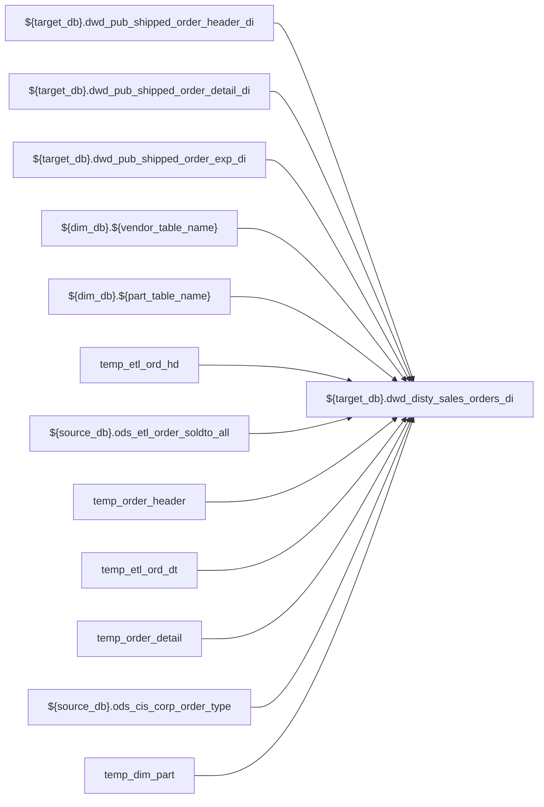

# ETL: `load_single_orders_di`

- artifact_type: etl_table
- artifact_id: ${target_db}.dwd_disty_sales_orders_di
- domain: pos
- one_line_purpose: ETL script `source/etl/sql/pos/data_service/pos/python/load_single_orders_di.py` loads `${target_db}.dwd_disty_sales_orders_di` (layer `ETL`). Purpose inferred from SQL only.
- layer_type: ETL
- source_kind: etl_sql
- evidence_source: source/etl/sql/pos/data_service/pos/python/load_single_orders_di.py

---

## L1 Data Foundation

### Identity and physical mapping
- **Table:** `${target_db}.dwd_disty_sales_orders_di`
- **Layer type:** ETL
- **Canonical / derived:** Derived / ETL-loaded (see L3)
- **Owner team:** Not documented in repository

### Grain, scope, exclusions
- **Grain:** Not documented in repository (see SELECT/GROUP BY in `source/etl/sql/pos/data_service/pos/python/load_single_orders_di.py`)
- **Partition:** `date_flag`
- **Exclusions:** See L3 Key filters

### Cross-engine presence
| Engine | Present | Canonical FQN | Notes |
|--------|---------|---------------|-------|
| Hive | yes | `${target_db}.dwd_disty_sales_orders_di` | ETL target |
| Vertica | Not documented in repository | — | Confirm via hive2vertica flow |

### Physical schema reference

Pointer block only - full column catalog lives in WKB L1 storage JSON.

| Field | Value |
|-------|-------|
| **Authoritative catalog** | WKB L1 storage seed (not duplicated in this file) |
| **entity_id** | `${target_db}.dwd_disty_sales_orders_di` |
| **l1_catalog_seed** | `target/storage/wkb/snapshots/_snapshot_id_template/l1_catalog/{engine}_{schema}_{table}.json` |
| **column_count** | pending (run ddl_seed_writer) |
| **partition_keys** | `date_flag` |
| **ddl_source** | pending Bitbucket DDL / Vertica metadata ingest |
| **retrieval** | `python -m tools.wkb.indexing.run_query --query "pos load_single_orders_di schema" --intent find_table_schema` |

### Lineage
| Object | Role |
|--------|------|
| `${target_db}.dwd_pub_shipped_order_header_di` | upstream (ETL FROM/JOIN) |
| `${target_db}.dwd_pub_shipped_order_detail_di` | upstream (ETL FROM/JOIN) |
| `${target_db}.dwd_pub_shipped_order_exp_di` | upstream (ETL FROM/JOIN) |
| `${dim_db}.${vendor_table_name}` | upstream (ETL FROM/JOIN) |
| `${dim_db}.${part_table_name}` | upstream (ETL FROM/JOIN) |
| `temp_etl_ord_hd` | upstream (ETL FROM/JOIN) |
| `${source_db}.ods_etl_order_soldto_all` | upstream (ETL FROM/JOIN) |
| `temp_order_header` | upstream (ETL FROM/JOIN) |
| `temp_etl_ord_dt` | upstream (ETL FROM/JOIN) |
| `temp_order_detail` | upstream (ETL FROM/JOIN) |
| `${source_db}.ods_cis_corp_order_type` | upstream (ETL FROM/JOIN) |
| `temp_dim_part` | upstream (ETL FROM/JOIN) |
| `temp_dim_vendor` | upstream (ETL FROM/JOIN) |
| `${source_db}.ods_cis_corp_customer_header` | upstream (ETL FROM/JOIN) |
| `${source_db}.ods_cis_corp_territory` | upstream (ETL FROM/JOIN) |
| `temp_etl_ord_exp` | upstream (ETL FROM/JOIN) |
| `tv1` | upstream (ETL FROM/JOIN) |
| `${source_db}.ods_cis_corp_project_info` | upstream (ETL FROM/JOIN) |
| `${source_db}.ods_cis_corp_pm_claim` | upstream (ETL FROM/JOIN) |
| `tv2` | upstream (ETL FROM/JOIN) |
| `${target_db}.dwd_disty_sales_orders_di` | **Target** |

### Freshness and load path
| Item | Value |
|------|-------|
| Load pattern | See L3 INSERT / OVERWRITE in evidence script |
| Schedule | Not documented in repository |
| Parameters | Parsed from ETL literals / `${...}` in `source/etl/sql/pos/data_service/pos/python/load_single_orders_di.py` |

## L2 Declarative Knowledge

### Business purpose
ETL script `source/etl/sql/pos/data_service/pos/python/load_single_orders_di.py` loads `${target_db}.dwd_disty_sales_orders_di` (layer `ETL`). Purpose inferred from SQL only.

### Audience and use cases
| Audience | How they benefit |
|----------|-----------------|
| Data / BI consumers | Use target table produced by this ETL |
| Data Engineering | Maintain load logic in evidence script |

### Fact key resolution
- Keys follow target INSERT column list / GROUP BY in evidence SQL.

### Time field semantics
- Partition / date fields: `date_flag`

### Metrics served
- See L3 column derivations for measure expressions when present.

### Metric serving map
N/A — not a multi-period wide serving table (or not documented).

### etl_metrics
No calculable business metrics registered in metric-index for this create run.

## L3 Procedural Knowledge

### Query and routing rules
- Prefer querying the target `${target_db}.dwd_disty_sales_orders_di` after successful ETL load.

### Dimension join patterns
- See Relationship map and Base tables register.

### Key filters and ETL business logic

| Predicate | Kind | Evidence |
|-----------|------|----------|
| `oh.date_flag = '${date_flag}' CREATE TEMPORARY TABLE temp_etl_ord_dt stored as orc AS select od.* from ${target_db}.dwd_pub_shipped_order_detail_di od where od.date_flag = '${date_flag}' CREATE TEM...` | Technical (load only) / Business | `source/etl/sql/pos/data_service/pos/python/load_single_orders_di.py` |
| `a.date_flag = '${date_flag}' CREATE TEMPORARY TABLE temp_dw_orders_3 stored as orc AS select a.date_flag ,a.order_type ,a.order_no ,a.order_line_no ,a.ship_date ,a.sales_team ,a.terms ,a.ship_metho...` | Technical (load only) / Business | `source/etl/sql/pos/data_service/pos/python/load_single_orders_di.py` |
| `a.date_flag = '${date_flag}' CREATE TEMPORARY TABLE temp_dw_orders_4 stored as orc AS select a.date_flag ,a.order_type ,a.order_no ,a.order_line_no ,a.ship_date ,a.sales_team ,a.terms ,a.ship_metho...` | Technical (load only) / Business | `source/etl/sql/pos/data_service/pos/python/load_single_orders_di.py` |
| `a.date_flag = '${date_flag}' CREATE TEMPORARY TABLE temp_dw_orders_5 stored as orc AS with ord as (select a.order_type ,a.order_no ,a.order_line_no ,a.ship_date ,a.sales_team ,a.terms ,a.ship_metho...` | Technical (load only) / Business | `source/etl/sql/pos/data_service/pos/python/load_single_orders_di.py` |
| `a.order_type = b.order_type AND a.order_no = b.order_no AND a.order_type IN (14, 114)) SELECT t.order_type ,t.order_no ,t.order_line_no ,t.int_ref_type ,t.int_ref_no ,case when b.order_no is not nu...` | Business | `source/etl/sql/pos/data_service/pos/python/load_single_orders_di.py` |

### Standard time-filter SQL
```sql
-- See partition / date predicates in source/etl/sql/pos/data_service/pos/python/load_single_orders_di.py
```

### End-to-end flow



### Base tables register

| Object | Role |
|--------|------|
| `${target_db}.dwd_pub_shipped_order_header_di` | source / temp (from ETL FROM/JOIN) |
| `${target_db}.dwd_pub_shipped_order_detail_di` | source / temp (from ETL FROM/JOIN) |
| `${target_db}.dwd_pub_shipped_order_exp_di` | source / temp (from ETL FROM/JOIN) |
| `${dim_db}.${vendor_table_name}` | source / temp (from ETL FROM/JOIN) |
| `${dim_db}.${part_table_name}` | source / temp (from ETL FROM/JOIN) |
| `temp_etl_ord_hd` | source / temp (from ETL FROM/JOIN) |
| `${source_db}.ods_etl_order_soldto_all` | source / temp (from ETL FROM/JOIN) |
| `temp_order_header` | source / temp (from ETL FROM/JOIN) |
| `temp_etl_ord_dt` | source / temp (from ETL FROM/JOIN) |
| `temp_order_detail` | source / temp (from ETL FROM/JOIN) |
| `${source_db}.ods_cis_corp_order_type` | source / temp (from ETL FROM/JOIN) |
| `temp_dim_part` | source / temp (from ETL FROM/JOIN) |
| `temp_dim_vendor` | source / temp (from ETL FROM/JOIN) |
| `${source_db}.ods_cis_corp_customer_header` | source / temp (from ETL FROM/JOIN) |
| `${source_db}.ods_cis_corp_territory` | source / temp (from ETL FROM/JOIN) |
| `temp_etl_ord_exp` | source / temp (from ETL FROM/JOIN) |
| `tv1` | source / temp (from ETL FROM/JOIN) |
| `${source_db}.ods_cis_corp_project_info` | source / temp (from ETL FROM/JOIN) |
| `${source_db}.ods_cis_corp_pm_claim` | source / temp (from ETL FROM/JOIN) |
| `tv2` | source / temp (from ETL FROM/JOIN) |
| `temp_dw_orders_1` | source / temp (from ETL FROM/JOIN) |
| `temp_vcred` | source / temp (from ETL FROM/JOIN) |
| `temp_dw_orders_2` | source / temp (from ETL FROM/JOIN) |
| `${source_db}.ods_cis_corp_sales_rep` | source / temp (from ETL FROM/JOIN) |
| `${source_db}.ods_cis_corp_order_eu_common` | source / temp (from ETL FROM/JOIN) |
| `temp_dw_orders_3` | source / temp (from ETL FROM/JOIN) |
| `${source_db}.ods_cis_corp_no_ctrl` | source / temp (from ETL FROM/JOIN) |
| `${source_db}.ods_cis_corp_list_box_detail` | source / temp (from ETL FROM/JOIN) |
| `temp_dw_orders_4` | source / temp (from ETL FROM/JOIN) |
| `ord` | source / temp (from ETL FROM/JOIN) |
| `temp_dw_orders_5` | source / temp (from ETL FROM/JOIN) |
| `temp_exp_dsl` | source / temp (from ETL FROM/JOIN) |
| `temp_dw_orders_6` | source / temp (from ETL FROM/JOIN) |
| `t14` | source / temp (from ETL FROM/JOIN) |
| `temp_type14_orders` | source / temp (from ETL FROM/JOIN) |
| `temp_final_so` | source / temp (from ETL FROM/JOIN) |
| `${target_db}.dwd_disty_sales_orders_di` | source / temp (from ETL FROM/JOIN) |
| `${source_db}.ods_cis_corp_his_pocv_detail_cost` | source / temp (from ETL FROM/JOIN) |
| `temp_sku` | source / temp (from ETL FROM/JOIN) |
| `temp_sku1` | source / temp (from ETL FROM/JOIN) |
| `temp_pocv_sku` | source / temp (from ETL FROM/JOIN) |
| `temp_pocv_sku1` | source / temp (from ETL FROM/JOIN) |
| `${source_db}.ods_etl_order_detail_all` | source / temp (from ETL FROM/JOIN) |
| `${source_db}.ods_etl_order_detail_date_all` | source / temp (from ETL FROM/JOIN) |
| `${target_db}.dwd_disty_sales_single_orders_pocv_di` | source / temp (from ETL FROM/JOIN) |
| `temp_t_98_1` | source / temp (from ETL FROM/JOIN) |
| `temp_t_98_2` | source / temp (from ETL FROM/JOIN) |
| `temp_t_98_3` | source / temp (from ETL FROM/JOIN) |
| `temp_t_98_4` | source / temp (from ETL FROM/JOIN) |
| `${source_db}.ods_cis_corp_addr_xref` | source / temp (from ETL FROM/JOIN) |
| `${source_db}.ods_cis_corp_address` | source / temp (from ETL FROM/JOIN) |

### Step-by-step logic
1. Read sources listed in Base tables register (`source/etl/sql/pos/data_service/pos/python/load_single_orders_di.py`).
2. Apply filters documented under Key filters.
3. INSERT OVERWRITE / write target `${target_db}.dwd_disty_sales_orders_di`.

### Relationship map (embedded)

| from_fqn | to_fqn | cardinality | join_keys | provenance |
|----------|--------|-------------|-----------|------------|
| `temp_etl_ord_hd` | `ods_xx.ods_etl_order_soldto_all` | many:1 | `oh.order_type = os.order_type AND oh.order_no = os.order_no` | etl_sql (source/etl/sql/pos/data_service/pos/python/load_single_orders_di.py:53) |
| `temp_order_header` | `temp_etl_ord_dt` | many:1 | `oh.order_type = od.order_type AND oh.order_no = od.order_no` | etl_sql (source/etl/sql/pos/data_service/pos/python/load_single_orders_di.py:83) |
| `temp_order_detail` | `ods_xx.ods_cis_corp_order_type` | many:1 | `ot.order_type = oh.order_type` | etl_sql (source/etl/sql/pos/data_service/pos/python/load_single_orders_di.py:106) |
| `temp_order_detail` | `temp_dim_part` | many:1 | `oh.sku_no = pm.sku_no` | etl_sql (source/etl/sql/pos/data_service/pos/python/load_single_orders_di.py:106) |
| `temp_dim_part` | `temp_dim_vendor` | many:1 | `pm.vend_no = vm.vend_no` | etl_sql (source/etl/sql/pos/data_service/pos/python/load_single_orders_di.py:106) |
| `temp_order_detail` | `ods_xx.ods_cis_corp_customer_header` | many:1 | `oh.to_acct_no = cm.cust_no` | etl_sql (source/etl/sql/pos/data_service/pos/python/load_single_orders_di.py:106) |
| `temp_order_detail` | `ods_xx.ods_cis_corp_territory` | many:1 | `oh.sales_terr = th.sales_terr` | etl_sql (source/etl/sql/pos/data_service/pos/python/load_single_orders_di.py:106) |
| `ods_xx.ods_cis_corp_customer_header` | `ods_xx.ods_cis_corp_territory` | many:1 | `cm.sales_terr = tm.sales_terr` | etl_sql (source/etl/sql/pos/data_service/pos/python/load_single_orders_di.py:106) |
| `temp_order_header` | `temp_etl_ord_exp` | many:1 | `oh.order_no = oe.order_no AND oh.order_type = oe.order_type` | etl_sql (source/etl/sql/pos/data_service/pos/python/load_single_orders_di.py:336) |
| `temp_order_header` | `ods_xx.ods_cis_corp_project_info` | many:1 | `a.project_no = b.proj_no` | etl_sql (source/etl/sql/pos/data_service/pos/python/load_single_orders_di.py:336) |
| `ods_xx.ods_cis_corp_project_info` | `temp_dim_vendor` | many:1 | `b.vendor_no=c.vend_no` | etl_sql (source/etl/sql/pos/data_service/pos/python/load_single_orders_di.py:336) |
| `temp_order_header` | `ods_xx.ods_cis_corp_pm_claim` | many:1 | `a.project_no = b.project_no AND a.claim_no = b.claim_no` | etl_sql (source/etl/sql/pos/data_service/pos/python/load_single_orders_di.py:336) |
| `temp_dw_orders_1` | `temp_vcred` | many:1 | `a.order_type = b.order_type AND a.order_no = b.order_no AND a.order_line_no = b.order_line_no` | etl_sql (source/etl/sql/pos/data_service/pos/python/load_single_orders_di.py:382) |
| `temp_dw_orders_2` | `temp_etl_ord_hd` | many:1 | `oh.order_type = a.order_type AND oh.order_no = a.order_no` | etl_sql (source/etl/sql/pos/data_service/pos/python/load_single_orders_di.py:461) |
| `temp_dw_orders_2` | `ods_xx.ods_cis_corp_order_eu_common` | many:1 | `a.order_type = og.order_type AND a.order_no = og.order_no AND og.delete_date is NULL AND og.order_line_no = 0` | etl_sql (source/etl/sql/pos/data_service/pos/python/load_single_orders_di.py:461) |
| `temp_dw_orders_4` | `temp_etl_ord_dt` | many:1 | `a.order_type = od.order_type AND a.order_no = od.order_no AND a.order_line_no = od.order_line_no)` | etl_sql (source/etl/sql/pos/data_service/pos/python/load_single_orders_di.py:623) |
| `temp_dw_orders_5` | `temp_exp_dsl` | many:1 | `a.order_type = ex.order_type AND a.order_no = ex.order_no AND a.order_line_no = ex.order_line_no` | etl_sql (source/etl/sql/pos/data_service/pos/python/load_single_orders_di.py:771) |
| `ods_xx.ods_cis_corp_his_pocv_detail_cost` | `temp_sku` | many:1 | `a.sku_no = b.sku_no` | etl_sql (source/etl/sql/pos/data_service/pos/python/load_single_orders_di.py:1057) |
| `ods_xx.ods_cis_corp_his_pocv_detail_cost` | `temp_sku1` | many:1 | `a.sku_no = b.sku_no` | etl_sql (source/etl/sql/pos/data_service/pos/python/load_single_orders_di.py:1069) |
| `dw_xx.dwd_disty_sales_orders_di` | `temp_pocv_sku` | many:1 | `a.sku_no = b.sku_no` | etl_sql (source/etl/sql/pos/data_service/pos/python/load_single_orders_di.py:1107) |
| `dw_xx.dwd_disty_sales_orders_di` | `temp_pocv_sku1` | many:1 | `a.sku_no = c.sku_no` | etl_sql (source/etl/sql/pos/data_service/pos/python/load_single_orders_di.py:1107) |
| `dw_xx.dwd_disty_sales_orders_di` | `temp_dim_part` | many:1 | `a.sku_no = d.sku_no` | etl_sql (source/etl/sql/pos/data_service/pos/python/load_single_orders_di.py:1107) |
| `dw_xx.dwd_disty_sales_orders_di` | `temp_etl_ord_exp` | many:1 | `a.order_type = b.order_type AND a.order_no = b.order_no AND a.order_line_no = b.order_line_no` | etl_sql (source/etl/sql/pos/data_service/pos/python/load_single_orders_di.py:1107) |
| `dw_xx.dwd_disty_sales_orders_di` | `temp_dim_part` | many:1 | `a.sku_no = c.sku_no` | etl_sql (source/etl/sql/pos/data_service/pos/python/load_single_orders_di.py:1107) |
| `dw_xx.dwd_disty_sales_orders_di` | `ods_xx.ods_etl_order_detail_all` | many:1 | `a.order_type = d.order_type AND a.order_no = d.order_no AND a.order_line_no = d.order_line_no` | etl_sql (source/etl/sql/pos/data_service/pos/python/load_single_orders_di.py:1107) |
| `temp_etl_ord_hd` | `ods_xx.ods_etl_order_detail_date_all` | many:1 | `Not documented in repository` | etl_sql (source/etl/sql/pos/data_service/pos/python/load_single_orders_di.py:1210) |
| `temp_t_98_1` | `temp_etl_ord_dt` | many:1 | `a.order_no=b.order_no AND a.order_line_no=b.order_line_no AND a.order_type = b.order_type` | etl_sql (source/etl/sql/pos/data_service/pos/python/load_single_orders_di.py:1233) |
| `temp_t_98_2` | `ods_xx.ods_etl_order_detail_all` | many:1 | `a.int_ref_no=b.order_no and a.int_ref_line_no=b.order_line_no and a.int_ref_type = b.order_type` | etl_sql (source/etl/sql/pos/data_service/pos/python/load_single_orders_di.py:1258) |
| `temp_t_98_3` | `ods_xx.ods_etl_order_detail_date_all` | many:1 | `a.int_ref_no=b.order_no and a.int_ref_line_no=b.order_line_no and a.int_ref_type = b.order_type and b.foreign_cost is not null` | etl_sql (source/etl/sql/pos/data_service/pos/python/load_single_orders_di.py:1273) |
| `dw_xx.dwd_disty_sales_single_orders_pocv_di` | `temp_t_98_4` | many:1 | `a.order_no=b.order_no and a.order_type = b.order_type and a.order_line_no=b.order_line_no` | etl_sql (source/etl/sql/pos/data_service/pos/python/load_single_orders_di.py:1295) |
| `dw_xx.dwd_disty_sales_single_orders_pocv_di` | `ods_xx.ods_cis_corp_addr_xref` | many:1 | `a.cust_no = ax.xref_no and a.cust_loc_no = ax.xref_seq and ax.xref_type = 'ADDR_CUST' and ax.active = 'Y'` | etl_sql (source/etl/sql/pos/data_service/pos/python/load_single_orders_di.py:1295) |
| `ods_xx.ods_cis_corp_addr_xref` | `ods_xx.ods_cis_corp_address` | many:1 | `ax.addr_no = cl.addr_no` | etl_sql (source/etl/sql/pos/data_service/pos/python/load_single_orders_di.py:1295) |

`table relationship.txt` edges naming this FQN: none found — Not documented in repository.

### Special logic (embedded)

Provenance file: `source/ref/pos/special_logic.txt` (applicable rules only).

Domain `special_logic.txt` present, but no numbered rules name this artifact FQN / stem — Not documented in repository for this artifact.

### Column / field derivations (from ETL SQL)

| target_column | expression_sql | upstream_columns | upstream_tables | transform_kind | evidence |
|---------------|----------------|------------------|-----------------|----------------|----------|
| `order_type` | `a.order_type` | `order_type` | `${target_db}.dwd_disty_sales_single_orders_pocv_di`, `temp_t_98_4`, `${source_db}.ods_cis_corp_addr_xref`, `${source_db}.ods_cis_corp_address` | passthrough | `source/etl/sql/pos/data_service/pos/python/load_single_orders_di.py:385` |
| `order_no` | `a.order_no` | `order_no` | `${target_db}.dwd_disty_sales_single_orders_pocv_di`, `temp_t_98_4`, `${source_db}.ods_cis_corp_addr_xref`, `${source_db}.ods_cis_corp_address` | passthrough | `source/etl/sql/pos/data_service/pos/python/load_single_orders_di.py:386` |
| `order_line_no` | `a.order_line_no` | `order_line_no` | `${target_db}.dwd_disty_sales_single_orders_pocv_di`, `temp_t_98_4`, `${source_db}.ods_cis_corp_addr_xref`, `${source_db}.ods_cis_corp_address` | passthrough | `source/etl/sql/pos/data_service/pos/python/load_single_orders_di.py:387` |
| `u_version` | `'!'` | — | `${target_db}.dwd_disty_sales_single_orders_pocv_di`, `temp_t_98_4`, `${source_db}.ods_cis_corp_addr_xref`, `${source_db}.ods_cis_corp_address` | literal | `source/etl/sql/pos/data_service/pos/python/load_single_orders_di.py:994` |
| `ship_date` | `a.ship_date` | `ship_date` | `${target_db}.dwd_disty_sales_single_orders_pocv_di`, `temp_t_98_4`, `${source_db}.ods_cis_corp_addr_xref`, `${source_db}.ods_cis_corp_address` | passthrough | `source/etl/sql/pos/data_service/pos/python/load_single_orders_di.py:388` |
| `sales_team` | `a.sales_team` | `sales_team` | `${target_db}.dwd_disty_sales_single_orders_pocv_di`, `temp_t_98_4`, `${source_db}.ods_cis_corp_addr_xref`, `${source_db}.ods_cis_corp_address` | passthrough | `source/etl/sql/pos/data_service/pos/python/load_single_orders_di.py:389` |
| `terms` | `a.terms` | `terms` | `${target_db}.dwd_disty_sales_single_orders_pocv_di`, `temp_t_98_4`, `${source_db}.ods_cis_corp_addr_xref`, `${source_db}.ods_cis_corp_address` | passthrough | `source/etl/sql/pos/data_service/pos/python/load_single_orders_di.py:390` |
| `ship_method` | `a.ship_method` | `ship_method` | `${target_db}.dwd_disty_sales_single_orders_pocv_di`, `temp_t_98_4`, `${source_db}.ods_cis_corp_addr_xref`, `${source_db}.ods_cis_corp_address` | passthrough | `source/etl/sql/pos/data_service/pos/python/load_single_orders_di.py:391` |
| `from_loc_no` | `a.from_loc_no` | `from_loc_no` | `${target_db}.dwd_disty_sales_single_orders_pocv_di`, `temp_t_98_4`, `${source_db}.ods_cis_corp_addr_xref`, `${source_db}.ods_cis_corp_address` | passthrough | `source/etl/sql/pos/data_service/pos/python/load_single_orders_di.py:392` |
| `to_zip` | `a.to_zip` | `to_zip` | `${target_db}.dwd_disty_sales_single_orders_pocv_di`, `temp_t_98_4`, `${source_db}.ods_cis_corp_addr_xref`, `${source_db}.ods_cis_corp_address` | passthrough | `source/etl/sql/pos/data_service/pos/python/load_single_orders_di.py:393` |
| `cust_no` | `a.cust_no` | `cust_no` | `${target_db}.dwd_disty_sales_single_orders_pocv_di`, `temp_t_98_4`, `${source_db}.ods_cis_corp_addr_xref`, `${source_db}.ods_cis_corp_address` | passthrough | `source/etl/sql/pos/data_service/pos/python/load_single_orders_di.py:394` |
| `cust_name` | `a.cust_name` | `cust_name` | `${target_db}.dwd_disty_sales_single_orders_pocv_di`, `temp_t_98_4`, `${source_db}.ods_cis_corp_addr_xref`, `${source_db}.ods_cis_corp_address` | passthrough | `source/etl/sql/pos/data_service/pos/python/load_single_orders_di.py:395` |
| `cust_loc_no` | `a.cust_loc_no` | `cust_loc_no` | `${target_db}.dwd_disty_sales_single_orders_pocv_di`, `temp_t_98_4`, `${source_db}.ods_cis_corp_addr_xref`, `${source_db}.ods_cis_corp_address` | passthrough | `source/etl/sql/pos/data_service/pos/python/load_single_orders_di.py:396` |
| `cust_type` | `a.cust_type` | `cust_type` | `${target_db}.dwd_disty_sales_single_orders_pocv_di`, `temp_t_98_4`, `${source_db}.ods_cis_corp_addr_xref`, `${source_db}.ods_cis_corp_address` | passthrough | `source/etl/sql/pos/data_service/pos/python/load_single_orders_di.py:397` |
| `cust_region` | `a.cust_region` | `cust_region` | `${target_db}.dwd_disty_sales_single_orders_pocv_di`, `temp_t_98_4`, `${source_db}.ods_cis_corp_addr_xref`, `${source_db}.ods_cis_corp_address` | passthrough | `source/etl/sql/pos/data_service/pos/python/load_single_orders_di.py:398` |
| `cust_terr` | `a.cust_terr` | `cust_terr` | `${target_db}.dwd_disty_sales_single_orders_pocv_di`, `temp_t_98_4`, `${source_db}.ods_cis_corp_addr_xref`, `${source_db}.ods_cis_corp_address` | passthrough | `source/etl/sql/pos/data_service/pos/python/load_single_orders_di.py:399` |
| `cust_zip` | `case when ax.xref_no is not null and cl.addr_no is not null then cl.zip_code else a.cust_zip end` | `xref_no`, `addr_no`, `zip_code`, `cust_zip` | `${target_db}.dwd_disty_sales_single_orders_pocv_di`, `temp_t_98_4`, `${source_db}.ods_cis_corp_addr_xref`, `${source_db}.ods_cis_corp_address` | case | `source/etl/sql/pos/data_service/pos/python/load_single_orders_di.py:1312` |
| `vend_no` | `a.vend_no` | `vend_no` | `${target_db}.dwd_disty_sales_single_orders_pocv_di`, `temp_t_98_4`, `${source_db}.ods_cis_corp_addr_xref`, `${source_db}.ods_cis_corp_address` | passthrough | `source/etl/sql/pos/data_service/pos/python/load_single_orders_di.py:406` |
| `vend_name` | `a.vend_name` | `vend_name` | `${target_db}.dwd_disty_sales_single_orders_pocv_di`, `temp_t_98_4`, `${source_db}.ods_cis_corp_addr_xref`, `${source_db}.ods_cis_corp_address` | passthrough | `source/etl/sql/pos/data_service/pos/python/load_single_orders_di.py:412` |
| `vend_type` | `a.vend_type` | `vend_type` | `${target_db}.dwd_disty_sales_single_orders_pocv_di`, `temp_t_98_4`, `${source_db}.ods_cis_corp_addr_xref`, `${source_db}.ods_cis_corp_address` | passthrough | `source/etl/sql/pos/data_service/pos/python/load_single_orders_di.py:413` |
| `sku_no` | `a.sku_no` | `sku_no` | `${target_db}.dwd_disty_sales_single_orders_pocv_di`, `temp_t_98_4`, `${source_db}.ods_cis_corp_addr_xref`, `${source_db}.ods_cis_corp_address` | passthrough | `source/etl/sql/pos/data_service/pos/python/load_single_orders_di.py:414` |
| `part_no` | `a.part_no` | `part_no` | `${target_db}.dwd_disty_sales_single_orders_pocv_di`, `temp_t_98_4`, `${source_db}.ods_cis_corp_addr_xref`, `${source_db}.ods_cis_corp_address` | passthrough | `source/etl/sql/pos/data_service/pos/python/load_single_orders_di.py:415` |
| `inv_type` | `a.inv_type` | `inv_type` | `${target_db}.dwd_disty_sales_single_orders_pocv_di`, `temp_t_98_4`, `${source_db}.ods_cis_corp_addr_xref`, `${source_db}.ods_cis_corp_address` | passthrough | `source/etl/sql/pos/data_service/pos/python/load_single_orders_di.py:416` |
| `division` | `a.division` | `division` | `${target_db}.dwd_disty_sales_single_orders_pocv_di`, `temp_t_98_4`, `${source_db}.ods_cis_corp_addr_xref`, `${source_db}.ods_cis_corp_address` | passthrough | `source/etl/sql/pos/data_service/pos/python/load_single_orders_di.py:417` |
| `pm_code` | `a.pm_code` | `pm_code` | `${target_db}.dwd_disty_sales_single_orders_pocv_di`, `temp_t_98_4`, `${source_db}.ods_cis_corp_addr_xref`, `${source_db}.ods_cis_corp_address` | passthrough | `source/etl/sql/pos/data_service/pos/python/load_single_orders_di.py:423` |
| `super_prod_code` | `a.super_prod_code` | `super_prod_code` | `${target_db}.dwd_disty_sales_single_orders_pocv_di`, `temp_t_98_4`, `${source_db}.ods_cis_corp_addr_xref`, `${source_db}.ods_cis_corp_address` | passthrough | `source/etl/sql/pos/data_service/pos/python/load_single_orders_di.py:424` |
| `prod_code` | `a.prod_code` | `prod_code` | `${target_db}.dwd_disty_sales_single_orders_pocv_di`, `temp_t_98_4`, `${source_db}.ods_cis_corp_addr_xref`, `${source_db}.ods_cis_corp_address` | passthrough | `source/etl/sql/pos/data_service/pos/python/load_single_orders_di.py:425` |
| `vend_code` | `a.vend_code` | `vend_code` | `${target_db}.dwd_disty_sales_single_orders_pocv_di`, `temp_t_98_4`, `${source_db}.ods_cis_corp_addr_xref`, `${source_db}.ods_cis_corp_address` | passthrough | `source/etl/sql/pos/data_service/pos/python/load_single_orders_di.py:426` |
| `issue_date` | `a.issue_date` | `issue_date` | `${target_db}.dwd_disty_sales_single_orders_pocv_di`, `temp_t_98_4`, `${source_db}.ods_cis_corp_addr_xref`, `${source_db}.ods_cis_corp_address` | passthrough | `source/etl/sql/pos/data_service/pos/python/load_single_orders_di.py:432` |
| `entry_datetime` | `a.entry_datetime` | `entry_datetime` | `${target_db}.dwd_disty_sales_single_orders_pocv_di`, `temp_t_98_4`, `${source_db}.ods_cis_corp_addr_xref`, `${source_db}.ods_cis_corp_address` | passthrough | `source/etl/sql/pos/data_service/pos/python/load_single_orders_di.py:433` |
| `sales_rep` | `a.sales_rep` | `sales_rep` | `${target_db}.dwd_disty_sales_single_orders_pocv_di`, `temp_t_98_4`, `${source_db}.ods_cis_corp_addr_xref`, `${source_db}.ods_cis_corp_address` | passthrough | `source/etl/sql/pos/data_service/pos/python/load_single_orders_di.py:434` |
| `gv_user_type` | `a.gv_user_type` | `gv_user_type` | `${target_db}.dwd_disty_sales_single_orders_pocv_di`, `temp_t_98_4`, `${source_db}.ods_cis_corp_addr_xref`, `${source_db}.ods_cis_corp_address` | passthrough | `source/etl/sql/pos/data_service/pos/python/load_single_orders_di.py:440` |
| `lead_id` | `a.lead_id` | `lead_id` | `${target_db}.dwd_disty_sales_single_orders_pocv_di`, `temp_t_98_4`, `${source_db}.ods_cis_corp_addr_xref`, `${source_db}.ods_cis_corp_address` | passthrough | `source/etl/sql/pos/data_service/pos/python/load_single_orders_di.py:431` |
| `vend_seg` | `a.vend_seg` | `vend_seg` | `${target_db}.dwd_disty_sales_single_orders_pocv_di`, `temp_t_98_4`, `${source_db}.ods_cis_corp_addr_xref`, `${source_db}.ods_cis_corp_address` | passthrough | `source/etl/sql/pos/data_service/pos/python/load_single_orders_di.py:441` |
| `vend_seq_ord` | `a.vend_seq_ord` | `vend_seq_ord` | `${target_db}.dwd_disty_sales_single_orders_pocv_di`, `temp_t_98_4`, `${source_db}.ods_cis_corp_addr_xref`, `${source_db}.ods_cis_corp_address` | passthrough | `source/etl/sql/pos/data_service/pos/python/load_single_orders_di.py:442` |
| `cust_seg` | `a.cust_seg` | `cust_seg` | `${target_db}.dwd_disty_sales_single_orders_pocv_di`, `temp_t_98_4`, `${source_db}.ods_cis_corp_addr_xref`, `${source_db}.ods_cis_corp_address` | passthrough | `source/etl/sql/pos/data_service/pos/python/load_single_orders_di.py:443` |
| `mcust_no` | `a.mcust_no` | `mcust_no` | `${target_db}.dwd_disty_sales_single_orders_pocv_di`, `temp_t_98_4`, `${source_db}.ods_cis_corp_addr_xref`, `${source_db}.ods_cis_corp_address` | passthrough | `source/etl/sql/pos/data_service/pos/python/load_single_orders_di.py:444` |
| `from_ref_type` | `a.from_ref_type` | `from_ref_type` | `${target_db}.dwd_disty_sales_single_orders_pocv_di`, `temp_t_98_4`, `${source_db}.ods_cis_corp_addr_xref`, `${source_db}.ods_cis_corp_address` | passthrough | `source/etl/sql/pos/data_service/pos/python/load_single_orders_di.py:436` |
| `company_no` | `a.company_no` | `company_no` | `${target_db}.dwd_disty_sales_single_orders_pocv_di`, `temp_t_98_4`, `${source_db}.ods_cis_corp_addr_xref`, `${source_db}.ods_cis_corp_address` | passthrough | `source/etl/sql/pos/data_service/pos/python/load_single_orders_di.py:439` |
| `price_source` | `a.price_source` | `price_source` | `${target_db}.dwd_disty_sales_single_orders_pocv_di`, `temp_t_98_4`, `${source_db}.ods_cis_corp_addr_xref`, `${source_db}.ods_cis_corp_address` | passthrough | `source/etl/sql/pos/data_service/pos/python/load_single_orders_di.py:438` |
| `grid_price` | `a.grid_price` | `grid_price` | `${target_db}.dwd_disty_sales_single_orders_pocv_di`, `temp_t_98_4`, `${source_db}.ods_cis_corp_addr_xref`, `${source_db}.ods_cis_corp_address` | passthrough | `source/etl/sql/pos/data_service/pos/python/load_single_orders_di.py:437` |
| `retail_price` | `a.retail_price` | `retail_price` | `${target_db}.dwd_disty_sales_single_orders_pocv_di`, `temp_t_98_4`, `${source_db}.ods_cis_corp_addr_xref`, `${source_db}.ods_cis_corp_address` | passthrough | `source/etl/sql/pos/data_service/pos/python/load_single_orders_di.py:446` |
| `std_whls_price` | `a.std_whls_price` | `std_whls_price` | `${target_db}.dwd_disty_sales_single_orders_pocv_di`, `temp_t_98_4`, `${source_db}.ods_cis_corp_addr_xref`, `${source_db}.ods_cis_corp_address` | passthrough | `source/etl/sql/pos/data_service/pos/python/load_single_orders_di.py:447` |
| `base_cost` | `case when b.order_no is not null and b.order_line_no is not null and b.order_type is not null and a.inv_type=100 and ...` | `order_no`, `order_line_no`, `order_type`, `inv_type`, `unit_cost`, `base_cost` | `${target_db}.dwd_disty_sales_single_orders_pocv_di`, `temp_t_98_4`, `${source_db}.ods_cis_corp_addr_xref`, `${source_db}.ods_cis_corp_address` | case | `source/etl/sql/pos/data_service/pos/python/load_single_orders_di.py:6` |
| `sales_cost` | `a.sales_cost` | `sales_cost` | `${target_db}.dwd_disty_sales_single_orders_pocv_di`, `temp_t_98_4`, `${source_db}.ods_cis_corp_addr_xref`, `${source_db}.ods_cis_corp_address` | passthrough | `source/etl/sql/pos/data_service/pos/python/load_single_orders_di.py:445` |
| `vpo_cost` | `case when b.order_no is not null and b.order_line_no is not null and b.order_type is not null and a.inv_type=200 and ...` | `order_no`, `order_line_no`, `order_type`, `inv_type`, `unit_cost`, `from_loc_no`, `base_cost`, `vpo_cost` | `${target_db}.dwd_disty_sales_single_orders_pocv_di`, `temp_t_98_4`, `${source_db}.ods_cis_corp_addr_xref`, `${source_db}.ods_cis_corp_address` | case | `source/etl/sql/pos/data_service/pos/python/load_single_orders_di.py:6` |
| `ship_qty` | `case when a.u_price = 0 and a.u_cost = 0 and a.u_sum_expense = 0 and a.order_type = 125 then 1 else a.ship_qty end` | `u_price`, `u_cost`, `u_sum_expense`, `order_type`, `ship_qty` | `${target_db}.dwd_disty_sales_single_orders_pocv_di`, `temp_t_98_4`, `${source_db}.ods_cis_corp_addr_xref`, `${source_db}.ods_cis_corp_address` | case | `source/etl/sql/pos/data_service/pos/python/load_single_orders_di.py:1360` |
| `u_cost` | `a.u_cost` | `u_cost` | `${target_db}.dwd_disty_sales_single_orders_pocv_di`, `temp_t_98_4`, `${source_db}.ods_cis_corp_addr_xref`, `${source_db}.ods_cis_corp_address` | passthrough | `source/etl/sql/pos/data_service/pos/python/load_single_orders_di.py:428` |
| `u_price` | `a.u_price` | `u_price` | `${target_db}.dwd_disty_sales_single_orders_pocv_di`, `temp_t_98_4`, `${source_db}.ods_cis_corp_addr_xref`, `${source_db}.ods_cis_corp_address` | passthrough | `source/etl/sql/pos/data_service/pos/python/load_single_orders_di.py:429` |
| `u_sum_expense` | `a.u_sum_expense` | `u_sum_expense` | `${target_db}.dwd_disty_sales_single_orders_pocv_di`, `temp_t_98_4`, `${source_db}.ods_cis_corp_addr_xref`, `${source_db}.ods_cis_corp_address` | passthrough | `source/etl/sql/pos/data_service/pos/python/load_single_orders_di.py:430` |
| `sales_total` | `a.sales_total` | `sales_total` | `${target_db}.dwd_disty_sales_single_orders_pocv_di`, `temp_t_98_4`, `${source_db}.ods_cis_corp_addr_xref`, `${source_db}.ods_cis_corp_address` | passthrough | `source/etl/sql/pos/data_service/pos/python/load_single_orders_di.py:1166` |
| `ext_ref` | `a.ext_ref` | `ext_ref` | `${target_db}.dwd_disty_sales_single_orders_pocv_di`, `temp_t_98_4`, `${source_db}.ods_cis_corp_addr_xref`, `${source_db}.ods_cis_corp_address` | passthrough | `source/etl/sql/pos/data_service/pos/python/load_single_orders_di.py:450` |
| `end_user_po` | `a.end_user_po` | `end_user_po` | `${target_db}.dwd_disty_sales_single_orders_pocv_di`, `temp_t_98_4`, `${source_db}.ods_cis_corp_addr_xref`, `${source_db}.ods_cis_corp_address` | passthrough | `source/etl/sql/pos/data_service/pos/python/load_single_orders_di.py:451` |
| `etl_timestamp` | `'${etl_timestamp}'` | `etl_timestamp` | `${target_db}.dwd_disty_sales_single_orders_pocv_di`, `temp_t_98_4`, `${source_db}.ods_cis_corp_addr_xref`, `${source_db}.ods_cis_corp_address` | literal | `source/etl/sql/pos/data_service/pos/python/load_single_orders_di.py:1044` |
| `rule_no` | `cast(null as int)` | — | `${target_db}.dwd_disty_sales_single_orders_pocv_di`, `temp_t_98_4`, `${source_db}.ods_cis_corp_addr_xref`, `${source_db}.ods_cis_corp_address` | cast | `source/etl/sql/pos/data_service/pos/python/load_single_orders_di.py:151` |
| `date_flag` | `a.date_flag` | `date_flag` | `${target_db}.dwd_disty_sales_single_orders_pocv_di`, `temp_t_98_4`, `${source_db}.ods_cis_corp_addr_xref`, `${source_db}.ods_cis_corp_address` | passthrough | `source/etl/sql/pos/data_service/pos/python/load_single_orders_di.py:384` |
| `terr_status` | `'o'` | `o` | `${target_db}.dwd_disty_sales_single_orders_pocv_di`, `temp_t_98_4`, `${source_db}.ods_cis_corp_addr_xref`, `${source_db}.ods_cis_corp_address` | literal | `source/etl/sql/pos/data_service/pos/python/load_single_orders_di.py:1371` |

### Sentinel and code values
Not documented in repository beyond CASE/exp_code predicates in ETL SQL.

## L4 Validation

### Resolved partition value
- Partition expression from ETL: `date_flag`
- Runtime values: Not documented in repository (resolve via Azkaban params when flow evidence exists).

### Data quality checks
Not documented in repository

### Validation SQL
N/A — Vertica MCP not executed during documentation (Vertica no-run policy).

### Caveats for interpretation
- Generated from ETL SQL evidence only; business definitions may need `source/ref` enrichment.

### Conflicts and open questions
None identified in repository

## L5 Runtime View

### Query path and engine preference
| Path | Engine | Evidence |
|------|--------|----------|
| ETL load | Hive/Spark | `source/etl/sql/pos/data_service/pos/python/load_single_orders_di.py` |
| Serving | Vertica (when synced) | Not documented in repository |

### Access constraints
Not documented in repository

### Query risk profile
- Scan risk depends on partition pruning; always filter partition keys when present.

## L6 Access and Consumption

### Primary consumers and use cases
Not documented in repository

### Representative query patterns
Not documented in repository

### Dependencies and notes

#### Upstream objects (verified)
| Object | Usage | Evidence |
|--------|-------|----------|
| `${target_db}.dwd_pub_shipped_order_header_di` | FROM/JOIN | `source/etl/sql/pos/data_service/pos/python/load_single_orders_di.py` |
| `${target_db}.dwd_pub_shipped_order_detail_di` | FROM/JOIN | `source/etl/sql/pos/data_service/pos/python/load_single_orders_di.py` |
| `${target_db}.dwd_pub_shipped_order_exp_di` | FROM/JOIN | `source/etl/sql/pos/data_service/pos/python/load_single_orders_di.py` |
| `${dim_db}.${vendor_table_name}` | FROM/JOIN | `source/etl/sql/pos/data_service/pos/python/load_single_orders_di.py` |
| `${dim_db}.${part_table_name}` | FROM/JOIN | `source/etl/sql/pos/data_service/pos/python/load_single_orders_di.py` |
| `temp_etl_ord_hd` | FROM/JOIN | `source/etl/sql/pos/data_service/pos/python/load_single_orders_di.py` |
| `${source_db}.ods_etl_order_soldto_all` | FROM/JOIN | `source/etl/sql/pos/data_service/pos/python/load_single_orders_di.py` |
| `temp_order_header` | FROM/JOIN | `source/etl/sql/pos/data_service/pos/python/load_single_orders_di.py` |
| `temp_etl_ord_dt` | FROM/JOIN | `source/etl/sql/pos/data_service/pos/python/load_single_orders_di.py` |
| `temp_order_detail` | FROM/JOIN | `source/etl/sql/pos/data_service/pos/python/load_single_orders_di.py` |
| `${source_db}.ods_cis_corp_order_type` | FROM/JOIN | `source/etl/sql/pos/data_service/pos/python/load_single_orders_di.py` |
| `temp_dim_part` | FROM/JOIN | `source/etl/sql/pos/data_service/pos/python/load_single_orders_di.py` |
| `temp_dim_vendor` | FROM/JOIN | `source/etl/sql/pos/data_service/pos/python/load_single_orders_di.py` |
| `${source_db}.ods_cis_corp_customer_header` | FROM/JOIN | `source/etl/sql/pos/data_service/pos/python/load_single_orders_di.py` |
| `${source_db}.ods_cis_corp_territory` | FROM/JOIN | `source/etl/sql/pos/data_service/pos/python/load_single_orders_di.py` |
| `temp_etl_ord_exp` | FROM/JOIN | `source/etl/sql/pos/data_service/pos/python/load_single_orders_di.py` |
| `tv1` | FROM/JOIN | `source/etl/sql/pos/data_service/pos/python/load_single_orders_di.py` |
| `${source_db}.ods_cis_corp_project_info` | FROM/JOIN | `source/etl/sql/pos/data_service/pos/python/load_single_orders_di.py` |
| `${source_db}.ods_cis_corp_pm_claim` | FROM/JOIN | `source/etl/sql/pos/data_service/pos/python/load_single_orders_di.py` |
| `tv2` | FROM/JOIN | `source/etl/sql/pos/data_service/pos/python/load_single_orders_di.py` |

#### Downstream consumers (verified)
| Object / script | Evidence |
|-----------------|----------|
| Not documented in repository | — |

#### Operational detail (verified)
- Partition clause: `date_flag`

#### Not documented in repository
- Schedule, owner, SLA
