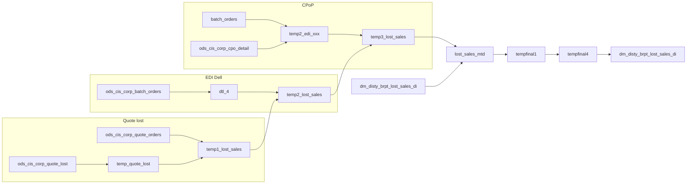

# DM: Lost sales and quote-failure daily detail (`dm_disty_brpt_lost_sales_di`)

- artifact_type: etl_table
- artifact_id: dm_us.dm_disty_brpt_lost_sales_di
- domain: sales
- one_line_purpose: This job builds a month-to-date lost-sales fact table that captures quote lines lost to competitors, Dell EDI batch rejections, and CPoP/EDI cancellation lines. It merges the current day’s new lost events with prior MTD rows, then enriches ...
- layer_type: DM
- source_kind: etl_sql
- evidence_source: source/etl/sql/sales/data_service/brpt_patch/python/load_dm_disty_brpt_lost_sales_di.py

---

## L1 Data Foundation

### Identity and physical mapping
- **Table:** `dm_us.dm_disty_brpt_lost_sales_di`
- **Layer type:** DM
- **Canonical / derived:** Derived / ETL-loaded (see L3)
- **Owner team:** not registered in metadata catalog

### Grain, scope, exclusions
- **Grain:** one row per lost event (quote line, EDI PO line, or CPoP line) per `date_flag`, identified by `source`, `quote_no`, `quote_line_no`, and supporting reason fields; `seq` is `row_number()` over `date_flag` for the daily append set.
- **Scope:** See L2 business purpose / L3 filters
- **Partition:** `date_flag` — business date (cast to date on INSERT). - resolved from pipeline (see L4)
- **Natural key:** `date_flag`, `source`, `quote_no`, `quote_line_no`, `reason_type`, `reason_sub_type`, `seq` (composite; not declared unique in script).
- **Exclusions:** Not documented in repository

#### Grain detail (preserved)

- **Grain:** one row per lost event (quote line, EDI PO line, or CPoP line) per `date_flag`, identified by `source`, `quote_no`, `quote_line_no`, and supporting reason fields; `seq` is `row_number()` over `date_flag` for the daily append set.
- **Partition:** `date_flag` — business date (cast to date on INSERT).
- **Natural key:** `date_flag`, `source`, `quote_no`, `quote_line_no`, `reason_type`, `reason_sub_type`, `seq` (composite; not declared unique in script).

---

### Cross-engine presence
| Engine | Present | Canonical FQN | Notes |
|--------|---------|---------------|-------|
| Hive | yes | `dm_disty_brpt_lost_sales_di` | ETL target / intermediate per evidence script |
| Vertica | pending | `dm_disty_brpt_lost_sales_di` | Confirm via hive2vertica flow evidence / MCP |

### Physical schema reference

Pointer block only - full column catalog lives in WKB L1 storage JSON.

| Field | Value |
|-------|-------|
| **Authoritative catalog** | WKB L1 storage seed (not duplicated in this file) |
| **entity_id** | `dm_us.dm_disty_brpt_lost_sales_di` |
| **l1_catalog_seed** | `target/storage/wkb/snapshots/_snapshot_id_template/l1_catalog/{engine}_{schema}_{table}.json` |
| **column_count** | pending (run ddl_seed_writer) |
| **partition_keys** | `date_flag` |
| **ddl_source** | pending Bitbucket DDL / Vertica metadata ingest |
| **retrieval** | `python -m tools.wkb.indexing.run_query --query "sales load_dm_disty_brpt_lost_sales_di schema" --intent find_table_schema` |

### Lineage
See L6 Dependencies and notes.

### Freshness and load path
| Item | Value |
|------|-------|
| Load pattern | See L3 end-to-end / INSERT pattern in evidence script |
| Schedule | Not documented in repository |
| Parameters | `country_no`, `date_flag`, `next_date` (window: `entry_datetime >= date_flag` and `< next_date` for intraday sources) |


---

## L2 Declarative Knowledge

### Business purpose
This job builds a month-to-date lost-sales fact table that captures quote lines lost to competitors, Dell EDI batch rejections, and CPoP/EDI cancellation lines. It merges the current day’s new lost events with prior MTD rows, then enriches placeholders with customer territory, vendor/VPL, segment, PM accountability, and product group so BRPT can analyze lost revenue and margin by sales dimension.

---

### Audience and use cases
| Audience | How they benefit |
|----------|-----------------|
| **Sales / quoting** | Lost quote lines with `reason_type`, `reason_sub_type`, `reason_comment`, and quote vs order qty. |
| **Operations (EDI/Dell)** | EDI DELL and CPoP sources with status-driven `reason_type` and comments. |
| **Finance / margin** | `unit_price`, `unit_cost`, `net_price`, `gm`, `quote_qty`, `order_qty` for lost revenue analysis. |
| **Territory management** | Enriched `cust_terr`, `terr_group`, `sub_terr_group`, `division`, `cust_type`. |
| **Vendor / PM analytics** | `vend_no`, `vpl_no`, `seg_code`, `pm_header`, `key_manager`, `pm_code`, `director`, `product_group`. |

---

### Fact key resolution
- Natural key: `date_flag`, `source`, `quote_no`, `quote_line_no`, `reason_type`, `reason_sub_type`, `seq` (composite; not declared unique in script).
- FK / label-on attributes: see L3 dimension join patterns and step-by-step logic.
- Negative assertion: do not treat descriptive labels as grain keys unless listed under natural key.

### Time field semantics
- **date_flag / partition columns:** `date_flag` — business date (cast to date on INSERT).
- Primary reporting filter should use the partition column(s) documented in L1; resolve values via L4.


### Metrics served

| Category | Column | Logical metric | Business reading |
|----------|--------|----------------|------------------|
| Measures | — | — | No measure columns mapped for this table. |

### Metric serving map

**Formula authority:** [`source/contracts/sales/metric-index.md`](../../source/contracts/sales/metric-index.md)

N/A — no measure columns mapped for this table.

### etl_metrics

No governed logical metrics from `source/contracts/sales/metric-index.md` are mapped on this table.

---

### Metric serving map
N/A - not a `*_comb_mtd` / multi-period wide serving table (or map not present in legacy doc).


### Data products and column groups (preserved)

### Identifiers and relationships

- **Quote / order reference:** `quote_no`, `quote_line_no`, `ext_ref`, `source` (`Quote Orders`, `EDI DELL`, `CPoP`)
- **Customer:** `cust_no`, `mcust_no`, `cust_terr`, `cust_type`, `division`
- **Vendor / product:** `vend_no`, `vpl_no`, `sku_no`, `seg_code`, `master_xref`, `group_id`, `product_group`

### Dimension columns

- `reason_type`, `reason_sub_type`, `reason_priority`, `reason_comment`
- `gv_user_type` — HP enterprise flag from order comments on quote path
- `terms` — from customer credit when available
- `terr_group`, `sub_terr_group`, `director`
- `pm_header`, `key_manager`, `pm_code` — PM role ids (enriched from `pm_vpc_matrix` when -3)
- `inv_type`, `competitor`, `comp_price`

### Quantity, pricing, and cost building blocks

- `unit_price`, `unit_cost`, `net_price`
- `quote_qty`, `order_qty`, `open_qty`
- `gm`

---

### etl_metrics

N/A - no calculable ETL formulas extracted from this document (passthrough / stored measures only, or formulas not documented).

---

## L3 Procedural Knowledge

### Query and routing rules
**Business filters:** Use partition / date keys from L1 grain for reporting scope.
**Technical predicates (load only):** See Key filters and step-by-step logic below.

### Dimension join patterns
| Dimension FQN | Join keys | Purpose | Evidence |
|---------------|-----------|---------|----------|
| See step-by-step / base tables | See L3 steps | Dimension enrichment | `source/etl/sql/sales/data_service/brpt_patch/python/load_dm_disty_brpt_lost_sales_di.py` |

### Key filters and ETL business logic
### Step 1 — Quote lost: `temp_quote_lost1` → `temp_quote_lost` → `temp1_lost_sales`

**Filters on `ods_cis_corp_quote_lost`:**
- `entry_datetime` in `[date_flag, next_date)`
- `ifnull(active_flag,'Y')='Y'`, `delete_date IS NULL`

**Logic:** pick dominant `reason_type` per `(quote_no, quote_line_no)`, then max `reason_sub_type` for that type.  
**`hp` view:** min HP flag (`2` if comment like `%HP ENTES%`, else `1`) from order comments on linked orders.  
**`temp1_lost_sales`:** joins quote orders; many dimensions initialized to `-3` or null; carries pricing/qty/GM from quote orders.

---

### Step 2 — Dell EDI: `temp_bo_process` through `dtl_4` → `temp2_lost_sales`

**`temp_bo_process` filters:**
- `cust_no IN (124858, 118905, 138473)`
- `from_ref_type = 9`
- entry window; status excludes `E`, `e`, `R`; additional status/ref_type rules

**Detail pipeline:** builds `temp_dtl` / `temp1_dtl` / `temp2_dtl` with act codes `IA`/`RD`; `dtl_1`–`dtl_4` apply invalid-customer and stock messages; keep `act_code IN ('IR','RD')`.  
**Union:** `temp2_lost_sales = temp1_lost_sales UNION ALL` EDI DELL rows from `dtl_4` with SKU from part master.

---

### Step 3 — CPoP: `edi_xxx` → `temp2_edi_xxx` → `temp3_lost_sales`

**`edi_xxx`:** batch orders in date window (broader cust filter than Dell path).  
**CPO enrichment:** when `int_ref_type = 37` and status like `5`, replace line/sku/status from `cpo_detail`.  
**Comments:** OX comments for cancelled/stock-out lines; filter `status_desc IN ('P...

### Standard time-filter SQL
```sql
-- relative period filter using resolved partition value (see L4)
SELECT *
FROM dm_disty_brpt_lost_sales_di
WHERE /* partition predicate */ date_flag = '${partition_value}';
```

### End-to-end flow
**Runtime parameters:** `country_no`, `date_flag`, `next_date`  
**Target table:** `dm_${country_no}.dm_disty_brpt_lost_sales_di`, partitioned by **`date_flag`**.

1. Build quote-lost temps → `temp1_lost_sales`.
2. Build Dell batch-order detail pipeline → union into `temp2_lost_sales`.
3. Build CPoP EDI pipeline → `temp3_lost_sales` with `lost_sales_seq`.
4. Merge MTD from target table + new rows → `lost_sales_mtd`.
5. Enrichment temps `tempfinal1` → `tempfinal4`.
6. **Insert overwrite** partitions for MTD window.



---


#### High-level stages (preserved)

| Stage | Business meaning |
|-------|-----------------|
| **Quote lost extraction** | Identifies quote lines with active lost reasons in the processing date window and attaches quote order economics (price, qty, GM). |
| **Dell EDI batch path** | Processes special batch orders for Dell customers; derives invalid/reject detail rows (`act_code` IR/RD) and unions as lost EDI lines. |
| **CPoP / EDI CPOP path** | Pulls batch-order cancellations and inventory stock-out lines; enriches from CPO detail and comments. |
| **MTD union** | Combines month-to-date existing `dm_disty_brpt_lost_sales_di` rows with new lines and assigns `seq`. |
| **Customer & territory enrichment** | Replaces `-3` placeholders for cust_type, division, cust_terr, mcust_no from header, territory, and xref. |
| **Vendor / VPL / segment enrichment** | Resolves vend_no, vpl_no, seg_code from part master, vend_pl, vendor profile, and PM matrix. |
| **Final attributes** | Master vendor xref, VPC product group from `dim_pub_vpl_info`, credit terms; excludes EXP/SER segment types. |
| **Partition load** | Overwrites `date_flag` partitions for the MTD date range into `dm_disty_brpt_lost_sales_di`. |

**Parameters:** `country_no`, `date_flag`, `next_date` (window: `entry_datetime >= date_flag` and `< next_date` for intraday sources)

---


### Base tables register
| Object | Role in this job |
|--------|-----------------|
| `ods_${country_no}.ods_cis_corp_quote_lost` | Lost reason facts |
| `ods_${country_no}.ods_cis_corp_quote_orders` | Quote line economics and customer |
| `ods_${country_no}.ods_cis_corp_order_comments` | HP flag detection |
| `ods_${country_no}.ods_cis_corp_batch_orders` | Dell EDI and CPoP batch sources |
| `ods_${country_no}.ods_cis_corp_part_master` | SKU mapping |
| `ods_${country_no}.ods_cis_corp_cpo_detail` / `cpo_comments` | CPoP line enrichment |
| `ods_${country_no}.ods_cis_corp_customer_header` | Territory |
| `ods_${country_no}.ods_cis_corp_territory` / `cust_type` | Type, division, groups |
| `ods_${country_no}.ods_cis_corp_cust_xref` | MASTER_SUB mcust |
| `ods_${country_no}.ods_cis_corp_dw_vend_pl` | VPL/segment/vendor resolution |
| `ods_${country_no}.ods_cis_corp_vendor_profile` | SEG profile fallback |
| `ods_${country_no}.ods_cis_corp_pm_vpc_matrix` | PM role ids |
| `ods_${country_no}.ods_cis_corp_pl_code` | Valid VSEG codes |
| `ods_${country_no}.ods_cis_corp_vendor_xref` | SRef master vendor |
| `ods_${country_no}.ods_cis_corp_vendor_segment` | EXP/SER exclusion filter |
| `ods_${country_no}.ods_cis_corp_customer_credit` | Payment terms |
| `dim_${country_no}.dim_pub_vpl_info` | `product_group` / vpc_group_id |
| `dm_${country_no}.dm_disty_brpt_lost_sales_di` | Prior MTD rows for merge |

---

### Step-by-step logic
### Step 1 — Quote lost: `temp_quote_lost1` → `temp_quote_lost` → `temp1_lost_sales`

**Filters on `ods_cis_corp_quote_lost`:**
- `entry_datetime` in `[date_flag, next_date)`
- `ifnull(active_flag,'Y')='Y'`, `delete_date IS NULL`

**Logic:** pick dominant `reason_type` per `(quote_no, quote_line_no)`, then max `reason_sub_type` for that type.  
**`hp` view:** min HP flag (`2` if comment like `%HP ENTES%`, else `1`) from order comments on linked orders.  
**`temp1_lost_sales`:** joins quote orders; many dimensions initialized to `-3` or null; carries pricing/qty/GM from quote orders.

---

### Step 2 — Dell EDI: `temp_bo_process` through `dtl_4` → `temp2_lost_sales`

**`temp_bo_process` filters:**
- `cust_no IN (124858, 118905, 138473)`
- `from_ref_type = 9`
- entry window; status excludes `E`, `e`, `R`; additional status/ref_type rules

**Detail pipeline:** builds `temp_dtl` / `temp1_dtl` / `temp2_dtl` with act codes `IA`/`RD`; `dtl_1`–`dtl_4` apply invalid-customer and stock messages; keep `act_code IN ('IR','RD')`.  
**Union:** `temp2_lost_sales = temp1_lost_sales UNION ALL` EDI DELL rows from `dtl_4` with SKU from part master.

---

### Step 3 — CPoP: `edi_xxx` → `temp2_edi_xxx` → `temp3_lost_sales`

**`edi_xxx`:** batch orders in date window (broader cust filter than Dell path).  
**CPO enrichment:** when `int_ref_type = 37` and status like `5`, replace line/sku/status from `cpo_detail`.  
**Comments:** OX comments for cancelled/stock-out lines; filter `status_desc IN ('PO Line Delete, Inventory Stock Out', 'CANCELLED')`.  
**Union:** `temp3_lost_sales = temp2_lost_sales UNION ALL` CPoP rows with reason_type `I` or `O` from status rules.

---

### Step 4 — `lost_sales_mtd`

**From:** existing `dm_disty_brpt_lost_sales_di` where `date_flag` from month start of `next_date` through `date_flag - 2` days  
**Union:** new rows from `lost_sales_seq` (adds `seq` via `row_number()` over `date_flag`)

---

### Step 5 — `tempfinal1_lost_sales`

**Enrichment when `date_flag` between month-start(`next_date`) and `date_flag`:**
- `cust_terr` from customer header
- `cust_type`, `division`, `terr_group`, `sub_terr_group` from territory/cust_type when both resolve
- `mcust_no` from `MASTER_SUB` xref
- `vend_no`, `vpl_no`, `group_id` from part master when SKU present
- `seg_code` from vend_pl `alt_seg_code`

---

### Step 6 — `tempfinal2_lost_sales`

**VPL alternate resolution:** when vend_pl row exists with mismatched alt refs, use `nvl(alt_vend_no, vend_no)` and `nvl(alt_vpl_no, vpl_no)` for vend/vpl/master_xref.

---

### Step 7 — `tempfinal3_lost_sales` (CTE `temp_tab1` + outer query)

**Segment:** vend_pl `alt_seg_code` or vendor SEG `profile_c` when segment null.  
**PM roles:** when `pm_header`, `key_manager`, `pm_code`, or `director` = -3, fill from `pm_vpc_matrix` at VPL level (`vpl_no <> -1`) then vendor level (`vpl_no = -1`) for roles PM VP, PM Team Manager, PM, PM Director with matching `in_vend_matrix` codes.

---

### Step 8 — `tempfinal4_lost_sales`

**Segment validation:** invalid `seg_code` not in `pl_code` VSEG set → `'OTH'`.  
**Master xref:** `SRef` vendor xref when active.  
**Product group:** `dim_pub_vpl_info.vpc_group_id` when VPL active.  
**Terms:** customer credit terms when present.  
**Exclude:** rows where `seg_code` matches `vendor_segment` with `type_code = 'EXP/SER'`.

---

### Step 9 — Final `INSERT` into `dm_disty_brpt_lost_sales_di`

**From:** `tempfinal4_lost_sales`  
**Mode:** `INSERT OVERWRITE ... PARTITION (date_flag)`  
**Output:** full lost-sales column set; `date_flag` cast to date

---

### Relationship map (embedded)

| from_fqn | to_fqn | cardinality | join_keys | provenance |
|----------|--------|-------------|-----------|------------|
| `ods_${country_no}.ods_cis_corp_quote_lost` | `temp_quote_lost1` | many:1 | `a.quote_no = b.quote_no AND a.quote_line_no = b.quote_line_no AND a.reason_type = b.reason_type` | etl_sql (source/etl/sql/sales/data_service/brpt_patch/python/load_dm_disty_brpt_lost_sales_di.py:18) |
| `temp_quote_lost` | `ods_${country_no}.ods_cis_corp_quote_orders` | many:1 | `ql.quote_no = qo.quote_no AND ql.quote_line_no = qo.quote_line_no` | etl_sql (source/etl/sql/sales/data_service/brpt_patch/python/load_dm_disty_brpt_lost_sales_di.py:38) |
| `ods_${country_no}.ods_cis_corp_quote_orders` | `ods_${country_no}.ods_cis_corp_order_comments` | many:1 | `qo.order_type = h.order_type AND qo.order_no = h.order_no AND h.comment like '%HP ENT%'` | etl_sql (source/etl/sql/sales/data_service/brpt_patch/python/load_dm_disty_brpt_lost_sales_di.py:38) |
| `temp_quote_lost` | `ods_${country_no}.ods_cis_corp_quote_lost` | many:1 | `ql.quote_no = q2.quote_no AND ql.quote_line_no = q2.quote_line_no AND ql.reason_type = q2.reason_type AND ql.reason_sub_type = q2.reason_sub_type` | etl_sql (source/etl/sql/sales/data_service/brpt_patch/python/load_dm_disty_brpt_lost_sales_di.py:55) |
| `temp_bo_process` | `ods_${country_no}.ods_cis_corp_quote_orders` | many:1 | `bo.cust_no = qo.cust_no AND bo.ext_ref = qo.po_no AND bo.sequence = qo.sequence` | etl_sql (source/etl/sql/sales/data_service/brpt_patch/python/load_dm_disty_brpt_lost_sales_di.py:125) |
| `ods_${country_no}.ods_cis_corp_quote_orders` | `ods_${country_no}.ods_cis_corp_quote_lost` | many:1 | `qo.quote_no = ql.quote_no AND qo.quote_line_no = ql.quote_line_no` | etl_sql (source/etl/sql/sales/data_service/brpt_patch/python/load_dm_disty_brpt_lost_sales_di.py:125) |
| `temp_bo_process` | `ods_${country_no}.ods_cis_corp_part_master` | many:1 | `b.part_no = p.part_no AND b.status not IN ('K', 'M', 'W', 'V', 'U', 'Z')` | etl_sql (source/etl/sql/sales/data_service/brpt_patch/python/load_dm_disty_brpt_lost_sales_di.py:143) |
| `—` | `temp_bo_process` | many:1 | `b.int_ref_no = a.int_po_no AND b.sequence = a.po_line_no AND b.status IN ('C')` | etl_sql (source/etl/sql/sales/data_service/brpt_patch/python/load_dm_disty_brpt_lost_sales_di.py:221) |
| `temp_bo_process` | `temp_reason_type` | many:1 | `b.ext_ref = r.po_no AND b.cust_no = r.cust_no AND b.sequence = r.po_line_no` | etl_sql (source/etl/sql/sales/data_service/brpt_patch/python/load_dm_disty_brpt_lost_sales_di.py:246) |
| `—` | `temp_bo_process` | many:1 | `b.int_ref_no = a.int_po_no AND b.sequence = a.po_line_no` | etl_sql (source/etl/sql/sales/data_service/brpt_patch/python/load_dm_disty_brpt_lost_sales_di.py:273) |
| `—` | `ods_${country_no}.ods_cis_corp_part_master` | many:1 | `Not documented in repository` | etl_sql (source/etl/sql/sales/data_service/brpt_patch/python/load_dm_disty_brpt_lost_sales_di.py:307) |
| `—` | `ods_${country_no}.ods_cis_corp_cpo_detail` | many:1 | `a.int_po_no = cpo.cpo_id AND a.po_line_no = cpo.cpo_line_no AND a.int_ref_type = 37 AND a.status like '5'` | etl_sql (source/etl/sql/sales/data_service/brpt_patch/python/load_dm_disty_brpt_lost_sales_di.py:380) |
| `temp_edi_xxx` | `ods_${country_no}.ods_cis_corp_cpo_comments` | many:1 | `a.int_po_no = b1.cpo_id AND a.po_line_no = b1.cpo_line_seq AND b1.cpo_comment_type = 'OX' AND b1.cpo_comment_loc = '5'` | etl_sql (source/etl/sql/sales/data_service/brpt_patch/python/load_dm_disty_brpt_lost_sales_di.py:406) |
| `—` | `ods_${country_no}.ods_cis_corp_customer_header` | many:1 | `a.cust_no = ch.cust_no` | etl_sql (source/etl/sql/sales/data_service/brpt_patch/python/load_dm_disty_brpt_lost_sales_di.py:575) |
| `ods_${country_no}.ods_cis_corp_customer_header` | `ods_${country_no}.ods_cis_corp_territory` | many:1 | `ch.sales_terr = t.sales_terr` | etl_sql (source/etl/sql/sales/data_service/brpt_patch/python/load_dm_disty_brpt_lost_sales_di.py:575) |
| `ods_${country_no}.ods_cis_corp_territory` | `ods_${country_no}.ods_cis_corp_cust_type` | many:1 | `t.cust_type = c.cust_type` | etl_sql (source/etl/sql/sales/data_service/brpt_patch/python/load_dm_disty_brpt_lost_sales_di.py:575) |
| `ods_${country_no}.ods_cis_corp_customer_header` | `ods_${country_no}.ods_cis_corp_cust_xref` | many:1 | `a.cust_no = cx.cust_no AND cx.xref_type = 'MASTER_SUB' AND cx.active = 'Y'` | etl_sql (source/etl/sql/sales/data_service/brpt_patch/python/load_dm_disty_brpt_lost_sales_di.py:575) |
| `ods_${country_no}.ods_cis_corp_customer_header` | `ods_${country_no}.ods_cis_corp_part_master` | many:1 | `a.sku_no = pm.sku_no` | etl_sql (source/etl/sql/sales/data_service/brpt_patch/python/load_dm_disty_brpt_lost_sales_di.py:575) |
| `ods_${country_no}.ods_cis_corp_customer_header` | `ods_${country_no}.ods_cis_corp_dw_vend_pl` | many:1 | `a.vpl_no = vp.vpl_no AND vp.vpl_no <> - 1 AND vp.alt_seg_code IS not NULL` | etl_sql (source/etl/sql/sales/data_service/brpt_patch/python/load_dm_disty_brpt_lost_sales_di.py:575) |
| `—` | `ods_${country_no}.ods_cis_corp_dw_vend_pl` | many:1 | `a.vpl_no = pl.vpl_no AND pl.vpl_no <> -1 AND ( a.vend_no <> pl.vend_no OR pl.vend_no <> pl.alt_vend_no OR pl.vpl_no <> pl.alt_vpl_no )` | etl_sql (source/etl/sql/sales/data_service/brpt_patch/python/load_dm_disty_brpt_lost_sales_di.py:639) |
| `temp_tab1` | `ods_${country_no}.ods_cis_corp_pm_vpc_matrix` | many:1 | `a.vpl_no = pm1.vpl_no AND pm1.vpl_no != -1 AND pm1.pm_dna_role = 'PM VP' AND pm1.in_vend_matrix = 'O' AND a.pm_header = -3` | etl_sql (source/etl/sql/sales/data_service/brpt_patch/python/load_dm_disty_brpt_lost_sales_di.py:695) |
| `temp_tab1` | `ods_${country_no}.ods_cis_corp_pm_vpc_matrix` | many:1 | `a.vpl_no = pm3.vpl_no AND pm3.vpl_no != -1 AND pm3.pm_dna_role = 'PM Team Manager' AND pm3.in_vend_matrix = 'M' AND a.key_manager = -3` | etl_sql (source/etl/sql/sales/data_service/brpt_patch/python/load_dm_disty_brpt_lost_sales_di.py:695) |
| `temp_tab1` | `ods_${country_no}.ods_cis_corp_pm_vpc_matrix` | many:1 | `a.vpl_no = pm5.vpl_no AND pm5.vpl_no != -1 AND pm5.pm_dna_role = 'PM' AND pm5.in_vend_matrix = 'P' AND a.pm_code = -3` | etl_sql (source/etl/sql/sales/data_service/brpt_patch/python/load_dm_disty_brpt_lost_sales_di.py:695) |
| `temp_tab1` | `ods_${country_no}.ods_cis_corp_pm_vpc_matrix` | many:1 | `a.vpl_no = pm7.vpl_no AND pm7.vpl_no != -1 AND pm7.pm_dna_role = 'PM Director' AND pm7.in_vend_matrix = 'D' AND a.director = -3` | etl_sql (source/etl/sql/sales/data_service/brpt_patch/python/load_dm_disty_brpt_lost_sales_di.py:695) |
| `temp_tab1` | `ods_${country_no}.ods_cis_corp_dw_vend_pl` | many:1 | `a.vpl_no = pl.vpl_no AND pl.vpl_no <> -1 AND pl.alt_seg_code IS not NULL` | etl_sql (source/etl/sql/sales/data_service/brpt_patch/python/load_dm_disty_brpt_lost_sales_di.py:695) |
| `temp_tab1` | `ods_${country_no}.ods_cis_corp_vendor_profile` | many:1 | `a.vend_no = vp.vend_no AND vp.profile_type = 'SEG'` | etl_sql (source/etl/sql/sales/data_service/brpt_patch/python/load_dm_disty_brpt_lost_sales_di.py:695) |
| `temp_tab1` | `ods_${country_no}.ods_cis_corp_pm_vpc_matrix` | many:1 | `a.vend_no = pm2.vend_no AND pm2.vpl_no = -1 AND pm2.pm_dna_role = 'PM VP' AND pm2.in_vend_matrix = 'O' AND a.pm_header = -3` | etl_sql (source/etl/sql/sales/data_service/brpt_patch/python/load_dm_disty_brpt_lost_sales_di.py:695) |
| `temp_tab1` | `ods_${country_no}.ods_cis_corp_pm_vpc_matrix` | many:1 | `a.vend_no = pm4.vend_no AND pm4.vpl_no = -1 AND pm4.pm_dna_role = 'PM Team Manager' AND pm4.in_vend_matrix = 'M' AND a.key_manager = -3` | etl_sql (source/etl/sql/sales/data_service/brpt_patch/python/load_dm_disty_brpt_lost_sales_di.py:695) |
| `temp_tab1` | `ods_${country_no}.ods_cis_corp_pm_vpc_matrix` | many:1 | `a.vend_no = pm6.vend_no AND pm6.vpl_no = -1 AND pm6.pm_dna_role = 'PM' AND pm6.in_vend_matrix = 'P' AND a.pm_code = -3` | etl_sql (source/etl/sql/sales/data_service/brpt_patch/python/load_dm_disty_brpt_lost_sales_di.py:695) |
| `temp_tab1` | `ods_${country_no}.ods_cis_corp_pm_vpc_matrix` | many:1 | `a.vend_no = pm8.vend_no AND pm8.vpl_no = -1 AND pm8.pm_dna_role = 'PM Director' AND pm8.in_vend_matrix = 'D' AND a.director = -3` | etl_sql (source/etl/sql/sales/data_service/brpt_patch/python/load_dm_disty_brpt_lost_sales_di.py:695) |
| `temp_1` | `ods_${country_no}.ods_cis_corp_vendor_xref` | many:1 | `a.vend_no = vx.vend_no AND vx.xref_type = 'SRef' AND vx.active = 'Y'` | etl_sql (source/etl/sql/sales/data_service/brpt_patch/python/load_dm_disty_brpt_lost_sales_di.py:859) |
| `temp_1` | `dim_${country_no}.dim_pub_vpl_info` | many:1 | `a.vpl_no = vpc.vpl_no AND vpc.active = 'Y'` | etl_sql (source/etl/sql/sales/data_service/brpt_patch/python/load_dm_disty_brpt_lost_sales_di.py:859) |
| `temp_1` | `ods_${country_no}.ods_cis_corp_customer_credit` | many:1 | `a.cust_no = cc.cust_no AND cc.delete_datetime IS NULL` | etl_sql (source/etl/sql/sales/data_service/brpt_patch/python/load_dm_disty_brpt_lost_sales_di.py:859) |

`source/ref/sales/table relationship.txt`: Not documented in repository.

### Special logic (embedded)

Not documented in repository

### Column / field derivations (from ETL SQL)

| target_column | expression_sql | upstream_columns | upstream_tables | transform_kind | evidence |
|---------------|----------------|------------------|-----------------|----------------|----------|
| `quote_no` | `quote_no` | `quote_no` | `tempfinal4_lost_sales` | passthrough | `source/etl/sql/sales/data_service/brpt_patch/python/load_dm_disty_brpt_lost_sales_di.py:6` |
| `quote_line_no` | `quote_line_no` | `quote_line_no` | `tempfinal4_lost_sales` | passthrough | `source/etl/sql/sales/data_service/brpt_patch/python/load_dm_disty_brpt_lost_sales_di.py:7` |
| `reason_type` | `reason_type` | `reason_type` | `tempfinal4_lost_sales` | passthrough | `source/etl/sql/sales/data_service/brpt_patch/python/load_dm_disty_brpt_lost_sales_di.py:8` |
| `reason_sub_type` | `reason_sub_type` | `reason_sub_type` | `tempfinal4_lost_sales` | passthrough | `source/etl/sql/sales/data_service/brpt_patch/python/load_dm_disty_brpt_lost_sales_di.py:23` |
| `cust_type` | `cust_type` | `cust_type` | `tempfinal4_lost_sales` | passthrough | `source/etl/sql/sales/data_service/brpt_patch/python/load_dm_disty_brpt_lost_sales_di.py:63` |
| `division` | `division` | `division` | `tempfinal4_lost_sales` | passthrough | `source/etl/sql/sales/data_service/brpt_patch/python/load_dm_disty_brpt_lost_sales_di.py:64` |
| `cust_terr` | `cust_terr` | `cust_terr` | `tempfinal4_lost_sales` | passthrough | `source/etl/sql/sales/data_service/brpt_patch/python/load_dm_disty_brpt_lost_sales_di.py:65` |
| `mcust_no` | `mcust_no` | `mcust_no` | `tempfinal4_lost_sales` | passthrough | `source/etl/sql/sales/data_service/brpt_patch/python/load_dm_disty_brpt_lost_sales_di.py:66` |
| `cust_no` | `cust_no` | `cust_no` | `tempfinal4_lost_sales` | passthrough | `source/etl/sql/sales/data_service/brpt_patch/python/load_dm_disty_brpt_lost_sales_di.py:66` |
| `vend_no` | `vend_no` | `vend_no` | `tempfinal4_lost_sales` | passthrough | `source/etl/sql/sales/data_service/brpt_patch/python/load_dm_disty_brpt_lost_sales_di.py:68` |
| `vpl_no` | `vpl_no` | `vpl_no` | `tempfinal4_lost_sales` | passthrough | `source/etl/sql/sales/data_service/brpt_patch/python/load_dm_disty_brpt_lost_sales_di.py:69` |
| `seg_code` | `seg_code` | `seg_code` | `tempfinal4_lost_sales` | passthrough | `source/etl/sql/sales/data_service/brpt_patch/python/load_dm_disty_brpt_lost_sales_di.py:70` |
| `pm_header` | `pm_header` | `pm_header` | `tempfinal4_lost_sales` | passthrough | `source/etl/sql/sales/data_service/brpt_patch/python/load_dm_disty_brpt_lost_sales_di.py:71` |
| `key_manager` | `key_manager` | `key_manager` | `tempfinal4_lost_sales` | passthrough | `source/etl/sql/sales/data_service/brpt_patch/python/load_dm_disty_brpt_lost_sales_di.py:72` |
| `pm_code` | `pm_code` | `pm_code` | `tempfinal4_lost_sales` | passthrough | `source/etl/sql/sales/data_service/brpt_patch/python/load_dm_disty_brpt_lost_sales_di.py:73` |
| `sku_no` | `sku_no` | `sku_no` | `tempfinal4_lost_sales` | passthrough | `source/etl/sql/sales/data_service/brpt_patch/python/load_dm_disty_brpt_lost_sales_di.py:74` |
| `master_xref` | `master_xref` | `master_xref` | `tempfinal4_lost_sales` | passthrough | `source/etl/sql/sales/data_service/brpt_patch/python/load_dm_disty_brpt_lost_sales_di.py:75` |
| `group_id` | `group_id` | `group_id` | `tempfinal4_lost_sales` | passthrough | `source/etl/sql/sales/data_service/brpt_patch/python/load_dm_disty_brpt_lost_sales_di.py:76` |
| `product_group` | `product_group` | `product_group` | `tempfinal4_lost_sales` | passthrough | `source/etl/sql/sales/data_service/brpt_patch/python/load_dm_disty_brpt_lost_sales_di.py:77` |
| `gv_user_type` | `gv_user_type` | `gv_user_type` | `tempfinal4_lost_sales` | passthrough | `source/etl/sql/sales/data_service/brpt_patch/python/load_dm_disty_brpt_lost_sales_di.py:78` |
| `terms` | `terms` | `terms` | `tempfinal4_lost_sales` | passthrough | `source/etl/sql/sales/data_service/brpt_patch/python/load_dm_disty_brpt_lost_sales_di.py:79` |
| `reason_priority` | `reason_priority` | `reason_priority` | `tempfinal4_lost_sales` | passthrough | `source/etl/sql/sales/data_service/brpt_patch/python/load_dm_disty_brpt_lost_sales_di.py:80` |
| `reason_comment` | `reason_comment` | `reason_comment` | `tempfinal4_lost_sales` | passthrough | `source/etl/sql/sales/data_service/brpt_patch/python/load_dm_disty_brpt_lost_sales_di.py:81` |
| `unit_price` | `unit_price` | `unit_price` | `tempfinal4_lost_sales` | passthrough | `source/etl/sql/sales/data_service/brpt_patch/python/load_dm_disty_brpt_lost_sales_di.py:82` |
| `unit_cost` | `unit_cost` | `unit_cost` | `tempfinal4_lost_sales` | passthrough | `source/etl/sql/sales/data_service/brpt_patch/python/load_dm_disty_brpt_lost_sales_di.py:83` |
| `net_price` | `net_price` | `net_price` | `tempfinal4_lost_sales` | passthrough | `source/etl/sql/sales/data_service/brpt_patch/python/load_dm_disty_brpt_lost_sales_di.py:84` |
| `quote_qty` | `quote_qty` | `quote_qty` | `tempfinal4_lost_sales` | passthrough | `source/etl/sql/sales/data_service/brpt_patch/python/load_dm_disty_brpt_lost_sales_di.py:85` |
| `order_qty` | `order_qty` | `order_qty` | `tempfinal4_lost_sales` | passthrough | `source/etl/sql/sales/data_service/brpt_patch/python/load_dm_disty_brpt_lost_sales_di.py:86` |
| `open_qty` | `open_qty` | `open_qty` | `tempfinal4_lost_sales` | passthrough | `source/etl/sql/sales/data_service/brpt_patch/python/load_dm_disty_brpt_lost_sales_di.py:87` |
| `gm` | `gm` | `gm` | `tempfinal4_lost_sales` | passthrough | `source/etl/sql/sales/data_service/brpt_patch/python/load_dm_disty_brpt_lost_sales_di.py:88` |
| `inv_type` | `inv_type` | `inv_type` | `tempfinal4_lost_sales` | passthrough | `source/etl/sql/sales/data_service/brpt_patch/python/load_dm_disty_brpt_lost_sales_di.py:89` |
| `competitor` | `competitor` | `competitor` | `tempfinal4_lost_sales` | passthrough | `source/etl/sql/sales/data_service/brpt_patch/python/load_dm_disty_brpt_lost_sales_di.py:90` |
| `comp_price` | `comp_price` | `comp_price` | `tempfinal4_lost_sales` | passthrough | `source/etl/sql/sales/data_service/brpt_patch/python/load_dm_disty_brpt_lost_sales_di.py:91` |
| `source` | `source` | `source` | `tempfinal4_lost_sales` | passthrough | `source/etl/sql/sales/data_service/brpt_patch/python/load_dm_disty_brpt_lost_sales_di.py:58` |
| `ext_ref` | `ext_ref` | `ext_ref` | `tempfinal4_lost_sales` | passthrough | `source/etl/sql/sales/data_service/brpt_patch/python/load_dm_disty_brpt_lost_sales_di.py:92` |
| `seq` | `seq` | `seq` | `tempfinal4_lost_sales` | passthrough | `source/etl/sql/sales/data_service/brpt_patch/python/load_dm_disty_brpt_lost_sales_di.py:129` |
| `director` | `director` | `director` | `tempfinal4_lost_sales` | passthrough | `source/etl/sql/sales/data_service/brpt_patch/python/load_dm_disty_brpt_lost_sales_di.py:93` |
| `terr_group` | `terr_group` | `terr_group` | `tempfinal4_lost_sales` | passthrough | `source/etl/sql/sales/data_service/brpt_patch/python/load_dm_disty_brpt_lost_sales_di.py:94` |
| `sub_terr_group` | `sub_terr_group` | `sub_terr_group` | `tempfinal4_lost_sales` | passthrough | `source/etl/sql/sales/data_service/brpt_patch/python/load_dm_disty_brpt_lost_sales_di.py:95` |
| `date_flag` | `cast(date_flag as date)` | `date_flag` | `tempfinal4_lost_sales` | cast | `source/etl/sql/sales/data_service/brpt_patch/python/load_dm_disty_brpt_lost_sales_di.py:1011` |

### Sentinel and code values
| Value | Meaning |
|-------|---------|
| `-3` (int dimensions) | Unassigned placeholder until enrichment |
| `cust_no IN (124858, 118905, 138473)` | Dell EDI batch customer filter |
| `from_ref_type = 9` | Dell batch order reference type |
| `act_code IN ('IR','RD')` | Invalid/reject lines kept in Dell path |
| `int_ref_type = 37` | CPO-linked batch rows |
| `xref_type = 'MASTER_SUB'` | Master customer xref |
| `profile_type = 'SEG'` | Vendor segment profile |
| `code_type = 'VSEG'` | Valid segment codes in pl_code |
| `type_code = 'EXP/SER'` | Excluded vendor segment types |
| `seg_code = 'OTH'` | Default when not in VSEG pl_code set |
| `gv_user_type` | HP flag encoding from comments |

---

---

## L4 Validation

### Resolved partition value
| Step | Source | How partition / date scope is determined |
|------|--------|------------------------------------------|
| 1 | evidence script / flow | See parameters in L1 Freshness and L3 filters - `source/etl/sql/sales/data_service/brpt_patch/python/load_dm_disty_brpt_lost_sales_di.py` |

**Plain language:** Partition and date scope follow Azkaban/bootstrap parameters documented in the source script and orchestrating flow; do not hardcode calendar literals.

### Data quality checks
- Prefer row-count-by-partition, metric sums, and grain duplicate checks (see Validation SQL).
- Additional checks from legacy caveats / operational notes when present.

### Validation SQL
```sql
-- 1) Row count by partition
SELECT ${partition_col}, COUNT(*) AS row_cnt
FROM dm_${country_no}.dm_disty_brpt_lost_sales_di
WHERE ${partition_col} = '${partition_value}'
GROUP BY ${partition_col};

-- 2) Metric sum by business dimension (top deltas)
SELECT ${dim_key}, SUM(${metric}) AS metric_sum
FROM dm_${country_no}.dm_disty_brpt_lost_sales_di
WHERE ${partition_col} = '${partition_value}'
GROUP BY ${dim_key}
ORDER BY ABS(SUM(${metric})) DESC
LIMIT 20;

-- 3) Grain duplicate check
SELECT ${grain_key_1}, ${grain_key_2}, ${grain_key_3}, ${partition_col}, COUNT(*) AS cnt
FROM dm_${country_no}.dm_disty_brpt_lost_sales_di
WHERE ${partition_col} = '${partition_value}'
GROUP BY ${grain_key_1}, ${grain_key_2}, ${grain_key_3}, ${partition_col}
HAVING COUNT(*) > 1;
```

Replace placeholders from this file's Grain and keys / Data you can fetch sections, and use the resolved partition value from run scope.

### Caveats for interpretation
- MTD reload reads **prior partitions** of the same table plus new rows; logic depends on successful prior-day loads within the month.
- Three source systems use different meanings for `quote_no` (e.g. EDI uses `int_po_no`).
- PM matrix enrichment only runs when role columns remain `-3` after earlier steps.
- EXP/SER segment rows are filtered out at the final step.

---

### Conflicts and open questions
- Schedule, owner, SLA: Not documented in repository (unless preserved schedule evidence above).
- Vertica MCP verification: pending unless confirmed in L5.


---

## L5 Runtime View

### Query path and engine preference
| Role | Hive object | Vertica object | Sync mode | Evidence | MCP verified |
|------|-------------|----------------|-----------|----------|--------------|
| **Query for reporting** | *See script lineage* | `dm_${country_no}.dm_disty_brpt_lost_sales_di` | *Verify from flow* | *Add flow file:line* | pending |
| **Hive alternative** | `*` | `dm_${country_no}.dm_disty_brpt_lost_sales_di` | - | *See dependencies* | - |
| **ETL internal** | staging/temp tables | *Not synced to Vertica* | - | *See step-by-step logic* | - |

Business users should query `dm_${country_no}.dm_disty_brpt_lost_sales_di` in Vertica once MCP verification is completed for this document.

### Access constraints
- Country / company schema parameters may apply (`literal_country`, `company_no`, etc.).
- Hive-only staging objects are not reporting surfaces unless synced.

### Query risk profile
| Field | Value |
|-------|-------|
| requires_date_predicate | yes |
| scan_risk_tier | medium |

---

## L6 Access and Consumption

### Primary consumers and use cases
| Audience | How they benefit |
|----------|-----------------|
| **Sales / quoting** | Lost quote lines with `reason_type`, `reason_sub_type`, `reason_comment`, and quote vs order qty. |
| **Operations (EDI/Dell)** | EDI DELL and CPoP sources with status-driven `reason_type` and comments. |
| **Finance / margin** | `unit_price`, `unit_cost`, `net_price`, `gm`, `quote_qty`, `order_qty` for lost revenue analysis. |
| **Territory management** | Enriched `cust_terr`, `terr_group`, `sub_terr_group`, `division`, `cust_type`. |
| **Vendor / PM analytics** | `vend_no`, `vpl_no`, `seg_code`, `pm_header`, `key_manager`, `pm_code`, `director`, `product_group`. |

---

### Representative query patterns
```sql
-- certified / illustrative lookup - replace predicates from L1/L4
SELECT *
FROM dm_disty_brpt_lost_sales_di
WHERE date_flag = '${partition_value}'
LIMIT 100;
```

### Dependencies and notes
### Upstream objects (verified)

| Object | Usage | Evidence |
|--------|-------|----------|
| `ods_${country_no}.ods_cis_corp_quote_lost` | Quote lost reasons | `load_dm_disty_brpt_lost_sales_di.py:9-14` |
| `ods_${country_no}.ods_cis_corp_quote_orders` | Quote economics | `load_dm_disty_brpt_lost_sales_di.py:97-99` |
| `ods_${country_no}.ods_cis_corp_batch_orders` | EDI/CPoP sources | `load_dm_disty_brpt_lost_sales_di.py:113-114`, `375-377` |
| `dim_${country_no}.dim_pub_vpl_info` | product_group | `load_dm_disty_brpt_lost_sales_di.py:956-958` |
| `dm_${country_no}.dm_disty_brpt_lost_sales_di` | MTD self-read | `load_dm_disty_brpt_lost_sales_di.py:527-528` |

### Downstream consumers (verified)

| Object / script | Evidence |
|-----------------|----------|
| `sync_dm_disty_brpt_lost_sales_di` | Vertica sync | `source/etl/flows/data_service/brpt_patch/load_brpt_patch_us.flow:250-257` |

### Operational detail (verified)

- Partition overwrite on `date_flag` (`load_dm_disty_brpt_lost_sales_di.py:970-971`)
- Date window filters use `date_flag` and `next_date` (`load_dm_disty_brpt_lost_sales_di.py:10-11`)

### Not documented in repository

- Owner, schedule, SLA
- Flow copies script from `./disty_common/brpt_patch/python/` path while repo stores under `source/etl/sql/sales/data_service/brpt_patch/python/`

### Related scripts (verified)

- `load_dm_disty_brpt_sales_tam_qf.py` — sibling in BRPT patch flow (`load_brpt_patch_us.flow:154-194`)

### Scripts referenced in flows but not in `sales/` folder

The following SQL paths are referenced for sales-territory **scoring ODS** loads but are **not present** in this repository under `sales/` or `source/etl/flows/public_order_tools/ingest/ods_etl/script/`:

| Script (flow reference) | Flow evidence |
|-------------------------|---------------|
| `ods_ods_vwdisty_sales_terr_metric.sql` | `source/etl/flows/public_order_tools/ingest/ods_etl/ods_vds.flow:95-102` |
| `ods_ods_vwdisty_sales_terr_score.sql` | `source/etl/flows/public_order_tools/ingest/ods_etl/ods_vds.flow:104-111` |
| `ods_etl_sales_terr_metric_all.sql` | `source/etl/flows/public_order_tools/ingest/ods_etl/ods_etl_vds_gbl.flow:132-135` |
| `ods_etl_sales_terr_score_all.sql` | `source/etl/flows/public_order_tools/ingest/ods_etl/ods_etl_vds_gbl.flow:147-150` |

---

*Document generated from `source/etl/sql/sales/data_service/brpt_patch/python/load_dm_disty_brpt_lost_sales_di.py`.*

#### Not documented in repository
- Owner, SLA (unless schedule evidence preserved above)
- Any dependency without `file:line` evidence in this document

---

*Document migrated to L1-L6 from legacy Knowledgebase content. Evidence: `source/etl/sql/sales/data_service/brpt_patch/python/load_dm_disty_brpt_lost_sales_di.py`.*
