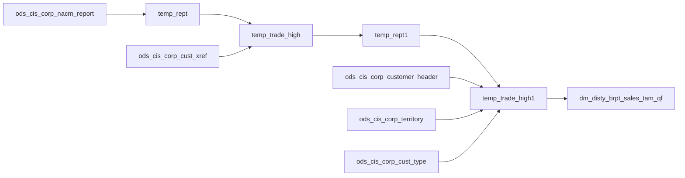

# DM: Sales territory TAM trade-currency snapshot (`dm_disty_brpt_sales_tam_qf`)

- artifact_type: etl_table
- artifact_id: dm_us.dm_disty_brpt_sales_tam_qf
- domain: sales
- one_line_purpose: This job builds a daily snapshot of customer trade-currency exposure from NACM credit reports, rolled up to master-customer and sales-territory attributes. It supports BRPT sales analytics that need TAM (total addressable market) style trad...
- layer_type: DM
- source_kind: etl_sql
- evidence_source: source/etl/sql/sales/data_service/brpt_patch/python/load_dm_disty_brpt_sales_tam_qf.py

---

## L1 Data Foundation

### Identity and physical mapping
- **Table:** `dm_us.dm_disty_brpt_sales_tam_qf`
- **Layer type:** DM
- **Canonical / derived:** Derived / ETL-loaded (see L3)
- **Owner team:** not registered in metadata catalog

### Grain, scope, exclusions
- **Grain:** one row per `(cust_no, rept_id)` after master-customer dedup, loaded into partition `date_flag = tam_date`.
- **Scope:** See L2 business purpose / L3 filters
- **Partition:** `date_flag` — business date key (`tam_date` parameter). - resolved from pipeline (see L4)
- **Natural key:** `date_flag`, `cust_no`, `rept_id` (within partition).
- **Exclusions:** Not documented in repository

#### Grain detail (preserved)

- **Grain:** one row per `(cust_no, rept_id)` after master-customer dedup, loaded into partition `date_flag = tam_date`.
- **Partition:** `date_flag` — business date key (`tam_date` parameter).
- **Natural key:** `date_flag`, `cust_no`, `rept_id` (within partition).

---

### Cross-engine presence
| Engine | Present | Canonical FQN | Notes |
|--------|---------|---------------|-------|
| Hive | yes | `dm_disty_brpt_sales_tam_qf` | ETL target / intermediate per evidence script |
| Vertica | pending | `dm_disty_brpt_sales_tam_qf` | Confirm via hive2vertica flow evidence / MCP |

### Physical schema reference

Pointer block only - full column catalog lives in WKB L1 storage JSON.

| Field | Value |
|-------|-------|
| **Authoritative catalog** | WKB L1 storage seed (not duplicated in this file) |
| **entity_id** | `dm_us.dm_disty_brpt_sales_tam_qf` |
| **l1_catalog_seed** | `target/storage/wkb/snapshots/_snapshot_id_template/l1_catalog/{engine}_{schema}_{table}.json` |
| **column_count** | pending (run ddl_seed_writer) |
| **partition_keys** | `date_flag, tam_date` |
| **ddl_source** | pending Bitbucket DDL / Vertica metadata ingest |
| **retrieval** | `python -m tools.wkb.indexing.run_query --query "sales load_dm_disty_brpt_sales_tam_qf schema" --intent find_table_schema` |

### Lineage
| Object | Role |
|--------|------|
| `ods_${country_no}.ods_cis_corp_nacm_report` | Trade currency facts |
| `ods_${country_no}.ods_cis_corp_cust_xref` | Master customer mapping |
| `ods_${country_no}.ods_cis_corp_customer_header` | Territory assignment |
| `ods_${country_no}.ods_cis_corp_territory` | Territory hierarchy attributes |
| `ods_${country_no}.ods_cis_corp_cust_type` | Division lookup |
| `dm_${country_no}.dm_disty_brpt_sales_tam_qf` | Target (partition overwrite) |

---

### Freshness and load path
| Item | Value |
|------|-------|
| Load pattern | See L3 end-to-end / INSERT pattern in evidence script |
| Schedule | Not documented in repository |
| Parameters | `country_no`, `tam_date` (written as partition `date_flag`) |


---

## L2 Declarative Knowledge

### Business purpose
This job builds a daily snapshot of customer trade-currency exposure from NACM credit reports, rolled up to master-customer and sales-territory attributes. It supports BRPT sales analytics that need TAM (total addressable market) style trade balances by division, customer type, and territory hierarchy for a given report date.

---

### Audience and use cases
| Audience | How they benefit |
|----------|-----------------|
| **Sales leadership** | `trade_curr` by `cust_terr`, `cust_type`, and `division` for territory TAM views. |
| **Credit / risk** | `rept_id` and customer-level trade exposure tied to NACM reporting. |
| **BRPT patch consumers** | Input to downstream BRPT patch flows that sync this table to Vertica. |

---

### Fact key resolution
- Natural key: `date_flag`, `cust_no`, `rept_id` (within partition).
- FK / label-on attributes: see L3 dimension join patterns and step-by-step logic.
- Negative assertion: do not treat descriptive labels as grain keys unless listed under natural key.

### Time field semantics
- **date_flag / partition columns:** `date_flag` — business date key (`tam_date` parameter).
- Primary reporting filter should use the partition column(s) documented in L1; resolve values via L4.


### Metrics served

| Category | Column | Logical metric | Business reading |
|----------|--------|----------------|------------------|
| Measures | — | — | No measure columns mapped for this table. |

### Metric serving map

**Formula authority:** [`source/contracts/sales/metric-index.md`](../../source/contracts/sales/metric-index.md)

N/A — no measure columns mapped for this table.

### etl_metrics

No governed logical metrics from `source/contracts/sales/metric-index.md` are mapped on this table.

---

### Metric serving map
N/A - not a `*_comb_mtd` / multi-period wide serving table (or map not present in legacy doc).


### Data products and column groups (preserved)

### Identifiers and relationships

- **Customer:** `cust_no`, `mcust_no` (master customer from `MASTER_SUB` xref when present)
- **Credit report:** `rept_id`

### Dimension columns

- `cust_terr` — sales territory from customer header when available
- `cust_type` — from territory when `sales_terr` matches, else prior value
- `division` — from `ods_cis_corp_cust_type` when `cust_type` resolves
- `terr_group`, `sub_terr_group` — territory group ids from `ods_cis_corp_territory`

### Core derived metrics

| Column | Formula | Business reading |
|--------|---------|------------------|
| `trade_curr` | `SUM(trade_curr)` from NACM report joined to latest `rept_id` per customer | Aggregated trade-currency balance for the customer/report |
| `trade_curr` (output) | `nvl(trade_curr, 0)` at INSERT | Zero when null |

---

### etl_metrics

N/A - no calculable ETL formulas extracted from this document (passthrough / stored measures only, or formulas not documented).

---

## L3 Procedural Knowledge

### Query and routing rules
**Business filters:** Use partition / date keys from L1 grain for reporting scope.
**Technical predicates (load only):** See Key filters and step-by-step logic below.

### Dimension join patterns
| Dimension FQN | Join keys | Purpose | Evidence |
|---------------|-----------|---------|----------|
| See step-by-step / base tables | See L3 steps | Dimension enrichment | `source/etl/sql/sales/data_service/brpt_patch/python/load_dm_disty_brpt_sales_tam_qf.py` |

### Key filters and ETL business logic
### Step 1 — `temp_rept`

**Source:** `ods_cis_corp_nacm_report`  
**Aggregation:** `max(rept_id)` grouped by `cust_no`

---

### Step 2 — `temp_trade_high`

**Source:** `temp_rept` join `ods_cis_corp_nacm_report` on `cust_no` and `rept_id`  
**Derived:** `SUM(trade_curr)`; `mcust_no` starts as `cust_no`  
**Join:** left join `cust_xref` where `xref_type = 'MASTER_SUB'` and `nvl(active,'Y')='Y'` to replace `mcust_no` with `xref_no`

---

### Step 3 — `temp_rept1`

**Source:** `temp_trade_high`  
**Aggregation:** `max(rept_id)` per `mcust_no`

---

### Step 4 — `temp_trade_high1`

**Filter:** inner join `temp_rept1` on `mcust_no` and `rept_id` (latest report per master customer)  
**Enrichment chain (CTEs in script):**
- `cust_terr` from customer header `sales_terr` when `mcust_no` matches
- `cust_type`, `terr_group`, `sub_terr_group` from territory when `sales_terr` matches
- `division` from `cust_type` master when `cust_type` resolves

---

### Step 5 — Final `INSERT` into `dm_disty_brpt_sales_tam_qf`

**From:** `temp_trade_high1`  
**Partition:** `date_flag = '${tam_date}'`  
**Columns:** `division`, `cust_type`, `cust_terr`, `mcust_no`, `cust_no`, `nvl(trade_curr,0)`, `rept_id`, `terr_group`, `sub_terr_group`, `date_flag`

---

### Standard time-filter SQL
```sql
-- relative period filter using resolved partition value (see L4)
SELECT *
FROM dm_disty_brpt_sales_tam_qf
WHERE /* partition predicate */ date_flag = '${partition_value}';
```

### End-to-end flow
**Runtime parameters:** `country_no`, `tam_date`  
**Target table:** `dm_${country_no}.dm_disty_brpt_sales_tam_qf`, partitioned by **`date_flag`**.

1. Build `temp_rept` — max `rept_id` per `cust_no`.
2. Build `temp_trade_high` — sum trade currency; resolve `mcust_no` via active `MASTER_SUB` xref.
3. Build `temp_rept1` — max `rept_id` per `mcust_no`.
4. Build `temp_trade_high1` — filter to winning report per master customer; enrich territory hierarchy.
5. **Insert overwrite** partition `date_flag = tam_date`.



---


#### High-level stages (preserved)

| Stage | Business meaning |
|-------|-----------------|
| **Latest report per customer** | Picks the maximum `rept_id` per `cust_no` from NACM report history. |
| **Trade currency aggregation** | Sums `trade_curr` for each customer/report combination and resolves master customer via `MASTER_SUB` xref. |
| **Master-customer dedup** | Keeps the row with the highest `rept_id` per `mcust_no`. |
| **Territory enrichment** | Fills `cust_terr`, `cust_type`, `division`, `terr_group`, and `sub_terr_group` from customer header and territory master. |
| **Partition load** | Overwrites one `date_flag` partition in `dm_disty_brpt_sales_tam_qf`. |

**Parameters:** `country_no`, `tam_date` (written as partition `date_flag`)

---


### Base tables register
| Object | Role in this job |
|--------|-----------------|
| `ods_${country_no}.ods_cis_corp_nacm_report` | Source for `rept_id` and `trade_curr` |
| `ods_${country_no}.ods_cis_corp_cust_xref` | `MASTER_SUB` xref for `mcust_no` |
| `ods_${country_no}.ods_cis_corp_customer_header` | `sales_terr` for customer |
| `ods_${country_no}.ods_cis_corp_territory` | `cust_type`, `group_id`, `sub_group_id` |
| `ods_${country_no}.ods_cis_corp_cust_type` | `division` by customer type |

**Temporary tables:** `temp_rept` → `temp_trade_high` → `temp_rept1` → `temp_trade_high1` → INSERT

---

### Step-by-step logic
### Step 1 — `temp_rept`

**Source:** `ods_cis_corp_nacm_report`  
**Aggregation:** `max(rept_id)` grouped by `cust_no`

---

### Step 2 — `temp_trade_high`

**Source:** `temp_rept` join `ods_cis_corp_nacm_report` on `cust_no` and `rept_id`  
**Derived:** `SUM(trade_curr)`; `mcust_no` starts as `cust_no`  
**Join:** left join `cust_xref` where `xref_type = 'MASTER_SUB'` and `nvl(active,'Y')='Y'` to replace `mcust_no` with `xref_no`

---

### Step 3 — `temp_rept1`

**Source:** `temp_trade_high`  
**Aggregation:** `max(rept_id)` per `mcust_no`

---

### Step 4 — `temp_trade_high1`

**Filter:** inner join `temp_rept1` on `mcust_no` and `rept_id` (latest report per master customer)  
**Enrichment chain (CTEs in script):**
- `cust_terr` from customer header `sales_terr` when `mcust_no` matches
- `cust_type`, `terr_group`, `sub_terr_group` from territory when `sales_terr` matches
- `division` from `cust_type` master when `cust_type` resolves

---

### Step 5 — Final `INSERT` into `dm_disty_brpt_sales_tam_qf`

**From:** `temp_trade_high1`  
**Partition:** `date_flag = '${tam_date}'`  
**Columns:** `division`, `cust_type`, `cust_terr`, `mcust_no`, `cust_no`, `nvl(trade_curr,0)`, `rept_id`, `terr_group`, `sub_terr_group`, `date_flag`

---

### Relationship map (embedded)

| from_fqn | to_fqn | cardinality | join_keys | provenance |
|----------|--------|-------------|-----------|------------|
| `temp_tab1` | `ods_${country_no}.ods_cis_corp_nacm_report` | many:1 | `a.cust_no = b.cust_no AND a.rept_id = b.rept_id` | etl_sql (source/etl/sql/sales/data_service/brpt_patch/python/load_dm_disty_brpt_sales_tam_qf.py:12) |
| `temp_tab1` | `ods_${country_no}.ods_cis_corp_cust_xref` | many:1 | `a.cust_no = b.cust_no AND b.xref_type = 'MASTER_SUB' AND nvl(b.active, 'Y') = 'Y';` | etl_sql (source/etl/sql/sales/data_service/brpt_patch/python/load_dm_disty_brpt_sales_tam_qf.py:12) |
| `temp_tab3` | `temp_rept1` | many:1 | `a.mcust_no = b.mcust_no and a.rept_id = b.rept_id) ,temp_tab2 as (` | etl_sql (source/etl/sql/sales/data_service/brpt_patch/python/load_dm_disty_brpt_sales_tam_qf.py:55) |
| `temp_tab3` | `ods_${country_no}.ods_cis_corp_customer_header` | many:1 | `a.mcust_no = b.cust_no) ,temp_tab3 as (` | etl_sql (source/etl/sql/sales/data_service/brpt_patch/python/load_dm_disty_brpt_sales_tam_qf.py:55) |
| `temp_tab3` | `ods_${country_no}.ods_cis_corp_territory` | many:1 | `a.cust_terr = b.sales_terr)` | etl_sql (source/etl/sql/sales/data_service/brpt_patch/python/load_dm_disty_brpt_sales_tam_qf.py:55) |
| `temp_tab3` | `ods_${country_no}.ods_cis_corp_cust_type` | many:1 | `a.cust_type = b.cust_type;` | etl_sql (source/etl/sql/sales/data_service/brpt_patch/python/load_dm_disty_brpt_sales_tam_qf.py:55) |

`source/ref/sales/table relationship.txt`: Not documented in repository.

### Special logic (embedded)

Not documented in repository

### Column / field derivations (from ETL SQL)

| target_column | expression_sql | upstream_columns | upstream_tables | transform_kind | evidence |
|---------------|----------------|------------------|-----------------|----------------|----------|
| `division` | `division` | `division` | `temp_trade_high1` | passthrough | `source/etl/sql/sales/data_service/brpt_patch/python/load_dm_disty_brpt_sales_tam_qf.py:22` |
| `cust_type` | `cust_type` | `cust_type` | `temp_trade_high1` | passthrough | `source/etl/sql/sales/data_service/brpt_patch/python/load_dm_disty_brpt_sales_tam_qf.py:21` |
| `cust_terr` | `cust_terr` | `cust_terr` | `temp_trade_high1` | passthrough | `source/etl/sql/sales/data_service/brpt_patch/python/load_dm_disty_brpt_sales_tam_qf.py:20` |
| `mcust_no` | `mcust_no` | `mcust_no` | `temp_trade_high1` | passthrough | `source/etl/sql/sales/data_service/brpt_patch/python/load_dm_disty_brpt_sales_tam_qf.py:18` |
| `cust_no` | `cust_no` | `cust_no` | `temp_trade_high1` | passthrough | `source/etl/sql/sales/data_service/brpt_patch/python/load_dm_disty_brpt_sales_tam_qf.py:6` |
| `0` | `nvl(trade_curr, 0)` | `trade_curr` | `temp_trade_high1` | coalesce | `source/etl/sql/sales/data_service/brpt_patch/python/load_dm_disty_brpt_sales_tam_qf.py:122` |
| `rept_id` | `rept_id` | `rept_id` | `temp_trade_high1` | passthrough | `source/etl/sql/sales/data_service/brpt_patch/python/load_dm_disty_brpt_sales_tam_qf.py:7` |
| `terr_group` | `terr_group` | `terr_group` | `temp_trade_high1` | passthrough | `source/etl/sql/sales/data_service/brpt_patch/python/load_dm_disty_brpt_sales_tam_qf.py:23` |
| `sub_terr_group` | `sub_terr_group` | `sub_terr_group` | `temp_trade_high1` | passthrough | `source/etl/sql/sales/data_service/brpt_patch/python/load_dm_disty_brpt_sales_tam_qf.py:24` |
| `date_flag` | `'${tam_date}'` | `tam_date` | `temp_trade_high1` | literal | `source/etl/sql/sales/data_service/brpt_patch/python/load_dm_disty_brpt_sales_tam_qf.py:126` |

### Sentinel and code values
| Value | Meaning |
|-------|---------|
| `xref_type = 'MASTER_SUB'` | Master/sub customer relationship for `mcust_no` |
| `nvl(trade_curr, 0)` | Null trade currency stored as zero |

---

---

## L4 Validation

### Resolved partition value
| Step | Source | How partition / date scope is determined |
|------|--------|------------------------------------------|
| 1 | evidence script / flow | See parameters in L1 Freshness and L3 filters - `source/etl/sql/sales/data_service/brpt_patch/python/load_dm_disty_brpt_sales_tam_qf.py` |

**Plain language:** Partition and date scope follow Azkaban/bootstrap parameters documented in the source script and orchestrating flow; do not hardcode calendar literals.

### Data quality checks
- Prefer row-count-by-partition, metric sums, and grain duplicate checks (see Validation SQL).
- Additional checks from legacy caveats / operational notes when present.

### Validation SQL
```sql
-- 1) Row count by partition
SELECT ${partition_col}, COUNT(*) AS row_cnt
FROM dm_${country_no}.dm_disty_brpt_sales_tam_qf
WHERE ${partition_col} = '${partition_value}'
GROUP BY ${partition_col};

-- 2) Metric sum by business dimension (top deltas)
SELECT ${dim_key}, SUM(${metric}) AS metric_sum
FROM dm_${country_no}.dm_disty_brpt_sales_tam_qf
WHERE ${partition_col} = '${partition_value}'
GROUP BY ${dim_key}
ORDER BY ABS(SUM(${metric})) DESC
LIMIT 20;

-- 3) Grain duplicate check
SELECT ${grain_key_1}, ${grain_key_2}, ${grain_key_3}, ${partition_col}, COUNT(*) AS cnt
FROM dm_${country_no}.dm_disty_brpt_sales_tam_qf
WHERE ${partition_col} = '${partition_value}'
GROUP BY ${grain_key_1}, ${grain_key_2}, ${grain_key_3}, ${partition_col}
HAVING COUNT(*) > 1;
```

Replace placeholders from this file's Grain and keys / Data you can fetch sections, and use the resolved partition value from run scope.

### Caveats for interpretation
- Only the **latest** `rept_id` per `mcust_no` is retained after deduplication; older reports for the same master customer are dropped.
- Territory attributes apply only when customer header and territory joins succeed.

---

### Conflicts and open questions
- Schedule, owner, SLA: Not documented in repository (unless preserved schedule evidence above).
- Vertica MCP verification: pending unless confirmed in L5.


---

## L5 Runtime View

### Query path and engine preference
| Role | Hive object | Vertica object | Sync mode | Evidence | MCP verified |
|------|-------------|----------------|-----------|----------|--------------|
| **Query for reporting** | *See script lineage* | `dm_${country_no}.dm_disty_brpt_sales_tam_qf` | *Verify from flow* | *Add flow file:line* | pending |
| **Hive alternative** | `*` | `dm_${country_no}.dm_disty_brpt_sales_tam_qf` | - | *See dependencies* | - |
| **ETL internal** | staging/temp tables | *Not synced to Vertica* | - | *See step-by-step logic* | - |

Business users should query `dm_${country_no}.dm_disty_brpt_sales_tam_qf` in Vertica once MCP verification is completed for this document.

### Access constraints
- Country / company schema parameters may apply (`literal_country`, `company_no`, etc.).
- Hive-only staging objects are not reporting surfaces unless synced.

### Query risk profile
| Field | Value |
|-------|-------|
| requires_date_predicate | yes |
| scan_risk_tier | medium |

---

## L6 Access and Consumption

### Primary consumers and use cases
| Audience | How they benefit |
|----------|-----------------|
| **Sales leadership** | `trade_curr` by `cust_terr`, `cust_type`, and `division` for territory TAM views. |
| **Credit / risk** | `rept_id` and customer-level trade exposure tied to NACM reporting. |
| **BRPT patch consumers** | Input to downstream BRPT patch flows that sync this table to Vertica. |

---

### Representative query patterns
```sql
-- certified / illustrative lookup - replace predicates from L1/L4
SELECT *
FROM dm_disty_brpt_sales_tam_qf
WHERE date_flag = '${partition_value}'
LIMIT 100;
```

### Dependencies and notes
### Upstream objects (verified)

| Object | Usage | Evidence |
|--------|-------|----------|
| `ods_${country_no}.ods_cis_corp_nacm_report` | Report id and trade_curr | `source/etl/sql/sales/data_service/brpt_patch/python/load_dm_disty_brpt_sales_tam_qf.py:8-28` |
| `ods_${country_no}.ods_cis_corp_cust_xref` | MASTER_SUB mcust | `load_dm_disty_brpt_sales_tam_qf.py:42-45` |
| `ods_${country_no}.ods_cis_corp_customer_header` | sales_terr | `load_dm_disty_brpt_sales_tam_qf.py:85-86` |
| `ods_${country_no}.ods_cis_corp_territory` | cust_type, groups | `load_dm_disty_brpt_sales_tam_qf.py:98-99` |
| `ods_${country_no}.ods_cis_corp_cust_type` | division | `load_dm_disty_brpt_sales_tam_qf.py:111-112` |

### Downstream consumers (verified)

| Object / script | Evidence |
|-----------------|----------|
| `sync_dm_disty_brpt_sales_tam_qf` | Vertica sync after load | `source/etl/flows/data_service/brpt_patch/load_brpt_patch_us.flow:210-217` |

### Operational detail (verified)

- `INSERT OVERWRITE ... PARTITION (date_flag)` with `tam_date` (`load_dm_disty_brpt_sales_tam_qf.py:116-127`)
- Flow references `./disty_common/brpt_patch/python/load_dm_disty_brpt_sales_tam_qf.py`; repo copy under `source/etl/sql/sales/data_service/brpt_patch/python/` (`load_brpt_patch_us.flow:154-160`)

### Not documented in repository

- Owner, schedule, SLA (beyond flow email config)
- Business definition of `trade_curr` units

### Related scripts (verified)

- `load_dm_disty_brpt_lost_sales_di.py` — sibling BRPT patch job in same flow bundle (`load_brpt_patch_us.flow:188-194`)

---

*Document generated from `source/etl/sql/sales/data_service/brpt_patch/python/load_dm_disty_brpt_sales_tam_qf.py`.*

#### Not documented in repository
- Owner, SLA (unless schedule evidence preserved above)
- Any dependency without `file:line` evidence in this document

---

*Document migrated to L1-L6 from legacy Knowledgebase content. Evidence: `source/etl/sql/sales/data_service/brpt_patch/python/load_dm_disty_brpt_sales_tam_qf.py`.*
