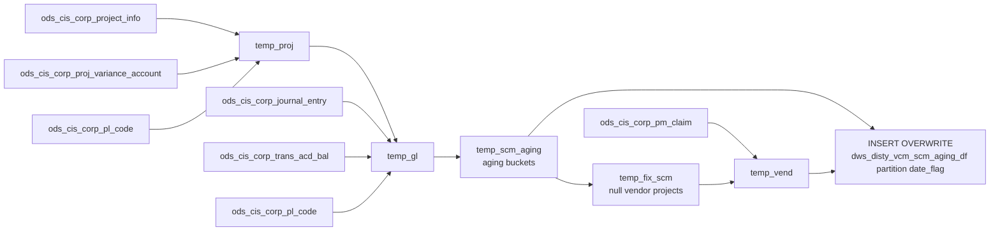

# DWS: VCM SCM Aging (`dws_disty_vcm_scm_aging_df`)

- artifact_type: etl_table
- artifact_id: ${target_db}.dws_disty_vcm_scm_aging_df
- domain: scm
- one_line_purpose: This job builds a daily SCM aging snapshot by project and vendor, grouping SCM GL balances into aging buckets (1-30 days through 451-540 days). It combines current-month journal activity with prior-month carry-forward balances, then writes ...
- layer_type: DWS
- source_kind: etl_sql
- evidence_source: source/etl/sql/scm/data_service/scm_aging/sql/load_vcm_scm_aging_df.sql

---

## L1 Data Foundation

### Identity and physical mapping
- **Table:** `${target_db}.dws_disty_vcm_scm_aging_df`
- **Layer type:** DWS
- **Canonical / derived:** Derived / ETL-loaded (see L3)
- **Owner team:** not registered in metadata catalog

### Grain, scope, exclusions
- **Grain:** one row per `(vend_no, proj_no, company_no, date_flag)`.
- **Scope:** See L2 business purpose / L3 filters
- **Partition:** `date_flag`. - resolved from pipeline (see L4)
- **Natural key:** Not documented in repository
- **Exclusions:** Not documented in repository

#### Grain detail (preserved)

- **Grain:** one row per `(vend_no, proj_no, company_no, date_flag)`.
- **Partition:** `date_flag`.
- **Natural business keys:** `proj_no`, `vend_no`, `company_no`, `date_flag`.
- **Deduplication:** none; aggregation is controlled by `GROUP BY`.

---

### Cross-engine presence
| Engine | Present | Canonical FQN | Notes |
|--------|---------|---------------|-------|
| Hive | yes | `${target_db}.dws_disty_vcm_scm_aging_df` | ETL target / intermediate per evidence script |
| Vertica | pending | `${target_db}.dws_disty_vcm_scm_aging_df` | Confirm via hive2vertica flow evidence / MCP |

### Physical schema reference

Pointer block only - full column catalog lives in WKB L1 storage JSON.

| Field | Value |
|-------|-------|
| **Authoritative catalog** | WKB L1 storage seed (not duplicated in this file) |
| **entity_id** | `${target_db}.dws_disty_vcm_scm_aging_df` |
| **l1_catalog_seed** | `target/storage/wkb/snapshots/_snapshot_id_template/l1_catalog/{engine}_{schema}_{table}.json` |
| **column_count** | pending (run ddl_seed_writer) |
| **partition_keys** | `date_flag` |
| **ddl_source** | pending Bitbucket DDL / Vertica metadata ingest |
| **retrieval** | `python -m tools.wkb.indexing.run_query --query "scm load_vcm_scm_aging_df schema" --intent find_table_schema` |

### Lineage
| Object | Role |
|--------|------|
| `${source_db}.ods_cis_corp_project_info` | SCM project eligibility source |
| `${source_db}.ods_cis_corp_proj_variance_account` | Project -> GL mapping source |
| `${source_db}.ods_cis_corp_pl_code` | SCM GL account filter source |
| `${source_db}.ods_cis_corp_journal_entry` | Current-month transaction source |
| `${source_db}.ods_cis_corp_trans_acd_bal` | Prior-month carry-forward source |
| `${source_db}.ods_cis_corp_pm_claim` | Vendor remediation source |
| `${target_db}.dws_disty_vcm_scm_aging_df` | Final target output |

---

### Freshness and load path
| Item | Value |
|------|-------|
| Load pattern | See L3 end-to-end / INSERT pattern in evidence script |
| Schedule | Not documented in repository |
| Parameters | See source script / flow parameters |


---

## L2 Declarative Knowledge

### Business purpose
This job builds a daily SCM aging snapshot by project and vendor, grouping SCM GL balances into aging buckets (1-30 days through 451-540 days). It combines current-month journal activity with prior-month carry-forward balances, then writes one partitioned DWS output used for SCM financial monitoring and downstream sync jobs.

---

### Audience and use cases
| Audience | How they benefit |
|----------|------------------|
| SCM finance analysts | Track unresolved SCM balances by aging range and project. |
| Vendor operations | See SCM aging exposure by vendor and project combination. |
| Data engineering / integration teams | Consume one curated DWS table for Vertica and StarRocks sync pipelines. |
| Governance / controls teams | Use bucketed aging + total to review long-outstanding SCM balances. |

---

### Fact key resolution
- Natural key: Not documented in repository
- FK / label-on attributes: see L3 dimension join patterns and step-by-step logic.
- Negative assertion: do not treat descriptive labels as grain keys unless listed under natural key.

### Time field semantics
- **date_flag / partition columns:** `date_flag`.
- Primary reporting filter should use the partition column(s) documented in L1; resolve values via L4.


### Metrics served

| Category | Column | Logical metric | Business reading |
|----------|--------|----------------|------------------|
| Measures | — | — | No measure columns mapped for this table. |

### Metric serving map

**Formula authority:** [`source/contracts/scm/metric-index.md`](../../source/contracts/scm/metric-index.md)

N/A — no measure columns mapped for this table.

### etl_metrics

No governed logical metrics from `source/contracts/scm/metric-index.md` are mapped on this table.

---

### Metric serving map
N/A - not a `*_comb_mtd` / multi-period wide serving table (or map not present in legacy doc).


### Data products and column groups (preserved)

### Identifiers

- `vend_no` - vendor number (project vendor or backfilled PM-claim vendor).
- `proj_no` - project number.
- `company_no` - company/legal entity number.
- `date_flag` - partition date, set to one day before runtime `date_flag`.

### Aging measures

- `age1_30`, `age31_60`, `age61_90`, `age91_120`, `age121_150`, `age151_180`, `age181_270`, `age271_360`, `age361_450`, `age451_540`.
- `total` - sum of all included GL amounts for the row.

---

### etl_metrics

N/A - no calculable ETL formulas extracted from this document (passthrough / stored measures only, or formulas not documented).

---

## L3 Procedural Knowledge

### Query and routing rules
**Business filters:** Use partition / date keys from L1 grain for reporting scope.
**Technical predicates (load only):** See Key filters and step-by-step logic below.

### Dimension join patterns
| Dimension FQN | Join keys | Purpose | Evidence |
|---------------|-----------|---------|----------|
| See step-by-step / base tables | See L3 steps | Dimension enrichment | `source/etl/sql/scm/data_service/scm_aging/sql/load_vcm_scm_aging_df.sql` |

### Key filters and ETL business logic
### Step 1 - `temp_proj`

- Joins `project_info` -> `proj_variance_account` -> `pl_code`.
- Filters to SCM GL mapping (`code_type='GLNO'`, `ccode='SCM'`), non-closed/non-deleted projects, excludes `proj_no = 1`.
- Keeps distinct `(vendor_no, proj_no, company_no)`.

### Step 2 - `temp_gl` (current-month journal entries)

- Joins `temp_proj` with `journal_entry` on `gl_project = proj_no`.
- Filters journal dates from `${first_date_month}` (inclusive) to `${date_flag}` (exclusive), and `entry_datetime < '${date_flag}'`.
- Aggregates `sum(gl_amt)` by transaction date/vendor/project/account/company.

### Step 3 - `temp_gl` carry-forward insert

- Inserts prior-month balances from `trans_acd_bal` joined to `pl_code`.
- Filters to `${last_month_year}`, `${last_month}`, and SCM GL mapping.
- Uses synthetic date `date_add('${date_flag}', -541)` so amounts are bucketed into `age451_540`.

### Step 4 - `temp_scm_aging`

- Re-joins `temp_gl` to `pl_code` and re-applies SCM GL filters.
- Builds aging buckets via `datediff('${date_flag}', je.gl_trans_date)` ranges.
- Computes `total = sum(gl_amt)` and emits `date_add('${date_flag}', -1)` as partition key.

### Step 5 - Null-vendor repair (`temp_fix_scm`, `temp_vend`)

- `temp_fix_scm`: projects where `vend_no IS NULL`.
- `temp_vend`: finds projects in PM claims where min and max vendor are equal (exactly one distinct vendor).

### Step 6 - Final write

- Left joins `temp_scm_aging a` to `temp_vend b` by project.
- Writes `nvl(a.vend_no, b....

### Standard time-filter SQL
```sql
-- relative period filter using resolved partition value (see L4)
SELECT *
FROM ${target_db}.dws_disty_vcm_scm_aging_df
WHERE /* partition predicate */ date_flag = '${partition_value}';
```

### End-to-end flow
**Target table:** `${target_db}.dws_disty_vcm_scm_aging_df` (partitioned by `date_flag`).

1. Build `temp_proj` from project, variance account, and PL code mappings for SCM GL accounts.
2. Build `temp_gl` from journal entries (current month window), grouped by date/vendor/project/account/company.
3. Insert prior-month account balances (`ods_cis_corp_trans_acd_bal`) into `temp_gl` with synthetic date `date_add('${date_flag}', -541)`.
4. Aggregate `temp_gl` into `temp_scm_aging` aging buckets using `datediff`.
5. Find null-vendor rows (`temp_fix_scm`) and compute single-vendor mappings from PM claims (`temp_vend`).
6. `INSERT OVERWRITE` target partition using `nvl(a.vend_no, b.minv)` as final vendor number.



---


#### High-level stages (preserved)

| Stage | Business meaning |
|-------|------------------|
| **Eligible project filter** | Keeps open, non-deleted SCM projects tied to GLNO/SCM mapping. |
| **Current-month GL aggregation** | Sums journal entries for each project/account from first day of month to run date (exclusive). |
| **Prior-month carry-forward** | Inserts prior-month account balances as a synthetic transaction date 541 days before run date so they land in oldest bucket. |
| **Aging bucket rollup** | Converts GL amounts into time buckets (1-30, 31-60, ... 451-540) and total. |
| **Vendor backfill** | For rows with null vendor, derives a single vendor from PM claims if project maps to exactly one vendor. |
| **Partition write** | Overwrites `dws_disty_vcm_scm_aging_df` partition by computed `date_flag` (run date - 1). |

**Runtime parameters:** `source_db`, `target_db`, `date_flag`, `first_date_month`, `last_month`, `last_month_year`.

---


### Base tables register
| Object | Role in this job |
|--------|------------------|
| `${source_db}.ods_cis_corp_project_info` | Project master for vendor/project/company and status checks. |
| `${source_db}.ods_cis_corp_proj_variance_account` | Maps project variance account numbers used to qualify SCM projects. |
| `${source_db}.ods_cis_corp_pl_code` | Restricts processing to `code_type='GLNO'` and `ccode='SCM'`. |
| `${source_db}.ods_cis_corp_journal_entry` | Current-month GL transactions used for aging. |
| `${source_db}.ods_cis_corp_trans_acd_bal` | Prior-month GL balances inserted as oldest-age carry-forward. |
| `${source_db}.ods_cis_corp_pm_claim` | Vendor backfill source for projects with null vendor in aging output. |
| `${target_db}.dws_disty_vcm_scm_aging_df` | Final partitioned DWS output table. |

---

### Step-by-step logic
### Step 1 - `temp_proj`

- Joins `project_info` -> `proj_variance_account` -> `pl_code`.
- Filters to SCM GL mapping (`code_type='GLNO'`, `ccode='SCM'`), non-closed/non-deleted projects, excludes `proj_no = 1`.
- Keeps distinct `(vendor_no, proj_no, company_no)`.

### Step 2 - `temp_gl` (current-month journal entries)

- Joins `temp_proj` with `journal_entry` on `gl_project = proj_no`.
- Filters journal dates from `${first_date_month}` (inclusive) to `${date_flag}` (exclusive), and `entry_datetime < '${date_flag}'`.
- Aggregates `sum(gl_amt)` by transaction date/vendor/project/account/company.

### Step 3 - `temp_gl` carry-forward insert

- Inserts prior-month balances from `trans_acd_bal` joined to `pl_code`.
- Filters to `${last_month_year}`, `${last_month}`, and SCM GL mapping.
- Uses synthetic date `date_add('${date_flag}', -541)` so amounts are bucketed into `age451_540`.

### Step 4 - `temp_scm_aging`

- Re-joins `temp_gl` to `pl_code` and re-applies SCM GL filters.
- Builds aging buckets via `datediff('${date_flag}', je.gl_trans_date)` ranges.
- Computes `total = sum(gl_amt)` and emits `date_add('${date_flag}', -1)` as partition key.

### Step 5 - Null-vendor repair (`temp_fix_scm`, `temp_vend`)

- `temp_fix_scm`: projects where `vend_no IS NULL`.
- `temp_vend`: finds projects in PM claims where min and max vendor are equal (exactly one distinct vendor).

### Step 6 - Final write

- Left joins `temp_scm_aging a` to `temp_vend b` by project.
- Writes `nvl(a.vend_no, b.minv)` as final vendor number.
- Overwrites `${target_db}.dws_disty_vcm_scm_aging_df` partitioned by `date_flag`.

---

### Relationship map (embedded)

| from_fqn | to_fqn | cardinality | join_keys | provenance |
|----------|--------|-------------|-----------|------------|
| `temp_proj` | `ods_xx.ods_cis_corp_proj_variance_account` | many:1 | `pi.var_no = pva.var_no` | etl_sql (source/etl/sql/scm/data_service/scm_aging/sql/load_vcm_scm_aging_df.sql:1) |
| `ods_xx.ods_cis_corp_proj_variance_account` | `ods_xx.ods_cis_corp_pl_code` | many:1 | `pva.gl_acct_no = pc.icode` | etl_sql (source/etl/sql/scm/data_service/scm_aging/sql/load_vcm_scm_aging_df.sql:1) |
| `temp_proj` | `ods_xx.ods_cis_corp_journal_entry` | many:1 | `je.gl_project = pi.proj_no` | etl_sql (source/etl/sql/scm/data_service/scm_aging/sql/load_vcm_scm_aging_df.sql:1) |
| `temp_proj` | `ods_xx.ods_cis_corp_trans_acd_bal` | many:1 | `je.gl_project = pi.proj_no` | etl_sql (source/etl/sql/scm/data_service/scm_aging/sql/load_vcm_scm_aging_df.sql:1) |
| `ods_xx.ods_cis_corp_trans_acd_bal` | `ods_xx.ods_cis_corp_pl_code` | many:1 | `je.gl_acct_no = pc.icode` | etl_sql (source/etl/sql/scm/data_service/scm_aging/sql/load_vcm_scm_aging_df.sql:1) |
| `temp_fix_scm` | `ods_xx.ods_cis_corp_pm_claim` | many:1 | `fs.proj_no = pc.project_no` | etl_sql (source/etl/sql/scm/data_service/scm_aging/sql/load_vcm_scm_aging_df.sql:1) |
| `temp_scm_aging` | `temp_vend` | many:1 | `a.proj_no = b.proj_no;` | etl_sql (source/etl/sql/scm/data_service/scm_aging/sql/load_vcm_scm_aging_df.sql:1) |

`source/ref/scm/table relationship.txt`: Not documented in repository.

### Special logic (embedded)

Not documented in repository

### Column / field derivations (from ETL SQL)

| target_column | expression_sql | upstream_columns | upstream_tables | transform_kind | evidence |
|---------------|----------------|------------------|-----------------|----------------|----------|
| `541` | `date_add('${date_flag}', -541)` | `date_add`, `date_flag` | `temp_proj`, `${source_db}.ods_cis_corp_trans_acd_bal`, `${source_db}.ods_cis_corp_pl_code`, `temp_gl`, `temp_scm_aging`, `temp_fix_scm`, `${source_db}.ods_cis_corp_pm_claim`, `temp_vend` | arithmetic | `source/etl/sql/scm/data_service/scm_aging/sql/load_vcm_scm_aging_df.sql:38` |
| `vendor_no` | `pi.vendor_no` | `vendor_no` | `temp_proj`, `${source_db}.ods_cis_corp_trans_acd_bal`, `${source_db}.ods_cis_corp_pl_code`, `temp_gl`, `temp_scm_aging`, `temp_fix_scm`, `${source_db}.ods_cis_corp_pm_claim`, `temp_vend` | passthrough | `source/etl/sql/scm/data_service/scm_aging/sql/load_vcm_scm_aging_df.sql:2` |
| `proj_no` | `pi.proj_no` | `proj_no` | `temp_proj`, `${source_db}.ods_cis_corp_trans_acd_bal`, `${source_db}.ods_cis_corp_pl_code`, `temp_gl`, `temp_scm_aging`, `temp_fix_scm`, `${source_db}.ods_cis_corp_pm_claim`, `temp_vend` | passthrough | `source/etl/sql/scm/data_service/scm_aging/sql/load_vcm_scm_aging_df.sql:3` |
| `gl_acct_no` | `je.gl_acct_no` | `gl_acct_no` | `temp_proj`, `${source_db}.ods_cis_corp_trans_acd_bal`, `${source_db}.ods_cis_corp_pl_code`, `temp_gl`, `temp_scm_aging`, `temp_fix_scm`, `${source_db}.ods_cis_corp_pm_claim`, `temp_vend` | passthrough | `source/etl/sql/scm/data_service/scm_aging/sql/load_vcm_scm_aging_df.sql:21` |
| `company_no` | `pi.company_no` | `company_no` | `temp_proj`, `${source_db}.ods_cis_corp_trans_acd_bal`, `${source_db}.ods_cis_corp_pl_code`, `temp_gl`, `temp_scm_aging`, `temp_fix_scm`, `${source_db}.ods_cis_corp_pm_claim`, `temp_vend` | passthrough | `source/etl/sql/scm/data_service/scm_aging/sql/load_vcm_scm_aging_df.sql:4` |
| `gl_amt` | `sum(gl_amt)` | `gl_amt` | `temp_proj`, `${source_db}.ods_cis_corp_trans_acd_bal`, `${source_db}.ods_cis_corp_pl_code`, `temp_gl`, `temp_scm_aging`, `temp_fix_scm`, `${source_db}.ods_cis_corp_pm_claim`, `temp_vend` | agg | `source/etl/sql/scm/data_service/scm_aging/sql/load_vcm_scm_aging_df.sql:23` |

### Sentinel and code values
| Value | Meaning |
|-------|---------|
| `code_type = 'GLNO'` and `ccode = 'SCM'` | Restricts all accounting logic to SCM GL account mapping. |
| `proj_no != 1` | Excludes special/system project 1 from processing. |
| `nvl(pi.close_date, '${date_flag}') >= '${date_flag}'` | Keeps open projects as of run date. |
| `date_add('${date_flag}', -541)` | Synthetic date used for prior-month carry-forward to force oldest aging bucket. |
| `date_add('${date_flag}', -1)` | Final output partition date (`date_flag`). |
| `having min(vend_no)=max(vend_no)` | Only backfills vendor when project has exactly one claim vendor. |

---

---

## L4 Validation

### Resolved partition value
| Step | Source | How partition / date scope is determined |
|------|--------|------------------------------------------|
| 1 | evidence script / flow | See parameters in L1 Freshness and L3 filters - `source/etl/sql/scm/data_service/scm_aging/sql/load_vcm_scm_aging_df.sql` |

**Plain language:** Partition and date scope follow Azkaban/bootstrap parameters documented in the source script and orchestrating flow; do not hardcode calendar literals.

### Data quality checks
- Prefer row-count-by-partition, metric sums, and grain duplicate checks (see Validation SQL).
- Additional checks from legacy caveats / operational notes when present.

### Validation SQL
```sql
-- 1) Row count by partition
SELECT ${partition_col}, COUNT(*) AS row_cnt
FROM dw_us.dws_disty_vcm_scm_aging_df
WHERE ${partition_col} = '${partition_value}'
GROUP BY ${partition_col};

-- 2) Metric sum by business dimension (top deltas)
SELECT ${dim_key}, SUM(${metric}) AS metric_sum
FROM dw_us.dws_disty_vcm_scm_aging_df
WHERE ${partition_col} = '${partition_value}'
GROUP BY ${dim_key}
ORDER BY ABS(SUM(${metric})) DESC
LIMIT 20;

-- 3) Grain duplicate check
SELECT ${grain_key_1}, ${grain_key_2}, ${grain_key_3}, ${partition_col}, COUNT(*) AS cnt
FROM dw_us.dws_disty_vcm_scm_aging_df
WHERE ${partition_col} = '${partition_value}'
GROUP BY ${grain_key_1}, ${grain_key_2}, ${grain_key_3}, ${partition_col}
HAVING COUNT(*) > 1;
```

Replace placeholders from this file's Grain and keys / Data you can fetch sections, and use the resolved partition value from run scope.

### Caveats for interpretation
- Prior-month carry-forward is injected at a fixed synthetic age (541 days offset), so it always contributes to the oldest bucket rather than original transaction aging.
- Vendor backfill only occurs when PM claims show exactly one vendor for a project; multi-vendor projects remain null vendor if source vendor is null.
- The SQL only defines transformation logic; schedule, ownership, and SLA are not declared in this script.

---

### Conflicts and open questions
- Schedule, owner, SLA: Not documented in repository (unless preserved schedule evidence above).
- Vertica MCP verification: pending unless confirmed in L5.


---

## L5 Runtime View

### Query path and engine preference
| Role | Hive object | Vertica object | Sync mode | Evidence | MCP verified |
|------|-------------|----------------|-----------|----------|--------------|
| **Query for reporting** | *See script lineage* | `dw_us.dws_disty_vcm_scm_aging_df` | overwrite | `scm_dw/scm_data_load/ods_data_load_us_06.flow` | yes |
| **Hive alternative** | `*` | `dw_us.dws_disty_vcm_scm_aging_df` | - | *See dependencies* | - |
| **ETL internal** | staging/temp tables | *Not synced to Vertica* | - | *See step-by-step logic* | - |

Business users should query `dw_us.dws_disty_vcm_scm_aging_df` in Vertica once MCP verification is completed for this document.

### Access constraints
- Country / company schema parameters may apply (`literal_country`, `company_no`, etc.).
- Hive-only staging objects are not reporting surfaces unless synced.

### Query risk profile
| Field | Value |
|-------|-------|
| requires_date_predicate | yes |
| scan_risk_tier | high |

---

## L6 Access and Consumption

### Primary consumers and use cases
| Audience | How they benefit |
|----------|------------------|
| SCM finance analysts | Track unresolved SCM balances by aging range and project. |
| Vendor operations | See SCM aging exposure by vendor and project combination. |
| Data engineering / integration teams | Consume one curated DWS table for Vertica and StarRocks sync pipelines. |
| Governance / controls teams | Use bucketed aging + total to review long-outstanding SCM balances. |

---

### Representative query patterns
```sql
-- certified / illustrative lookup - replace predicates from L1/L4
SELECT *
FROM ${target_db}.dws_disty_vcm_scm_aging_df
WHERE date_flag = '${partition_value}'
LIMIT 100;
```

### Dependencies and notes
### Upstream objects (verified)

| Object | Usage | Evidence |
|--------|-------|----------|
| `${source_db}.ods_cis_corp_project_info` | Project-level source for `vendor_no`, `proj_no`, `company_no` and close/delete filters | `source/etl/sql/scm/data_service/scm_aging/sql/load_vcm_scm_aging_df.sql:2-13` |
| `${source_db}.ods_cis_corp_proj_variance_account` | Project variance account join used to map project to GL account | `source/etl/sql/scm/data_service/scm_aging/sql/load_vcm_scm_aging_df.sql:6-7` |
| `${source_db}.ods_cis_corp_pl_code` | SCM GL account qualification (`GLNO`/`SCM`) in project and aging logic | `source/etl/sql/scm/data_service/scm_aging/sql/load_vcm_scm_aging_df.sql:7-10`, `source/etl/sql/scm/data_service/scm_aging/sql/load_vcm_scm_aging_df.sql:117-119` |
| `${source_db}.ods_cis_corp_journal_entry` | Current-month GL transaction source for `temp_gl` | `source/etl/sql/scm/data_service/scm_aging/sql/load_vcm_scm_aging_df.sql:25-34` |
| `${source_db}.ods_cis_corp_trans_acd_bal` | Prior-month balance source inserted into `temp_gl` | `source/etl/sql/scm/data_service/scm_aging/sql/load_vcm_scm_aging_df.sql:45-56` |
| `${source_db}.ods_cis_corp_pm_claim` | Vendor remediation lookup for null-vendor projects | `source/etl/sql/scm/data_service/scm_aging/sql/load_vcm_scm_aging_df.sql:137-140` |

### Downstream consumers (verified)

| Object / script | Evidence |
|-----------------|----------|
| `source/etl/flows/data_service/scm_aging/scm_aging_load_us.flow` sync step reads `${target_db}.dws_disty_vcm_scm_aging_df` for yesterday partition | `source/etl/flows/data_service/scm_aging/scm_aging_load_us.flow:83-90` |
| `source/etl/flows/data_service/scm_aging/scm_aging_load_ca.flow` sync step reads `${target_db}.dws_disty_vcm_scm_aging_df` for yesterday partition | `source/etl/flows/data_service/scm_aging/scm_aging_load_ca.flow:82-89` |
| `source/etl/flows/data_service/scm_aging/scm_aging_load_br.flow` sync step reads `${target_db}.dws_disty_vcm_scm_aging_df` for yesterday partition | `source/etl/flows/data_service/scm_aging/scm_aging_load_br.flow:82-89` |
| `source/etl/flows/data_service/scm_aging/scm_aging_load_wcla.flow` sync step reads `${target_db}.dws_disty_vcm_scm_aging_df` for yesterday partition | `source/etl/flows/data_service/scm_aging/scm_aging_load_wcla.flow:83-90` |
| `source/etl/flows/public_order_tools/ingest/ods_etl/ods_data_load_us_06.flow` waits for `scm_aging_load_us.load_vcm_scm_aging_df` and runs `dw_us.dws_disty_vcm_scm_aging_df.sql` StarRocks sync script | `source/etl/flows/public_order_tools/ingest/ods_etl/ods_data_load_us_06.flow:524-558` |

### Operational detail (verified)

- Script is invoked by multiple country flows via `script.file.path: ./disty_common/scm_aging/sql/load_vcm_scm_aging_df.sql` with parameters (`date_flag`, `first_date_month`, `last_month`, `last_month_year`) - `source/etl/flows/data_service/scm_aging/scm_aging_load_us.flow:72-79`, `source/etl/flows/data_service/scm_aging/scm_aging_load_ca.flow:71-78`, `source/etl/flows/data_service/scm_aging/scm_aging_load_br.flow:71-78`, `source/etl/flows/data_service/scm_aging/scm_aging_load_wcla.flow:71-78`.
- Target load mode is partition overwrite: `INSERT OVERWRITE TABLE ${target_db}.dws_disty_vcm_scm_aging_df PARTITION (date_flag)` - `source/etl/sql/scm/data_service/scm_aging/sql/load_vcm_scm_aging_df.sql:143`.

### Not documented in repository

- Schedule/cron cadence for each flow run.
- Job owner and SLA/latency commitments.
- The referenced initialization SQL file `./disty_common/scm_aging/sql/data_initialization/dws_disty_vcm_scm_aging_df.sql` is referenced by flow but not found in this repository snapshot.

### Related scripts (verified)

- `source/etl/flows/data_service/scm_aging/scm_aging_load_us.flow` - Executes this SQL and syncs output - `source/etl/flows/data_service/scm_aging/scm_aging_load_us.flow:79-90`.
- `source/etl/flows/data_service/scm_aging/scm_aging_data_initialization_us.flow` - Contains initialization node for same target table and a sync query by date range - `source/etl/flows/data_service/scm_aging/scm_aging_data_initialization_us.flow:14-30`.

---

*Document generated from `source/etl/sql/scm/data_service/scm_aging/sql/load_vcm_scm_aging_df.sql`.*

#### Not documented in repository
- Owner, SLA (unless schedule evidence preserved above)
- Any dependency without `file:line` evidence in this document

---

*Document migrated to L1-L6 from legacy Knowledgebase content. Evidence: `source/etl/sql/scm/data_service/scm_aging/sql/load_vcm_scm_aging_df.sql`.*
