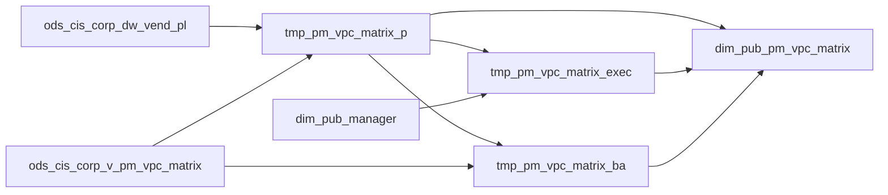

# DIM: PM–VPC assignment matrix by vendor and VPL (`dim_pub_pm_vpc_matrix`)

- artifact_type: etl_table
- artifact_id: dim_us.dim_pub_pm_vpc_matrix
- domain: vendor
- one_line_purpose: This job materializes the product-manager VPC matrix used to relate vendors and VPLs to PM user IDs by role and primary/backup flag. It expands vendor-level assignments (`vpl_no = -1`) onto each VPL, adds executive (manager) rows derived fr...
- layer_type: DIM
- source_kind: etl_sql
- evidence_source: source/etl/sql/vendor/source/etl/flows/public_order_tools/ingest/public_vpl_dimension/script/dim_pub_pm_vpc_matrix.sql

---

## L1 Data Foundation

### Identity and physical mapping
- **Table:** `dim_us.dim_pub_pm_vpc_matrix`
- **Layer type:** DIM
- **Canonical / derived:** Derived / ETL-loaded (see L3)
- **Owner team:** not registered in metadata catalog

### Grain, scope, exclusions
- **Grain:** one row per combination of `vend_no`, `vpl_no`, `pm_role`, `primary_flag`, and PM assignment (union of three branches may yield multiple rows per VPL).
- **Scope:** See L2 business purpose / L3 filters
- **Partition:** none. - resolved from pipeline (see L4)
- **Natural key:** `vend_no`, `vpl_no`, `pm_id`, `pm_role`, `primary_flag` (within a load; not explicitly deduplicated across branches beyond branch logic).
- **Exclusions:** Not documented in repository

#### Grain detail (preserved)

- **Grain:** one row per combination of `vend_no`, `vpl_no`, `pm_role`, `primary_flag`, and PM assignment (union of three branches may yield multiple rows per VPL).
- **Partition:** none.
- **Natural key:** `vend_no`, `vpl_no`, `pm_id`, `pm_role`, `primary_flag` (within a load; not explicitly deduplicated across branches beyond branch logic).

---

### Cross-engine presence
| Engine | Present | Canonical FQN | Notes |
|--------|---------|---------------|-------|
| Hive | yes | `dim_pub_pm_vpc_matrix` | ETL target / intermediate per evidence script |
| Vertica | pending | `dim_pub_pm_vpc_matrix` | Confirm via hive2vertica flow evidence / MCP |

### Physical schema reference

Pointer block only - full column catalog lives in WKB L1 storage JSON.

| Field | Value |
|-------|-------|
| **Authoritative catalog** | WKB L1 storage seed (not duplicated in this file) |
| **entity_id** | `dim_us.dim_pub_pm_vpc_matrix` |
| **l1_catalog_seed** | `target/storage/wkb/snapshots/_snapshot_id_template/l1_catalog/{engine}_{schema}_{table}.json` |
| **column_count** | pending (run ddl_seed_writer) |
| **partition_keys** | `none.` |
| **ddl_source** | pending Bitbucket DDL / Vertica metadata ingest |
| **retrieval** | `python -m tools.wkb.indexing.run_query --query "vendor dim_pub_pm_vpc_matrix schema" --intent find_table_schema` |

### Lineage
See L6 Dependencies and notes.

### Freshness and load path
| Item | Value |
|------|-------|
| Load pattern | See L3 end-to-end / INSERT pattern in evidence script |
| Schedule | Not documented in repository |
| Parameters | `country_code` |


---

## L2 Declarative Knowledge

### Business purpose
This job materializes the product-manager VPC matrix used to relate vendors and VPLs to PM user IDs by role and primary/backup flag. It expands vendor-level assignments (`vpl_no = -1`) onto each VPL, adds executive (manager) rows derived from VP assignments, and includes alternate/backup matrix rows. Downstream systems use it for PM routing, accountability matrices, and joins where `dim_pub_vpl_hierarchy_info` PM rollups are not sufficient.

---

### Audience and use cases
| Audience | How they benefit |
|----------|-----------------|
| **PM operations** | Role-level PM user IDs with primary vs backup flags. |
| **Hierarchy ETL** | Source for PM pivots in `dim_pub_vpl_hierarchy_info` (`tmp_pm_hierarchy`). |
| **Vertica consumers** | Synced via `hive2vertica_dim_pub_pm_vpc_matrix` in country flows. |

---

### Identifier search profile
- Primary lookup keys: see natural key under L1 Grain.
- Use latest snapshot / active flags when documented in L3 filters.

### Time field semantics
- **date_flag / partition columns:** none.
- Primary reporting filter should use the partition column(s) documented in L1; resolve values via L4.


### Metrics served

| Category | Column | Logical metric | Business reading |
|----------|--------|----------------|------------------|
| Measures | — | — | No measure columns mapped for this table. |

### Metric serving map

**Formula authority:** [`source/contracts/vendor/metric-index.md`](../../source/contracts/vendor/metric-index.md)

N/A — no measure columns mapped for this table.

### etl_metrics

No governed logical metrics from `source/contracts/vendor/metric-index.md` are mapped on this table.

---

### Metric serving map
N/A - not a `*_comb_mtd` / multi-period wide serving table (or map not present in legacy doc).


### Data products and column groups (preserved)

- `vend_no`, `vpl_no`
- `pm_id`, `pm_role`, `primary_flag` (`P`, `B`, `A`, and `EXEC` for executive rows)
- `is_primary`, `is_backup` (normalized to `'Y'/'N'` on P and EXEC branches; from source on BA branch)
- `etl_timestamp`

---

### etl_metrics

N/A - no calculable ETL formulas extracted from this document (passthrough / stored measures only, or formulas not documented).

---

## L3 Procedural Knowledge

### Query and routing rules
**Business filters:** Use partition / date keys from L1 grain for reporting scope.
**Technical predicates (load only):** See Key filters and step-by-step logic below.

### Dimension join patterns
| Dimension FQN | Join keys | Purpose | Evidence |
|---------------|-----------|---------|----------|
| See step-by-step / base tables | See L3 steps | Dimension enrichment | `source/etl/sql/vendor/source/etl/flows/public_order_tools/ingest/public_vpl_dimension/script/dim_pub_pm_vpc_matrix.sql` |

### Key filters and ETL business logic
### Step 1 — `tmp_pm_vpc_matrix_p`

**Logic:** For each row in `dw_vend_pl`, left join VPL-level matrix (`vpl_no <> -1`, primary Y, backup N) and vendor-level matrix (`vpl_no = -1`, same flags, `vpl_pm.pm_role = vend_pm.pm_role`).  
**Output:** `vend_no`, `vpl_no`, `nvl(pm_id,-3)`, `nvl(pm_role,'PM')`, `primary_flag = 'P'`  
**Filter:** `pm_id is not null`

### Step 2 — `tmp_pm_vpc_matrix_exec`

**From:** `tmp_pm_vpc_matrix_p` where `pm_role = 'VP'` and `primary_flag = 'P'`  
**Join:** `dim_pub_manager` on `t.pm_id = m.userid`  
**Output:** `pm_id = case when t.pm_id = -3 then -3 else m.managerid end`, `pm_role = 'EXEC'`, `primary_flag = 'P'`

### Step 3 — `tmp_pm_vpc_matrix_ba`

**From:** distinct `(vend_no, vpl_no)` in `tmp_pm_vpc_matrix_p` joined to matrix where `not (is_primary='Y' and is_backup='N')` and `vpl_no <> -1`  
**primary_flag:** `'A'` if `is_primary='N'`; `'B'` if `is_backup='Y'`; else `'P'`

### Step 4 — Final `INSERT`

**Union** of P, EXEC, and BA branches; P and EXEC rows set `is_primary='Y'`, `is_backup='N'`; BA passes through source flags.

---

### Standard time-filter SQL
```sql
-- relative period filter using resolved partition value (see L4)
SELECT *
FROM dim_pub_pm_vpc_matrix
WHERE /* partition predicate */ date_flag = '${partition_value}';
```

### End-to-end flow
**Target:** `dim_${country_code}.dim_pub_pm_vpc_matrix`

1. `tmp_pm_vpc_matrix_p` — primary assignments per VPL with vendor-level fallback matched on `pm_role`.
2. `tmp_pm_vpc_matrix_exec` — VP primary rows → executive `managerid`.
3. `tmp_pm_vpc_matrix_ba` — non-(primary Y, backup N) matrix rows for vend/vpl pairs seen in step 1.
4. Union all three into target with timestamps.



---


#### High-level stages (preserved)

| Stage | Business meaning |
|-------|-----------------|
| **Primary (P) rows** | For each VPL, resolve PM id/role from VPL-level or vendor-level matrix where `is_primary='Y'` and `is_backup='N'`. |
| **Executive (EXEC) rows** | For VP primary rows, map PM id to manager `managerid` from `dim_pub_manager` (or `-3` preserved). |
| **Backup/alternate (B/A) rows** | Other matrix rows per vend/vpl not in the strict primary+non-backup set. |
| **Union load** | Overwrites target with all three sets plus `etl_timestamp`. |

**Parameters:** `country_code`

---


### Base tables register
| Object | Role |
|--------|------|
| `ods_${country_code}.ods_cis_corp_dw_vend_pl` | VPL enumeration for expansion |
| `ods_${country_code}.ods_cis_corp_v_pm_vpc_matrix` | PM assignments |
| `dim_${country_code}.dim_pub_manager` | VP → executive `managerid` |

**Temporary views:** `tmp_pm_vpc_matrix_p` → (`tmp_pm_vpc_matrix_exec`, `tmp_pm_vpc_matrix_ba`) → UNION INSERT

---

### Step-by-step logic
### Step 1 — `tmp_pm_vpc_matrix_p`

**Logic:** For each row in `dw_vend_pl`, left join VPL-level matrix (`vpl_no <> -1`, primary Y, backup N) and vendor-level matrix (`vpl_no = -1`, same flags, `vpl_pm.pm_role = vend_pm.pm_role`).  
**Output:** `vend_no`, `vpl_no`, `nvl(pm_id,-3)`, `nvl(pm_role,'PM')`, `primary_flag = 'P'`  
**Filter:** `pm_id is not null`

### Step 2 — `tmp_pm_vpc_matrix_exec`

**From:** `tmp_pm_vpc_matrix_p` where `pm_role = 'VP'` and `primary_flag = 'P'`  
**Join:** `dim_pub_manager` on `t.pm_id = m.userid`  
**Output:** `pm_id = case when t.pm_id = -3 then -3 else m.managerid end`, `pm_role = 'EXEC'`, `primary_flag = 'P'`

### Step 3 — `tmp_pm_vpc_matrix_ba`

**From:** distinct `(vend_no, vpl_no)` in `tmp_pm_vpc_matrix_p` joined to matrix where `not (is_primary='Y' and is_backup='N')` and `vpl_no <> -1`  
**primary_flag:** `'A'` if `is_primary='N'`; `'B'` if `is_backup='Y'`; else `'P'`

### Step 4 — Final `INSERT`

**Union** of P, EXEC, and BA branches; P and EXEC rows set `is_primary='Y'`, `is_backup='N'`; BA passes through source flags.

---

### Relationship map (embedded)

| from_fqn | to_fqn | cardinality | join_keys | provenance |
|----------|--------|-------------|-----------|------------|
| `ods_${country_code}.ods_cis_corp_dw_vend_pl` | `ods_${country_code}.ods_cis_corp_v_pm_vpc_matrix` | many:1 | `vpl.vend_no = vpl_pm.vend_no and vpl.vpl_no = vpl_pm.vpl_no and vpl_pm.vpl_no <> -1 and vpl_pm.is_primary='Y' and vpl_pm.is_backup='N'` | etl_sql (source/etl/sql/vendor/public_order_scripts/public_vpl_dimension/script/dim_pub_pm_vpc_matrix.sql:1) |
| `ods_${country_code}.ods_cis_corp_dw_vend_pl` | `ods_${country_code}.ods_cis_corp_v_pm_vpc_matrix` | many:1 | `vpl.vend_no = vend_pm.vend_no and vend_pm.vpl_no = -1 and vend_pm.is_primary='Y' and vend_pm.is_backup='N' and vpl_pm.pm_role = vend_pm.pm_role ) t` | etl_sql (source/etl/sql/vendor/public_order_scripts/public_vpl_dimension/script/dim_pub_pm_vpc_matrix.sql:1) |
| `dw_vend_pl` | `ods_${country_code}.ods_cis_corp_manager` | many:1 | `Not documented in repository` | etl_sql (source/etl/sql/vendor/public_order_scripts/public_vpl_dimension/script/dim_pub_pm_vpc_matrix.sql:1) |
| `tmp_pm_vpc_matrix_p)` | `dim_${country_code}.dim_pub_manager` | many:1 | `t.pm_id = m.userid` | etl_sql (source/etl/sql/vendor/public_order_scripts/public_vpl_dimension/script/dim_pub_pm_vpc_matrix.sql:1) |
| `tmp_pm_vpc_matrix_p)` | `ods_${country_code}.ods_cis_corp_v_pm_vpc_matrix` | many:1 | `t.vend_no = vpl_pm.vend_no and t.vpl_no = vpl_pm.vpl_no and vpl_pm.vpl_no <> -1 and not (vpl_pm.is_primary='Y' and vpl_pm.is_backup='N') ; ---9.` | etl_sql (source/etl/sql/vendor/public_order_scripts/public_vpl_dimension/script/dim_pub_pm_vpc_matrix.sql:1) |

`source/ref/vendor/table relationship.txt`: Not documented in repository.

### Special logic (embedded)

Not documented in repository

### Column / field derivations (from ETL SQL)

| target_column | expression_sql | upstream_columns | upstream_tables | transform_kind | evidence |
|---------------|----------------|------------------|-----------------|----------------|----------|
| `vend_no` | `vend_no` | `vend_no` | `tmp_pm_vpc_matrix_p`, `tmp_pm_vpc_matrix_exec`, `tmp_pm_vpc_matrix_ba` | passthrough | `source/etl/sql/vendor/public_order_scripts/public_vpl_dimension/script/dim_pub_pm_vpc_matrix.sql:9` |
| `vpl_no` | `vpl_no` | `vpl_no` | `tmp_pm_vpc_matrix_p`, `tmp_pm_vpc_matrix_exec`, `tmp_pm_vpc_matrix_ba` | passthrough | `source/etl/sql/vendor/public_order_scripts/public_vpl_dimension/script/dim_pub_pm_vpc_matrix.sql:4` |
| `pm_id` | `pm_id` | `pm_id` | `tmp_pm_vpc_matrix_p`, `tmp_pm_vpc_matrix_exec`, `tmp_pm_vpc_matrix_ba` | passthrough | `source/etl/sql/vendor/public_order_scripts/public_vpl_dimension/script/dim_pub_pm_vpc_matrix.sql:9` |
| `pm_role` | `pm_role` | `pm_role` | `tmp_pm_vpc_matrix_p`, `tmp_pm_vpc_matrix_exec`, `tmp_pm_vpc_matrix_ba` | passthrough | `source/etl/sql/vendor/public_order_scripts/public_vpl_dimension/script/dim_pub_pm_vpc_matrix.sql:9` |
| `primary_flag` | `primary_flag` | `primary_flag` | `tmp_pm_vpc_matrix_p`, `tmp_pm_vpc_matrix_exec`, `tmp_pm_vpc_matrix_ba` | passthrough | `source/etl/sql/vendor/public_order_scripts/public_vpl_dimension/script/dim_pub_pm_vpc_matrix.sql:2` |
| `is_primary` | `'Y'` | `Y` | `tmp_pm_vpc_matrix_p`, `tmp_pm_vpc_matrix_exec`, `tmp_pm_vpc_matrix_ba` | literal | `source/etl/sql/vendor/public_order_scripts/public_vpl_dimension/script/dim_pub_pm_vpc_matrix.sql:4` |
| `is_backup` | `'N'` | `N` | `tmp_pm_vpc_matrix_p`, `tmp_pm_vpc_matrix_exec`, `tmp_pm_vpc_matrix_ba` | literal | `source/etl/sql/vendor/public_order_scripts/public_vpl_dimension/script/dim_pub_pm_vpc_matrix.sql:4` |
| `etl_timestamp` | `from_utc_timestamp(current_timestamp(),'America/Los_Angeles')` | `from_utc_timestamp`, `current_timestamp`, `America`, `Los_Angeles` | `tmp_pm_vpc_matrix_p`, `tmp_pm_vpc_matrix_exec`, `tmp_pm_vpc_matrix_ba` | arithmetic | `source/etl/sql/vendor/public_order_scripts/public_vpl_dimension/script/dim_pub_pm_vpc_matrix.sql:69` |

### Sentinel and code values
| Value | Meaning |
|-------|---------|
| `pm_id = -3` | Sentinel preserved through EXEC mapping when VP pm_id is -3 |
| `vpl_no = -1` | Vendor-level matrix template expanded per VPL |
| `primary_flag = 'P'/'B'/'A'` | Primary, backup, alternate assignment classification |
| `pm_role = 'EXEC'` | Executive row derived from VP primary via manager table |
| `is_primary='Y'`, `is_backup='N'` | Primary non-backup matrix filter |

---

---

## L4 Validation

### Resolved partition value
| Step | Source | How partition / date scope is determined |
|------|--------|------------------------------------------|
| 1 | evidence script / flow | See parameters in L1 Freshness and L3 filters - `source/etl/sql/vendor/source/etl/flows/public_order_tools/ingest/public_vpl_dimension/script/dim_pub_pm_vpc_matrix.sql` |

**Plain language:** Partition and date scope follow Azkaban/bootstrap parameters documented in the source script and orchestrating flow; do not hardcode calendar literals.

### Data quality checks
- Prefer row-count-by-partition, metric sums, and grain duplicate checks (see Validation SQL).
- Additional checks from legacy caveats / operational notes when present.

### Validation SQL
```sql
-- 1) Row count by partition
SELECT ${partition_col}, COUNT(*) AS row_cnt
FROM dim_${country_code}.dim_pub_pm_vpc_matrix
WHERE ${partition_col} = '${partition_value}'
GROUP BY ${partition_col};

-- 2) Metric sum by business dimension (top deltas)
SELECT ${dim_key}, SUM(${metric}) AS metric_sum
FROM dim_${country_code}.dim_pub_pm_vpc_matrix
WHERE ${partition_col} = '${partition_value}'
GROUP BY ${dim_key}
ORDER BY ABS(SUM(${metric})) DESC
LIMIT 20;

-- 3) Grain duplicate check
SELECT ${grain_key_1}, ${grain_key_2}, ${grain_key_3}, ${partition_col}, COUNT(*) AS cnt
FROM dim_${country_code}.dim_pub_pm_vpc_matrix
WHERE ${partition_col} = '${partition_value}'
GROUP BY ${grain_key_1}, ${grain_key_2}, ${grain_key_3}, ${partition_col}
HAVING COUNT(*) > 1;
```

Replace placeholders from this file's Grain and keys / Data you can fetch sections, and use the resolved partition value from run scope.

### Caveats for interpretation
- Vendor-level fallback requires matching `pm_role` between VPL and vendor matrix rows.
- EXEC rows exist only for VP primary (`P`) assignments.
- BA branch only joins matrix at explicit VPL level (`vpl_no <> -1`), not vendor-level -1 rows.

---

### Conflicts and open questions
- Schedule, owner, SLA: Not documented in repository (unless preserved schedule evidence above).
- Vertica MCP verification: pending unless confirmed in L5.


---

## L5 Runtime View

### Query path and engine preference
| Role | Hive object | Vertica object | Sync mode | Evidence | MCP verified |
|------|-------------|----------------|-----------|----------|--------------|
| **Query for reporting** | *See script lineage* | `dim_${country_code}.dim_pub_pm_vpc_matrix` | *Verify from flow* | *Add flow file:line* | pending |
| **Hive alternative** | `*` | `dim_${country_code}.dim_pub_pm_vpc_matrix` | - | *See dependencies* | - |
| **ETL internal** | staging/temp tables | *Not synced to Vertica* | - | *See step-by-step logic* | - |

Business users should query `dim_${country_code}.dim_pub_pm_vpc_matrix` in Vertica once MCP verification is completed for this document.

### Access constraints
- Country / company schema parameters may apply (`literal_country`, `company_no`, etc.).
- Hive-only staging objects are not reporting surfaces unless synced.

### Query risk profile
| Field | Value |
|-------|-------|
| requires_date_predicate | unknown |
| scan_risk_tier | medium |

---

## L6 Access and Consumption

### Primary consumers and use cases
| Audience | How they benefit |
|----------|-----------------|
| **PM operations** | Role-level PM user IDs with primary vs backup flags. |
| **Hierarchy ETL** | Source for PM pivots in `dim_pub_vpl_hierarchy_info` (`tmp_pm_hierarchy`). |
| **Vertica consumers** | Synced via `hive2vertica_dim_pub_pm_vpc_matrix` in country flows. |

---

### Representative query patterns
```sql
-- certified / illustrative lookup - replace predicates from L1/L4
SELECT *
FROM dim_pub_pm_vpc_matrix
WHERE date_flag = '${partition_value}'
LIMIT 100;
```

### Dependencies and notes
### Upstream objects (verified)

| Object | Usage | Evidence |
|--------|-------|----------|
| `ods_${country_code}.ods_cis_corp_dw_vend_pl` | VPL driver | `dim_pub_pm_vpc_matrix.sql:16` |
| `ods_${country_code}.ods_cis_corp_v_pm_vpc_matrix` | PM matrix | `dim_pub_pm_vpc_matrix.sql:18-24`, `58-60` |
| `dim_${country_code}.dim_pub_manager` | EXEC managerid | `dim_pub_pm_vpc_matrix.sql:41-42` |

### Downstream consumers (verified)

| Object / script | Evidence |
|-----------------|----------|
| `dim_pub_vpl_hierarchy_info.sql` | Reads `ods_cis_corp_v_pm_vpc_matrix` for PM hierarchy | `dim_pub_vpl_hierarchy_info.sql:170-171` |
| `hive2vertica_dim_pub_pm_vpc_matrix` | Vertica sync | `public_vpl_dimension_us.flow:136-143` |

### Operational detail (verified)

- CDC dependency on `ods_cis_corp_v_pm_vpc_matrix` in US flow (`public_vpl_dimension_us.flow:29-32`)
- `insert overwrite` + union (`dim_pub_pm_vpc_matrix.sql:65-82`)

### Not documented in repository

- Business meaning of `pm_role` values beyond those referenced in SQL

### Related scripts (verified)

- `dim_pub_vpl_hierarchy_info.sql` — related PM consumption path

---

*Document generated from `source/etl/sql/vendor/source/etl/flows/public_order_tools/ingest/public_vpl_dimension/script/dim_pub_pm_vpc_matrix.sql`.*

#### Not documented in repository
- Owner, SLA (unless schedule evidence preserved above)
- Any dependency without `file:line` evidence in this document

---

*Document migrated to L1-L6 from legacy Knowledgebase content. Evidence: `source/etl/sql/vendor/source/etl/flows/public_order_tools/ingest/public_vpl_dimension/script/dim_pub_pm_vpc_matrix.sql`.*
