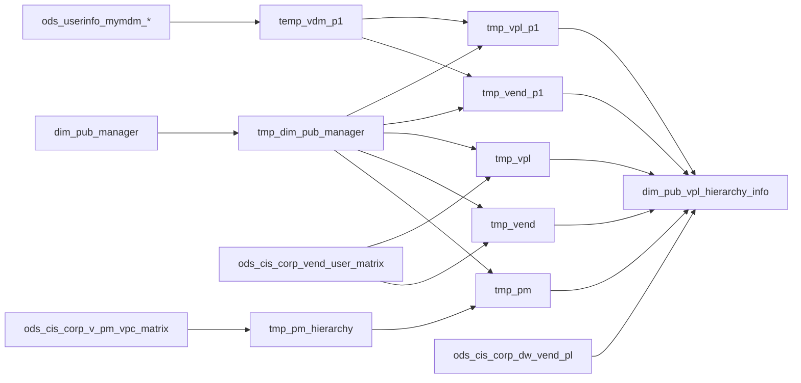

# DIM: VPL organizational hierarchy by role (`dim_pub_vpl_hierarchy_info`)

- artifact_type: etl_table
- artifact_id: dim_us.dim_pub_vpl_hierarchy_info
- domain: vendor
- one_line_purpose: This job builds a wide dimension that attaches buyer, BJBR, BJBN, VCM, marketing, PANA, and product-manager hierarchies to each vendor product line. It merges MyMDM DNA group assignments, legacy vendor user matrix rows, and PM VPC matrix da...
- layer_type: DIM
- source_kind: etl_sql
- evidence_source: source/etl/sql/vendor/source/etl/flows/public_order_tools/ingest/public_vpl_dimension/script/dim_pub_vpl_hierarchy_info.sql

---

## L1 Data Foundation

### Identity and physical mapping
- **Table:** `dim_us.dim_pub_vpl_hierarchy_info`
- **Layer type:** DIM
- **Canonical / derived:** Derived / ETL-loaded (see L3)
- **Owner team:** not registered in metadata catalog

### Grain, scope, exclusions
- **Grain:** one row per `(vend_no, vpl_no)` from `ods_cis_corp_dw_vend_pl` driving the final INSERT.
- **Scope:** See L2 business purpose / L3 filters
- **Partition:** none (full overwrite). - resolved from pipeline (see L4)
- **Natural key:** `vend_no`, `vpl_no`.
- **Exclusions:** Not documented in repository

#### Grain detail (preserved)

- **Grain:** one row per `(vend_no, vpl_no)` from `ods_cis_corp_dw_vend_pl` driving the final INSERT.
- **Partition:** none (full overwrite).
- **Natural key:** `vend_no`, `vpl_no`.

---

### Cross-engine presence
| Engine | Present | Canonical FQN | Notes |
|--------|---------|---------------|-------|
| Hive | yes | `dim_pub_vpl_hierarchy_info` | ETL target / intermediate per evidence script |
| Vertica | pending | `dim_pub_vpl_hierarchy_info` | Confirm via hive2vertica flow evidence / MCP |

### Physical schema reference

Pointer block only - full column catalog lives in WKB L1 storage JSON.

| Field | Value |
|-------|-------|
| **Authoritative catalog** | WKB L1 storage seed (not duplicated in this file) |
| **entity_id** | `dim_us.dim_pub_vpl_hierarchy_info` |
| **l1_catalog_seed** | `target/storage/wkb/snapshots/_snapshot_id_template/l1_catalog/{engine}_{schema}_{table}.json` |
| **column_count** | pending (run ddl_seed_writer) |
| **partition_keys** | `none (full overwrite).` |
| **ddl_source** | pending Bitbucket DDL / Vertica metadata ingest |
| **retrieval** | `python -m tools.wkb.indexing.run_query --query "vendor dim_pub_vpl_hierarchy_info schema" --intent find_table_schema` |

### Lineage
See L6 Dependencies and notes.

### Freshness and load path
| Item | Value |
|------|-------|
| Load pattern | See L3 end-to-end / INSERT pattern in evidence script |
| Schedule | Not documented in repository |
| Parameters | `country_code` |


---

## L2 Declarative Knowledge

### Business purpose
This job builds a wide dimension that attaches buyer, BJBR, BJBN, VCM, marketing, PANA, and product-manager hierarchies to each vendor product line. It merges MyMDM DNA group assignments, legacy vendor user matrix rows, and PM VPC matrix data, resolving VPL-level vs vendor-level (`vpl_no = -1`) fallbacks. Reporting teams use it for accountability chains (VP through primary/backup contacts) by department and PM role.

---

### Audience and use cases
| Audience | How they benefit |
|----------|-----------------|
| **Category / buyer teams** | `buyer_*` contacts and escalation chain. |
| **BJBR / BJBN / PANA** | Department-specific hierarchy columns. |
| **VCM / marketing** | `vcm_*`, `marketing_*` from user matrix. |
| **Product management** | `pm_*` roles from VPC matrix. |
| **Downstream PM dimension** | Source for `dim_pub_vpl_pm_hierarchy_info`. |

---

### Identifier search profile
- Primary lookup keys: see natural key under L1 Grain.
- Use latest snapshot / active flags when documented in L3 filters.

### Time field semantics
- **date_flag / partition columns:** none (full overwrite).
- Primary reporting filter should use the partition column(s) documented in L1; resolve values via L4.


### Metrics served

| Category | Column | Logical metric | Business reading |
|----------|--------|----------------|------------------|
| Measures | — | — | No measure columns mapped for this table. |

### Metric serving map

**Formula authority:** [`source/contracts/vendor/metric-index.md`](../../source/contracts/vendor/metric-index.md)

N/A — no measure columns mapped for this table.

### etl_metrics

No governed logical metrics from `source/contracts/vendor/metric-index.md` are mapped on this table.

---

### Metric serving map
N/A - not a `*_comb_mtd` / multi-period wide serving table (or map not present in legacy doc).


### Data products and column groups (preserved)

### Identifiers

- `vend_no`, `vpl_no`

### Per-role column pattern (repeated for buyer, bjbr, bjbn, vcm, marketing, pana, pm)

For each prefix (`buyer_`, `bjbr_`, …): `{prefix}vp_id`, `{prefix}vp_name`, `{prefix}vp_email`, `{prefix}director_id`, `{prefix}director_name`, `{prefix}director_email`, `{prefix}manager_id`, `{prefix}manager_name`, `{prefix}manager_email`, `{prefix}id` (primary member), `{prefix}name`, `{prefix}email`, `{prefix}primary_backup_id`, `{prefix}primary_backup_name`, `{prefix}primary_backup_email`.

PM block uses `pm_` prefix (e.g. `pm_vp_id`, `pm_id`, `pm_primary_backup_id`).

> **Note:** VCM and marketing paths from `vend_user_matrix` leave `vp_*` columns as empty strings at the temp stage; final output uses `nvl` from VPL-level vs vendor-level DNA paths for departments that use MyMDM.

---

### etl_metrics

N/A - no calculable ETL formulas extracted from this document (passthrough / stored measures only, or formulas not documented).

---

## L3 Procedural Knowledge

### Query and routing rules
**Business filters:** Use partition / date keys from L1 grain for reporting scope.
**Technical predicates (load only):** See Key filters and step-by-step logic below.

### Dimension join patterns
| Dimension FQN | Join keys | Purpose | Evidence |
|---------------|-----------|---------|----------|
| See step-by-step / base tables | See L3 steps | Dimension enrichment | `source/etl/sql/vendor/source/etl/flows/public_order_tools/ingest/public_vpl_dimension/script/dim_pub_vpl_hierarchy_info.sql` |

### Key filters and ETL business logic
### Step 1 — `tmp_dim_pub_manager`

**Source:** `dim_${country_code}.dim_pub_manager`  
**Columns:** `userid`, `name`, `email` (ORC temp table).

### Step 2 — `temp_vdm_p1`

**Source:** MyMDM `vendor_dna_group` left join `vendor_dna_members`  
**Filter:** `vdm.primary_flag = 'Y'`  
**Aggregation:** `max(case when member_role = …)` for `primary`, `backup`, `manager`, `director`, `vp`  
**Grain:** `vend_no`, `vpl_no`, `department_type`

### Step 3 — `tmp_vpl_p1` / `tmp_vend_p1`

**Source:** `dw_vend_pl` inner join `temp_vdm_p1`  
**Filter:** `tmp_vpl_p1`: `vp.vpl_no <> -1`; `tmp_vend_p1`: `vp.vpl_no = -1`  
**Enrichment:** five left joins to `tmp_dim_pub_manager` on role user IDs → `*_name`, `*_email` columns.

### Step 4 — `tmp_vpl` / `tmp_vend`

**Source:** `dw_vend_pl` inner join `vend_user_matrix`  
**Filter:** VPL level `vu.vpl_no <> -1`; vendor level `vu.vpl_no = -1`  
**Columns:** `other_id` as `director_id`; empty `vp_*`; manager/primary/backup from matrix; `profile_type` retained for final join filter (`VCM`, `MRKT`).

### Step 5 — `tmp_pm_hierarchy`

**Source:** `ods_cis_corp_v_pm_vpc_matrix`  
**Aggregation:** per `(vpl_no, vend_no)`, max `pm_id` where `pm_role` in (`VP`,`DIR`,`MGR`,`PM`) with `is_primary='Y'` and `is_backup='N'` (and backup PM with `is_backup='Y'`).

### Step 6 — `tmp_pm`

**Source:** `dw_vend_pl` with two subqueries (VPL `vpl_no <> -1`, vendor `vpl_no = -1`) joined to `tmp_pm_hierarchy` and managers.  
**Fallback:** `nvl(vpl_pm.*, vend_pm.*)` and `...

### Standard time-filter SQL
```sql
-- relative period filter using resolved partition value (see L4)
SELECT *
FROM dim_pub_vpl_hierarchy_info
WHERE /* partition predicate */ date_flag = '${partition_value}';
```

### End-to-end flow
**Runtime parameters:** `country_code`  
**Target table:** `dim_${country_code}.dim_pub_vpl_hierarchy_info`.

1. Cache managers; build `temp_vdm_p1` from MyMDM DNA groups/members.
2. Build `tmp_vpl_p1` / `tmp_vend_p1` (DNA at VPL vs vendor level) with manager names.
3. Build `tmp_vpl` / `tmp_vend` from `vend_user_matrix` (VPL vs vendor).
4. Build `tmp_pm_hierarchy` and `tmp_pm` from `v_pm_vpc_matrix` with manager enrichment.
5. INSERT: for each department, `nvl(vpl_*, vend_*)` and `if(vpl id null, vend name, vpl name)` pattern.



---


#### High-level stages (preserved)

| Stage | Business meaning |
|-------|-----------------|
| **Manager cache** | Loads `dim_pub_manager` into `tmp_dim_pub_manager` for name/email lookup. |
| **MyMDM DNA rollup** | Pivots primary/backup/manager/director/VP member IDs per `(vend_no, vpl_no, department_type)` where `primary_flag = 'Y'`. |
| **DNA + manager enrichment (VPL & vendor)** | Joins DNA rollups to `dw_vend_pl` at VPL grain (`vpl_no <> -1`) and vendor grain (`vpl_no = -1`). |
| **User matrix paths** | Parallel paths from `ods_cis_corp_vend_user_matrix` for VCM/MRKT profile types at VPL and vendor level. |
| **PM hierarchy** | Aggregates `v_pm_vpc_matrix` by role; merges VPL-level and vendor-level PM with `nvl` / `if` fallbacks. |
| **Final assembly** | One row per VPL from `dw_vend_pl` with role-prefixed columns (`buyer_*`, `bjbr_*`, …, `pm_*`, `pana_*`). |

**Parameters:** `country_code`

---


### Base tables register
| Object | Role in this job |
|--------|-----------------|
| `dim_${country_code}.dim_pub_manager` | userid → name, email |
| `ods_${country_code}.ods_userinfo_mymdm_vendor_dna_group` | DNA group to vend/vpl/dept |
| `ods_${country_code}.ods_userinfo_mymdm_vendor_dna_members` | Role members (`primary_flag='Y'`) |
| `ods_${country_code}.ods_cis_corp_dw_vend_pl` | VPL grain driver |
| `ods_${country_code}.ods_cis_corp_vend_user_matrix` | VCM/MRKT assignments |
| `ods_${country_code}.ods_cis_corp_v_pm_vpc_matrix` | PM role matrix |

**Temporary chain:** `tmp_dim_pub_manager` → `temp_vdm_p1` → (`tmp_vpl_p1`, `tmp_vend_p1`, `tmp_vpl`, `tmp_vend`) + (`tmp_pm_hierarchy` → `tmp_pm`) → INSERT

---

### Step-by-step logic
### Step 1 — `tmp_dim_pub_manager`

**Source:** `dim_${country_code}.dim_pub_manager`  
**Columns:** `userid`, `name`, `email` (ORC temp table).

### Step 2 — `temp_vdm_p1`

**Source:** MyMDM `vendor_dna_group` left join `vendor_dna_members`  
**Filter:** `vdm.primary_flag = 'Y'`  
**Aggregation:** `max(case when member_role = …)` for `primary`, `backup`, `manager`, `director`, `vp`  
**Grain:** `vend_no`, `vpl_no`, `department_type`

### Step 3 — `tmp_vpl_p1` / `tmp_vend_p1`

**Source:** `dw_vend_pl` inner join `temp_vdm_p1`  
**Filter:** `tmp_vpl_p1`: `vp.vpl_no <> -1`; `tmp_vend_p1`: `vp.vpl_no = -1`  
**Enrichment:** five left joins to `tmp_dim_pub_manager` on role user IDs → `*_name`, `*_email` columns.

### Step 4 — `tmp_vpl` / `tmp_vend`

**Source:** `dw_vend_pl` inner join `vend_user_matrix`  
**Filter:** VPL level `vu.vpl_no <> -1`; vendor level `vu.vpl_no = -1`  
**Columns:** `other_id` as `director_id`; empty `vp_*`; manager/primary/backup from matrix; `profile_type` retained for final join filter (`VCM`, `MRKT`).

### Step 5 — `tmp_pm_hierarchy`

**Source:** `ods_cis_corp_v_pm_vpc_matrix`  
**Aggregation:** per `(vpl_no, vend_no)`, max `pm_id` where `pm_role` in (`VP`,`DIR`,`MGR`,`PM`) with `is_primary='Y'` and `is_backup='N'` (and backup PM with `is_backup='Y'`).

### Step 6 — `tmp_pm`

**Source:** `dw_vend_pl` with two subqueries (VPL `vpl_no <> -1`, vendor `vpl_no = -1`) joined to `tmp_pm_hierarchy` and managers.  
**Fallback:** `nvl(vpl_pm.*, vend_pm.*)` and `if(vpl_pm id null, vend name, vpl name)` for each PM attribute.

### Step 7 — Final `INSERT` into `dim_pub_vpl_hierarchy_info`

**From:** all `ods_cis_corp_dw_vend_pl` rows `vpl`  
**Joins:** `tmp_vpl_p1` / `tmp_vend_p1` filtered by `department_type` in (`BUYR`,`BJBR`,`BJBN`,`PANA`); `tmp_vpl`/`tmp_vend` by `profile_type` (`VCM`,`MRKT`); `tmp_pm` on vend/vpl.

**Derived pattern (each role block):**

| Pattern | Plain language |
|---------|----------------|
| `nvl(vpl_x.id, vend_x.id)` | Prefer VPL-level assignment, else vendor-level |
| `if(vpl_x.id is null, vend_x.name, vpl_x.name)` | Names follow same precedence |

---

### Relationship map (embedded)

| from_fqn | to_fqn | cardinality | join_keys | provenance |
|----------|--------|-------------|-----------|------------|
| `ods_${country_code}.ods_userinfo_mymdm_vendor_dna_group` | `ods_${country_code}.ods_userinfo_mymdm_vendor_dna_members` | many:1 | `vdg.group_no = vdm.group_no` | etl_sql (source/etl/sql/vendor/public_order_scripts/public_vpl_dimension/script/dim_pub_vpl_hierarchy_info.sql:1) |
| `ods_${country_code}.ods_cis_corp_dw_vend_pl` | `temp_vdm_p1` | many:1 | `b.vend_no=vp.vend_no and b.vpl_no=vp.vpl_no and vp.vpl_no <> -1` | etl_sql (source/etl/sql/vendor/public_order_scripts/public_vpl_dimension/script/dim_pub_vpl_hierarchy_info.sql:1) |
| `temp_vdm_p1` | `tmp_dim_pub_manager` | many:1 | `f.userid=vp.director_id` | etl_sql (source/etl/sql/vendor/public_order_scripts/public_vpl_dimension/script/dim_pub_vpl_hierarchy_info.sql:1) |
| `temp_vdm_p1` | `tmp_dim_pub_manager` | many:1 | `f1.userid=vp.manager_id` | etl_sql (source/etl/sql/vendor/public_order_scripts/public_vpl_dimension/script/dim_pub_vpl_hierarchy_info.sql:1) |
| `temp_vdm_p1` | `tmp_dim_pub_manager` | many:1 | `f2.userid=vp.primary_id` | etl_sql (source/etl/sql/vendor/public_order_scripts/public_vpl_dimension/script/dim_pub_vpl_hierarchy_info.sql:1) |
| `temp_vdm_p1` | `tmp_dim_pub_manager` | many:1 | `f3.userid=vp.backup_id` | etl_sql (source/etl/sql/vendor/public_order_scripts/public_vpl_dimension/script/dim_pub_vpl_hierarchy_info.sql:1) |
| `temp_vdm_p1` | `tmp_dim_pub_manager` | many:1 | `f4.userid=vp.vp_id; create TEMPORARY table tmp_vend_p1 stored as orc as` | etl_sql (source/etl/sql/vendor/public_order_scripts/public_vpl_dimension/script/dim_pub_vpl_hierarchy_info.sql:1) |
| `ods_${country_code}.ods_cis_corp_dw_vend_pl` | `temp_vdm_p1` | many:1 | `b.vend_no=vp.vend_no and vp.vpl_no= -1` | etl_sql (source/etl/sql/vendor/public_order_scripts/public_vpl_dimension/script/dim_pub_vpl_hierarchy_info.sql:1) |
| `temp_vdm_p1` | `tmp_dim_pub_manager` | many:1 | `f4.userid=vp.vp_id; create TEMPORARY table tmp_vpl stored as orc as` | etl_sql (source/etl/sql/vendor/public_order_scripts/public_vpl_dimension/script/dim_pub_vpl_hierarchy_info.sql:1) |
| `ods_${country_code}.ods_cis_corp_dw_vend_pl` | `ods_${country_code}.ods_cis_corp_vend_user_matrix` | many:1 | `b.vend_no=vu.vend_no and b.vpl_no=vu.vpl_no and vu.vpl_no <> -1 -- and vu.profile_type='BUYR' and vu.vpl_no <> -1` | etl_sql (source/etl/sql/vendor/public_order_scripts/public_vpl_dimension/script/dim_pub_vpl_hierarchy_info.sql:1) |
| `ods_${country_code}.ods_cis_corp_vend_user_matrix` | `tmp_dim_pub_manager` | many:1 | `f.userid=vu.other_id` | etl_sql (source/etl/sql/vendor/public_order_scripts/public_vpl_dimension/script/dim_pub_vpl_hierarchy_info.sql:1) |
| `ods_${country_code}.ods_cis_corp_vend_user_matrix` | `tmp_dim_pub_manager` | many:1 | `f1.userid=vu.manager_id` | etl_sql (source/etl/sql/vendor/public_order_scripts/public_vpl_dimension/script/dim_pub_vpl_hierarchy_info.sql:1) |
| `ods_${country_code}.ods_cis_corp_vend_user_matrix` | `tmp_dim_pub_manager` | many:1 | `f2.userid=vu.primary_id` | etl_sql (source/etl/sql/vendor/public_order_scripts/public_vpl_dimension/script/dim_pub_vpl_hierarchy_info.sql:1) |
| `ods_${country_code}.ods_cis_corp_vend_user_matrix` | `tmp_dim_pub_manager` | many:1 | `f3.userid=vu.backup_id; create TEMPORARY table tmp_vend stored as orc as` | etl_sql (source/etl/sql/vendor/public_order_scripts/public_vpl_dimension/script/dim_pub_vpl_hierarchy_info.sql:1) |
| `ods_${country_code}.ods_cis_corp_dw_vend_pl` | `ods_${country_code}.ods_cis_corp_vend_user_matrix` | many:1 | `b.vend_no=vu.vend_no and vu.vpl_no = -1 --and vu.profile_type='BUYR' and vu.vpl_no = -1` | etl_sql (source/etl/sql/vendor/public_order_scripts/public_vpl_dimension/script/dim_pub_vpl_hierarchy_info.sql:1) |
| `ods_${country_code}.ods_cis_corp_vend_user_matrix` | `tmp_dim_pub_manager` | many:1 | `f3.userid=vu.backup_id; create or replace TEMPORARY view tmp_pm_hierarchy as` | etl_sql (source/etl/sql/vendor/public_order_scripts/public_vpl_dimension/script/dim_pub_vpl_hierarchy_info.sql:1) |
| `ods_${country_code}.ods_cis_corp_dw_vend_pl` | `tmp_pm_hierarchy` | many:1 | `b.vend_no=vu.vend_no and b.vpl_no=vu.vpl_no and vu.vpl_no <> -1` | etl_sql (source/etl/sql/vendor/public_order_scripts/public_vpl_dimension/script/dim_pub_vpl_hierarchy_info.sql:1) |
| `tmp_pm_hierarchy` | `tmp_dim_pub_manager` | many:1 | `f.userid=vu.pm_director_id` | etl_sql (source/etl/sql/vendor/public_order_scripts/public_vpl_dimension/script/dim_pub_vpl_hierarchy_info.sql:1) |
| `tmp_pm_hierarchy` | `tmp_dim_pub_manager` | many:1 | `f1.userid=vu.pm_manager_id` | etl_sql (source/etl/sql/vendor/public_order_scripts/public_vpl_dimension/script/dim_pub_vpl_hierarchy_info.sql:1) |
| `tmp_pm_hierarchy` | `tmp_dim_pub_manager` | many:1 | `f2.userid=vu.pm_id` | etl_sql (source/etl/sql/vendor/public_order_scripts/public_vpl_dimension/script/dim_pub_vpl_hierarchy_info.sql:1) |
| `tmp_pm_hierarchy` | `tmp_dim_pub_manager` | many:1 | `f3.userid=vu.pm_primary_backup_id` | etl_sql (source/etl/sql/vendor/public_order_scripts/public_vpl_dimension/script/dim_pub_vpl_hierarchy_info.sql:1) |
| `tmp_pm_hierarchy` | `tmp_dim_pub_manager` | many:1 | `f4.userid=vu.pm_vp_id ) vpl_pm on vpl.vend_no=vpl_pm.vend_no and vpl.vpl_no=vpl_pm.vpl_no` | etl_sql (source/etl/sql/vendor/public_order_scripts/public_vpl_dimension/script/dim_pub_vpl_hierarchy_info.sql:1) |
| `ods_${country_code}.ods_cis_corp_dw_vend_pl` | `tmp_pm_hierarchy` | many:1 | `b.vend_no=vu.vend_no and vu.vpl_no = -1` | etl_sql (source/etl/sql/vendor/public_order_scripts/public_vpl_dimension/script/dim_pub_vpl_hierarchy_info.sql:1) |
| `tmp_pm_hierarchy` | `tmp_dim_pub_manager` | many:1 | `f4.userid=vu.pm_vp_id ) vend_pm on vpl.vend_no=vend_pm.vend_no and vpl.vpl_no=vend_pm.vpl_no; --` | etl_sql (source/etl/sql/vendor/public_order_scripts/public_vpl_dimension/script/dim_pub_vpl_hierarchy_info.sql:1) |
| `ods_${country_code}.ods_cis_corp_dw_vend_pl` | `tmp_vpl_p1` | many:1 | `vpl.vend_no=vpl_buyer.vend_no and vpl.vpl_no=vpl_buyer.vpl_no and vpl_buyer.department_type='BUYR'` | etl_sql (source/etl/sql/vendor/public_order_scripts/public_vpl_dimension/script/dim_pub_vpl_hierarchy_info.sql:1) |
| `ods_${country_code}.ods_cis_corp_dw_vend_pl` | `tmp_vend_p1` | many:1 | `vpl.vend_no=vend_buyer.vend_no and vpl.vpl_no=vend_buyer.vpl_no and vend_buyer.department_type='BUYR'` | etl_sql (source/etl/sql/vendor/public_order_scripts/public_vpl_dimension/script/dim_pub_vpl_hierarchy_info.sql:1) |
| `ods_${country_code}.ods_cis_corp_dw_vend_pl` | `tmp_vpl_p1` | many:1 | `vpl.vend_no=vpl_bjbr.vend_no and vpl.vpl_no=vpl_bjbr.vpl_no and vpl_bjbr.department_type='BJBR'` | etl_sql (source/etl/sql/vendor/public_order_scripts/public_vpl_dimension/script/dim_pub_vpl_hierarchy_info.sql:1) |
| `ods_${country_code}.ods_cis_corp_dw_vend_pl` | `tmp_vend_p1` | many:1 | `vpl.vend_no=vend_bjbr.vend_no and vpl.vpl_no=vend_bjbr.vpl_no and vend_bjbr.department_type='BJBR'` | etl_sql (source/etl/sql/vendor/public_order_scripts/public_vpl_dimension/script/dim_pub_vpl_hierarchy_info.sql:1) |
| `ods_${country_code}.ods_cis_corp_dw_vend_pl` | `tmp_vpl_p1` | many:1 | `vpl.vend_no=vpl_bjbn.vend_no and vpl.vpl_no=vpl_bjbn.vpl_no and vpl_bjbn.department_type='BJBN'` | etl_sql (source/etl/sql/vendor/public_order_scripts/public_vpl_dimension/script/dim_pub_vpl_hierarchy_info.sql:1) |
| `ods_${country_code}.ods_cis_corp_dw_vend_pl` | `tmp_vend_p1` | many:1 | `vpl.vend_no=vend_bjbn.vend_no and vpl.vpl_no=vend_bjbn.vpl_no and vend_bjbn.department_type='BJBN'` | etl_sql (source/etl/sql/vendor/public_order_scripts/public_vpl_dimension/script/dim_pub_vpl_hierarchy_info.sql:1) |
| `ods_${country_code}.ods_cis_corp_dw_vend_pl` | `tmp_vpl` | many:1 | `vpl.vend_no=vpl_vcm.vend_no and vpl.vpl_no=vpl_vcm.vpl_no and vpl_vcm.profile_type='VCM'` | etl_sql (source/etl/sql/vendor/public_order_scripts/public_vpl_dimension/script/dim_pub_vpl_hierarchy_info.sql:1) |
| `ods_${country_code}.ods_cis_corp_dw_vend_pl` | `tmp_vend` | many:1 | `vpl.vend_no=vend_vcm.vend_no and vpl.vpl_no=vend_vcm.vpl_no and vend_vcm.profile_type='VCM'` | etl_sql (source/etl/sql/vendor/public_order_scripts/public_vpl_dimension/script/dim_pub_vpl_hierarchy_info.sql:1) |
| `ods_${country_code}.ods_cis_corp_dw_vend_pl` | `tmp_vpl` | many:1 | `vpl.vend_no=vpl_marketing.vend_no and vpl.vpl_no=vpl_marketing.vpl_no and vpl_marketing.profile_type='MRKT'` | etl_sql (source/etl/sql/vendor/public_order_scripts/public_vpl_dimension/script/dim_pub_vpl_hierarchy_info.sql:1) |
| `ods_${country_code}.ods_cis_corp_dw_vend_pl` | `tmp_vend` | many:1 | `vpl.vend_no=vend_marketing.vend_no and vpl.vpl_no=vend_marketing.vpl_no and vend_marketing.profile_type='MRKT'` | etl_sql (source/etl/sql/vendor/public_order_scripts/public_vpl_dimension/script/dim_pub_vpl_hierarchy_info.sql:1) |
| `ods_${country_code}.ods_cis_corp_dw_vend_pl` | `tmp_pm` | many:1 | `vpl.vend_no = pm.vend_no and vpl.vpl_no = pm.vpl_no` | etl_sql (source/etl/sql/vendor/public_order_scripts/public_vpl_dimension/script/dim_pub_vpl_hierarchy_info.sql:1) |
| `ods_${country_code}.ods_cis_corp_dw_vend_pl` | `tmp_vpl_p1` | many:1 | `vpl.vend_no=vpl_pana.vend_no and vpl.vpl_no=vpl_pana.vpl_no and vpl_pana.department_type='PANA'` | etl_sql (source/etl/sql/vendor/public_order_scripts/public_vpl_dimension/script/dim_pub_vpl_hierarchy_info.sql:1) |
| `ods_${country_code}.ods_cis_corp_dw_vend_pl` | `tmp_vend_p1` | many:1 | `vpl.vend_no=vend_pana.vend_no and vpl.vpl_no=vend_pana.vpl_no and vend_pana.department_type='PANA';` | etl_sql (source/etl/sql/vendor/public_order_scripts/public_vpl_dimension/script/dim_pub_vpl_hierarchy_info.sql:1) |

`source/ref/vendor/table relationship.txt`: Not documented in repository.

### Special logic (embedded)

Not documented in repository

### Column / field derivations (from ETL SQL)

| target_column | expression_sql | upstream_columns | upstream_tables | transform_kind | evidence |
|---------------|----------------|------------------|-----------------|----------------|----------|
| `vend_no` | `vpl.vend_no` | `vend_no` | `ods_${country_code}.ods_cis_corp_dw_vend_pl`, `tmp_vpl_p1`, `tmp_vend_p1`, `tmp_vpl`, `tmp_vend`, `tmp_pm` | passthrough | `source/etl/sql/vendor/public_order_scripts/public_vpl_dimension/script/dim_pub_vpl_hierarchy_info.sql:175` |
| `vpl_no` | `vpl.vpl_no` | `vpl_no` | `ods_${country_code}.ods_cis_corp_dw_vend_pl`, `tmp_vpl_p1`, `tmp_vend_p1`, `tmp_vpl`, `tmp_vend`, `tmp_pm` | passthrough | `source/etl/sql/vendor/public_order_scripts/public_vpl_dimension/script/dim_pub_vpl_hierarchy_info.sql:176` |
| `buyer_vp_id` | `nvl(vpl_buyer.vp_id, vend_buyer.vp_id)` | `vp_id` | `ods_${country_code}.ods_cis_corp_dw_vend_pl`, `tmp_vpl_p1`, `tmp_vend_p1`, `tmp_vpl`, `tmp_vend`, `tmp_pm` | coalesce | `source/etl/sql/vendor/public_order_scripts/public_vpl_dimension/script/dim_pub_vpl_hierarchy_info.sql:252` |
| `buyer_vp_name` | `if(vpl_buyer.vp_id is null, vend_buyer.vp_name, vpl_buyer.vp_name)` | `vp_id`, `vp_name` | `ods_${country_code}.ods_cis_corp_dw_vend_pl`, `tmp_vpl_p1`, `tmp_vend_p1`, `tmp_vpl`, `tmp_vend`, `tmp_pm` | udf | `source/etl/sql/vendor/public_order_scripts/public_vpl_dimension/script/dim_pub_vpl_hierarchy_info.sql:253` |
| `buyer_vp_email` | `if(vpl_buyer.vp_id is null, vend_buyer.vp_email, vpl_buyer.vp_email)` | `vp_id`, `vp_email` | `ods_${country_code}.ods_cis_corp_dw_vend_pl`, `tmp_vpl_p1`, `tmp_vend_p1`, `tmp_vpl`, `tmp_vend`, `tmp_pm` | udf | `source/etl/sql/vendor/public_order_scripts/public_vpl_dimension/script/dim_pub_vpl_hierarchy_info.sql:253` |
| `buyer_director_id` | `nvl(vpl_buyer.director_id, vend_buyer.director_id)` | `director_id` | `ods_${country_code}.ods_cis_corp_dw_vend_pl`, `tmp_vpl_p1`, `tmp_vend_p1`, `tmp_vpl`, `tmp_vend`, `tmp_pm` | coalesce | `source/etl/sql/vendor/public_order_scripts/public_vpl_dimension/script/dim_pub_vpl_hierarchy_info.sql:255` |
| `buyer_director_name` | `if(vpl_buyer.director_id is null, vend_buyer.director_name, vpl_buyer.director_name)` | `director_id`, `director_name` | `ods_${country_code}.ods_cis_corp_dw_vend_pl`, `tmp_vpl_p1`, `tmp_vend_p1`, `tmp_vpl`, `tmp_vend`, `tmp_pm` | udf | `source/etl/sql/vendor/public_order_scripts/public_vpl_dimension/script/dim_pub_vpl_hierarchy_info.sql:256` |
| `buyer_director_email` | `if(vpl_buyer.director_id is null, vend_buyer.director_email, vpl_buyer.director_email)` | `director_id`, `director_email` | `ods_${country_code}.ods_cis_corp_dw_vend_pl`, `tmp_vpl_p1`, `tmp_vend_p1`, `tmp_vpl`, `tmp_vend`, `tmp_pm` | udf | `source/etl/sql/vendor/public_order_scripts/public_vpl_dimension/script/dim_pub_vpl_hierarchy_info.sql:256` |
| `buyer_manager_id` | `nvl(vpl_buyer.manager_id, vend_buyer.manager_id)` | `manager_id` | `ods_${country_code}.ods_cis_corp_dw_vend_pl`, `tmp_vpl_p1`, `tmp_vend_p1`, `tmp_vpl`, `tmp_vend`, `tmp_pm` | coalesce | `source/etl/sql/vendor/public_order_scripts/public_vpl_dimension/script/dim_pub_vpl_hierarchy_info.sql:258` |
| `buyer_manager_name` | `if(vpl_buyer.manager_id is null, vend_buyer.manager_name, vpl_buyer.manager_name)` | `manager_id`, `manager_name` | `ods_${country_code}.ods_cis_corp_dw_vend_pl`, `tmp_vpl_p1`, `tmp_vend_p1`, `tmp_vpl`, `tmp_vend`, `tmp_pm` | udf | `source/etl/sql/vendor/public_order_scripts/public_vpl_dimension/script/dim_pub_vpl_hierarchy_info.sql:259` |
| `buyer_manager_email` | `if(vpl_buyer.manager_id is null, vend_buyer.manager_email, vpl_buyer.manager_email)` | `manager_id`, `manager_email` | `ods_${country_code}.ods_cis_corp_dw_vend_pl`, `tmp_vpl_p1`, `tmp_vend_p1`, `tmp_vpl`, `tmp_vend`, `tmp_pm` | udf | `source/etl/sql/vendor/public_order_scripts/public_vpl_dimension/script/dim_pub_vpl_hierarchy_info.sql:259` |
| `buyer_id` | `nvl(vpl_buyer.id, vend_buyer.id)` | `id` | `ods_${country_code}.ods_cis_corp_dw_vend_pl`, `tmp_vpl_p1`, `tmp_vend_p1`, `tmp_vpl`, `tmp_vend`, `tmp_pm` | coalesce | `source/etl/sql/vendor/public_order_scripts/public_vpl_dimension/script/dim_pub_vpl_hierarchy_info.sql:261` |
| `buyer_name` | `if(vpl_buyer.id is null, vend_buyer.name, vpl_buyer.name)` | `id`, `name` | `ods_${country_code}.ods_cis_corp_dw_vend_pl`, `tmp_vpl_p1`, `tmp_vend_p1`, `tmp_vpl`, `tmp_vend`, `tmp_pm` | udf | `source/etl/sql/vendor/public_order_scripts/public_vpl_dimension/script/dim_pub_vpl_hierarchy_info.sql:262` |
| `buyer_email` | `if(vpl_buyer.id is null, vend_buyer.email, vpl_buyer.email)` | `id`, `email` | `ods_${country_code}.ods_cis_corp_dw_vend_pl`, `tmp_vpl_p1`, `tmp_vend_p1`, `tmp_vpl`, `tmp_vend`, `tmp_pm` | udf | `source/etl/sql/vendor/public_order_scripts/public_vpl_dimension/script/dim_pub_vpl_hierarchy_info.sql:263` |
| `buyer_primary_backup_id` | `nvl(vpl_buyer.primary_backup_id, vend_buyer.primary_backup_id)` | `primary_backup_id` | `ods_${country_code}.ods_cis_corp_dw_vend_pl`, `tmp_vpl_p1`, `tmp_vend_p1`, `tmp_vpl`, `tmp_vend`, `tmp_pm` | coalesce | `source/etl/sql/vendor/public_order_scripts/public_vpl_dimension/script/dim_pub_vpl_hierarchy_info.sql:264` |
| `buyer_primary_backup_name` | `if(vpl_buyer.primary_backup_id is null, vend_buyer.primary_backup_name, vpl_buyer.primary_backup_name)` | `primary_backup_id`, `primary_backup_name` | `ods_${country_code}.ods_cis_corp_dw_vend_pl`, `tmp_vpl_p1`, `tmp_vend_p1`, `tmp_vpl`, `tmp_vend`, `tmp_pm` | udf | `source/etl/sql/vendor/public_order_scripts/public_vpl_dimension/script/dim_pub_vpl_hierarchy_info.sql:265` |
| `buyer_primary_backup_email` | `if(vpl_buyer.primary_backup_id is null, vend_buyer.primary_backup_email, vpl_buyer.primary_backup_email)` | `primary_backup_id`, `primary_backup_email` | `ods_${country_code}.ods_cis_corp_dw_vend_pl`, `tmp_vpl_p1`, `tmp_vend_p1`, `tmp_vpl`, `tmp_vend`, `tmp_pm` | udf | `source/etl/sql/vendor/public_order_scripts/public_vpl_dimension/script/dim_pub_vpl_hierarchy_info.sql:265` |
| `bjbr_vp_id` | `nvl(vpl_bjbr.vp_id, vend_bjbr.vp_id)` | `vp_id` | `ods_${country_code}.ods_cis_corp_dw_vend_pl`, `tmp_vpl_p1`, `tmp_vend_p1`, `tmp_vpl`, `tmp_vend`, `tmp_pm` | coalesce | `source/etl/sql/vendor/public_order_scripts/public_vpl_dimension/script/dim_pub_vpl_hierarchy_info.sql:268` |
| `bjbr_vp_name` | `if(vpl_bjbr.vp_id is null, vend_bjbr.vp_name, vpl_bjbr.vp_name)` | `vp_id`, `vp_name` | `ods_${country_code}.ods_cis_corp_dw_vend_pl`, `tmp_vpl_p1`, `tmp_vend_p1`, `tmp_vpl`, `tmp_vend`, `tmp_pm` | udf | `source/etl/sql/vendor/public_order_scripts/public_vpl_dimension/script/dim_pub_vpl_hierarchy_info.sql:269` |
| `bjbr_vp_email` | `if(vpl_bjbr.vp_id is null, vend_bjbr.vp_email, vpl_bjbr.vp_email)` | `vp_id`, `vp_email` | `ods_${country_code}.ods_cis_corp_dw_vend_pl`, `tmp_vpl_p1`, `tmp_vend_p1`, `tmp_vpl`, `tmp_vend`, `tmp_pm` | udf | `source/etl/sql/vendor/public_order_scripts/public_vpl_dimension/script/dim_pub_vpl_hierarchy_info.sql:269` |
| `bjbr_director_id` | `nvl(vpl_bjbr.director_id, vend_bjbr.director_id)` | `director_id` | `ods_${country_code}.ods_cis_corp_dw_vend_pl`, `tmp_vpl_p1`, `tmp_vend_p1`, `tmp_vpl`, `tmp_vend`, `tmp_pm` | coalesce | `source/etl/sql/vendor/public_order_scripts/public_vpl_dimension/script/dim_pub_vpl_hierarchy_info.sql:271` |
| `bjbr_director_name` | `if(vpl_bjbr.director_id is null, vend_bjbr.director_name, vpl_bjbr.director_name)` | `director_id`, `director_name` | `ods_${country_code}.ods_cis_corp_dw_vend_pl`, `tmp_vpl_p1`, `tmp_vend_p1`, `tmp_vpl`, `tmp_vend`, `tmp_pm` | udf | `source/etl/sql/vendor/public_order_scripts/public_vpl_dimension/script/dim_pub_vpl_hierarchy_info.sql:272` |
| `bjbr_director_email` | `if(vpl_bjbr.director_id is null, vend_bjbr.director_email, vpl_bjbr.director_email)` | `director_id`, `director_email` | `ods_${country_code}.ods_cis_corp_dw_vend_pl`, `tmp_vpl_p1`, `tmp_vend_p1`, `tmp_vpl`, `tmp_vend`, `tmp_pm` | udf | `source/etl/sql/vendor/public_order_scripts/public_vpl_dimension/script/dim_pub_vpl_hierarchy_info.sql:272` |
| `bjbr_manager_id` | `nvl(vpl_bjbr.manager_id, vend_bjbr.manager_id)` | `manager_id` | `ods_${country_code}.ods_cis_corp_dw_vend_pl`, `tmp_vpl_p1`, `tmp_vend_p1`, `tmp_vpl`, `tmp_vend`, `tmp_pm` | coalesce | `source/etl/sql/vendor/public_order_scripts/public_vpl_dimension/script/dim_pub_vpl_hierarchy_info.sql:274` |
| `bjbr_manager_name` | `if(vpl_bjbr.manager_id is null, vend_bjbr.manager_name, vpl_bjbr.manager_name)` | `manager_id`, `manager_name` | `ods_${country_code}.ods_cis_corp_dw_vend_pl`, `tmp_vpl_p1`, `tmp_vend_p1`, `tmp_vpl`, `tmp_vend`, `tmp_pm` | udf | `source/etl/sql/vendor/public_order_scripts/public_vpl_dimension/script/dim_pub_vpl_hierarchy_info.sql:275` |
| `bjbr_manager_email` | `if(vpl_bjbr.manager_id is null, vend_bjbr.manager_email, vpl_bjbr.manager_email)` | `manager_id`, `manager_email` | `ods_${country_code}.ods_cis_corp_dw_vend_pl`, `tmp_vpl_p1`, `tmp_vend_p1`, `tmp_vpl`, `tmp_vend`, `tmp_pm` | udf | `source/etl/sql/vendor/public_order_scripts/public_vpl_dimension/script/dim_pub_vpl_hierarchy_info.sql:275` |
| `bjbr_id` | `nvl(vpl_bjbr.id, vend_bjbr.id)` | `id` | `ods_${country_code}.ods_cis_corp_dw_vend_pl`, `tmp_vpl_p1`, `tmp_vend_p1`, `tmp_vpl`, `tmp_vend`, `tmp_pm` | coalesce | `source/etl/sql/vendor/public_order_scripts/public_vpl_dimension/script/dim_pub_vpl_hierarchy_info.sql:277` |
| `bjbr_name` | `if(vpl_bjbr.id is null, vend_bjbr.name, vpl_bjbr.name)` | `id`, `name` | `ods_${country_code}.ods_cis_corp_dw_vend_pl`, `tmp_vpl_p1`, `tmp_vend_p1`, `tmp_vpl`, `tmp_vend`, `tmp_pm` | udf | `source/etl/sql/vendor/public_order_scripts/public_vpl_dimension/script/dim_pub_vpl_hierarchy_info.sql:278` |
| `bjbr_email` | `if(vpl_bjbr.id is null, vend_bjbr.email, vpl_bjbr.email)` | `id`, `email` | `ods_${country_code}.ods_cis_corp_dw_vend_pl`, `tmp_vpl_p1`, `tmp_vend_p1`, `tmp_vpl`, `tmp_vend`, `tmp_pm` | udf | `source/etl/sql/vendor/public_order_scripts/public_vpl_dimension/script/dim_pub_vpl_hierarchy_info.sql:279` |
| `bjbr_primary_backup_id` | `nvl(vpl_bjbr.primary_backup_id, vend_bjbr.primary_backup_id)` | `primary_backup_id` | `ods_${country_code}.ods_cis_corp_dw_vend_pl`, `tmp_vpl_p1`, `tmp_vend_p1`, `tmp_vpl`, `tmp_vend`, `tmp_pm` | coalesce | `source/etl/sql/vendor/public_order_scripts/public_vpl_dimension/script/dim_pub_vpl_hierarchy_info.sql:280` |
| `bjbr_primary_backup_name` | `if(vpl_bjbr.primary_backup_id is null, vend_bjbr.primary_backup_name, vpl_bjbr.primary_backup_name)` | `primary_backup_id`, `primary_backup_name` | `ods_${country_code}.ods_cis_corp_dw_vend_pl`, `tmp_vpl_p1`, `tmp_vend_p1`, `tmp_vpl`, `tmp_vend`, `tmp_pm` | udf | `source/etl/sql/vendor/public_order_scripts/public_vpl_dimension/script/dim_pub_vpl_hierarchy_info.sql:281` |
| `bjbr_primary_backup_email` | `if(vpl_bjbr.primary_backup_id is null, vend_bjbr.primary_backup_email, vpl_bjbr.primary_backup_email)` | `primary_backup_id`, `primary_backup_email` | `ods_${country_code}.ods_cis_corp_dw_vend_pl`, `tmp_vpl_p1`, `tmp_vend_p1`, `tmp_vpl`, `tmp_vend`, `tmp_pm` | udf | `source/etl/sql/vendor/public_order_scripts/public_vpl_dimension/script/dim_pub_vpl_hierarchy_info.sql:281` |
| `bjbn_vp_id` | `nvl(vpl_bjbn.vp_id, vend_bjbn.vp_id)` | `vp_id` | `ods_${country_code}.ods_cis_corp_dw_vend_pl`, `tmp_vpl_p1`, `tmp_vend_p1`, `tmp_vpl`, `tmp_vend`, `tmp_pm` | coalesce | `source/etl/sql/vendor/public_order_scripts/public_vpl_dimension/script/dim_pub_vpl_hierarchy_info.sql:284` |
| `bjbn_vp_name` | `if(vpl_bjbn.vp_id is null, vend_bjbn.vp_name, vpl_bjbn.vp_name)` | `vp_id`, `vp_name` | `ods_${country_code}.ods_cis_corp_dw_vend_pl`, `tmp_vpl_p1`, `tmp_vend_p1`, `tmp_vpl`, `tmp_vend`, `tmp_pm` | udf | `source/etl/sql/vendor/public_order_scripts/public_vpl_dimension/script/dim_pub_vpl_hierarchy_info.sql:285` |
| `bjbn_vp_email` | `if(vpl_bjbn.vp_id is null, vend_bjbn.vp_email, vpl_bjbn.vp_email)` | `vp_id`, `vp_email` | `ods_${country_code}.ods_cis_corp_dw_vend_pl`, `tmp_vpl_p1`, `tmp_vend_p1`, `tmp_vpl`, `tmp_vend`, `tmp_pm` | udf | `source/etl/sql/vendor/public_order_scripts/public_vpl_dimension/script/dim_pub_vpl_hierarchy_info.sql:285` |
| `bjbn_director_id` | `nvl(vpl_bjbn.director_id, vend_bjbn.director_id)` | `director_id` | `ods_${country_code}.ods_cis_corp_dw_vend_pl`, `tmp_vpl_p1`, `tmp_vend_p1`, `tmp_vpl`, `tmp_vend`, `tmp_pm` | coalesce | `source/etl/sql/vendor/public_order_scripts/public_vpl_dimension/script/dim_pub_vpl_hierarchy_info.sql:287` |
| `bjbn_director_name` | `if(vpl_bjbn.director_id is null, vend_bjbn.director_name, vpl_bjbn.director_name)` | `director_id`, `director_name` | `ods_${country_code}.ods_cis_corp_dw_vend_pl`, `tmp_vpl_p1`, `tmp_vend_p1`, `tmp_vpl`, `tmp_vend`, `tmp_pm` | udf | `source/etl/sql/vendor/public_order_scripts/public_vpl_dimension/script/dim_pub_vpl_hierarchy_info.sql:288` |
| `bjbn_director_email` | `if(vpl_bjbn.director_id is null, vend_bjbn.director_email, vpl_bjbn.director_email)` | `director_id`, `director_email` | `ods_${country_code}.ods_cis_corp_dw_vend_pl`, `tmp_vpl_p1`, `tmp_vend_p1`, `tmp_vpl`, `tmp_vend`, `tmp_pm` | udf | `source/etl/sql/vendor/public_order_scripts/public_vpl_dimension/script/dim_pub_vpl_hierarchy_info.sql:288` |
| `bjbn_manager_id` | `nvl(vpl_bjbn.manager_id, vend_bjbn.manager_id)` | `manager_id` | `ods_${country_code}.ods_cis_corp_dw_vend_pl`, `tmp_vpl_p1`, `tmp_vend_p1`, `tmp_vpl`, `tmp_vend`, `tmp_pm` | coalesce | `source/etl/sql/vendor/public_order_scripts/public_vpl_dimension/script/dim_pub_vpl_hierarchy_info.sql:290` |
| `bjbn_manager_name` | `if(vpl_bjbn.manager_id is null, vend_bjbn.manager_name, vpl_bjbn.manager_name)` | `manager_id`, `manager_name` | `ods_${country_code}.ods_cis_corp_dw_vend_pl`, `tmp_vpl_p1`, `tmp_vend_p1`, `tmp_vpl`, `tmp_vend`, `tmp_pm` | udf | `source/etl/sql/vendor/public_order_scripts/public_vpl_dimension/script/dim_pub_vpl_hierarchy_info.sql:291` |
| `bjbn_manager_email` | `if(vpl_bjbn.manager_id is null, vend_bjbn.manager_email, vpl_bjbn.manager_email)` | `manager_id`, `manager_email` | `ods_${country_code}.ods_cis_corp_dw_vend_pl`, `tmp_vpl_p1`, `tmp_vend_p1`, `tmp_vpl`, `tmp_vend`, `tmp_pm` | udf | `source/etl/sql/vendor/public_order_scripts/public_vpl_dimension/script/dim_pub_vpl_hierarchy_info.sql:291` |
| `bjbn_id` | `nvl(vpl_bjbn.id, vend_bjbn.id)` | `id` | `ods_${country_code}.ods_cis_corp_dw_vend_pl`, `tmp_vpl_p1`, `tmp_vend_p1`, `tmp_vpl`, `tmp_vend`, `tmp_pm` | coalesce | `source/etl/sql/vendor/public_order_scripts/public_vpl_dimension/script/dim_pub_vpl_hierarchy_info.sql:293` |
| `bjbn_name` | `if(vpl_bjbn.id is null, vend_bjbn.name, vpl_bjbn.name)` | `id`, `name` | `ods_${country_code}.ods_cis_corp_dw_vend_pl`, `tmp_vpl_p1`, `tmp_vend_p1`, `tmp_vpl`, `tmp_vend`, `tmp_pm` | udf | `source/etl/sql/vendor/public_order_scripts/public_vpl_dimension/script/dim_pub_vpl_hierarchy_info.sql:294` |
| `bjbn_email` | `if(vpl_bjbn.id is null, vend_bjbn.email, vpl_bjbn.email)` | `id`, `email` | `ods_${country_code}.ods_cis_corp_dw_vend_pl`, `tmp_vpl_p1`, `tmp_vend_p1`, `tmp_vpl`, `tmp_vend`, `tmp_pm` | udf | `source/etl/sql/vendor/public_order_scripts/public_vpl_dimension/script/dim_pub_vpl_hierarchy_info.sql:295` |
| `bjbn_primary_backup_id` | `nvl(vpl_bjbn.primary_backup_id, vend_bjbn.primary_backup_id)` | `primary_backup_id` | `ods_${country_code}.ods_cis_corp_dw_vend_pl`, `tmp_vpl_p1`, `tmp_vend_p1`, `tmp_vpl`, `tmp_vend`, `tmp_pm` | coalesce | `source/etl/sql/vendor/public_order_scripts/public_vpl_dimension/script/dim_pub_vpl_hierarchy_info.sql:296` |
| `bjbn_primary_backup_name` | `if(vpl_bjbn.primary_backup_id is null, vend_bjbn.primary_backup_name, vpl_bjbn.primary_backup_name)` | `primary_backup_id`, `primary_backup_name` | `ods_${country_code}.ods_cis_corp_dw_vend_pl`, `tmp_vpl_p1`, `tmp_vend_p1`, `tmp_vpl`, `tmp_vend`, `tmp_pm` | udf | `source/etl/sql/vendor/public_order_scripts/public_vpl_dimension/script/dim_pub_vpl_hierarchy_info.sql:297` |
| `bjbn_primary_backup_email` | `if(vpl_bjbn.primary_backup_id is null, vend_bjbn.primary_backup_email, vpl_bjbn.primary_backup_email)` | `primary_backup_id`, `primary_backup_email` | `ods_${country_code}.ods_cis_corp_dw_vend_pl`, `tmp_vpl_p1`, `tmp_vend_p1`, `tmp_vpl`, `tmp_vend`, `tmp_pm` | udf | `source/etl/sql/vendor/public_order_scripts/public_vpl_dimension/script/dim_pub_vpl_hierarchy_info.sql:297` |
| `vcm_vp_id` | `nvl(vpl_vcm.vp_id, vend_vcm.vp_id)` | `vp_id` | `ods_${country_code}.ods_cis_corp_dw_vend_pl`, `tmp_vpl_p1`, `tmp_vend_p1`, `tmp_vpl`, `tmp_vend`, `tmp_pm` | coalesce | `source/etl/sql/vendor/public_order_scripts/public_vpl_dimension/script/dim_pub_vpl_hierarchy_info.sql:300` |
| `vcm_vp_name` | `if(vpl_vcm.vp_id is null, vend_vcm.vp_name, vpl_vcm.vp_name)` | `vp_id`, `vp_name` | `ods_${country_code}.ods_cis_corp_dw_vend_pl`, `tmp_vpl_p1`, `tmp_vend_p1`, `tmp_vpl`, `tmp_vend`, `tmp_pm` | udf | `source/etl/sql/vendor/public_order_scripts/public_vpl_dimension/script/dim_pub_vpl_hierarchy_info.sql:301` |
| `vcm_vp_email` | `if(vpl_vcm.vp_id is null, vend_vcm.vp_email, vpl_vcm.vp_email)` | `vp_id`, `vp_email` | `ods_${country_code}.ods_cis_corp_dw_vend_pl`, `tmp_vpl_p1`, `tmp_vend_p1`, `tmp_vpl`, `tmp_vend`, `tmp_pm` | udf | `source/etl/sql/vendor/public_order_scripts/public_vpl_dimension/script/dim_pub_vpl_hierarchy_info.sql:302` |
| `vcm_director_id` | `nvl(vpl_vcm.director_id, vend_vcm.director_id)` | `director_id` | `ods_${country_code}.ods_cis_corp_dw_vend_pl`, `tmp_vpl_p1`, `tmp_vend_p1`, `tmp_vpl`, `tmp_vend`, `tmp_pm` | coalesce | `source/etl/sql/vendor/public_order_scripts/public_vpl_dimension/script/dim_pub_vpl_hierarchy_info.sql:303` |
| `vcm_director_name` | `if(vpl_vcm.director_id is null, vend_vcm.director_name, vpl_vcm.director_name)` | `director_id`, `director_name` | `ods_${country_code}.ods_cis_corp_dw_vend_pl`, `tmp_vpl_p1`, `tmp_vend_p1`, `tmp_vpl`, `tmp_vend`, `tmp_pm` | udf | `source/etl/sql/vendor/public_order_scripts/public_vpl_dimension/script/dim_pub_vpl_hierarchy_info.sql:304` |
| `vcm_director_email` | `if(vpl_vcm.director_id is null, vend_vcm.director_email, vpl_vcm.director_email)` | `director_id`, `director_email` | `ods_${country_code}.ods_cis_corp_dw_vend_pl`, `tmp_vpl_p1`, `tmp_vend_p1`, `tmp_vpl`, `tmp_vend`, `tmp_pm` | udf | `source/etl/sql/vendor/public_order_scripts/public_vpl_dimension/script/dim_pub_vpl_hierarchy_info.sql:304` |
| `vcm_manager_id` | `nvl(vpl_vcm.manager_id, vend_vcm.manager_id)` | `manager_id` | `ods_${country_code}.ods_cis_corp_dw_vend_pl`, `tmp_vpl_p1`, `tmp_vend_p1`, `tmp_vpl`, `tmp_vend`, `tmp_pm` | coalesce | `source/etl/sql/vendor/public_order_scripts/public_vpl_dimension/script/dim_pub_vpl_hierarchy_info.sql:306` |
| `vcm_manager_name` | `if(vpl_vcm.manager_id is null, vend_vcm.manager_name, vpl_vcm.manager_name)` | `manager_id`, `manager_name` | `ods_${country_code}.ods_cis_corp_dw_vend_pl`, `tmp_vpl_p1`, `tmp_vend_p1`, `tmp_vpl`, `tmp_vend`, `tmp_pm` | udf | `source/etl/sql/vendor/public_order_scripts/public_vpl_dimension/script/dim_pub_vpl_hierarchy_info.sql:307` |
| `vcm_manager_email` | `if(vpl_vcm.manager_id is null, vend_vcm.manager_email, vpl_vcm.manager_email)` | `manager_id`, `manager_email` | `ods_${country_code}.ods_cis_corp_dw_vend_pl`, `tmp_vpl_p1`, `tmp_vend_p1`, `tmp_vpl`, `tmp_vend`, `tmp_pm` | udf | `source/etl/sql/vendor/public_order_scripts/public_vpl_dimension/script/dim_pub_vpl_hierarchy_info.sql:307` |
| `vcm_id` | `nvl(vpl_vcm.id, vend_vcm.id)` | `id` | `ods_${country_code}.ods_cis_corp_dw_vend_pl`, `tmp_vpl_p1`, `tmp_vend_p1`, `tmp_vpl`, `tmp_vend`, `tmp_pm` | coalesce | `source/etl/sql/vendor/public_order_scripts/public_vpl_dimension/script/dim_pub_vpl_hierarchy_info.sql:309` |
| `vcm_name` | `if(vpl_vcm.id is null, vend_vcm.name, vpl_vcm.name)` | `id`, `name` | `ods_${country_code}.ods_cis_corp_dw_vend_pl`, `tmp_vpl_p1`, `tmp_vend_p1`, `tmp_vpl`, `tmp_vend`, `tmp_pm` | udf | `source/etl/sql/vendor/public_order_scripts/public_vpl_dimension/script/dim_pub_vpl_hierarchy_info.sql:310` |
| `vcm_email` | `if(vpl_vcm.id is null, vend_vcm.email, vpl_vcm.email)` | `id`, `email` | `ods_${country_code}.ods_cis_corp_dw_vend_pl`, `tmp_vpl_p1`, `tmp_vend_p1`, `tmp_vpl`, `tmp_vend`, `tmp_pm` | udf | `source/etl/sql/vendor/public_order_scripts/public_vpl_dimension/script/dim_pub_vpl_hierarchy_info.sql:311` |
| `vcm_primary_backup_id` | `nvl(vpl_vcm.primary_backup_id, vend_vcm.primary_backup_id)` | `primary_backup_id` | `ods_${country_code}.ods_cis_corp_dw_vend_pl`, `tmp_vpl_p1`, `tmp_vend_p1`, `tmp_vpl`, `tmp_vend`, `tmp_pm` | coalesce | `source/etl/sql/vendor/public_order_scripts/public_vpl_dimension/script/dim_pub_vpl_hierarchy_info.sql:312` |
| `vcm_primary_backup_name` | `if(vpl_vcm.primary_backup_id is null, vend_vcm.primary_backup_name, vpl_vcm.primary_backup_name)` | `primary_backup_id`, `primary_backup_name` | `ods_${country_code}.ods_cis_corp_dw_vend_pl`, `tmp_vpl_p1`, `tmp_vend_p1`, `tmp_vpl`, `tmp_vend`, `tmp_pm` | udf | `source/etl/sql/vendor/public_order_scripts/public_vpl_dimension/script/dim_pub_vpl_hierarchy_info.sql:313` |
| `vcm_primary_backup_email` | `if(vpl_vcm.primary_backup_id is null, vend_vcm.primary_backup_email, vpl_vcm.primary_backup_email)` | `primary_backup_id`, `primary_backup_email` | `ods_${country_code}.ods_cis_corp_dw_vend_pl`, `tmp_vpl_p1`, `tmp_vend_p1`, `tmp_vpl`, `tmp_vend`, `tmp_pm` | udf | `source/etl/sql/vendor/public_order_scripts/public_vpl_dimension/script/dim_pub_vpl_hierarchy_info.sql:313` |
| `marketing_vp_id` | `nvl(vpl_marketing.vp_id, vend_marketing.vp_id)` | `vp_id` | `ods_${country_code}.ods_cis_corp_dw_vend_pl`, `tmp_vpl_p1`, `tmp_vend_p1`, `tmp_vpl`, `tmp_vend`, `tmp_pm` | coalesce | `source/etl/sql/vendor/public_order_scripts/public_vpl_dimension/script/dim_pub_vpl_hierarchy_info.sql:316` |
| `marketing_vp_name` | `if(vpl_marketing.vp_id is null, vend_marketing.vp_name, vpl_marketing.vp_name)` | `vp_id`, `vp_name` | `ods_${country_code}.ods_cis_corp_dw_vend_pl`, `tmp_vpl_p1`, `tmp_vend_p1`, `tmp_vpl`, `tmp_vend`, `tmp_pm` | udf | `source/etl/sql/vendor/public_order_scripts/public_vpl_dimension/script/dim_pub_vpl_hierarchy_info.sql:317` |
| `marketing_vp_email` | `if(vpl_marketing.vp_id is null, vend_marketing.vp_email, vpl_marketing.vp_email)` | `vp_id`, `vp_email` | `ods_${country_code}.ods_cis_corp_dw_vend_pl`, `tmp_vpl_p1`, `tmp_vend_p1`, `tmp_vpl`, `tmp_vend`, `tmp_pm` | udf | `source/etl/sql/vendor/public_order_scripts/public_vpl_dimension/script/dim_pub_vpl_hierarchy_info.sql:317` |
| `marketing_director_id` | `nvl(vpl_marketing.director_id, vend_marketing.director_id)` | `director_id` | `ods_${country_code}.ods_cis_corp_dw_vend_pl`, `tmp_vpl_p1`, `tmp_vend_p1`, `tmp_vpl`, `tmp_vend`, `tmp_pm` | coalesce | `source/etl/sql/vendor/public_order_scripts/public_vpl_dimension/script/dim_pub_vpl_hierarchy_info.sql:319` |
| `marketing_director_name` | `if(vpl_marketing.director_id is null, vend_marketing.director_name, vpl_marketing.director_name)` | `director_id`, `director_name` | `ods_${country_code}.ods_cis_corp_dw_vend_pl`, `tmp_vpl_p1`, `tmp_vend_p1`, `tmp_vpl`, `tmp_vend`, `tmp_pm` | udf | `source/etl/sql/vendor/public_order_scripts/public_vpl_dimension/script/dim_pub_vpl_hierarchy_info.sql:320` |
| `marketing_director_email` | `if(vpl_marketing.director_id is null, vend_marketing.director_email, vpl_marketing.director_email)` | `director_id`, `director_email` | `ods_${country_code}.ods_cis_corp_dw_vend_pl`, `tmp_vpl_p1`, `tmp_vend_p1`, `tmp_vpl`, `tmp_vend`, `tmp_pm` | udf | `source/etl/sql/vendor/public_order_scripts/public_vpl_dimension/script/dim_pub_vpl_hierarchy_info.sql:320` |
| `marketing_manager_id` | `nvl(vpl_marketing.manager_id, vend_marketing.manager_id)` | `manager_id` | `ods_${country_code}.ods_cis_corp_dw_vend_pl`, `tmp_vpl_p1`, `tmp_vend_p1`, `tmp_vpl`, `tmp_vend`, `tmp_pm` | coalesce | `source/etl/sql/vendor/public_order_scripts/public_vpl_dimension/script/dim_pub_vpl_hierarchy_info.sql:322` |
| `marketing_manager_name` | `if(vpl_marketing.manager_id is null, vend_marketing.manager_name, vpl_marketing.manager_name)` | `manager_id`, `manager_name` | `ods_${country_code}.ods_cis_corp_dw_vend_pl`, `tmp_vpl_p1`, `tmp_vend_p1`, `tmp_vpl`, `tmp_vend`, `tmp_pm` | udf | `source/etl/sql/vendor/public_order_scripts/public_vpl_dimension/script/dim_pub_vpl_hierarchy_info.sql:323` |
| `marketing_manager_email` | `if(vpl_marketing.manager_id is null, vend_marketing.manager_email, vpl_marketing.manager_email)` | `manager_id`, `manager_email` | `ods_${country_code}.ods_cis_corp_dw_vend_pl`, `tmp_vpl_p1`, `tmp_vend_p1`, `tmp_vpl`, `tmp_vend`, `tmp_pm` | udf | `source/etl/sql/vendor/public_order_scripts/public_vpl_dimension/script/dim_pub_vpl_hierarchy_info.sql:323` |
| `marketing_id` | `nvl(vpl_marketing.id, vend_marketing.id)` | `id` | `ods_${country_code}.ods_cis_corp_dw_vend_pl`, `tmp_vpl_p1`, `tmp_vend_p1`, `tmp_vpl`, `tmp_vend`, `tmp_pm` | coalesce | `source/etl/sql/vendor/public_order_scripts/public_vpl_dimension/script/dim_pub_vpl_hierarchy_info.sql:325` |
| `marketing_name` | `if(vpl_marketing.id is null, vend_marketing.name, vpl_marketing.name)` | `id`, `name` | `ods_${country_code}.ods_cis_corp_dw_vend_pl`, `tmp_vpl_p1`, `tmp_vend_p1`, `tmp_vpl`, `tmp_vend`, `tmp_pm` | udf | `source/etl/sql/vendor/public_order_scripts/public_vpl_dimension/script/dim_pub_vpl_hierarchy_info.sql:326` |
| `marketing_email` | `if(vpl_marketing.id is null, vend_marketing.email, vpl_marketing.email)` | `id`, `email` | `ods_${country_code}.ods_cis_corp_dw_vend_pl`, `tmp_vpl_p1`, `tmp_vend_p1`, `tmp_vpl`, `tmp_vend`, `tmp_pm` | udf | `source/etl/sql/vendor/public_order_scripts/public_vpl_dimension/script/dim_pub_vpl_hierarchy_info.sql:326` |
| `marketing_primary_backup_id` | `nvl(vpl_marketing.primary_backup_id, vend_marketing.primary_backup_id)` | `primary_backup_id` | `ods_${country_code}.ods_cis_corp_dw_vend_pl`, `tmp_vpl_p1`, `tmp_vend_p1`, `tmp_vpl`, `tmp_vend`, `tmp_pm` | coalesce | `source/etl/sql/vendor/public_order_scripts/public_vpl_dimension/script/dim_pub_vpl_hierarchy_info.sql:328` |
| `marketing_primary_backup_name` | `if(vpl_marketing.primary_backup_id is null, vend_marketing.primary_backup_name, vpl_marketing.primary_backup_name)` | `primary_backup_id`, `primary_backup_name` | `ods_${country_code}.ods_cis_corp_dw_vend_pl`, `tmp_vpl_p1`, `tmp_vend_p1`, `tmp_vpl`, `tmp_vend`, `tmp_pm` | udf | `source/etl/sql/vendor/public_order_scripts/public_vpl_dimension/script/dim_pub_vpl_hierarchy_info.sql:329` |
| `marketing_primary_backup_email` | `if(vpl_marketing.primary_backup_id is null, vend_marketing.primary_backup_email, vpl_marketing.primary_backup_email)` | `primary_backup_id`, `primary_backup_email` | `ods_${country_code}.ods_cis_corp_dw_vend_pl`, `tmp_vpl_p1`, `tmp_vend_p1`, `tmp_vpl`, `tmp_vend`, `tmp_pm` | udf | `source/etl/sql/vendor/public_order_scripts/public_vpl_dimension/script/dim_pub_vpl_hierarchy_info.sql:329` |
| `pm_vp_id` | `pm.pm_vp_id` | `pm_vp_id` | `ods_${country_code}.ods_cis_corp_dw_vend_pl`, `tmp_vpl_p1`, `tmp_vend_p1`, `tmp_vpl`, `tmp_vend`, `tmp_pm` | passthrough | `source/etl/sql/vendor/public_order_scripts/public_vpl_dimension/script/dim_pub_vpl_hierarchy_info.sql:177` |
| `pm_vp_name` | `pm.pm_vp_name` | `pm_vp_name` | `ods_${country_code}.ods_cis_corp_dw_vend_pl`, `tmp_vpl_p1`, `tmp_vend_p1`, `tmp_vpl`, `tmp_vend`, `tmp_pm` | passthrough | `source/etl/sql/vendor/public_order_scripts/public_vpl_dimension/script/dim_pub_vpl_hierarchy_info.sql:178` |
| `pm_vp_email` | `pm.pm_vp_email` | `pm_vp_email` | `ods_${country_code}.ods_cis_corp_dw_vend_pl`, `tmp_vpl_p1`, `tmp_vend_p1`, `tmp_vpl`, `tmp_vend`, `tmp_pm` | passthrough | `source/etl/sql/vendor/public_order_scripts/public_vpl_dimension/script/dim_pub_vpl_hierarchy_info.sql:179` |
| `pm_director_id` | `pm.pm_director_id` | `pm_director_id` | `ods_${country_code}.ods_cis_corp_dw_vend_pl`, `tmp_vpl_p1`, `tmp_vend_p1`, `tmp_vpl`, `tmp_vend`, `tmp_pm` | passthrough | `source/etl/sql/vendor/public_order_scripts/public_vpl_dimension/script/dim_pub_vpl_hierarchy_info.sql:180` |
| `pm_director_name` | `pm.pm_director_name` | `pm_director_name` | `ods_${country_code}.ods_cis_corp_dw_vend_pl`, `tmp_vpl_p1`, `tmp_vend_p1`, `tmp_vpl`, `tmp_vend`, `tmp_pm` | passthrough | `source/etl/sql/vendor/public_order_scripts/public_vpl_dimension/script/dim_pub_vpl_hierarchy_info.sql:181` |
| `pm_director_email` | `pm.pm_director_email` | `pm_director_email` | `ods_${country_code}.ods_cis_corp_dw_vend_pl`, `tmp_vpl_p1`, `tmp_vend_p1`, `tmp_vpl`, `tmp_vend`, `tmp_pm` | passthrough | `source/etl/sql/vendor/public_order_scripts/public_vpl_dimension/script/dim_pub_vpl_hierarchy_info.sql:182` |
| `pm_manager_id` | `pm.pm_manager_id` | `pm_manager_id` | `ods_${country_code}.ods_cis_corp_dw_vend_pl`, `tmp_vpl_p1`, `tmp_vend_p1`, `tmp_vpl`, `tmp_vend`, `tmp_pm` | passthrough | `source/etl/sql/vendor/public_order_scripts/public_vpl_dimension/script/dim_pub_vpl_hierarchy_info.sql:183` |
| `pm_manager_name` | `pm.pm_manager_name` | `pm_manager_name` | `ods_${country_code}.ods_cis_corp_dw_vend_pl`, `tmp_vpl_p1`, `tmp_vend_p1`, `tmp_vpl`, `tmp_vend`, `tmp_pm` | passthrough | `source/etl/sql/vendor/public_order_scripts/public_vpl_dimension/script/dim_pub_vpl_hierarchy_info.sql:184` |
| `pm_manager_email` | `pm.pm_manager_email` | `pm_manager_email` | `ods_${country_code}.ods_cis_corp_dw_vend_pl`, `tmp_vpl_p1`, `tmp_vend_p1`, `tmp_vpl`, `tmp_vend`, `tmp_pm` | passthrough | `source/etl/sql/vendor/public_order_scripts/public_vpl_dimension/script/dim_pub_vpl_hierarchy_info.sql:185` |
| `pm_id` | `pm.pm_id` | `pm_id` | `ods_${country_code}.ods_cis_corp_dw_vend_pl`, `tmp_vpl_p1`, `tmp_vend_p1`, `tmp_vpl`, `tmp_vend`, `tmp_pm` | passthrough | `source/etl/sql/vendor/public_order_scripts/public_vpl_dimension/script/dim_pub_vpl_hierarchy_info.sql:187` |
| `pm_name` | `pm.pm_name` | `pm_name` | `ods_${country_code}.ods_cis_corp_dw_vend_pl`, `tmp_vpl_p1`, `tmp_vend_p1`, `tmp_vpl`, `tmp_vend`, `tmp_pm` | passthrough | `source/etl/sql/vendor/public_order_scripts/public_vpl_dimension/script/dim_pub_vpl_hierarchy_info.sql:188` |
| `pm_email` | `pm.pm_email` | `pm_email` | `ods_${country_code}.ods_cis_corp_dw_vend_pl`, `tmp_vpl_p1`, `tmp_vend_p1`, `tmp_vpl`, `tmp_vend`, `tmp_pm` | passthrough | `source/etl/sql/vendor/public_order_scripts/public_vpl_dimension/script/dim_pub_vpl_hierarchy_info.sql:189` |
| `pm_primary_backup_id` | `pm.pm_primary_backup_id` | `pm_primary_backup_id` | `ods_${country_code}.ods_cis_corp_dw_vend_pl`, `tmp_vpl_p1`, `tmp_vend_p1`, `tmp_vpl`, `tmp_vend`, `tmp_pm` | passthrough | `source/etl/sql/vendor/public_order_scripts/public_vpl_dimension/script/dim_pub_vpl_hierarchy_info.sql:191` |
| `pm_primary_backup_name` | `pm.pm_primary_backup_name` | `pm_primary_backup_name` | `ods_${country_code}.ods_cis_corp_dw_vend_pl`, `tmp_vpl_p1`, `tmp_vend_p1`, `tmp_vpl`, `tmp_vend`, `tmp_pm` | passthrough | `source/etl/sql/vendor/public_order_scripts/public_vpl_dimension/script/dim_pub_vpl_hierarchy_info.sql:192` |
| `pm_primary_backup_email` | `pm.pm_primary_backup_email` | `pm_primary_backup_email` | `ods_${country_code}.ods_cis_corp_dw_vend_pl`, `tmp_vpl_p1`, `tmp_vend_p1`, `tmp_vpl`, `tmp_vend`, `tmp_pm` | passthrough | `source/etl/sql/vendor/public_order_scripts/public_vpl_dimension/script/dim_pub_vpl_hierarchy_info.sql:193` |
| `pana_vp_id` | `nvl(vpl_pana.vp_id, vend_pana.vp_id)` | `vp_id` | `ods_${country_code}.ods_cis_corp_dw_vend_pl`, `tmp_vpl_p1`, `tmp_vend_p1`, `tmp_vpl`, `tmp_vend`, `tmp_pm` | coalesce | `source/etl/sql/vendor/public_order_scripts/public_vpl_dimension/script/dim_pub_vpl_hierarchy_info.sql:348` |
| `pana_vp_name` | `if(vpl_pana.vp_id is null, vend_pana.vp_name, vpl_pana.vp_name)` | `vp_id`, `vp_name` | `ods_${country_code}.ods_cis_corp_dw_vend_pl`, `tmp_vpl_p1`, `tmp_vend_p1`, `tmp_vpl`, `tmp_vend`, `tmp_pm` | udf | `source/etl/sql/vendor/public_order_scripts/public_vpl_dimension/script/dim_pub_vpl_hierarchy_info.sql:349` |
| `pana_vp_email` | `if(vpl_pana.vp_id is null, vend_pana.vp_email, vpl_pana.vp_email)` | `vp_id`, `vp_email` | `ods_${country_code}.ods_cis_corp_dw_vend_pl`, `tmp_vpl_p1`, `tmp_vend_p1`, `tmp_vpl`, `tmp_vend`, `tmp_pm` | udf | `source/etl/sql/vendor/public_order_scripts/public_vpl_dimension/script/dim_pub_vpl_hierarchy_info.sql:349` |
| `pana_director_id` | `nvl(vpl_pana.director_id, vend_pana.director_id)` | `director_id` | `ods_${country_code}.ods_cis_corp_dw_vend_pl`, `tmp_vpl_p1`, `tmp_vend_p1`, `tmp_vpl`, `tmp_vend`, `tmp_pm` | coalesce | `source/etl/sql/vendor/public_order_scripts/public_vpl_dimension/script/dim_pub_vpl_hierarchy_info.sql:351` |
| `pana_director_name` | `if(vpl_pana.director_id is null, vend_pana.director_name, vpl_pana.director_name)` | `director_id`, `director_name` | `ods_${country_code}.ods_cis_corp_dw_vend_pl`, `tmp_vpl_p1`, `tmp_vend_p1`, `tmp_vpl`, `tmp_vend`, `tmp_pm` | udf | `source/etl/sql/vendor/public_order_scripts/public_vpl_dimension/script/dim_pub_vpl_hierarchy_info.sql:352` |
| `pana_director_email` | `if(vpl_pana.director_id is null, vend_pana.director_email, vpl_pana.director_email)` | `director_id`, `director_email` | `ods_${country_code}.ods_cis_corp_dw_vend_pl`, `tmp_vpl_p1`, `tmp_vend_p1`, `tmp_vpl`, `tmp_vend`, `tmp_pm` | udf | `source/etl/sql/vendor/public_order_scripts/public_vpl_dimension/script/dim_pub_vpl_hierarchy_info.sql:352` |
| `pana_manager_id` | `nvl(vpl_pana.manager_id, vend_pana.manager_id)` | `manager_id` | `ods_${country_code}.ods_cis_corp_dw_vend_pl`, `tmp_vpl_p1`, `tmp_vend_p1`, `tmp_vpl`, `tmp_vend`, `tmp_pm` | coalesce | `source/etl/sql/vendor/public_order_scripts/public_vpl_dimension/script/dim_pub_vpl_hierarchy_info.sql:354` |
| `pana_manager_name` | `if(vpl_pana.manager_id is null, vend_pana.manager_name, vpl_pana.manager_name)` | `manager_id`, `manager_name` | `ods_${country_code}.ods_cis_corp_dw_vend_pl`, `tmp_vpl_p1`, `tmp_vend_p1`, `tmp_vpl`, `tmp_vend`, `tmp_pm` | udf | `source/etl/sql/vendor/public_order_scripts/public_vpl_dimension/script/dim_pub_vpl_hierarchy_info.sql:355` |
| `pana_manager_email` | `if(vpl_pana.manager_id is null, vend_pana.manager_email, vpl_pana.manager_email)` | `manager_id`, `manager_email` | `ods_${country_code}.ods_cis_corp_dw_vend_pl`, `tmp_vpl_p1`, `tmp_vend_p1`, `tmp_vpl`, `tmp_vend`, `tmp_pm` | udf | `source/etl/sql/vendor/public_order_scripts/public_vpl_dimension/script/dim_pub_vpl_hierarchy_info.sql:355` |
| `pana_id` | `nvl(vpl_pana.id, vend_pana.id)` | `id` | `ods_${country_code}.ods_cis_corp_dw_vend_pl`, `tmp_vpl_p1`, `tmp_vend_p1`, `tmp_vpl`, `tmp_vend`, `tmp_pm` | coalesce | `source/etl/sql/vendor/public_order_scripts/public_vpl_dimension/script/dim_pub_vpl_hierarchy_info.sql:357` |
| `pana_name` | `if(vpl_pana.id is null, vend_pana.name, vpl_pana.name)` | `id`, `name` | `ods_${country_code}.ods_cis_corp_dw_vend_pl`, `tmp_vpl_p1`, `tmp_vend_p1`, `tmp_vpl`, `tmp_vend`, `tmp_pm` | udf | `source/etl/sql/vendor/public_order_scripts/public_vpl_dimension/script/dim_pub_vpl_hierarchy_info.sql:358` |
| `pana_email` | `if(vpl_pana.id is null, vend_pana.email, vpl_pana.email)` | `id`, `email` | `ods_${country_code}.ods_cis_corp_dw_vend_pl`, `tmp_vpl_p1`, `tmp_vend_p1`, `tmp_vpl`, `tmp_vend`, `tmp_pm` | udf | `source/etl/sql/vendor/public_order_scripts/public_vpl_dimension/script/dim_pub_vpl_hierarchy_info.sql:359` |
| `pana_primary_backup_id` | `nvl(vpl_pana.primary_backup_id, vend_pana.primary_backup_id)` | `primary_backup_id` | `ods_${country_code}.ods_cis_corp_dw_vend_pl`, `tmp_vpl_p1`, `tmp_vend_p1`, `tmp_vpl`, `tmp_vend`, `tmp_pm` | coalesce | `source/etl/sql/vendor/public_order_scripts/public_vpl_dimension/script/dim_pub_vpl_hierarchy_info.sql:360` |
| `pana_primary_backup_name` | `if(vpl_pana.primary_backup_id is null, vend_pana.primary_backup_name, vpl_pana.primary_backup_name)` | `primary_backup_id`, `primary_backup_name` | `ods_${country_code}.ods_cis_corp_dw_vend_pl`, `tmp_vpl_p1`, `tmp_vend_p1`, `tmp_vpl`, `tmp_vend`, `tmp_pm` | udf | `source/etl/sql/vendor/public_order_scripts/public_vpl_dimension/script/dim_pub_vpl_hierarchy_info.sql:361` |
| `pana_primary_backup_email` | `if(vpl_pana.primary_backup_id is null, vend_pana.primary_backup_email, vpl_pana.primary_backup_email)` | `primary_backup_id`, `primary_backup_email` | `ods_${country_code}.ods_cis_corp_dw_vend_pl`, `tmp_vpl_p1`, `tmp_vend_p1`, `tmp_vpl`, `tmp_vend`, `tmp_pm` | udf | `source/etl/sql/vendor/public_order_scripts/public_vpl_dimension/script/dim_pub_vpl_hierarchy_info.sql:361` |

### Sentinel and code values
| Value | Meaning |
|-------|---------|
| `vpl_no = -1` | Vendor-level DNA/matrix row used when VPL-specific row missing |
| `department_type = 'BUYR'/'BJBR'/'BJBN'/'PANA'` | MyMDM department filters on final join |
| `profile_type = 'VCM'/'MRKT'` | User-matrix role filter |
| `member_role` in `primary`,`backup`,`manager`,`director`,`vp` | DNA pivot roles |
| `pm_role` `VP`,`DIR`,`MGR`,`PM` with `is_primary='Y'`, `is_backup='N'` | Primary PM hierarchy |
| `pm_role = 'PM'` and `is_backup='Y'` | Primary backup PM |

---

---

## L4 Validation

### Resolved partition value
| Step | Source | How partition / date scope is determined |
|------|--------|------------------------------------------|
| 1 | evidence script / flow | See parameters in L1 Freshness and L3 filters - `source/etl/sql/vendor/source/etl/flows/public_order_tools/ingest/public_vpl_dimension/script/dim_pub_vpl_hierarchy_info.sql` |

**Plain language:** Partition and date scope follow Azkaban/bootstrap parameters documented in the source script and orchestrating flow; do not hardcode calendar literals.

### Data quality checks
- Prefer row-count-by-partition, metric sums, and grain duplicate checks (see Validation SQL).
- Additional checks from legacy caveats / operational notes when present.

### Validation SQL
```sql
-- 1) Row count by partition
SELECT ${partition_col}, COUNT(*) AS row_cnt
FROM dim_${country_code}.dim_pub_vpl_hierarchy_info
WHERE ${partition_col} = '${partition_value}'
GROUP BY ${partition_col};

-- 2) Metric sum by business dimension (top deltas)
SELECT ${dim_key}, SUM(${metric}) AS metric_sum
FROM dim_${country_code}.dim_pub_vpl_hierarchy_info
WHERE ${partition_col} = '${partition_value}'
GROUP BY ${dim_key}
ORDER BY ABS(SUM(${metric})) DESC
LIMIT 20;

-- 3) Grain duplicate check
SELECT ${grain_key_1}, ${grain_key_2}, ${grain_key_3}, ${partition_col}, COUNT(*) AS cnt
FROM dim_${country_code}.dim_pub_vpl_hierarchy_info
WHERE ${partition_col} = '${partition_value}'
GROUP BY ${grain_key_1}, ${grain_key_2}, ${grain_key_3}, ${partition_col}
HAVING COUNT(*) > 1;
```

Replace placeholders from this file's Grain and keys / Data you can fetch sections, and use the resolved partition value from run scope.

### Caveats for interpretation
- Final row set includes **all** VPLs from `dw_vend_pl`; hierarchy columns are null/empty when no assignment exists.
- VCM/MRKT paths do not populate VP fields in the user-matrix branch.
- PM merge uses the same VPL vs vendor fallback as DNA departments but through `tmp_pm` only.

---

### Conflicts and open questions
- Schedule, owner, SLA: Not documented in repository (unless preserved schedule evidence above).
- Vertica MCP verification: pending unless confirmed in L5.


---

## L5 Runtime View

### Query path and engine preference
| Role | Hive object | Vertica object | Sync mode | Evidence | MCP verified |
|------|-------------|----------------|-----------|----------|--------------|
| **Query for reporting** | *See script lineage* | `dim_${country_code}.dim_pub_vpl_hierarchy_info` | *Verify from flow* | *Add flow file:line* | pending |
| **Hive alternative** | `*` | `dim_${country_code}.dim_pub_vpl_hierarchy_info` | - | *See dependencies* | - |
| **ETL internal** | staging/temp tables | *Not synced to Vertica* | - | *See step-by-step logic* | - |

Business users should query `dim_${country_code}.dim_pub_vpl_hierarchy_info` in Vertica once MCP verification is completed for this document.

### Access constraints
- Country / company schema parameters may apply (`literal_country`, `company_no`, etc.).
- Hive-only staging objects are not reporting surfaces unless synced.

### Query risk profile
| Field | Value |
|-------|-------|
| requires_date_predicate | unknown |
| scan_risk_tier | medium |

---

## L6 Access and Consumption

### Primary consumers and use cases
| Audience | How they benefit |
|----------|-----------------|
| **Category / buyer teams** | `buyer_*` contacts and escalation chain. |
| **BJBR / BJBN / PANA** | Department-specific hierarchy columns. |
| **VCM / marketing** | `vcm_*`, `marketing_*` from user matrix. |
| **Product management** | `pm_*` roles from VPC matrix. |
| **Downstream PM dimension** | Source for `dim_pub_vpl_pm_hierarchy_info`. |

---

### Representative query patterns
```sql
-- certified / illustrative lookup - replace predicates from L1/L4
SELECT *
FROM dim_pub_vpl_hierarchy_info
WHERE date_flag = '${partition_value}'
LIMIT 100;
```

### Dependencies and notes
### Upstream objects (verified)

| Object | Usage | Evidence |
|--------|-------|----------|
| `dim_${country_code}.dim_pub_manager` | Name/email lookup | `dim_pub_vpl_hierarchy_info.sql:1-7` |
| `ods_${country_code}.ods_userinfo_mymdm_vendor_dna_group` / `members` | DNA hierarchy | `dim_pub_vpl_hierarchy_info.sql:35-43` |
| `ods_${country_code}.ods_cis_corp_dw_vend_pl` | Grain | `dim_pub_vpl_hierarchy_info.sql:64-67`, `248-363` |
| `ods_${country_code}.ods_cis_corp_vend_user_matrix` | VCM/MRKT | `dim_pub_vpl_hierarchy_info.sql:126-160` |
| `ods_${country_code}.ods_cis_corp_v_pm_vpc_matrix` | PM roles | `dim_pub_vpl_hierarchy_info.sql:170-171` |

### Downstream consumers (verified)

| Object / script | Evidence |
|-----------------|----------|
| `dim_pub_vpl_hierarchy_info_df` | SELECT from this table | git: `dim_pub_vpl_hierarchy_info_df.sql` |
| `dim_pub_vpl_pm_hierarchy_info` | Reads PM columns | `dim_pub_vpl_pm_hierarchy_info.sql:42` |
| `hive2vertica_dim_pub_vpl_hierarchy_info` | Vertica sync | `public_vpl_dimension_us.flow:86-93` |

### Operational detail (verified)

- `insert overwrite` full table (`dim_pub_vpl_hierarchy_info.sql:248`)

### Not documented in repository

- Business definitions of department codes BJBR/BJBN/PANA

### Related scripts (verified)

- `dim_pub_vpl_pm_hierarchy_info.sql` — PM-focused derivative with termed labels

---

*Document generated from `source/etl/sql/vendor/source/etl/flows/public_order_tools/ingest/public_vpl_dimension/script/dim_pub_vpl_hierarchy_info.sql`.*

#### Not documented in repository
- Owner, SLA (unless schedule evidence preserved above)
- Any dependency without `file:line` evidence in this document

---

*Document migrated to L1-L6 from legacy Knowledgebase content. Evidence: `source/etl/sql/vendor/source/etl/flows/public_order_tools/ingest/public_vpl_dimension/script/dim_pub_vpl_hierarchy_info.sql`.*
