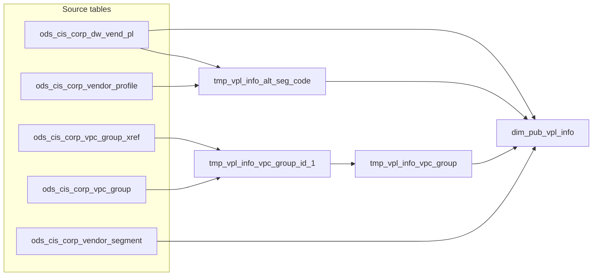

# DIM: Vendor product line (VPL) master attributes (`dim_pub_vpl_info`)

- artifact_type: etl_table
- artifact_id: dim_us.dim_pub_vpl_info
- domain: vendor
- one_line_purpose: This job builds the country-scoped vendor product line dimension from corporate VPL master data. It enriches each VPL with alternate segment codes, segment names, and the highest-priority active BRPT VPC group assignment. Analysts and opera...
- layer_type: DIM
- source_kind: etl_sql
- evidence_source: source/etl/sql/vendor/source/etl/flows/public_order_tools/ingest/public_vpl_dimension/script/dim_pub_vpl_info.sql

---

## L1 Data Foundation

### Identity and physical mapping
- **Table:** `dim_us.dim_pub_vpl_info`
- **Layer type:** DIM
- **Canonical / derived:** Derived / ETL-loaded (see L3)
- **Owner team:** not registered in metadata catalog

### Grain, scope, exclusions
- **Grain:** one row per `vpl_no` from `ods_cis_corp_dw_vend_pl`.
- **Scope:** See L2 business purpose / L3 filters
- **Partition:** not partitioned in this script (full overwrite of `dim_pub_vpl_info`). - resolved from pipeline (see L4)
- **Natural key:** `vpl_no` (within a country schema).
- **Exclusions:** Not documented in repository

#### Grain detail (preserved)

- **Grain:** one row per `vpl_no` from `ods_cis_corp_dw_vend_pl`.
- **Partition:** not partitioned in this script (full overwrite of `dim_pub_vpl_info`).
- **Natural key:** `vpl_no` (within a country schema).

---

### Cross-engine presence
| Engine | Present | Canonical FQN | Notes |
|--------|---------|---------------|-------|
| Hive | yes | `dim_pub_vpl_info` | ETL target / intermediate per evidence script |
| Vertica | pending | `dim_pub_vpl_info` | Confirm via hive2vertica flow evidence / MCP |

### Physical schema reference

Pointer block only - full column catalog lives in WKB L1 storage JSON.

| Field | Value |
|-------|-------|
| **Authoritative catalog** | WKB L1 storage seed (not duplicated in this file) |
| **entity_id** | `dim_us.dim_pub_vpl_info` |
| **l1_catalog_seed** | `target/storage/wkb/snapshots/_snapshot_id_template/l1_catalog/{engine}_{schema}_{table}.json` |
| **column_count** | pending (run ddl_seed_writer) |
| **partition_keys** | `dim_pub_vpl_info` |
| **ddl_source** | pending Bitbucket DDL / Vertica metadata ingest |
| **retrieval** | `python -m tools.wkb.indexing.run_query --query "vendor dim_pub_vpl_info schema" --intent find_table_schema` |

### Lineage
| Object | Role |
|--------|------|
| `ods_${country_code}.ods_cis_corp_dw_vend_pl` | Primary source |
| `ods_${country_code}.ods_cis_corp_vendor_profile` | SEG fallback |
| `ods_${country_code}.ods_cis_corp_vpc_group_xref` / `ods_cis_corp_vpc_group` | VPC enrichment |
| `ods_${country_code}.ods_cis_corp_vendor_segment` | Segment name |
| `dim_${country_code}.dim_pub_vpl_info` | Target (overwrite) |

---

### Freshness and load path
| Item | Value |
|------|-------|
| Load pattern | See L3 end-to-end / INSERT pattern in evidence script |
| Schedule | Not documented in repository |
| Parameters | `country_code` (schema suffix for `ods_${country_code}` and `dim_${country_code}`) |


---

## L2 Declarative Knowledge

### Business purpose
This job builds the country-scoped vendor product line dimension from corporate VPL master data. It enriches each VPL with alternate segment codes, segment names, and the highest-priority active BRPT VPC group assignment. Analysts and operational reports use it to describe VPLs, link them to vendors, and classify them for BRPT and segment-based reporting.

---

### Audience and use cases
| Audience | How they benefit |
|----------|-----------------|
| **Procurement / vendor management** | VPL codes, descriptions, product type, DSV settings, and active flags for vendor-line analysis. |
| **BRPT / reporting** | `vpc_group_id`, `vpc_group_desc`, and `alt_seg_code` / `alt_seg_name` for segment and VPC group reporting. |
| **Downstream ETL** | Base table for `dim_pub_vpl_info_df` snapshots and Vertica sync jobs in `public_vpl_dimension` flows. |

---

### Identifier search profile
- Primary lookup keys: see natural key under L1 Grain.
- Use latest snapshot / active flags when documented in L3 filters.

### Time field semantics
- **date_flag / partition columns:** not partitioned in this script (full overwrite of `dim_pub_vpl_info`).
- Primary reporting filter should use the partition column(s) documented in L1; resolve values via L4.


### Metrics served

| Category | Column | Logical metric | Business reading |
|----------|--------|----------------|------------------|
| P&L adjustment / measure | `dsv_min_amt` | `dsv_min_amt` | dsv_min_amt at unspecified grain |

### Metric serving map

**Formula authority:** [`source/contracts/vendor/metric-index.md`](../../source/contracts/vendor/metric-index.md)

| Logical metric | Period scope | Physical column | Formula reference |
|----------------|--------------|-----------------|-------------------|
| `dsv_min_amt` | unspecified | `dsv_min_amt` | Not in metric-index.md |

### etl_metrics

No governed logical metrics from `source/contracts/vendor/metric-index.md` are mapped on this table.

---

### Metric serving map
N/A - not a `*_comb_mtd` / multi-period wide serving table (or map not present in legacy doc).


### Data products and column groups (preserved)

### Identifiers and relationships

- **VPL:** `vpl_no`, `vpl_code`, `vpl_desc`
- **Vendor:** `vend_no`
- **Alternate references:** `alt_vend_no`, `alt_vpl_no`

### Dimension columns (reporting-ready, pre-computed from source)

- `alt_seg_code` — resolved alternate segment code (VPL, alt VPL, or vendor SEG profile)
- `alt_seg_name` — segment name from `ods_cis_corp_vendor_segment`
- `vpc_group_id`, `vpc_group_desc` — selected BRPT VPC group (`group_code = 'BRPT'`)
- `prod_type`, `tax_code`, `active`, `ec_flag`, `dsv_type`, `dsv_min_amt`
- `bid_factor`, `retail_factor`, `call_price`
- `entry_datetime`, `entry_id`
- `etl_timestamp` — load time in `America/Los_Angeles`

---

### etl_metrics

#### `alt_seg_code`
- **Source:** [metric-index.md](../../source/contracts/vendor/metric-index.md#alt_seg_code)
- **Business definition:** Cascading fallback for alternate segment
```sql
If `p.alt_seg_code` empty/null, use alt VPL’s code if present, else vendor SEG `profile_c`, else `p.alt_seg_code
```

#### `etl_timestamp`
- **Source:** [metric-index.md](../../source/contracts/vendor/metric-index.md#etl_timestamp)
- **Business definition:** Pacific load timestamp
```sql
from_utc_timestamp(current_timestamp(), 'America/Los_Angeles')
```


---

## L3 Procedural Knowledge

### Query and routing rules
**Business filters:** Use partition / date keys from L1 grain for reporting scope.
**Technical predicates (load only):** See Key filters and step-by-step logic below.

### Dimension join patterns
| Dimension FQN | Join keys | Purpose | Evidence |
|---------------|-----------|---------|----------|
| See step-by-step / base tables | See L3 steps | Dimension enrichment | `source/etl/sql/vendor/source/etl/flows/public_order_tools/ingest/public_vpl_dimension/script/dim_pub_vpl_info.sql` |

### Key filters and ETL business logic
### Step 1 — `tmp_vpl_info_alt_seg_code`

**Source:** `ods_cis_corp_dw_vend_pl` (alias `p`), self-join on `alt_vpl_no`, SEG vendor profile subquery

**Filter (natural language):**
- SEG profile rows: `profile_type = 'SEG'` and `active = 'Y'`

**Derived columns:**

| Column | Formula | Plain language |
|--------|---------|----------------|
| `alt_seg_code` | If `p.alt_seg_code` empty/null, use alt VPL’s code if present, else vendor SEG `profile_c`, else `p.alt_seg_code` | Cascading fallback for alternate segment |

---

### Step 2 — `tmp_vpl_info_vpc_group_id_1`

**Source:** `ods_cis_corp_vpc_group_xref` join `ods_cis_corp_vpc_group`

**Filter:**
- `vg.group_code = 'BRPT'`
- `vg.active = 'Y'` and `vgx.active = 'Y'`

**Output:** `vpl_no`, `vpc_group_id`, `vpc_group_desc` for all qualifying BRPT links.

---

### Step 3 — `tmp_vpl_info_vpc_group`

**Source:** `tmp_vpl_info_vpc_group_id_1`

**Deduplication:** `row_number()` over `partition by vpl_no order by vpc_group_id desc`, keep `rno = 1`.

---

### Step 4 — Final `INSERT` into `dim_pub_vpl_info`

**From:** `ods_cis_corp_dw_vend_pl` `p`

**Left joins:**

| Join | Keys | Purpose |
|------|------|---------|
| `tmp_vpl_info_alt_seg_code` `vp` | `vpl_no` | Resolved `alt_seg_code` |
| `ods_cis_corp_vendor_segment` `seg` | `seg.seg_code = vp.alt_seg_code` | `alt_seg_name` |
| `tmp_vpl_info_vpc_group` `vg` | `vpl_no` | VPC group id/desc |

**Pass-through:** VPL master columns (`vpl_no`, `vend_no`, `vpl_code`, factors, tax, alt refs, ...

### Standard time-filter SQL
```sql
-- relative period filter using resolved partition value (see L4)
SELECT *
FROM dim_pub_vpl_info
WHERE /* partition predicate */ date_flag = '${partition_value}';
```

### End-to-end flow
**Runtime parameters:** `country_code`  
**Target table:** `dim_${country_code}.dim_pub_vpl_info` (no partition in INSERT).

1. Build `tmp_vpl_info_alt_seg_code` from `ods_cis_corp_dw_vend_pl` with alt-VPL and SEG profile fallback.
2. Build `tmp_vpl_info_vpc_group_id_1` from active BRPT VPC group xref + group master.
3. Deduplicate to `tmp_vpl_info_vpc_group` (one row per `vpl_no`, max `vpc_group_id`).
4. **Insert overwrite** into `dim_pub_vpl_info` from VPL master with joins to segment and VPC temps.



---


#### High-level stages (preserved)

| Stage | Business meaning |
|-------|-----------------|
| **Alternate segment resolution** | Derives `alt_seg_code` from the VPL row, its alternate VPL reference, or the vendor SEG profile when codes are blank. |
| **VPC group selection** | Picks one active BRPT VPC group per VPL (highest `vpc_group_id` when multiple exist). |
| **Dimension load** | Overwrites `dim_pub_vpl_info` with master attributes plus resolved segment and VPC group fields. |

**Parameters:** `country_code` (schema suffix for `ods_${country_code}` and `dim_${country_code}`)

---


### Base tables register
| Object | Role in this job |
|--------|-----------------|
| `ods_${country_code}.ods_cis_corp_dw_vend_pl` | Primary VPL master; drives grain and most attributes |
| `ods_${country_code}.ods_cis_corp_vendor_profile` | SEG profile (`profile_type = 'SEG'`, `active = 'Y'`) for `profile_c` fallback |
| `ods_${country_code}.ods_cis_corp_vpc_group_xref` | VPL-to-VPC-group links (active only) |
| `ods_${country_code}.ods_cis_corp_vpc_group` | VPC group descriptions; filtered to `group_code = 'BRPT'` and active |
| `ods_${country_code}.ods_cis_corp_vendor_segment` | Segment name lookup on `alt_seg_code` |

**Temporary views:** `tmp_vpl_info_alt_seg_code` → `tmp_vpl_info_vpc_group_id_1` → `tmp_vpl_info_vpc_group` → INSERT

---

### Step-by-step logic
### Step 1 — `tmp_vpl_info_alt_seg_code`

**Source:** `ods_cis_corp_dw_vend_pl` (alias `p`), self-join on `alt_vpl_no`, SEG vendor profile subquery

**Filter (natural language):**
- SEG profile rows: `profile_type = 'SEG'` and `active = 'Y'`

**Derived columns:**

| Column | Formula | Plain language |
|--------|---------|----------------|
| `alt_seg_code` | If `p.alt_seg_code` empty/null, use alt VPL’s code if present, else vendor SEG `profile_c`, else `p.alt_seg_code` | Cascading fallback for alternate segment |

---

### Step 2 — `tmp_vpl_info_vpc_group_id_1`

**Source:** `ods_cis_corp_vpc_group_xref` join `ods_cis_corp_vpc_group`

**Filter:**
- `vg.group_code = 'BRPT'`
- `vg.active = 'Y'` and `vgx.active = 'Y'`

**Output:** `vpl_no`, `vpc_group_id`, `vpc_group_desc` for all qualifying BRPT links.

---

### Step 3 — `tmp_vpl_info_vpc_group`

**Source:** `tmp_vpl_info_vpc_group_id_1`

**Deduplication:** `row_number()` over `partition by vpl_no order by vpc_group_id desc`, keep `rno = 1`.

---

### Step 4 — Final `INSERT` into `dim_pub_vpl_info`

**From:** `ods_cis_corp_dw_vend_pl` `p`

**Left joins:**

| Join | Keys | Purpose |
|------|------|---------|
| `tmp_vpl_info_alt_seg_code` `vp` | `vpl_no` | Resolved `alt_seg_code` |
| `ods_cis_corp_vendor_segment` `seg` | `seg.seg_code = vp.alt_seg_code` | `alt_seg_name` |
| `tmp_vpl_info_vpc_group` `vg` | `vpl_no` | VPC group id/desc |

**Pass-through:** VPL master columns (`vpl_no`, `vend_no`, `vpl_code`, factors, tax, alt refs, flags, DSV fields, etc.)

**Derived at INSERT:**

| Column | Formula | Plain language |
|--------|---------|----------------|
| `etl_timestamp` | `from_utc_timestamp(current_timestamp(), 'America/Los_Angeles')` | Pacific load timestamp |

---

### Relationship map (embedded)

| from_fqn | to_fqn | cardinality | join_keys | provenance |
|----------|--------|-------------|-----------|------------|
| `tmp_vpl_info_vpc_group_id_1)t` | `ods_${country_code}.ods_cis_corp_dw_vend_pl` | many:1 | `p.alt_vpl_no = table_alt.vpl_no` | etl_sql (source/etl/sql/vendor/public_order_scripts/public_vpl_dimension/script/dim_pub_vpl_info.sql:1) |
| `ods_${country_code}.ods_cis_corp_vpc_group_xref` | `ods_${country_code}.ods_cis_corp_vpc_group` | many:1 | `vgx.vpc_group_id = vg.vpc_group_id` | etl_sql (source/etl/sql/vendor/public_order_scripts/public_vpl_dimension/script/dim_pub_vpl_info.sql:1) |
| `ods_${country_code}.ods_cis_corp_dw_vend_pl` | `tmp_vpl_info_alt_seg_code` | many:1 | `p.vpl_no = vp.vpl_no` | etl_sql (source/etl/sql/vendor/public_order_scripts/public_vpl_dimension/script/dim_pub_vpl_info.sql:1) |
| `tmp_vpl_info_alt_seg_code` | `ods_${country_code}.ods_cis_corp_vendor_segment` | many:1 | `seg.seg_code = vp.alt_seg_code` | etl_sql (source/etl/sql/vendor/public_order_scripts/public_vpl_dimension/script/dim_pub_vpl_info.sql:1) |
| `ods_${country_code}.ods_cis_corp_dw_vend_pl` | `tmp_vpl_info_vpc_group` | many:1 | `p.vpl_no = vg.vpl_no;` | etl_sql (source/etl/sql/vendor/public_order_scripts/public_vpl_dimension/script/dim_pub_vpl_info.sql:1) |

`source/ref/vendor/table relationship.txt`: Not documented in repository.

### Special logic (embedded)

Not documented in repository

### Column / field derivations (from ETL SQL)

| target_column | expression_sql | upstream_columns | upstream_tables | transform_kind | evidence |
|---------------|----------------|------------------|-----------------|----------------|----------|
| `vpl_no` | `p.vpl_no` | `vpl_no` | `ods_${country_code}.ods_cis_corp_dw_vend_pl`, `tmp_vpl_info_alt_seg_code`, `ods_${country_code}.ods_cis_corp_vendor_segment`, `tmp_vpl_info_vpc_group` | passthrough | `source/etl/sql/vendor/public_order_scripts/public_vpl_dimension/script/dim_pub_vpl_info.sql:3` |
| `vend_no` | `p.vend_no` | `vend_no` | `ods_${country_code}.ods_cis_corp_dw_vend_pl`, `tmp_vpl_info_alt_seg_code`, `ods_${country_code}.ods_cis_corp_vendor_segment`, `tmp_vpl_info_vpc_group` | passthrough | `source/etl/sql/vendor/public_order_scripts/public_vpl_dimension/script/dim_pub_vpl_info.sql:15` |
| `vpl_code` | `p.vpl_code` | `vpl_code` | `ods_${country_code}.ods_cis_corp_dw_vend_pl`, `tmp_vpl_info_alt_seg_code`, `ods_${country_code}.ods_cis_corp_vendor_segment`, `tmp_vpl_info_vpc_group` | passthrough | `source/etl/sql/vendor/public_order_scripts/public_vpl_dimension/script/dim_pub_vpl_info.sql:59` |
| `vpl_desc` | `p.vpl_desc` | `vpl_desc` | `ods_${country_code}.ods_cis_corp_dw_vend_pl`, `tmp_vpl_info_alt_seg_code`, `ods_${country_code}.ods_cis_corp_vendor_segment`, `tmp_vpl_info_vpc_group` | passthrough | `source/etl/sql/vendor/public_order_scripts/public_vpl_dimension/script/dim_pub_vpl_info.sql:60` |
| `entry_datetime` | `p.entry_datetime` | `entry_datetime` | `ods_${country_code}.ods_cis_corp_dw_vend_pl`, `tmp_vpl_info_alt_seg_code`, `ods_${country_code}.ods_cis_corp_vendor_segment`, `tmp_vpl_info_vpc_group` | passthrough | `source/etl/sql/vendor/public_order_scripts/public_vpl_dimension/script/dim_pub_vpl_info.sql:61` |
| `entry_id` | `p.entry_id` | `entry_id` | `ods_${country_code}.ods_cis_corp_dw_vend_pl`, `tmp_vpl_info_alt_seg_code`, `ods_${country_code}.ods_cis_corp_vendor_segment`, `tmp_vpl_info_vpc_group` | passthrough | `source/etl/sql/vendor/public_order_scripts/public_vpl_dimension/script/dim_pub_vpl_info.sql:62` |
| `bid_factor` | `p.bid_factor` | `bid_factor` | `ods_${country_code}.ods_cis_corp_dw_vend_pl`, `tmp_vpl_info_alt_seg_code`, `ods_${country_code}.ods_cis_corp_vendor_segment`, `tmp_vpl_info_vpc_group` | passthrough | `source/etl/sql/vendor/public_order_scripts/public_vpl_dimension/script/dim_pub_vpl_info.sql:63` |
| `retail_factor` | `p.retail_factor` | `retail_factor` | `ods_${country_code}.ods_cis_corp_dw_vend_pl`, `tmp_vpl_info_alt_seg_code`, `ods_${country_code}.ods_cis_corp_vendor_segment`, `tmp_vpl_info_vpc_group` | passthrough | `source/etl/sql/vendor/public_order_scripts/public_vpl_dimension/script/dim_pub_vpl_info.sql:64` |
| `tax_code` | `p.tax_code` | `tax_code` | `ods_${country_code}.ods_cis_corp_dw_vend_pl`, `tmp_vpl_info_alt_seg_code`, `ods_${country_code}.ods_cis_corp_vendor_segment`, `tmp_vpl_info_vpc_group` | passthrough | `source/etl/sql/vendor/public_order_scripts/public_vpl_dimension/script/dim_pub_vpl_info.sql:65` |
| `alt_vend_no` | `p.alt_vend_no` | `alt_vend_no` | `ods_${country_code}.ods_cis_corp_dw_vend_pl`, `tmp_vpl_info_alt_seg_code`, `ods_${country_code}.ods_cis_corp_vendor_segment`, `tmp_vpl_info_vpc_group` | passthrough | `source/etl/sql/vendor/public_order_scripts/public_vpl_dimension/script/dim_pub_vpl_info.sql:66` |
| `alt_vpl_no` | `p.alt_vpl_no` | `alt_vpl_no` | `ods_${country_code}.ods_cis_corp_dw_vend_pl`, `tmp_vpl_info_alt_seg_code`, `ods_${country_code}.ods_cis_corp_vendor_segment`, `tmp_vpl_info_vpc_group` | passthrough | `source/etl/sql/vendor/public_order_scripts/public_vpl_dimension/script/dim_pub_vpl_info.sql:10` |
| `call_price` | `p.call_price` | `call_price` | `ods_${country_code}.ods_cis_corp_dw_vend_pl`, `tmp_vpl_info_alt_seg_code`, `ods_${country_code}.ods_cis_corp_vendor_segment`, `tmp_vpl_info_vpc_group` | passthrough | `source/etl/sql/vendor/public_order_scripts/public_vpl_dimension/script/dim_pub_vpl_info.sql:68` |
| `prod_type` | `p.prod_type` | `prod_type` | `ods_${country_code}.ods_cis_corp_dw_vend_pl`, `tmp_vpl_info_alt_seg_code`, `ods_${country_code}.ods_cis_corp_vendor_segment`, `tmp_vpl_info_vpc_group` | passthrough | `source/etl/sql/vendor/public_order_scripts/public_vpl_dimension/script/dim_pub_vpl_info.sql:69` |
| `alt_seg_code` | `vp.alt_seg_code` | `alt_seg_code` | `ods_${country_code}.ods_cis_corp_dw_vend_pl`, `tmp_vpl_info_alt_seg_code`, `ods_${country_code}.ods_cis_corp_vendor_segment`, `tmp_vpl_info_vpc_group` | passthrough | `source/etl/sql/vendor/public_order_scripts/public_vpl_dimension/script/dim_pub_vpl_info.sql:70` |
| `active` | `p.active` | `active` | `ods_${country_code}.ods_cis_corp_dw_vend_pl`, `tmp_vpl_info_alt_seg_code`, `ods_${country_code}.ods_cis_corp_vendor_segment`, `tmp_vpl_info_vpc_group` | passthrough | `source/etl/sql/vendor/public_order_scripts/public_vpl_dimension/script/dim_pub_vpl_info.sql:71` |
| `ec_flag` | `p.ec_flag` | `ec_flag` | `ods_${country_code}.ods_cis_corp_dw_vend_pl`, `tmp_vpl_info_alt_seg_code`, `ods_${country_code}.ods_cis_corp_vendor_segment`, `tmp_vpl_info_vpc_group` | passthrough | `source/etl/sql/vendor/public_order_scripts/public_vpl_dimension/script/dim_pub_vpl_info.sql:72` |
| `dsv_type` | `p.dsv_type` | `dsv_type` | `ods_${country_code}.ods_cis_corp_dw_vend_pl`, `tmp_vpl_info_alt_seg_code`, `ods_${country_code}.ods_cis_corp_vendor_segment`, `tmp_vpl_info_vpc_group` | passthrough | `source/etl/sql/vendor/public_order_scripts/public_vpl_dimension/script/dim_pub_vpl_info.sql:73` |
| `dsv_min_amt` | `p.dsv_min_amt` | `dsv_min_amt` | `ods_${country_code}.ods_cis_corp_dw_vend_pl`, `tmp_vpl_info_alt_seg_code`, `ods_${country_code}.ods_cis_corp_vendor_segment`, `tmp_vpl_info_vpc_group` | passthrough | `source/etl/sql/vendor/public_order_scripts/public_vpl_dimension/script/dim_pub_vpl_info.sql:74` |
| `alt_seg_name` | `seg.seg_name alt_seg_name` | `seg_name`, `alt_seg_name` | `ods_${country_code}.ods_cis_corp_dw_vend_pl`, `tmp_vpl_info_alt_seg_code`, `ods_${country_code}.ods_cis_corp_vendor_segment`, `tmp_vpl_info_vpc_group` | partial | `source/etl/sql/vendor/public_order_scripts/public_vpl_dimension/script/dim_pub_vpl_info.sql:75` |
| `vpc_group_id` | `vg.vpc_group_id` | `vpc_group_id` | `ods_${country_code}.ods_cis_corp_dw_vend_pl`, `tmp_vpl_info_alt_seg_code`, `ods_${country_code}.ods_cis_corp_vendor_segment`, `tmp_vpl_info_vpc_group` | passthrough | `source/etl/sql/vendor/public_order_scripts/public_vpl_dimension/script/dim_pub_vpl_info.sql:23` |
| `etl_timestamp` | `from_utc_timestamp(current_timestamp(),'America/Los_Angeles')` | `from_utc_timestamp`, `current_timestamp`, `America`, `Los_Angeles` | `ods_${country_code}.ods_cis_corp_dw_vend_pl`, `tmp_vpl_info_alt_seg_code`, `ods_${country_code}.ods_cis_corp_vendor_segment`, `tmp_vpl_info_vpc_group` | arithmetic | `source/etl/sql/vendor/public_order_scripts/public_vpl_dimension/script/dim_pub_vpl_info.sql:77` |
| `vpc_group_desc` | `vg.vpc_group_desc` | `vpc_group_desc` | `ods_${country_code}.ods_cis_corp_dw_vend_pl`, `tmp_vpl_info_alt_seg_code`, `ods_${country_code}.ods_cis_corp_vendor_segment`, `tmp_vpl_info_vpc_group` | passthrough | `source/etl/sql/vendor/public_order_scripts/public_vpl_dimension/script/dim_pub_vpl_info.sql:24` |

### Sentinel and code values
| Value | Meaning |
|-------|---------|
| `group_code = 'BRPT'` | Only BRPT VPC groups are considered for `vpc_group_id` |
| `profile_type = 'SEG'` | Vendor profile used for segment fallback |
| Empty/null `alt_seg_code` on VPL | Triggers alt-VPL then vendor profile fallback chain |

---

---

## L4 Validation

### Resolved partition value
| Step | Source | How partition / date scope is determined |
|------|--------|------------------------------------------|
| 1 | evidence script / flow | See parameters in L1 Freshness and L3 filters - `source/etl/sql/vendor/source/etl/flows/public_order_tools/ingest/public_vpl_dimension/script/dim_pub_vpl_info.sql` |

**Plain language:** Partition and date scope follow Azkaban/bootstrap parameters documented in the source script and orchestrating flow; do not hardcode calendar literals.

### Data quality checks
- Prefer row-count-by-partition, metric sums, and grain duplicate checks (see Validation SQL).
- Additional checks from legacy caveats / operational notes when present.

### Validation SQL
```sql
-- 1) Row count by partition
SELECT ${partition_col}, COUNT(*) AS row_cnt
FROM dim_${country_code}.dim_pub_vpl_info
WHERE ${partition_col} = '${partition_value}'
GROUP BY ${partition_col};

-- 2) Metric sum by business dimension (top deltas)
SELECT ${dim_key}, SUM(${metric}) AS metric_sum
FROM dim_${country_code}.dim_pub_vpl_info
WHERE ${partition_col} = '${partition_value}'
GROUP BY ${dim_key}
ORDER BY ABS(SUM(${metric})) DESC
LIMIT 20;

-- 3) Grain duplicate check
SELECT ${grain_key_1}, ${grain_key_2}, ${grain_key_3}, ${partition_col}, COUNT(*) AS cnt
FROM dim_${country_code}.dim_pub_vpl_info
WHERE ${partition_col} = '${partition_value}'
GROUP BY ${grain_key_1}, ${grain_key_2}, ${grain_key_3}, ${partition_col}
HAVING COUNT(*) > 1;
```

Replace placeholders from this file's Grain and keys / Data you can fetch sections, and use the resolved partition value from run scope.

### Caveats for interpretation
- When multiple BRPT VPC groups exist for a VPL, only the row with the **largest** `vpc_group_id` is kept.
- `alt_seg_name` depends on a successful join to vendor segment; missing segment master leaves name null.
- This batch job reads non-`_hudi_rt` ODS tables; near-real-time attributes are built by `dim_pub_vpl_info_rt.sql` separately.

---

### Conflicts and open questions
- Schedule, owner, SLA: Not documented in repository (unless preserved schedule evidence above).
- Vertica MCP verification: pending unless confirmed in L5.


---

## L5 Runtime View

### Query path and engine preference
| Role | Hive object | Vertica object | Sync mode | Evidence | MCP verified |
|------|-------------|----------------|-----------|----------|--------------|
| **Query for reporting** | *See script lineage* | `dim_${country_code}.dim_pub_vpl_info` | *Verify from flow* | *Add flow file:line* | pending |
| **Hive alternative** | `*` | `dim_${country_code}.dim_pub_vpl_info` | - | *See dependencies* | - |
| **ETL internal** | staging/temp tables | *Not synced to Vertica* | - | *See step-by-step logic* | - |

Business users should query `dim_${country_code}.dim_pub_vpl_info` in Vertica once MCP verification is completed for this document.

### Access constraints
- Country / company schema parameters may apply (`literal_country`, `company_no`, etc.).
- Hive-only staging objects are not reporting surfaces unless synced.

### Query risk profile
| Field | Value |
|-------|-------|
| requires_date_predicate | yes |
| scan_risk_tier | medium |

---

## L6 Access and Consumption

### Primary consumers and use cases
| Audience | How they benefit |
|----------|-----------------|
| **Procurement / vendor management** | VPL codes, descriptions, product type, DSV settings, and active flags for vendor-line analysis. |
| **BRPT / reporting** | `vpc_group_id`, `vpc_group_desc`, and `alt_seg_code` / `alt_seg_name` for segment and VPC group reporting. |
| **Downstream ETL** | Base table for `dim_pub_vpl_info_df` snapshots and Vertica sync jobs in `public_vpl_dimension` flows. |

---

### Representative query patterns
```sql
-- certified / illustrative lookup - replace predicates from L1/L4
SELECT *
FROM dim_pub_vpl_info
WHERE date_flag = '${partition_value}'
LIMIT 100;
```

### Dependencies and notes
### Upstream objects (verified)

| Object | Usage | Evidence |
|--------|-------|----------|
| `ods_${country_code}.ods_cis_corp_dw_vend_pl` | VPL master grain | `source/etl/sql/vendor/source/etl/flows/public_order_tools/ingest/public_vpl_dimension/script/dim_pub_vpl_info.sql:8-9`, `dim_pub_vpl_info.sql:80` |
| `ods_${country_code}.ods_cis_corp_vendor_profile` | SEG profile fallback | `dim_pub_vpl_info.sql:12-15` |
| `ods_${country_code}.ods_cis_corp_vpc_group_xref` | VPC xref | `dim_pub_vpl_info.sql:27-28` |
| `ods_${country_code}.ods_cis_corp_vpc_group` | BRPT group filter | `dim_pub_vpl_info.sql:28-33` |
| `ods_${country_code}.ods_cis_corp_vendor_segment` | Segment name | `dim_pub_vpl_info.sql:83-85` |

### Downstream consumers (verified)

| Object / script | Evidence |
|-----------------|----------|
| `dim_${country_code}.dim_pub_vpl_info_df` | Reads `dim_pub_vpl_info` | `vendor/.../dim_pub_vpl_info_df.sql:4` (git) |
| `hive2vertica_dim_pub_vpl_info` | Syncs full table | `source/etl/flows/public_order_tools/ingest/public_vpl_dimension/public_vpl_dimension_us.flow:102-109` |
| `relyon_dim_pub_vpl_info` (brpt_patch) | Azkaban dependency | `source/etl/flows/data_service/brpt_patch/load_brpt_patch_us.flow:108-115` |

### Operational detail (verified)

- Load mode: `insert overwrite` full table (`dim_pub_vpl_info.sql:55`)
- Flow job `dim_pub_vpl_info` depends on CDC of vend_pl, vendor_profile, vendor_segment (`public_vpl_dimension_us.flow:41-48`)
- Schedule example (US flow config): `0 15 1 * * ? *` (`public_vpl_dimension_us.flow:11`)

### Not documented in repository

- Column-level business definitions for source CIS fields
- Retention policy for `dim_pub_vpl_info`

### Related scripts (verified)

- `dim_pub_vpl_info_df.sql` — date-flag snapshot from this table
- `dim_pub_vpl_info_rt.sql` — Hudi RT variant of same enrichment pattern

---

*Document generated from `source/etl/sql/vendor/source/etl/flows/public_order_tools/ingest/public_vpl_dimension/script/dim_pub_vpl_info.sql`.*

#### Not documented in repository
- Owner, SLA (unless schedule evidence preserved above)
- Any dependency without `file:line` evidence in this document

---

*Document migrated to L1-L6 from legacy Knowledgebase content. Evidence: `source/etl/sql/vendor/source/etl/flows/public_order_tools/ingest/public_vpl_dimension/script/dim_pub_vpl_info.sql`.*
