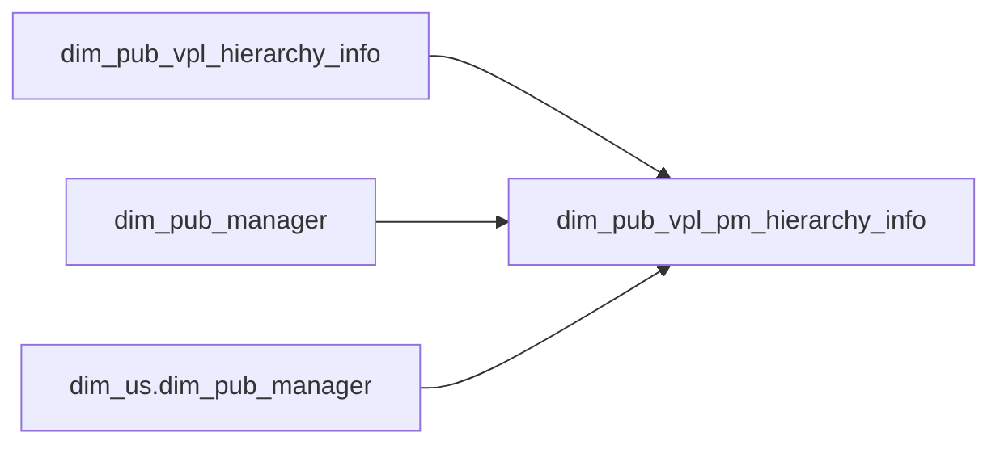

# DIM: Product manager hierarchy with assignment labels (`dim_pub_vpl_pm_hierarchy_info`)

- artifact_type: etl_table
- artifact_id: dim_us.dim_pub_vpl_pm_hierarchy_info
- domain: vendor
- one_line_purpose: This job publishes a PM-focused slice of the VPL hierarchy dimension, adding human-readable assignment status on PM names. When a PM user ID is missing it labels the name as "No Assignment"; when the manager record has a termination date it...
- layer_type: DIM
- source_kind: etl_sql
- evidence_source: source/etl/sql/vendor/source/etl/flows/public_order_tools/ingest/public_vpl_dimension/script/dim_pub_vpl_pm_hierarchy_info.sql

---

## L1 Data Foundation

### Identity and physical mapping
- **Table:** `dim_us.dim_pub_vpl_pm_hierarchy_info`
- **Layer type:** DIM
- **Canonical / derived:** Derived / ETL-loaded (see L3)
- **Owner team:** not registered in metadata catalog

### Grain, scope, exclusions
- **Grain:** one row per `(vend_no, vpl_no)` from source hierarchy (same as upstream).
- **Scope:** See L2 business purpose / L3 filters
- **Partition:** none. - resolved from pipeline (see L4)
- **Natural key:** `vend_no`, `vpl_no`
- **Exclusions:** Not documented in repository

#### Grain detail (preserved)

- **Grain:** one row per `(vend_no, vpl_no)` from source hierarchy (same as upstream).
- **Partition:** none.
- **Natural key:** `vend_no`, `vpl_no`

---

### Cross-engine presence
| Engine | Present | Canonical FQN | Notes |
|--------|---------|---------------|-------|
| Hive | yes | `dim_pub_vpl_pm_hierarchy_info` | ETL target / intermediate per evidence script |
| Vertica | pending | `dim_pub_vpl_pm_hierarchy_info` | Confirm via hive2vertica flow evidence / MCP |

### Physical schema reference

Pointer block only - full column catalog lives in WKB L1 storage JSON.

| Field | Value |
|-------|-------|
| **Authoritative catalog** | WKB L1 storage seed (not duplicated in this file) |
| **entity_id** | `dim_us.dim_pub_vpl_pm_hierarchy_info` |
| **l1_catalog_seed** | `target/storage/wkb/snapshots/_snapshot_id_template/l1_catalog/{engine}_{schema}_{table}.json` |
| **column_count** | pending (run ddl_seed_writer) |
| **partition_keys** | `none.` |
| **ddl_source** | pending Bitbucket DDL / Vertica metadata ingest |
| **retrieval** | `python -m tools.wkb.indexing.run_query --query "vendor dim_pub_vpl_pm_hierarchy_info schema" --intent find_table_schema` |

### Lineage
See L6 Dependencies and notes.

### Freshness and load path
| Item | Value |
|------|-------|
| Load pattern | See L3 end-to-end / INSERT pattern in evidence script |
| Schedule | Not documented in repository |
| Parameters | `country_code` |


---

## L2 Declarative Knowledge

### Business purpose
This job publishes a PM-focused slice of the VPL hierarchy dimension, adding human-readable assignment status on PM names. When a PM user ID is missing it labels the name as "No Assignment"; when the manager record has a termination date it appends "(Termed)" to the display name. Dashboards and extracts that only need PM accountability chains can use this narrower table.

---

### Audience and use cases
| Audience | How they benefit |
|----------|-----------------|
| **PM / vendor operations** | Clear PM, director, manager, VP, and backup contacts per VPL. |
| **Reporting** | Distinguishes unassigned vs termed employees without separate manager joins. |

---

### Identifier search profile
- Primary lookup keys: see natural key under L1 Grain.
- Use latest snapshot / active flags when documented in L3 filters.

### Time field semantics
- **date_flag / partition columns:** none.
- Primary reporting filter should use the partition column(s) documented in L1; resolve values via L4.


### Metrics served

| Category | Column | Logical metric | Business reading |
|----------|--------|----------------|------------------|
| Measures | — | — | No measure columns mapped for this table. |

### Metric serving map

**Formula authority:** [`source/contracts/vendor/metric-index.md`](../../source/contracts/vendor/metric-index.md)

N/A — no measure columns mapped for this table.

### etl_metrics

No governed logical metrics from `source/contracts/vendor/metric-index.md` are mapped on this table.

---

### Metric serving map
N/A - not a `*_comb_mtd` / multi-period wide serving table (or map not present in legacy doc).


### Data products and column groups (preserved)

- Keys: `vend_no`, `vpl_no`
- PM chain: `pm_vp_id`, `pm_vp_name`, `pm_vp_email`, `pm_director_id`, `pm_director_name`, `pm_director_email`, `pm_manager_id`, `pm_manager_name`, `pm_manager_email`, `pm_id`, `pm_name`, `pm_email`, `pm_primary_backup_id`, `pm_primary_backup_name`, `pm_primary_backup_email`
- `etl_timestamp`

Display names (`pm_vp_name`, etc.) are **derived** in this job; IDs and emails pass through from hierarchy.

---

### etl_metrics

N/A - no calculable ETL formulas extracted from this document (passthrough / stored measures only, or formulas not documented).

---

## L3 Procedural Knowledge

### Query and routing rules
**Business filters:** Use partition / date keys from L1 grain for reporting scope.
**Technical predicates (load only):** See Key filters and step-by-step logic below.

### Dimension join patterns
| Dimension FQN | Join keys | Purpose | Evidence |
|---------------|-----------|---------|----------|
| See step-by-step / base tables | See L3 steps | Dimension enrichment | `source/etl/sql/vendor/source/etl/flows/public_order_tools/ingest/public_vpl_dimension/script/dim_pub_vpl_pm_hierarchy_info.sql` |

### Key filters and ETL business logic
### Final `INSERT` into `dim_pub_vpl_pm_hierarchy_info`

**From:** `dim_${country_code}.dim_pub_vpl_hierarchy_info` `vh`

**Left joins:**

| Join | Keys | Purpose |
|------|------|---------|
| `dim_us.dim_pub_manager` `vp` | `pm_vp_id = userid` | VP term date (US manager table) |
| `dim_${country_code}.dim_pub_manager` `dir` | `pm_director_id` | Director term date |
| `dim_${country_code}.dim_pub_manager` `mgr` | `pm_manager_id` | Manager term date |
| `dim_${country_code}.dim_pub_manager` `pm` | `pm_id` | PM term date |
| `dim_${country_code}.dim_pub_manager` `bak` | `pm_primary_backup_id` | Backup term date |

**Derived columns (name fields):**

| Column | Formula | Plain language |
|--------|---------|----------------|
| `pm_vp_name` | null id → `'No Assignment'`; else if `vp.termdate` null then name else `concat(name,'(Termed)')` | VP display label |
| `pm_director_name` | Same pattern with `dir.termdate` | Director display label |
| `pm_manager_name` | Same with `mgr.termdate` | Manager display label |
| `pm_name` | Same with `pm.termdate`; uses `pm_name` in termed branch | PM display label |
| `pm_primary_backup_name` | Same with `bak.termdate` | Backup display label |

**Pass-through:** all `pm_*_id` and `pm_*_email` columns from `vh`.

---

### Standard time-filter SQL
```sql
-- relative period filter using resolved partition value (see L4)
SELECT *
FROM dim_pub_vpl_pm_hierarchy_info
WHERE /* partition predicate */ date_flag = '${partition_value}';
```

### End-to-end flow
**Target:** `dim_${country_code}.dim_pub_vpl_pm_hierarchy_info`

1. Read `dim_pub_vpl_hierarchy_info` `vh`.
2. Left join manager dimension on each PM role userid.
3. CASE expressions on names for null ID → `'No Assignment'`, termed → `concat(name, '(Termed)')` or `' (Termed)'`.
4. Insert overwrite.



---


#### High-level stages (preserved)

| Stage | Business meaning |
|-------|-----------------|
| **Read hierarchy** | Selects PM columns from `dim_pub_vpl_hierarchy_info`. |
| **Term / assignment labeling** | Joins `dim_pub_manager` (and `dim_us.dim_pub_manager` for VP) to adjust `pm_*_name` display values. |
| **Load** | Overwrites `dim_pub_vpl_pm_hierarchy_info` with IDs, emails, labeled names, and `etl_timestamp`. |

**Parameters:** `country_code`

---


### Base tables register
None identified in repository

### Step-by-step logic
### Final `INSERT` into `dim_pub_vpl_pm_hierarchy_info`

**From:** `dim_${country_code}.dim_pub_vpl_hierarchy_info` `vh`

**Left joins:**

| Join | Keys | Purpose |
|------|------|---------|
| `dim_us.dim_pub_manager` `vp` | `pm_vp_id = userid` | VP term date (US manager table) |
| `dim_${country_code}.dim_pub_manager` `dir` | `pm_director_id` | Director term date |
| `dim_${country_code}.dim_pub_manager` `mgr` | `pm_manager_id` | Manager term date |
| `dim_${country_code}.dim_pub_manager` `pm` | `pm_id` | PM term date |
| `dim_${country_code}.dim_pub_manager` `bak` | `pm_primary_backup_id` | Backup term date |

**Derived columns (name fields):**

| Column | Formula | Plain language |
|--------|---------|----------------|
| `pm_vp_name` | null id → `'No Assignment'`; else if `vp.termdate` null then name else `concat(name,'(Termed)')` | VP display label |
| `pm_director_name` | Same pattern with `dir.termdate` | Director display label |
| `pm_manager_name` | Same with `mgr.termdate` | Manager display label |
| `pm_name` | Same with `pm.termdate`; uses `pm_name` in termed branch | PM display label |
| `pm_primary_backup_name` | Same with `bak.termdate` | Backup display label |

**Pass-through:** all `pm_*_id` and `pm_*_email` columns from `vh`.

---

### Relationship map (embedded)

| from_fqn | to_fqn | cardinality | join_keys | provenance |
|----------|--------|-------------|-----------|------------|
| `dim_${country_code}.dim_pub_vpl_hierarchy_info` | `dim_us.dim_pub_manager` | many:1 | `vh.pm_vp_id = vp.userid` | etl_sql (source/etl/sql/vendor/public_order_scripts/public_vpl_dimension/script/dim_pub_vpl_pm_hierarchy_info.sql:1) |
| `dim_${country_code}.dim_pub_vpl_hierarchy_info` | `dim_${country_code}.dim_pub_manager` | many:1 | `vh.pm_director_id = dir.userid` | etl_sql (source/etl/sql/vendor/public_order_scripts/public_vpl_dimension/script/dim_pub_vpl_pm_hierarchy_info.sql:1) |
| `dim_${country_code}.dim_pub_vpl_hierarchy_info` | `dim_${country_code}.dim_pub_manager` | many:1 | `vh.pm_manager_id = mgr.userid` | etl_sql (source/etl/sql/vendor/public_order_scripts/public_vpl_dimension/script/dim_pub_vpl_pm_hierarchy_info.sql:1) |
| `dim_${country_code}.dim_pub_vpl_hierarchy_info` | `dim_${country_code}.dim_pub_manager` | many:1 | `vh.pm_id = pm.userid` | etl_sql (source/etl/sql/vendor/public_order_scripts/public_vpl_dimension/script/dim_pub_vpl_pm_hierarchy_info.sql:1) |
| `dim_${country_code}.dim_pub_vpl_hierarchy_info` | `dim_${country_code}.dim_pub_manager` | many:1 | `vh.pm_primary_backup_id = bak.userid;` | etl_sql (source/etl/sql/vendor/public_order_scripts/public_vpl_dimension/script/dim_pub_vpl_pm_hierarchy_info.sql:1) |

`source/ref/vendor/table relationship.txt`: Not documented in repository.

### Special logic (embedded)

Not documented in repository

### Column / field derivations (from ETL SQL)

| target_column | expression_sql | upstream_columns | upstream_tables | transform_kind | evidence |
|---------------|----------------|------------------|-----------------|----------------|----------|
| `vend_no` | `vh.vend_no` | `vend_no` | `dim_${country_code}.dim_pub_vpl_hierarchy_info`, `dim_us.dim_pub_manager`, `dim_${country_code}.dim_pub_manager` | passthrough | `source/etl/sql/vendor/public_order_scripts/public_vpl_dimension/script/dim_pub_vpl_pm_hierarchy_info.sql:3` |
| `vpl_no` | `vh.vpl_no` | `vpl_no` | `dim_${country_code}.dim_pub_vpl_hierarchy_info`, `dim_us.dim_pub_manager`, `dim_${country_code}.dim_pub_manager` | passthrough | `source/etl/sql/vendor/public_order_scripts/public_vpl_dimension/script/dim_pub_vpl_pm_hierarchy_info.sql:4` |
| `pm_vp_id` | `vh.pm_vp_id` | `pm_vp_id` | `dim_${country_code}.dim_pub_vpl_hierarchy_info`, `dim_us.dim_pub_manager`, `dim_${country_code}.dim_pub_manager` | passthrough | `source/etl/sql/vendor/public_order_scripts/public_vpl_dimension/script/dim_pub_vpl_pm_hierarchy_info.sql:5` |
| `pm_vp_name` | `case when vh.pm_vp_id is null then 'No Assignment' when vp.termdate is null then vh.pm_vp_name else concat(vh.pm_vp_n...` | `pm_vp_id`, `No`, `Assignment`, `termdate`, `pm_vp_name`, `Termed` | `dim_${country_code}.dim_pub_vpl_hierarchy_info`, `dim_us.dim_pub_manager`, `dim_${country_code}.dim_pub_manager` | case | `source/etl/sql/vendor/public_order_scripts/public_vpl_dimension/script/dim_pub_vpl_pm_hierarchy_info.sql:2` |
| `pm_vp_email` | `vh.pm_vp_email` | `pm_vp_email` | `dim_${country_code}.dim_pub_vpl_hierarchy_info`, `dim_us.dim_pub_manager`, `dim_${country_code}.dim_pub_manager` | passthrough | `source/etl/sql/vendor/public_order_scripts/public_vpl_dimension/script/dim_pub_vpl_pm_hierarchy_info.sql:11` |
| `pm_director_id` | `vh.pm_director_id` | `pm_director_id` | `dim_${country_code}.dim_pub_vpl_hierarchy_info`, `dim_us.dim_pub_manager`, `dim_${country_code}.dim_pub_manager` | passthrough | `source/etl/sql/vendor/public_order_scripts/public_vpl_dimension/script/dim_pub_vpl_pm_hierarchy_info.sql:12` |
| `pm_director_name` | `case when vh.pm_director_id is null then 'No Assignment' when dir.termdate is null then vh.pm_director_name else conc...` | `pm_director_id`, `No`, `Assignment`, `termdate`, `pm_director_name`, `Termed` | `dim_${country_code}.dim_pub_vpl_hierarchy_info`, `dim_us.dim_pub_manager`, `dim_${country_code}.dim_pub_manager` | case | `source/etl/sql/vendor/public_order_scripts/public_vpl_dimension/script/dim_pub_vpl_pm_hierarchy_info.sql:2` |
| `pm_director_email` | `vh.pm_director_email` | `pm_director_email` | `dim_${country_code}.dim_pub_vpl_hierarchy_info`, `dim_us.dim_pub_manager`, `dim_${country_code}.dim_pub_manager` | passthrough | `source/etl/sql/vendor/public_order_scripts/public_vpl_dimension/script/dim_pub_vpl_pm_hierarchy_info.sql:18` |
| `pm_manager_id` | `vh.pm_manager_id` | `pm_manager_id` | `dim_${country_code}.dim_pub_vpl_hierarchy_info`, `dim_us.dim_pub_manager`, `dim_${country_code}.dim_pub_manager` | passthrough | `source/etl/sql/vendor/public_order_scripts/public_vpl_dimension/script/dim_pub_vpl_pm_hierarchy_info.sql:19` |
| `pm_manager_name` | `case when vh.pm_manager_id is null then 'No Assignment' when mgr.termdate is null then pm_manager_name else concat(vh...` | `pm_manager_id`, `No`, `Assignment`, `termdate`, `pm_manager_name`, `Termed` | `dim_${country_code}.dim_pub_vpl_hierarchy_info`, `dim_us.dim_pub_manager`, `dim_${country_code}.dim_pub_manager` | case | `source/etl/sql/vendor/public_order_scripts/public_vpl_dimension/script/dim_pub_vpl_pm_hierarchy_info.sql:2` |
| `pm_manager_email` | `vh.pm_manager_email` | `pm_manager_email` | `dim_${country_code}.dim_pub_vpl_hierarchy_info`, `dim_us.dim_pub_manager`, `dim_${country_code}.dim_pub_manager` | passthrough | `source/etl/sql/vendor/public_order_scripts/public_vpl_dimension/script/dim_pub_vpl_pm_hierarchy_info.sql:25` |
| `pm_id` | `vh.pm_id` | `pm_id` | `dim_${country_code}.dim_pub_vpl_hierarchy_info`, `dim_us.dim_pub_manager`, `dim_${country_code}.dim_pub_manager` | passthrough | `source/etl/sql/vendor/public_order_scripts/public_vpl_dimension/script/dim_pub_vpl_pm_hierarchy_info.sql:26` |
| `pm_name` | `case when vh.pm_id is null then 'No Assignment' when pm.termdate is null then vh.pm_name else concat(pm_name, ' (Term...` | `pm_id`, `No`, `Assignment`, `termdate`, `pm_name`, `Termed` | `dim_${country_code}.dim_pub_vpl_hierarchy_info`, `dim_us.dim_pub_manager`, `dim_${country_code}.dim_pub_manager` | case | `source/etl/sql/vendor/public_order_scripts/public_vpl_dimension/script/dim_pub_vpl_pm_hierarchy_info.sql:2` |
| `pm_email` | `vh.pm_email` | `pm_email` | `dim_${country_code}.dim_pub_vpl_hierarchy_info`, `dim_us.dim_pub_manager`, `dim_${country_code}.dim_pub_manager` | passthrough | `source/etl/sql/vendor/public_order_scripts/public_vpl_dimension/script/dim_pub_vpl_pm_hierarchy_info.sql:32` |
| `pm_primary_backup_id` | `vh.pm_primary_backup_id` | `pm_primary_backup_id` | `dim_${country_code}.dim_pub_vpl_hierarchy_info`, `dim_us.dim_pub_manager`, `dim_${country_code}.dim_pub_manager` | passthrough | `source/etl/sql/vendor/public_order_scripts/public_vpl_dimension/script/dim_pub_vpl_pm_hierarchy_info.sql:33` |
| `pm_primary_backup_name` | `case when vh.pm_primary_backup_id is null then 'No Assignment' when bak.termdate is null then vh.pm_primary_backup_na...` | `pm_primary_backup_id`, `No`, `Assignment`, `termdate`, `pm_primary_backup_name`, `Termed` | `dim_${country_code}.dim_pub_vpl_hierarchy_info`, `dim_us.dim_pub_manager`, `dim_${country_code}.dim_pub_manager` | case | `source/etl/sql/vendor/public_order_scripts/public_vpl_dimension/script/dim_pub_vpl_pm_hierarchy_info.sql:2` |
| `pm_primary_backup_email` | `vh.pm_primary_backup_email` | `pm_primary_backup_email` | `dim_${country_code}.dim_pub_vpl_hierarchy_info`, `dim_us.dim_pub_manager`, `dim_${country_code}.dim_pub_manager` | passthrough | `source/etl/sql/vendor/public_order_scripts/public_vpl_dimension/script/dim_pub_vpl_pm_hierarchy_info.sql:39` |
| `etl_timestamp` | `from_utc_timestamp(current_timestamp(),'America/Los_Angeles')` | `from_utc_timestamp`, `current_timestamp`, `America`, `Los_Angeles` | `dim_${country_code}.dim_pub_vpl_hierarchy_info`, `dim_us.dim_pub_manager`, `dim_${country_code}.dim_pub_manager` | arithmetic | `source/etl/sql/vendor/public_order_scripts/public_vpl_dimension/script/dim_pub_vpl_pm_hierarchy_info.sql:40` |

### Sentinel and code values
| Value | Meaning |
|-------|---------|
| `'No Assignment'` | Replaces name when role userid is null |
| `'(Termed)'` / `' (Termed)'` | Appended when `termdate` is not null on manager row |

---

---

## L4 Validation

### Resolved partition value
| Step | Source | How partition / date scope is determined |
|------|--------|------------------------------------------|
| 1 | evidence script / flow | See parameters in L1 Freshness and L3 filters - `source/etl/sql/vendor/source/etl/flows/public_order_tools/ingest/public_vpl_dimension/script/dim_pub_vpl_pm_hierarchy_info.sql` |

**Plain language:** Partition and date scope follow Azkaban/bootstrap parameters documented in the source script and orchestrating flow; do not hardcode calendar literals.

### Data quality checks
- Prefer row-count-by-partition, metric sums, and grain duplicate checks (see Validation SQL).
- Additional checks from legacy caveats / operational notes when present.

### Validation SQL
```sql
-- 1) Row count by partition
SELECT ${partition_col}, COUNT(*) AS row_cnt
FROM dim_us.dim_pub_manager
WHERE ${partition_col} = '${partition_value}'
GROUP BY ${partition_col};

-- 2) Metric sum by business dimension (top deltas)
SELECT ${dim_key}, SUM(${metric}) AS metric_sum
FROM dim_us.dim_pub_manager
WHERE ${partition_col} = '${partition_value}'
GROUP BY ${dim_key}
ORDER BY ABS(SUM(${metric})) DESC
LIMIT 20;

-- 3) Grain duplicate check
SELECT ${grain_key_1}, ${grain_key_2}, ${grain_key_3}, ${partition_col}, COUNT(*) AS cnt
FROM dim_us.dim_pub_manager
WHERE ${partition_col} = '${partition_value}'
GROUP BY ${grain_key_1}, ${grain_key_2}, ${grain_key_3}, ${partition_col}
HAVING COUNT(*) > 1;
```

Replace placeholders from this file's Grain and keys / Data you can fetch sections, and use the resolved partition value from run scope.

### Caveats for interpretation
- **VP term lookup uses `dim_us.dim_pub_manager` only** (`dim_pub_vpl_pm_hierarchy_info.sql:43-44`), while other roles use `dim_${country_code}.dim_pub_manager`.
- `pm_manager_name` termed branch references `pm_manager_name` without `vh.` prefix in one branch (`sql:22`) — behavior follows script as written.
- IDs and emails are unchanged from hierarchy; only name columns are relabeled.

---

### Conflicts and open questions
- Schedule, owner, SLA: Not documented in repository (unless preserved schedule evidence above).
- Vertica MCP verification: pending unless confirmed in L5.


---

## L5 Runtime View

### Query path and engine preference
| Role | Hive object | Vertica object | Sync mode | Evidence | MCP verified |
|------|-------------|----------------|-----------|----------|--------------|
| **Query for reporting** | *See script lineage* | `dim_us.dim_pub_manager` | *Verify from flow* | *Add flow file:line* | pending |
| **Hive alternative** | `*` | `dim_us.dim_pub_manager` | - | *See dependencies* | - |
| **ETL internal** | staging/temp tables | *Not synced to Vertica* | - | *See step-by-step logic* | - |

Business users should query `dim_us.dim_pub_manager` in Vertica once MCP verification is completed for this document.

### Access constraints
- Country / company schema parameters may apply (`literal_country`, `company_no`, etc.).
- Hive-only staging objects are not reporting surfaces unless synced.

### Query risk profile
| Field | Value |
|-------|-------|
| requires_date_predicate | unknown |
| scan_risk_tier | medium |

---

## L6 Access and Consumption

### Primary consumers and use cases
| Audience | How they benefit |
|----------|-----------------|
| **PM / vendor operations** | Clear PM, director, manager, VP, and backup contacts per VPL. |
| **Reporting** | Distinguishes unassigned vs termed employees without separate manager joins. |

---

### Representative query patterns
```sql
-- certified / illustrative lookup - replace predicates from L1/L4
SELECT *
FROM dim_pub_vpl_pm_hierarchy_info
WHERE date_flag = '${partition_value}'
LIMIT 100;
```

### Dependencies and notes
### Upstream objects (verified)

| Object | Usage | Evidence |
|--------|-------|----------|
| `dim_${country_code}.dim_pub_vpl_hierarchy_info` | PM attributes source | `dim_pub_vpl_pm_hierarchy_info.sql:42` |
| `dim_us.dim_pub_manager` | VP termdate | `dim_pub_vpl_pm_hierarchy_info.sql:43-44` |
| `dim_${country_code}.dim_pub_manager` | Other role termdates | `dim_pub_vpl_pm_hierarchy_info.sql:45-52` |

### Downstream consumers (verified)

| Object / script | Evidence |
|-----------------|----------|
| `hive2vertica_dim_pub_vpl_pm_hierarchy_info` | Vertica overwrite sync | `public_vpl_dimension_us.flow:94-101` |

### Operational detail (verified)

- Depends on `dim_pub_vpl_hierarchy_info` and `flow_dependency_dim_pub_manager` in US flow (`public_vpl_dimension_us.flow:78-82`)

### Related scripts (verified)

- `dim_pub_vpl_hierarchy_info.sql` — supplies PM IDs and raw names

---

*Document generated from `source/etl/sql/vendor/source/etl/flows/public_order_tools/ingest/public_vpl_dimension/script/dim_pub_vpl_pm_hierarchy_info.sql`.*

#### Not documented in repository
- Owner, SLA (unless schedule evidence preserved above)
- Any dependency without `file:line` evidence in this document

---

*Document migrated to L1-L6 from legacy Knowledgebase content. Evidence: `source/etl/sql/vendor/source/etl/flows/public_order_tools/ingest/public_vpl_dimension/script/dim_pub_vpl_pm_hierarchy_info.sql`.*
