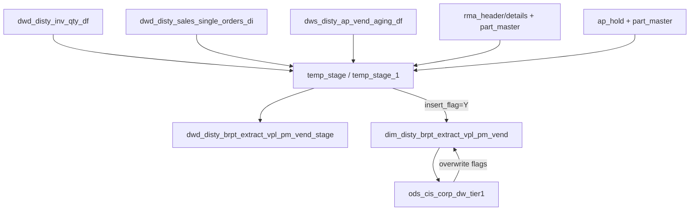

# DIM: B Report VPL extract prod/vendor dimension (`dim_${dim_db}.dim_disty_brpt_extract_vpl_pm_vend`)

- artifact_type: etl_table
- artifact_id: dim_us.dim_disty_brpt_extract_vpl_pm_vend
- domain: vendor
- one_line_purpose: Maintains the VPL extract prod_code×vend_no dimension (descriptions + tier/disty/mfg flags) from daily sales, inventory, AP aging, RMA, and AP-hold activity, gated by `skip_dim`.
- layer_type: DIM
- source_kind: etl_sql
- evidence_source: source/etl/sql/vendor/data_service/vpl_extract/python/load_dim_disty_brpt_extract_vpl_pm_vend.py

---

## L1 Data Foundation

### Identity and physical mapping
- **Table:** `${dim_db}.dim_disty_brpt_extract_vpl_pm_vend` (US flow default `dim_us`)
- **Also written:** `${target_db}.dwd_disty_brpt_extract_vpl_pm_vend_stage` (stage overwrite of candidate keys/flags)
- **Layer type:** DIM (plus DWD stage intermediate)
- **Canonical / derived:** Derived — incremental INSERT of new keys then full overwrite with flags
- **Owner team:** not registered in metadata catalog

### Grain, scope, exclusions
- **Grain:** one row per (`prod_code`, `vend_no`) in the DIM
- **Scope:** Disty B Report VPL extract; schemas from `${target_db}`, `${source_db}`, `${dim_db}`
- **Partition:** none on final DIM (non-partitioned overwrite/insert); stage also non-partitioned overwrite
- **Natural key:** `prod_code`, `vend_no`
- **Exclusions:** Entire DIM load skipped when `skip_dim = 's'` — `load_dim_disty_brpt_extract_vpl_pm_vend.py:34`

### Cross-engine presence
| Engine | Present | Canonical FQN | Notes |
|--------|---------|---------------|-------|
| Hive | yes | `${dim_db}.dim_disty_brpt_extract_vpl_pm_vend` | Final DIM target |
| Hive | yes | `${target_db}.dwd_disty_brpt_extract_vpl_pm_vend_stage` | Stage table |
| Vertica | yes (init/sync flows) | same logical names under sync jobs | `vpl_extract_data_initialization_us.flow` syncs DIM / stage; daily load flow sync focuses on DWS fact |

### Physical schema reference

| Field | Value |
|-------|-------|
| **Authoritative catalog** | WKB L1 storage seed (not duplicated in this file) |
| **entity_id** | `dim_us.dim_disty_brpt_extract_vpl_pm_vend` |
| **l1_catalog_seed** | `target/storage/wkb/snapshots/_snapshot_id_template/l1_catalog/{engine}_dim_us_dim_disty_brpt_extract_vpl_pm_vend.json` |
| **column_count** | pending (run ddl_seed_writer) |
| **partition_keys** | none in this ETL |
| **ddl_source** | pending Bitbucket DDL / Vertica metadata ingest |
| **retrieval** | `python -m tools.wkb.indexing.run_query --query "vendor dim_disty_brpt_extract_vpl_pm_vend schema" --intent find_table_schema` |

### Lineage
- **upstream (activity union):** `dwd_disty_inv_qty_df`, `dwd_disty_sales_single_orders_di`, `ods_cis_corp_part_master`, `dws_disty_ap_vend_aging_df`, `ods_cis_corp_rma_header`/`rma_details`, `ods_cis_corp_ap_hold` — `load_dim_disty_brpt_extract_vpl_pm_vend.py:39-89`
- **upstream (enrichment):** `ods_cis_corp_prod_code`, `ods_cis_corp_vend_master`, existing DIM, `ods_cis_corp_dw_tier1` — `:102-143`
- **downstream:** `load_dws_disty_brpt_extract_vpl_di` depends on this job in flow — `vpl_extract_load_us.flow:203-205`

### Freshness and load path
| Item | Value |
|------|-------|
| Load pattern | Stage OVERWRITE; INSERT new DIM rows where `insert_flag='Y'`; then full DIM OVERWRITE with flags |
| Schedule | `schedule-cron: 0 30 2 ? * *` on `vpl_extract_load_us.flow` |
| Parameters | `date_flag`, `bperiod_date`, `next_day`, `target_db`, `source_db`, `dim_db`, `skip_dim`, `etl_timestamp`, `bom` (passed by flow; `bom` unused in this script) |

---

## L2 Declarative Knowledge

### Business purpose
This Python ETL discovers prod_code×vendor pairs that appear in the VPL extract window across sales, inventory SKUs, AP aging, RMA receipts, and AP holds. It stages candidates with prefer/vrefer/insert flags, inserts brand-new dimension keys, then refreshes the full DIM with product/vendor descriptions and tier1 / tier2 / disty / manufacturing flags used by VPL extract reporting.

### Audience and use cases
| Audience | How they benefit |
|----------|-----------------|
| **B Report / VPL extract** | Prod×vendor spine and classification flags for extract facts |
| **Data engineering** | Incremental key discovery + full flag refresh |
| **Downstream DWS job** | Must complete before `load_dws_disty_brpt_extract_vpl_di` in the load flow |

### Identifier search profile
- Primary keys: `prod_code`, `vend_no`
- Flags: `tier1_flag`, `tier2_flag`, `disty_flag`, `mfg_flag` (`T`/`F`)
- Descriptions: `pc_desc` / `pc_descr` (see caveats), `vend_name`

### Time field semantics
- Window parameters `${date_flag}`, `${bperiod_date}`, `${next_day}` drive activity discovery; final DIM is not date-partitioned

### Metrics served
| Category | Columns | Business reading |
|----------|---------|------------------|
| Flags only | `tier1_flag`, `tier2_flag`, `disty_flag`, `mfg_flag` | Classification attributes, not measures |

### Metric serving map
N/A — dimension / flag table.

### etl_metrics
No calculable monetary metrics. Formula authority: [`source/contracts/vendor/metric-index.md`](../../source/contracts/vendor/metric-index.md).

---

## L3 Procedural Knowledge

### Query and routing rules
**Business filters:** See Key filters (sales `terr_status='n'`, AP `sum_level='AVG'`, RMA/AP-hold delete and date windows, etc.).
**Technical predicates (load only):** Parameterized date windows; `skip_dim` gate.

### Dimension join patterns
| Dimension FQN | Join keys | Purpose | Evidence |
|---------------|-----------|---------|----------|
| `ods_cis_corp_prod_code` | `prod_code` | prefer_flag + `pc_descr` | `:102` |
| `ods_cis_corp_vend_master` | `vend_no` | vrefer_flag + `vend_name` | `:103` |
| `dim_disty_brpt_extract_vpl_pm_vend` | `prod_code`,`vend_no` | insert_flag (existing?) | `:104` |
| `ods_cis_corp_dw_tier1` | `vend_no` | `tier1_flag` | `:142-143` |
| `ods_cis_corp_part_master` | `sku_no` | map inventory/RMA/AP-hold SKU → prod/vend | `:59-60`, `:77`, `:86-87` |

### Key filters and ETL business logic
- **Gate:** run DIM logic only if `skip_dim != 's'` — `:34`
- Inventory SKUs: `date_flag >= '${bperiod_date}' AND date_flag < '${next_day}' AND sku_no != 0` — `:42-44`
- Sales: `date_flag = '${date_flag}' AND terr_status = 'n'` — `:51-52`
- AP aging: `date_flag BETWEEN '${bperiod_date}' AND '${date_flag}' AND sum_level = 'AVG'` — `:67-69`
- RMA: `d.rec_date BETWEEN '${date_flag}' AND '${next_day}' AND h/d.delete_date IS NULL` — `:78-81`
- AP hold: `a.rec_datetime BETWEEN '${date_flag}' AND '${next_day}'` — `:88-89`
- Null coalesces on stage keys: `nvl(prod_code,-1)`, `nvl(vend_no,-1)` — `:92`
- `prefer_flag` / `vrefer_flag` / `insert_flag` CASE logic — `:97-99`
- New DIM rows only where `insert_flag = 'Y'` — `:129`
- `tier1_flag`: `'T'` when vend in `ods_cis_corp_dw_tier1` else `'F'` — `:136`
- `tier2_flag` / `disty_flag` hardcoded `'T'` — `:137-138`
- `mfg_flag`: `'T'` when `prod_code BETWEEN 800 AND 899` else `'F'` — `:139-141`
- **Technical (load only):** conf parameters for date/schema windows

### Standard time-filter SQL
```sql
-- Final DIM is not date-partitioned; activity windows use runtime params:
-- date_flag / bperiod_date / next_day from get_params (flow)
SELECT prod_code, vend_no, pc_desc, vend_name, tier1_flag, tier2_flag, disty_flag, mfg_flag
FROM ${dim_db}.dim_disty_brpt_extract_vpl_pm_vend
LIMIT 100;
```

### End-to-end flow
1. If `skip_dim == 's'`, skip all SQL below.
2. Build `temp_sku` from inventory qty window.
3. Union activity into `temp_stage` (sales ∪ inv→part ∪ AP aging ∪ RMA ∪ AP hold).
4. Normalize keys → `temp_stage_x`; enrich flags/descriptions → `temp_stage_1`.
5. OVERWRITE stage table; INSERT new DIM keys where `insert_flag='Y'`.
6. Rebuild `temp_dim_1` with tier/mfg flags; OVERWRITE full DIM.



### Base tables register
| Object | Role in this job |
|--------|-----------------|
| `${target_db}.dwd_disty_inv_qty_df` | SKU activity window |
| `${target_db}.dwd_disty_sales_single_orders_di` | Daily sales prod×vend |
| `${source_db}.ods_cis_corp_part_master` | SKU → prod/vend |
| `${target_db}.dws_disty_ap_vend_aging_df` | AP aging AVG activity |
| `${source_db}.ods_cis_corp_rma_header` / `rma_details` | RMA activity |
| `${source_db}.ods_cis_corp_ap_hold` | AP hold activity |
| `${source_db}.ods_cis_corp_prod_code` | Product description / prefer |
| `${source_db}.ods_cis_corp_vend_master` | Vendor name / vrefer |
| `${source_db}.ods_cis_corp_dw_tier1` | Tier1 vendor list |
| `${dim_db}.dim_disty_brpt_extract_vpl_pm_vend` | Target DIM (read for insert_flag + rewrite) |
| `${target_db}.dwd_disty_brpt_extract_vpl_pm_vend_stage` | Stage target |

Temporary: `temp_sku`, `temp_stage`, `temp_stage_x`, `temp_stage_1`, `temp_dim_1`.

### Step-by-step logic
#### Step 1 — `temp_sku` / `temp_stage` activity union
Collect distinct prod_code×vend_no from sales, inventory→part_master, AP aging AVG, RMA, AP hold.

#### Step 2 — `temp_stage_x` / `temp_stage_1` enrich
NVL keys; LEFT JOIN prod_code, vend_master, existing DIM for flags.

#### Step 3 — Stage OVERWRITE + conditional DIM INSERT
Write stage; insert new keys with NULL flag placeholders.

#### Step 4 — `temp_dim_1` + DIM OVERWRITE
Compute tier1/tier2/disty/mfg flags; overwrite full DIM.

### Relationship map (embedded)

| from_fqn | to_fqn | cardinality | join_keys | provenance |
|----------|--------|-------------|-----------|------------|
| `temp_sku` | `ods_xx.ods_cis_corp_part_master` | many:1 | `i.sku_no = p.sku_no` | etl_sql (source/etl/sql/vendor/data_service/vpl_extract/python/load_dim_disty_brpt_extract_vpl_pm_vend.py:47) |
| `ods_xx.ods_cis_corp_rma_header` | `ods_xx.ods_cis_corp_rma_details` | many:1 | `h.rma_no = d.rma_no` | etl_sql (source/etl/sql/vendor/data_service/vpl_extract/python/load_dim_disty_brpt_extract_vpl_pm_vend.py:47) |
| `ods_xx.ods_cis_corp_rma_details` | `ods_xx.ods_cis_corp_part_master` | many:1 | `d.sku_no = p.sku_no` | etl_sql (source/etl/sql/vendor/data_service/vpl_extract/python/load_dim_disty_brpt_extract_vpl_pm_vend.py:47) |
| `ods_xx.ods_cis_corp_ap_hold` | `ods_xx.ods_cis_corp_part_master` | many:1 | `a.sku_no = p.sku_no` | etl_sql (source/etl/sql/vendor/data_service/vpl_extract/python/load_dim_disty_brpt_extract_vpl_pm_vend.py:47) |
| `temp_stage_x` | `ods_xx.ods_cis_corp_prod_code` | many:1 | `s.prod_code = p.prod_code` | etl_sql (source/etl/sql/vendor/data_service/vpl_extract/python/load_dim_disty_brpt_extract_vpl_pm_vend.py:94) |
| `temp_stage_x` | `ods_xx.ods_cis_corp_vend_master` | many:1 | `s.vend_no = v.vend_no` | etl_sql (source/etl/sql/vendor/data_service/vpl_extract/python/load_dim_disty_brpt_extract_vpl_pm_vend.py:94) |
| `temp_stage_x` | `dim_xx.dim_disty_brpt_extract_vpl_pm_vend` | many:1 | `s.prod_code = d.prod_code AND s.vend_no = d.vend_no;` | etl_sql (source/etl/sql/vendor/data_service/vpl_extract/python/load_dim_disty_brpt_extract_vpl_pm_vend.py:94) |
| `dim_xx.dim_disty_brpt_extract_vpl_pm_vend` | `ods_xx.ods_cis_corp_dw_tier1` | many:1 | `a.vend_no = b.vend_no;` | etl_sql (source/etl/sql/vendor/data_service/vpl_extract/python/load_dim_disty_brpt_extract_vpl_pm_vend.py:131) |

`source/ref/vendor/table relationship.txt`: Not documented in repository.

### Special logic (embedded)

Not documented in repository

### Column / field derivations (from ETL SQL)

| target_column | expression_sql | upstream_columns | upstream_tables | transform_kind | evidence |
|---------------|----------------|------------------|-----------------|----------------|----------|
| `prod_code` | `prod_code` | `prod_code` | `temp_dim_1` | passthrough | `source/etl/sql/vendor/data_service/vpl_extract/python/load_dim_disty_brpt_extract_vpl_pm_vend.py:48` |
| `vend_no` | `vend_no` | `vend_no` | `temp_dim_1` | passthrough | `source/etl/sql/vendor/data_service/vpl_extract/python/load_dim_disty_brpt_extract_vpl_pm_vend.py:49` |
| `pc_desc` | `pc_desc` | `pc_desc` | `temp_dim_1` | passthrough | `source/etl/sql/vendor/data_service/vpl_extract/python/load_dim_disty_brpt_extract_vpl_pm_vend.py:100` |
| `vend_name` | `vend_name` | `vend_name` | `temp_dim_1` | passthrough | `source/etl/sql/vendor/data_service/vpl_extract/python/load_dim_disty_brpt_extract_vpl_pm_vend.py:101` |
| `tier1_flag` | `tier1_flag` | `tier1_flag` | `temp_dim_1` | passthrough | `source/etl/sql/vendor/data_service/vpl_extract/python/load_dim_disty_brpt_extract_vpl_pm_vend.py:136` |
| `tier2_flag` | `tier2_flag` | `tier2_flag` | `temp_dim_1` | passthrough | `source/etl/sql/vendor/data_service/vpl_extract/python/load_dim_disty_brpt_extract_vpl_pm_vend.py:137` |
| `disty_flag` | `disty_flag` | `disty_flag` | `temp_dim_1` | passthrough | `source/etl/sql/vendor/data_service/vpl_extract/python/load_dim_disty_brpt_extract_vpl_pm_vend.py:138` |
| `mfg_flag` | `mfg_flag` | `mfg_flag` | `temp_dim_1` | passthrough | `source/etl/sql/vendor/data_service/vpl_extract/python/load_dim_disty_brpt_extract_vpl_pm_vend.py:141` |

### Sentinel and code values
| Value | Meaning |
|-------|---------|
| `skip_dim = 's'` | Skip entire DIM load |
| `nvl(prod_code,-1)` / `nvl(vend_no,-1)` | Intermediate null sentinels |
| `nvl(prod_code, 0)` on insert | Insert default for null prod |
| `prefer_flag` / `vrefer_flag` / `insert_flag` | `Y`/`N` presence flags |
| `tier*_flag` / `disty_flag` / `mfg_flag` | `T`/`F` |

---

## L4 Validation

### Resolved partition value
| Step | Source | How date scope is determined |
|------|--------|------------------------------|
| 1 | Flow `get_params` | Injects `date_flag`, `bperiod_date`, `next_day`, schemas — `vpl_extract_load_us.flow:153-166` |
| 2 | Companion SQL | Flow references `./disty_common/vpl_extract/sql/get_params.sql` — **file not present** under local `source/etl/sql/vendor/data_service/vpl_extract/` |
| 3 | This script | Uses conf params in filters; DIM itself unpartitioned |

### Data quality checks
- New key count where `insert_flag='Y'` before overwrite
- Flag distribution (`tier1_flag`, `mfg_flag`)
- Grain uniqueness on (`prod_code`,`vend_no`)

### Validation SQL
```sql
SELECT prod_code, vend_no, COUNT(*) AS cnt
FROM ${dim_db}.dim_disty_brpt_extract_vpl_pm_vend
GROUP BY prod_code, vend_no
HAVING COUNT(*) > 1;

SELECT tier1_flag, mfg_flag, COUNT(*) AS cnt
FROM ${dim_db}.dim_disty_brpt_extract_vpl_pm_vend
GROUP BY tier1_flag, mfg_flag;
```

### Caveats for interpretation
- Column name mismatch risk: stage/insert uses `pc_descr` while DIM rewrite selects `pc_desc` — verify physical DDL.
- When `skip_dim='s'`, stage/DIM SQL in this script does not run.
- Companion `get_params.sql` content is Not documented in this local folder (only referenced by flow path).

### Conflicts and open questions
- Owner / SLA beyond flow emails: Not documented in repository
- Whether daily load syncs DIM to Vertica (init flow does; daily load sync nodes focus on DWS): confirm from flow evidence

---

## L5 Runtime View

### Query path and engine preference
| Role | Hive object | Vertica object | Sync mode | Evidence | MCP verified |
|------|-------------|----------------|-----------|----------|--------------|
| DIM | `${dim_db}.dim_disty_brpt_extract_vpl_pm_vend` | synced in init flow | hive2vertica (init) | `vpl_extract_data_initialization_us.flow:51` | pending |
| Stage | `${target_db}.dwd_disty_brpt_extract_vpl_pm_vend_stage` | synced in init flow | hive2vertica (init) | init flow stage sync | pending |

### Access constraints
- Requires `skip_dim` awareness for freshness interpretation
- Schema params `target_db` / `source_db` / `dim_db`

### Query risk profile
| Field | Value |
|-------|-------|
| requires_date_predicate | no on final DIM |
| scan_risk_tier | medium |

---

## L6 Access and Consumption

### Primary consumers and use cases
| Audience | How they benefit |
|----------|-----------------|
| **VPL extract DWS load** | Flow predecessor for fact extract |
| **B Report extract consumers** | Prod×vendor flags/descriptions |

### Representative query patterns
```sql
SELECT prod_code, vend_no, pc_desc, vend_name, tier1_flag, mfg_flag
FROM ${dim_db}.dim_disty_brpt_extract_vpl_pm_vend
WHERE mfg_flag = 'T'
LIMIT 100;
```

### Dependencies and notes

#### Upstream objects (verified)
| Object | Usage | Evidence |
|--------|-------|----------|
| `${target_db}.dwd_disty_inv_qty_df` | SKU window | `:41-45` |
| `${target_db}.dwd_disty_sales_single_orders_di` | Sales keys | `:50-54` |
| `${source_db}.ods_cis_corp_part_master` | SKU map | `:59-60` |
| `${target_db}.dws_disty_ap_vend_aging_df` | AP keys | `:66-71` |
| `${source_db}.ods_cis_corp_rma_header` / `rma_details` | RMA keys | `:75-81` |
| `${source_db}.ods_cis_corp_ap_hold` | Hold keys | `:85-89` |
| `${source_db}.ods_cis_corp_prod_code` | prefer / descr | `:102` |
| `${source_db}.ods_cis_corp_vend_master` | vrefer / name | `:103` |
| `${source_db}.ods_cis_corp_dw_tier1` | tier1 | `:142-143` |

#### Downstream consumers (verified)
| Object / script | Evidence |
|-----------------|----------|
| `load_dws_disty_brpt_extract_vpl_di` (flow dependsOn) | `vpl_extract_load_us.flow:203-205` |

#### Companion SQL
| Path | Status |
|------|--------|
| Flow `./disty_common/vpl_extract/sql/get_params.sql` | Not present under local `source/etl/sql/vendor/data_service/vpl_extract/` |
| Embedded `run_sql` blocks in this `.py` | Documented above (no external SQL files loaded by the script) |

#### Not documented in repository
- `source/ref/vendor/special_logic.txt`
- Local packaged `disty_common` SQL tree for get_params / init sync scripts
- Owner / SLA details beyond flow config emails

---

*Evidence: `source/etl/sql/vendor/data_service/vpl_extract/python/load_dim_disty_brpt_extract_vpl_pm_vend.py`; flow `source/etl/flows/data_service/vpl_extract/vpl_extract_load_us.flow`.*
