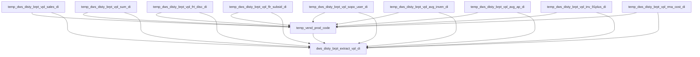

# DWS: B Report VPL extract daily fact (`dw_${target_db}.dws_disty_brpt_extract_vpl_di`)

- artifact_type: etl_table
- artifact_id: dw_us.dws_disty_brpt_extract_vpl_di
- domain: vendor
- one_line_purpose: Daily VPL extract fact at prod_code×vend_no with sales/cost/expense, MTD sales, freight discount, flooring subsidy, SOPO use, average inventory/AP, 91+ inventory, and RMA cost measures.
- layer_type: DWS
- source_kind: etl_sql
- evidence_source: source/etl/sql/vendor/data_service/vpl_extract/python/load_dws_disty_brpt_extract_vpl_di.py

---

## L1 Data Foundation

### Identity and physical mapping
- **Table:** `${target_db}.dws_disty_brpt_extract_vpl_di` (US flow default `dw_us`)
- **Layer type:** DWS
- **Canonical / derived:** Derived daily fact — union of measure spines then LEFT JOIN measure temps
- **Owner team:** not registered in metadata catalog

### Grain, scope, exclusions
- **Grain:** one row per (`prod_code`, `vend_no`, `date_flag`) for keys present in any measure temp for the day
- **Scope:** Disty B Report VPL extract; sales limited to `terr_status = 'n'`
- **Partition:** `date_flag` (INSERT OVERWRITE … `partition (date_flag)`)
- **Natural key:** `prod_code`, `vend_no`, `date_flag`
- **Exclusions:** See Key filters (consign, inv_type lists, freight flags, SOPO GL usage, flooring `who_pays like 'Vendor%'`, etc.)

### Cross-engine presence
| Engine | Present | Canonical FQN | Notes |
|--------|---------|---------------|-------|
| Hive | yes | `${target_db}.dws_disty_brpt_extract_vpl_di` | ETL target |
| Vertica | yes | same FQN via sync | `sync_dws_disty_brpt_extract_vpl_di` overwrite for `${date_flag}` — `vpl_extract_load_us.flow:208-216` |

### Physical schema reference

| Field | Value |
|-------|-------|
| **Authoritative catalog** | WKB L1 storage seed (not duplicated in this file) |
| **entity_id** | `dw_us.dws_disty_brpt_extract_vpl_di` |
| **l1_catalog_seed** | `target/storage/wkb/snapshots/_snapshot_id_template/l1_catalog/{engine}_dw_us_dws_disty_brpt_extract_vpl_di.json` |
| **column_count** | pending (run ddl_seed_writer) |
| **partition_keys** | `date_flag` |
| **ddl_source** | pending Bitbucket DDL / Vertica metadata ingest |
| **retrieval** | `python -m tools.wkb.indexing.run_query --query "vendor dws_disty_brpt_extract_vpl_di schema" --intent find_table_schema` |

### Lineage
- **upstream:** `dwd_disty_sales_single_orders_di`, history header/exp, freight exp codes, order type, part_master, flooring summary, project/PL code chain, inv_qty_df, cws_part, ap aging, inv_aging_df, RMA header/details, parameters — see L3 Base tables
- **downstream:** hive2vertica sync + `vpl_extract_data_validation_us` executeFlow — `vpl_extract_load_us.flow:208-229`

### Freshness and load path
| Item | Value |
|------|-------|
| Load pattern | Build measure temps → union key spine → INSERT OVERWRITE partition |
| Schedule | `schedule-cron: 0 30 2 ? * *` (`vpl_extract_load_us.flow`) |
| Parameters | `date_flag`, `bom`, `bperiod_date`, `next_day`, `target_db`, `source_db`, `etl_timestamp` |

---

## L2 Declarative Knowledge

### Business purpose
This Python ETL assembles the daily VPL extract fact for each product code and vendor: daily sales/cost/expense, month-to-date vendor and prod-vendor sales, allocated freight discount, vendor-paid flooring subsidy, SOPO use expense, average inventory and AP, inventory aged 91+, and parameterized RMA cost. Measures are computed in separate temporary facts, then outer-joined onto the union of keys for `${date_flag}`.

### Audience and use cases
| Audience | How they benefit |
|----------|-----------------|
| **B Report / VPL extract** | Daily prod×vendor performance and cost components |
| **Finance / ops** | Freight, flooring, SOPO, inventory, AP, RMA cost views |
| **Vertica consumers** | Synced partition for `${date_flag}` |

### Fact key resolution
- Fact FQN: `${target_db}.dws_disty_brpt_extract_vpl_di`
- Keys: `prod_code`, `vend_no` (NVL to 0 in several measure builds), `date_flag`
- Prefer filtering `date_flag = '${partition_value}'`

### Time field semantics
- **`date_flag`:** partition and primary reporting day
- **`bom` … `date_flag`:** MTD sales window for `vend_pm_sales` / `vend_sales`
- **`bperiod_date` … `next_day` / `date_flag`:** inventory and AP averaging windows; RMA issue window for counts

### Metrics served
| Category | Columns | Business reading |
|----------|---------|------------------|
| Daily sales stack | `sales`, `cost`, `expense` | Ship-qty × unit price/cost/sum_expense |
| MTD sales | `vend_pm_sales`, `vend_sales` | Prod×vend MTD sales; vendor total MTD sales |
| Freight | `frt_disc` | Weight-allocated outbound freight discount |
| Flooring | `flr_subsid_rate`, `flr_subsid` | Vendor-paid flooring subsidy |
| SOPO | `sopo_use` | SOPO-use expense (history + PO receipt var paths) |
| Inventory | `days_inv`, `avg_inven`, `inv_91plus` | Avg inventory & 91+ aged inventory |
| AP | `days_ap`, `avg_ap` | Average AP from aging AVG level |
| RMA | `rma_cnt`, `rma_unit`, `rma_fact`, `rma_cost` | Parameterized RMA cost |

### Metric serving map
| logical_metric | physical_col |
|----------------|--------------|
| `vpl_sales` | `sales` |
| `vpl_cost` | `cost` |
| `vpl_expense` | `expense` |
| `vpl_vend_pm_sales` | `vend_pm_sales` |
| `vpl_vend_sales` | `vend_sales` |
| `vpl_frt_disc` | `frt_disc` |
| `vpl_flr_subsid` | `flr_subsid` |
| `vpl_sopo_use` | `sopo_use` |
| `vpl_avg_inven` | `avg_inven` |
| `vpl_avg_ap` | `avg_ap` |
| `vpl_inv_91plus` | `inv_91plus` |
| `vpl_rma_cost` | `rma_cost` |

### etl_metrics
Formulas below are taken from this ETL SQL (not pre-registered in vendor metric-index). Do not treat as metric-index authority until appended.

#### `sales`
- **Source:** ETL `load_dws_disty_brpt_extract_vpl_di.py` (not in metric-index)
- **Business definition:** Sum of ship_qty × u_price for the day / terr_status n
```sql
sum(o.ship_qty * o.u_price)
```

#### `cost`
```sql
sum(o.ship_qty * o.u_cost)
```

#### `expense`
```sql
sum(o.ship_qty * o.u_sum_expense)
```

#### `frt_disc`
```sql
sum(o.ship_qty * p.weight / w.total_weight * f.total_frt_disc)
```

#### `flr_subsid`
```sql
sum(s.net_price * s.flooring_rate / 100)
```

#### `avg_inven`
```sql
sum((on_hand_qty + intran_in) * it_ave_cost) / ${inv_days}
```

#### `avg_ap`
```sql
sum(total) / ${ap_days}
```

#### `rma_cost`
```sql
sum(${rma_unit} / ${rma_count} + ${rma_factor} * rec_qty * p.ave_cost)
```

Formula authority file: [`source/contracts/vendor/metric-index.md`](../../source/contracts/vendor/metric-index.md) (these VPL extract formulas not yet indexed — see blockers).

---

## L3 Procedural Knowledge

### Query and routing rules
**Business filters:** `terr_status = 'n'` on sales-based measures; freight `sales='Y'` and `frt_out_flag='Y'`; flooring `who_pays like 'Vendor%'`; SOPO `pc.usage = 'GLNO-SOPOUSE'`; consign and inv_type exclusions on inventory measures.
**Technical predicates (load only):** Date windows from `${date_flag}`, `${bom}`, `${bperiod_date}`, `${next_day}`; runtime scalars `inv_days`, `ap_days`, `rma_count`, `rma_unit`, `rma_factor`.

### Dimension join patterns
| Dimension FQN | Join keys | Purpose | Evidence |
|---------------|-----------|---------|----------|
| `ods_cis_corp_part_master` | `sku_no` | weight, prod/vend, ave_cost | multiple steps |
| `ods_cis_corp_cws_part` | `sku_no` | consign_flag | avg inv / 91+ |
| Order/history/exp/project/PL chain | order keys / proj / gl | freight & SOPO | `:92-108`, `:173-188` |

### Key filters and ETL business logic
- Sales daily / weight / frt / sopo sales side: `terr_status = 'n'` and `date_flag = '${date_flag}'` — e.g. `:44-45`, `:119-120`
- MTD sales: `date_flag BETWEEN '${bom}' AND '${date_flag}'` and `terr_status = 'n'` — `:57-59`
- Freight: `t.sales = 'Y'`, `f.frt_out_flag = 'Y'`, ship_date window, delete_date null — `:100-105`; `total_weight != 0` — `:144`
- Flooring: `who_pays like 'Vendor%'` — `:162`
- SOPO: `pc.code_type = 'GLNO' AND pc.usage = 'GLNO-SOPOUSE'`, delete_date null — `:182-186`, `:208-209`
- Avg inventory: consign `<> 'Y'`, `inv_type not IN (6, 10, 100, 200)`, date window — `:244-249`
- Avg AP: `sum_level = 'AVG'` — `:275-277`
- Inv 91+: `view_level = 'IT_PART'`, consign/inv_type filters — `:294-298`
- RMA cost: rec_date window, delete_date null; parameters `rma_fix_cost_amount`, `rma_var_cost_rate` — `:336-375`
- **Technical:** Python computes `inv_days`, `ap_days`, `rma_count` (0 when no RMAs), injects into SQL

### Standard time-filter SQL
```sql
SELECT *
FROM ${target_db}.dws_disty_brpt_extract_vpl_di
WHERE date_flag = '${partition_value}';
```

### End-to-end flow
1. Build daily sales fact temp (`sales`/`cost`/`expense`).
2. Build MTD prod×vend sales + vendor totals.
3. Build freight discount allocation.
4. Build flooring subsidy.
5. Build SOPO use (history + PO receipt insert).
6. Compute `inv_days` / avg inventory; `ap_days` / avg AP.
7. Build inv 91+ and RMA cost (with parameter scalars).
8. Union keys → LEFT JOIN all measure temps → INSERT OVERWRITE partition.



### Base tables register
| Object | Role in this job |
|--------|-----------------|
| `${target_db}.dwd_disty_sales_single_orders_di` | Sales / weight / SOPO sales side |
| `${source_db}.ods_cis_corp_history_header` / `history_exp` | Freight & SOPO expenses |
| `${source_db}.ods_breport_mydaas_dw_frt_exp_codes` | Freight out flag |
| `${source_db}.ods_cis_corp_order_type` | Sales order types |
| `${source_db}.ods_cis_corp_part_master` | Weight, prod/vend, ave_cost |
| `${target_db}.dws_disty_ar_flooring_summary_di` | Flooring subsidy |
| `${source_db}.ods_cis_corp_project_info` / `proj_variance_account` / `pl_code` | SOPO GL mapping |
| `${source_db}.ods_cis_corp_po_rec_var` / `ap_hold` | SOPO receipt path |
| `${target_db}.dwd_disty_inv_qty_df` | Avg inventory |
| `${source_db}.ods_cis_corp_cws_part` | Consign filter |
| `${target_db}.dws_disty_ap_vend_aging_df` | Avg AP |
| `${target_db}.dwd_disty_inv_aging_df` | Inv 91+ |
| `${source_db}.ods_cis_corp_rma_header` / `rma_details` | RMA cost |
| `${source_db}.ods_cis_corp_parameters` | RMA unit/factor parameters |

### Step-by-step logic
#### Steps 3–4 — Sales and MTD sum facts
Daily SUM sales/cost/expense; MTD `vend_pm_sales` then vendor rollup `vend_sales`.

#### Step 5 — Freight discount
Order-level total freight → allocate by line weight share.

#### Step 6 — Flooring subsidy
MAX rate + SUM net_price × rate/100 for vendor-paid flooring.

#### Step 7 — SOPO use
History-exp path + insert from PO receipt variance path; SUM usage.

#### Steps 8–9 — Avg inventory / AP
Count distinct days then average value / days.

#### Steps 11–12 — Inv 91+ and RMA cost
SUM age90_up; parameterized RMA cost aggregation.

#### Final — Key union + INSERT OVERWRITE partition
LEFT JOIN all measure temps; `to_date('${date_flag}')` as partition column.

### Relationship map (embedded)

| from_fqn | to_fqn | cardinality | join_keys | provenance |
|----------|--------|-------------|-----------|------------|
| `temp_sales_sum_fact_1` | `temp_vend_sales` | many:1 | `Not documented in repository` | etl_sql (source/etl/sql/vendor/data_service/vpl_extract/python/load_dws_disty_brpt_extract_vpl_di.py:74) |
| `ods_xx.ods_cis_corp_history_header` | `ods_xx.ods_cis_corp_history_exp` | many:1 | `h.order_type = e.order_type AND h.order_no = e.order_no` | etl_sql (source/etl/sql/vendor/data_service/vpl_extract/python/load_dws_disty_brpt_extract_vpl_di.py:86) |
| `ods_xx.ods_cis_corp_history_exp` | `ods_xx.ods_breport_mydaas_dw_frt_exp_codes` | many:1 | `e.exp_code = f.exp_code` | etl_sql (source/etl/sql/vendor/data_service/vpl_extract/python/load_dws_disty_brpt_extract_vpl_di.py:86) |
| `ods_xx.ods_cis_corp_history_header` | `ods_xx.ods_cis_corp_order_type` | many:1 | `h.order_type = t.order_type` | etl_sql (source/etl/sql/vendor/data_service/vpl_extract/python/load_dws_disty_brpt_extract_vpl_di.py:86) |
| `dw_xx.dwd_disty_sales_single_orders_di` | `ods_xx.ods_cis_corp_part_master` | many:1 | `o.sku_no = p.sku_no` | etl_sql (source/etl/sql/vendor/data_service/vpl_extract/python/load_dws_disty_brpt_extract_vpl_di.py:109) |
| `dw_xx.dwd_disty_sales_single_orders_di` | `temp_total_frt_disc` | many:1 | `o.order_type = f.order_type AND o.order_no = f.order_no` | etl_sql (source/etl/sql/vendor/data_service/vpl_extract/python/load_dws_disty_brpt_extract_vpl_di.py:126) |
| `dw_xx.dwd_disty_sales_single_orders_di` | `temp_total_weight` | many:1 | `o.order_type = w.order_type AND o.order_no = w.order_no` | etl_sql (source/etl/sql/vendor/data_service/vpl_extract/python/load_dws_disty_brpt_extract_vpl_di.py:126) |
| `ods_xx.ods_cis_corp_history_exp` | `dw_xx.dwd_disty_sales_single_orders_di` | many:1 | `o.order_type = e.order_type AND o.order_no = e.order_no AND o.order_line_no = e.order_line_no` | etl_sql (source/etl/sql/vendor/data_service/vpl_extract/python/load_dws_disty_brpt_extract_vpl_di.py:167) |
| `ods_xx.ods_cis_corp_history_exp` | `ods_xx.ods_cis_corp_project_info` | many:1 | `e.project_no = i.proj_no` | etl_sql (source/etl/sql/vendor/data_service/vpl_extract/python/load_dws_disty_brpt_extract_vpl_di.py:167) |
| `ods_xx.ods_cis_corp_project_info` | `ods_xx.ods_cis_corp_proj_variance_account` | many:1 | `i.var_no = v.var_no` | etl_sql (source/etl/sql/vendor/data_service/vpl_extract/python/load_dws_disty_brpt_extract_vpl_di.py:167) |
| `ods_xx.ods_cis_corp_proj_variance_account` | `ods_xx.ods_cis_corp_pl_code` | many:1 | `v.gl_acct_no = pc.icode` | etl_sql (source/etl/sql/vendor/data_service/vpl_extract/python/load_dws_disty_brpt_extract_vpl_di.py:167) |
| `ods_xx.ods_cis_corp_po_rec_var` | `ods_xx.ods_cis_corp_ap_hold` | many:1 | `a.rec_no = r.rec_no AND a.rec_line_no = r.rec_line_no` | etl_sql (source/etl/sql/vendor/data_service/vpl_extract/python/load_dws_disty_brpt_extract_vpl_di.py:190) |
| `ods_xx.ods_cis_corp_ap_hold` | `ods_xx.ods_cis_corp_part_master` | many:1 | `a.sku_no = m.sku_no` | etl_sql (source/etl/sql/vendor/data_service/vpl_extract/python/load_dws_disty_brpt_extract_vpl_di.py:190) |
| `ods_xx.ods_cis_corp_po_rec_var` | `ods_xx.ods_cis_corp_project_info` | many:1 | `r.proj_no = i.proj_no` | etl_sql (source/etl/sql/vendor/data_service/vpl_extract/python/load_dws_disty_brpt_extract_vpl_di.py:190) |
| `dw_xx.dwd_disty_inv_aging_df` | `ods_xx.ods_cis_corp_cws_part` | many:1 | `i.sku_no = c.sku_no` | etl_sql (source/etl/sql/vendor/data_service/vpl_extract/python/load_dws_disty_brpt_extract_vpl_di.py:284) |
| `ods_xx.ods_cis_corp_rma_header` | `ods_xx.ods_cis_corp_rma_details` | many:1 | `rh.rma_no = rd.rma_no` | etl_sql (source/etl/sql/vendor/data_service/vpl_extract/python/load_dws_disty_brpt_extract_vpl_di.py:305) |
| `ods_xx.ods_cis_corp_rma_header` | `ods_xx.ods_cis_corp_rma_details` | many:1 | `h.rma_no = d.rma_no` | etl_sql (source/etl/sql/vendor/data_service/vpl_extract/python/load_dws_disty_brpt_extract_vpl_di.py:355) |
| `ods_xx.ods_cis_corp_rma_details` | `ods_xx.ods_cis_corp_part_master` | many:1 | `d.sku_no = p.sku_no` | etl_sql (source/etl/sql/vendor/data_service/vpl_extract/python/load_dws_disty_brpt_extract_vpl_di.py:355) |
| `temp_vend_prod_code` | `temp_dws_disty_brpt_vpl_sales_di` | many:1 | `a.vend_no = b.vend_no and a.prod_code = b.prod_code` | etl_sql (source/etl/sql/vendor/data_service/vpl_extract/python/load_dws_disty_brpt_extract_vpl_di.py:398) |
| `temp_vend_prod_code` | `temp_dws_disty_brpt_vpl_sum_di` | many:1 | `a.vend_no = c.vend_no and a.prod_code = c.prod_code` | etl_sql (source/etl/sql/vendor/data_service/vpl_extract/python/load_dws_disty_brpt_extract_vpl_di.py:398) |
| `temp_vend_prod_code` | `temp_dws_disty_brpt_vpl_frt_disc_di` | many:1 | `a.vend_no = d.vend_no and a.prod_code = d.prod_code` | etl_sql (source/etl/sql/vendor/data_service/vpl_extract/python/load_dws_disty_brpt_extract_vpl_di.py:398) |
| `temp_vend_prod_code` | `temp_dws_disty_brpt_vpl_flr_subsid_di` | many:1 | `a.vend_no = e.vend_no and a.prod_code = e.prod_code` | etl_sql (source/etl/sql/vendor/data_service/vpl_extract/python/load_dws_disty_brpt_extract_vpl_di.py:398) |
| `temp_vend_prod_code` | `temp_dws_disty_brpt_vpl_sopo_user_di` | many:1 | `a.vend_no = f.vend_no and a.prod_code = f.prod_code` | etl_sql (source/etl/sql/vendor/data_service/vpl_extract/python/load_dws_disty_brpt_extract_vpl_di.py:398) |
| `temp_vend_prod_code` | `temp_dws_disty_brpt_vpl_avg_inven_di` | many:1 | `a.vend_no = g.vend_no and a.prod_code = g.prod_code` | etl_sql (source/etl/sql/vendor/data_service/vpl_extract/python/load_dws_disty_brpt_extract_vpl_di.py:398) |
| `temp_vend_prod_code` | `temp_dws_disty_brpt_vpl_avg_ap_di` | many:1 | `a.vend_no = h.vend_no and a.prod_code = h.prod_code` | etl_sql (source/etl/sql/vendor/data_service/vpl_extract/python/load_dws_disty_brpt_extract_vpl_di.py:398) |
| `temp_vend_prod_code` | `temp_dws_disty_brpt_vpl_inv_91plus_di` | many:1 | `a.vend_no = i.vend_no and a.prod_code = i.prod_code` | etl_sql (source/etl/sql/vendor/data_service/vpl_extract/python/load_dws_disty_brpt_extract_vpl_di.py:398) |
| `temp_vend_prod_code` | `temp_dws_disty_brpt_vpl_rma_cost_di` | many:1 | `a.vend_no = j.vend_no and a.prod_code = j.prod_code;` | etl_sql (source/etl/sql/vendor/data_service/vpl_extract/python/load_dws_disty_brpt_extract_vpl_di.py:398) |

`source/ref/vendor/table relationship.txt`: Not documented in repository.

### Special logic (embedded)

Not documented in repository

### Column / field derivations (from ETL SQL)

| target_column | expression_sql | upstream_columns | upstream_tables | transform_kind | evidence |
|---------------|----------------|------------------|-----------------|----------------|----------|
| `prod_code` | `a.prod_code` | `prod_code` | `temp_vend_prod_code`, `temp_dws_disty_brpt_vpl_sales_di`, `temp_dws_disty_brpt_vpl_sum_di`, `temp_dws_disty_brpt_vpl_frt_disc_di`, `temp_dws_disty_brpt_vpl_flr_subsid_di`, `temp_dws_disty_brpt_vpl_sopo_user_di`, `temp_dws_disty_brpt_vpl_avg_inven_di`, `temp_dws_disty_brpt_vpl_avg_ap_di`, `temp_dws_disty_brpt_vpl_inv_91plus_di`, `temp_dws_disty_brpt_vpl_rma_cost_di` | passthrough | `source/etl/sql/vendor/data_service/vpl_extract/python/load_dws_disty_brpt_extract_vpl_di.py:269` |
| `vend_no` | `a.vend_no` | `vend_no` | `temp_vend_prod_code`, `temp_dws_disty_brpt_vpl_sales_di`, `temp_dws_disty_brpt_vpl_sum_di`, `temp_dws_disty_brpt_vpl_frt_disc_di`, `temp_dws_disty_brpt_vpl_flr_subsid_di`, `temp_dws_disty_brpt_vpl_sopo_user_di`, `temp_dws_disty_brpt_vpl_avg_inven_di`, `temp_dws_disty_brpt_vpl_avg_ap_di`, `temp_dws_disty_brpt_vpl_inv_91plus_di`, `temp_dws_disty_brpt_vpl_rma_cost_di` | passthrough | `source/etl/sql/vendor/data_service/vpl_extract/python/load_dws_disty_brpt_extract_vpl_di.py:270` |
| `sales` | `sales` | `sales` | `temp_vend_prod_code`, `temp_dws_disty_brpt_vpl_sales_di`, `temp_dws_disty_brpt_vpl_sum_di`, `temp_dws_disty_brpt_vpl_frt_disc_di`, `temp_dws_disty_brpt_vpl_flr_subsid_di`, `temp_dws_disty_brpt_vpl_sopo_user_di`, `temp_dws_disty_brpt_vpl_avg_inven_di`, `temp_dws_disty_brpt_vpl_avg_ap_di`, `temp_dws_disty_brpt_vpl_inv_91plus_di`, `temp_dws_disty_brpt_vpl_rma_cost_di` | passthrough | `source/etl/sql/vendor/data_service/vpl_extract/python/load_dws_disty_brpt_extract_vpl_di.py:32` |
| `cost` | `cost` | `cost` | `temp_vend_prod_code`, `temp_dws_disty_brpt_vpl_sales_di`, `temp_dws_disty_brpt_vpl_sum_di`, `temp_dws_disty_brpt_vpl_frt_disc_di`, `temp_dws_disty_brpt_vpl_flr_subsid_di`, `temp_dws_disty_brpt_vpl_sopo_user_di`, `temp_dws_disty_brpt_vpl_avg_inven_di`, `temp_dws_disty_brpt_vpl_avg_ap_di`, `temp_dws_disty_brpt_vpl_inv_91plus_di`, `temp_dws_disty_brpt_vpl_rma_cost_di` | passthrough | `source/etl/sql/vendor/data_service/vpl_extract/python/load_dws_disty_brpt_extract_vpl_di.py:40` |
| `expense` | `expense` | `expense` | `temp_vend_prod_code`, `temp_dws_disty_brpt_vpl_sales_di`, `temp_dws_disty_brpt_vpl_sum_di`, `temp_dws_disty_brpt_vpl_frt_disc_di`, `temp_dws_disty_brpt_vpl_flr_subsid_di`, `temp_dws_disty_brpt_vpl_sopo_user_di`, `temp_dws_disty_brpt_vpl_avg_inven_di`, `temp_dws_disty_brpt_vpl_avg_ap_di`, `temp_dws_disty_brpt_vpl_inv_91plus_di`, `temp_dws_disty_brpt_vpl_rma_cost_di` | passthrough | `source/etl/sql/vendor/data_service/vpl_extract/python/load_dws_disty_brpt_extract_vpl_di.py:41` |
| `vend_pm_sales` | `vend_pm_sales` | `vend_pm_sales` | `temp_vend_prod_code`, `temp_dws_disty_brpt_vpl_sales_di`, `temp_dws_disty_brpt_vpl_sum_di`, `temp_dws_disty_brpt_vpl_frt_disc_di`, `temp_dws_disty_brpt_vpl_flr_subsid_di`, `temp_dws_disty_brpt_vpl_sopo_user_di`, `temp_dws_disty_brpt_vpl_avg_inven_di`, `temp_dws_disty_brpt_vpl_avg_ap_di`, `temp_dws_disty_brpt_vpl_inv_91plus_di`, `temp_dws_disty_brpt_vpl_rma_cost_di` | passthrough | `source/etl/sql/vendor/data_service/vpl_extract/python/load_dws_disty_brpt_extract_vpl_di.py:54` |
| `vend_sales` | `vend_sales` | `vend_sales` | `temp_vend_prod_code`, `temp_dws_disty_brpt_vpl_sales_di`, `temp_dws_disty_brpt_vpl_sum_di`, `temp_dws_disty_brpt_vpl_frt_disc_di`, `temp_dws_disty_brpt_vpl_flr_subsid_di`, `temp_dws_disty_brpt_vpl_sopo_user_di`, `temp_dws_disty_brpt_vpl_avg_inven_di`, `temp_dws_disty_brpt_vpl_avg_ap_di`, `temp_dws_disty_brpt_vpl_inv_91plus_di`, `temp_dws_disty_brpt_vpl_rma_cost_di` | passthrough | `source/etl/sql/vendor/data_service/vpl_extract/python/load_dws_disty_brpt_extract_vpl_di.py:65` |
| `frt_disc` | `frt_disc` | `frt_disc` | `temp_vend_prod_code`, `temp_dws_disty_brpt_vpl_sales_di`, `temp_dws_disty_brpt_vpl_sum_di`, `temp_dws_disty_brpt_vpl_frt_disc_di`, `temp_dws_disty_brpt_vpl_flr_subsid_di`, `temp_dws_disty_brpt_vpl_sopo_user_di`, `temp_dws_disty_brpt_vpl_avg_inven_di`, `temp_dws_disty_brpt_vpl_avg_ap_di`, `temp_dws_disty_brpt_vpl_inv_91plus_di`, `temp_dws_disty_brpt_vpl_rma_cost_di` | passthrough | `source/etl/sql/vendor/data_service/vpl_extract/python/load_dws_disty_brpt_extract_vpl_di.py:85` |
| `flr_subsid_rate` | `flr_subsid_rate` | `flr_subsid_rate` | `temp_vend_prod_code`, `temp_dws_disty_brpt_vpl_sales_di`, `temp_dws_disty_brpt_vpl_sum_di`, `temp_dws_disty_brpt_vpl_frt_disc_di`, `temp_dws_disty_brpt_vpl_flr_subsid_di`, `temp_dws_disty_brpt_vpl_sopo_user_di`, `temp_dws_disty_brpt_vpl_avg_inven_di`, `temp_dws_disty_brpt_vpl_avg_ap_di`, `temp_dws_disty_brpt_vpl_inv_91plus_di`, `temp_dws_disty_brpt_vpl_rma_cost_di` | passthrough | `source/etl/sql/vendor/data_service/vpl_extract/python/load_dws_disty_brpt_extract_vpl_di.py:157` |
| `flr_subsid` | `flr_subsid` | `flr_subsid` | `temp_vend_prod_code`, `temp_dws_disty_brpt_vpl_sales_di`, `temp_dws_disty_brpt_vpl_sum_di`, `temp_dws_disty_brpt_vpl_frt_disc_di`, `temp_dws_disty_brpt_vpl_flr_subsid_di`, `temp_dws_disty_brpt_vpl_sopo_user_di`, `temp_dws_disty_brpt_vpl_avg_inven_di`, `temp_dws_disty_brpt_vpl_avg_ap_di`, `temp_dws_disty_brpt_vpl_inv_91plus_di`, `temp_dws_disty_brpt_vpl_rma_cost_di` | passthrough | `source/etl/sql/vendor/data_service/vpl_extract/python/load_dws_disty_brpt_extract_vpl_di.py:151` |
| `sopo_use` | `sopo_use` | `sopo_use` | `temp_vend_prod_code`, `temp_dws_disty_brpt_vpl_sales_di`, `temp_dws_disty_brpt_vpl_sum_di`, `temp_dws_disty_brpt_vpl_frt_disc_di`, `temp_dws_disty_brpt_vpl_flr_subsid_di`, `temp_dws_disty_brpt_vpl_sopo_user_di`, `temp_dws_disty_brpt_vpl_avg_inven_di`, `temp_dws_disty_brpt_vpl_avg_ap_di`, `temp_dws_disty_brpt_vpl_inv_91plus_di`, `temp_dws_disty_brpt_vpl_rma_cost_di` | passthrough | `source/etl/sql/vendor/data_service/vpl_extract/python/load_dws_disty_brpt_extract_vpl_di.py:166` |
| `days_inv` | `days_inv` | `days_inv` | `temp_vend_prod_code`, `temp_dws_disty_brpt_vpl_sales_di`, `temp_dws_disty_brpt_vpl_sum_di`, `temp_dws_disty_brpt_vpl_frt_disc_di`, `temp_dws_disty_brpt_vpl_flr_subsid_di`, `temp_dws_disty_brpt_vpl_sopo_user_di`, `temp_dws_disty_brpt_vpl_avg_inven_di`, `temp_dws_disty_brpt_vpl_avg_ap_di`, `temp_dws_disty_brpt_vpl_inv_91plus_di`, `temp_dws_disty_brpt_vpl_rma_cost_di` | passthrough | `source/etl/sql/vendor/data_service/vpl_extract/python/load_dws_disty_brpt_extract_vpl_di.py:238` |
| `avg_inven` | `avg_inven` | `avg_inven` | `temp_vend_prod_code`, `temp_dws_disty_brpt_vpl_sales_di`, `temp_dws_disty_brpt_vpl_sum_di`, `temp_dws_disty_brpt_vpl_frt_disc_di`, `temp_dws_disty_brpt_vpl_flr_subsid_di`, `temp_dws_disty_brpt_vpl_sopo_user_di`, `temp_dws_disty_brpt_vpl_avg_inven_di`, `temp_dws_disty_brpt_vpl_avg_ap_di`, `temp_dws_disty_brpt_vpl_inv_91plus_di`, `temp_dws_disty_brpt_vpl_rma_cost_di` | passthrough | `source/etl/sql/vendor/data_service/vpl_extract/python/load_dws_disty_brpt_extract_vpl_di.py:224` |
| `days_ap` | `days_ap` | `days_ap` | `temp_vend_prod_code`, `temp_dws_disty_brpt_vpl_sales_di`, `temp_dws_disty_brpt_vpl_sum_di`, `temp_dws_disty_brpt_vpl_frt_disc_di`, `temp_dws_disty_brpt_vpl_flr_subsid_di`, `temp_dws_disty_brpt_vpl_sopo_user_di`, `temp_dws_disty_brpt_vpl_avg_inven_di`, `temp_dws_disty_brpt_vpl_avg_ap_di`, `temp_dws_disty_brpt_vpl_inv_91plus_di`, `temp_dws_disty_brpt_vpl_rma_cost_di` | passthrough | `source/etl/sql/vendor/data_service/vpl_extract/python/load_dws_disty_brpt_extract_vpl_di.py:271` |
| `avg_ap` | `avg_ap` | `avg_ap` | `temp_vend_prod_code`, `temp_dws_disty_brpt_vpl_sales_di`, `temp_dws_disty_brpt_vpl_sum_di`, `temp_dws_disty_brpt_vpl_frt_disc_di`, `temp_dws_disty_brpt_vpl_flr_subsid_di`, `temp_dws_disty_brpt_vpl_sopo_user_di`, `temp_dws_disty_brpt_vpl_avg_inven_di`, `temp_dws_disty_brpt_vpl_avg_ap_di`, `temp_dws_disty_brpt_vpl_inv_91plus_di`, `temp_dws_disty_brpt_vpl_rma_cost_di` | passthrough | `source/etl/sql/vendor/data_service/vpl_extract/python/load_dws_disty_brpt_extract_vpl_di.py:255` |
| `inv_91plus` | `inv_91plus` | `inv_91plus` | `temp_vend_prod_code`, `temp_dws_disty_brpt_vpl_sales_di`, `temp_dws_disty_brpt_vpl_sum_di`, `temp_dws_disty_brpt_vpl_frt_disc_di`, `temp_dws_disty_brpt_vpl_flr_subsid_di`, `temp_dws_disty_brpt_vpl_sopo_user_di`, `temp_dws_disty_brpt_vpl_avg_inven_di`, `temp_dws_disty_brpt_vpl_avg_ap_di`, `temp_dws_disty_brpt_vpl_inv_91plus_di`, `temp_dws_disty_brpt_vpl_rma_cost_di` | passthrough | `source/etl/sql/vendor/data_service/vpl_extract/python/load_dws_disty_brpt_extract_vpl_di.py:282` |
| `rma_cnt` | `rma_cnt` | `rma_cnt` | `temp_vend_prod_code`, `temp_dws_disty_brpt_vpl_sales_di`, `temp_dws_disty_brpt_vpl_sum_di`, `temp_dws_disty_brpt_vpl_frt_disc_di`, `temp_dws_disty_brpt_vpl_flr_subsid_di`, `temp_dws_disty_brpt_vpl_sopo_user_di`, `temp_dws_disty_brpt_vpl_avg_inven_di`, `temp_dws_disty_brpt_vpl_avg_ap_di`, `temp_dws_disty_brpt_vpl_inv_91plus_di`, `temp_dws_disty_brpt_vpl_rma_cost_di` | passthrough | `source/etl/sql/vendor/data_service/vpl_extract/python/load_dws_disty_brpt_extract_vpl_di.py:358` |
| `rma_unit` | `rma_unit` | `rma_unit` | `temp_vend_prod_code`, `temp_dws_disty_brpt_vpl_sales_di`, `temp_dws_disty_brpt_vpl_sum_di`, `temp_dws_disty_brpt_vpl_frt_disc_di`, `temp_dws_disty_brpt_vpl_flr_subsid_di`, `temp_dws_disty_brpt_vpl_sopo_user_di`, `temp_dws_disty_brpt_vpl_avg_inven_di`, `temp_dws_disty_brpt_vpl_avg_ap_di`, `temp_dws_disty_brpt_vpl_inv_91plus_di`, `temp_dws_disty_brpt_vpl_rma_cost_di` | passthrough | `source/etl/sql/vendor/data_service/vpl_extract/python/load_dws_disty_brpt_extract_vpl_di.py:336` |
| `rma_fact` | `rma_fact` | `rma_fact` | `temp_vend_prod_code`, `temp_dws_disty_brpt_vpl_sales_di`, `temp_dws_disty_brpt_vpl_sum_di`, `temp_dws_disty_brpt_vpl_frt_disc_di`, `temp_dws_disty_brpt_vpl_flr_subsid_di`, `temp_dws_disty_brpt_vpl_sopo_user_di`, `temp_dws_disty_brpt_vpl_avg_inven_di`, `temp_dws_disty_brpt_vpl_avg_ap_di`, `temp_dws_disty_brpt_vpl_inv_91plus_di`, `temp_dws_disty_brpt_vpl_rma_cost_di` | passthrough | `source/etl/sql/vendor/data_service/vpl_extract/python/load_dws_disty_brpt_extract_vpl_di.py:346` |
| `rma_cost` | `rma_cost` | `rma_cost` | `temp_vend_prod_code`, `temp_dws_disty_brpt_vpl_sales_di`, `temp_dws_disty_brpt_vpl_sum_di`, `temp_dws_disty_brpt_vpl_frt_disc_di`, `temp_dws_disty_brpt_vpl_flr_subsid_di`, `temp_dws_disty_brpt_vpl_sopo_user_di`, `temp_dws_disty_brpt_vpl_avg_inven_di`, `temp_dws_disty_brpt_vpl_avg_ap_di`, `temp_dws_disty_brpt_vpl_inv_91plus_di`, `temp_dws_disty_brpt_vpl_rma_cost_di` | passthrough | `source/etl/sql/vendor/data_service/vpl_extract/python/load_dws_disty_brpt_extract_vpl_di.py:303` |
| `date_flag` | `to_date('${date_flag}')` | `date_flag` | `temp_vend_prod_code`, `temp_dws_disty_brpt_vpl_sales_di`, `temp_dws_disty_brpt_vpl_sum_di`, `temp_dws_disty_brpt_vpl_frt_disc_di`, `temp_dws_disty_brpt_vpl_flr_subsid_di`, `temp_dws_disty_brpt_vpl_sopo_user_di`, `temp_dws_disty_brpt_vpl_avg_inven_di`, `temp_dws_disty_brpt_vpl_avg_ap_di`, `temp_dws_disty_brpt_vpl_inv_91plus_di`, `temp_dws_disty_brpt_vpl_rma_cost_di` | udf | `source/etl/sql/vendor/data_service/vpl_extract/python/load_dws_disty_brpt_extract_vpl_di.py:419` |

### Sentinel and code values
| Value | Meaning |
|-------|---------|
| `nvl(prod_code,0)` / `nvl(vend_no,0)` | Null key defaults on several facts |
| `terr_status = 'n'` | Sales territory status included in extract |
| `inv_type not IN (6,10,100,200)` | Inventory type exclusions |
| `consign_flag <> 'Y'` | Exclude consign |
| `rma_count = 0` | No RMAs in issue window (Python branch) |

---

## L4 Validation

### Resolved partition value
| Step | Source | How `date_flag` is determined |
|------|--------|-------------------------------|
| 1 | Flow `get_params` + conf | `${date_flag}`, `${bom}`, `${bperiod_date}`, `${next_day}` — `vpl_extract_load_us.flow:153-202` |
| 2 | Companion `get_params.sql` | Referenced as `./disty_common/vpl_extract/sql/get_params.sql` — **not in local vpl_extract folder** |
| 3 | INSERT | `partition (date_flag)` with `to_date('${date_flag}')` — `:398-419` |

### Data quality checks
- Partition row count and measure sums for `${date_flag}`
- Null measure rates after outer joins (expected for keys present in only some measure temps)
- Grain uniqueness (`prod_code`,`vend_no`,`date_flag`)
- `total_weight = 0` orders excluded from freight allocation

### Validation SQL
```sql
SELECT date_flag, COUNT(*) AS row_cnt,
       SUM(sales) AS sales, SUM(cost) AS cost, SUM(frt_disc) AS frt_disc,
       SUM(avg_inven) AS avg_inven, SUM(rma_cost) AS rma_cost
FROM ${target_db}.dws_disty_brpt_extract_vpl_di
WHERE date_flag = '${partition_value}'
GROUP BY date_flag;

SELECT prod_code, vend_no, date_flag, COUNT(*) AS cnt
FROM ${target_db}.dws_disty_brpt_extract_vpl_di
WHERE date_flag = '${partition_value}'
GROUP BY prod_code, vend_no, date_flag
HAVING COUNT(*) > 1;
```

### Caveats for interpretation
- Outer joins leave measures null when a key appears only in another measure family.
- RMA cost depends on parameter table values and can be unstable if `rma_count = 0` (Python sets 0 when no RMAs).
- Typo in temp column alias `date_flaf` in first SOPO insert (`:172`) — second insert uses `date_flag`; final SOPO rollup does not select that alias.

### Conflicts and open questions
- Metric-index entries for these measures: not present (formulas documented from ETL only)
- Owner / SLA beyond flow emails: Not documented in repository

---

## L5 Runtime View

### Query path and engine preference
| Role | Hive object | Vertica object | Sync mode | Evidence | MCP verified |
|------|-------------|----------------|-----------|----------|--------------|
| Daily fact | `${target_db}.dws_disty_brpt_extract_vpl_di` | same | hive2vertica overwrite for `${date_flag}` | `vpl_extract_load_us.flow:208-216` | pending |

### Access constraints
- Always filter `date_flag`
- Schema via `target_db` / `source_db`

### Query risk profile
| Field | Value |
|-------|-------|
| requires_date_predicate | yes |
| scan_risk_tier | high |

---

## L6 Access and Consumption

### Primary consumers and use cases
| Audience | How they benefit |
|----------|-----------------|
| **Vertica VPL extract users** | Daily synced measures |
| **Validation flow** | `vpl_extract_data_validation_us` after load |

### Representative query patterns
```sql
SELECT prod_code, vend_no, sales, cost, expense, vend_pm_sales, vend_sales,
       frt_disc, flr_subsid, sopo_use, avg_inven, avg_ap, inv_91plus, rma_cost
FROM ${target_db}.dws_disty_brpt_extract_vpl_di
WHERE date_flag = '${partition_value}'
LIMIT 100;
```

### Dependencies and notes

#### Upstream objects (verified)
| Object | Usage | Evidence |
|--------|-------|----------|
| `${target_db}.dwd_disty_sales_single_orders_di` | Sales / allocation base | `:43`, `:56`, `:116`, `:133`, `:174` |
| `${source_db}.ods_cis_corp_history_header` / `history_exp` | Freight / SOPO | `:92-96`, `:173` |
| `${source_db}.ods_breport_mydaas_dw_frt_exp_codes` | Freight codes | `:97` |
| `${source_db}.ods_cis_corp_order_type` | Sales types | `:98` |
| `${source_db}.ods_cis_corp_part_master` | Weight / keys / cost | `:117`, `:134`, `:242`, `:368` |
| `${target_db}.dws_disty_ar_flooring_summary_di` | Flooring | `:160` |
| `${source_db}.ods_cis_corp_project_info` / `proj_variance_account` / `pl_code` | SOPO | `:178-180` |
| `${source_db}.ods_cis_corp_po_rec_var` / `ap_hold` | SOPO receipt path | `:197-199` |
| `${target_db}.dwd_disty_inv_qty_df` | Avg inventory | `:241` |
| `${source_db}.ods_cis_corp_cws_part` | Consign | `:243`, `:292` |
| `${target_db}.dws_disty_ap_vend_aging_df` | Avg AP | `:274` |
| `${target_db}.dwd_disty_inv_aging_df` | Inv 91+ | `:290` |
| `${source_db}.ods_cis_corp_rma_header` / `rma_details` | RMA | `:363-366` |
| `${source_db}.ods_cis_corp_parameters` | RMA params | `:339`, `:348` |

#### Downstream consumers (verified)
| Object / script | Evidence |
|-----------------|----------|
| `sync_dws_disty_brpt_extract_vpl_di` → Vertica | `vpl_extract_load_us.flow:208-216` |
| `call_data_validation_flow` → `vpl_extract_data_validation_us` | `vpl_extract_load_us.flow:220-229` |

#### Companion SQL
| Path | Status |
|------|--------|
| Flow `./disty_common/vpl_extract/sql/get_params.sql` | Not present under local `source/etl/sql/vendor/data_service/vpl_extract/` |
| Embedded `run_sql` in this `.py` | Sole SQL source for this load (documented above) |

#### Not documented in repository
- `source/ref/vendor/special_logic.txt`
- Local `disty_common` package tree for get_params / init SQL
- Metric-index registration for VPL extract measures
- Owner / job-level SLA beyond flow config

---

*Evidence: `source/etl/sql/vendor/data_service/vpl_extract/python/load_dws_disty_brpt_extract_vpl_di.py`; flow `source/etl/flows/data_service/vpl_extract/vpl_extract_load_us.flow`.*
