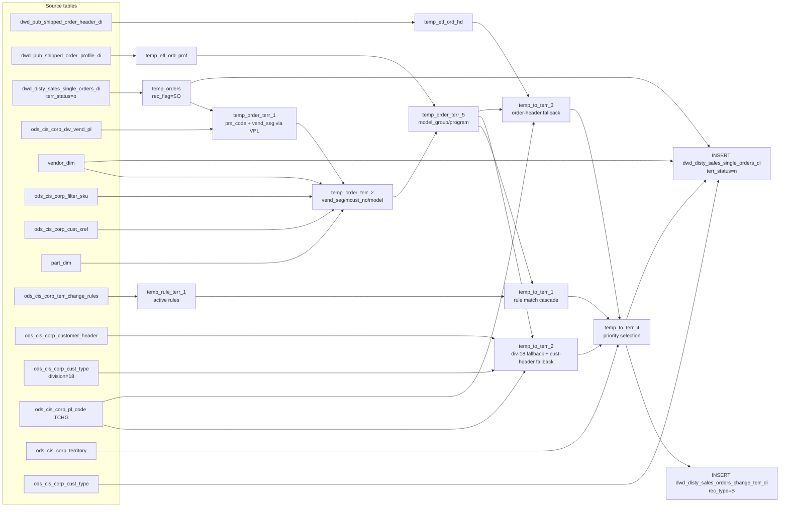

# DWD: Apply Territory Change Rules to Single Orders (`dwd_disty_sales_single_orders_di`)

## Business purpose

This job resolves territory assignment for single (non-kit/standalone) order lines that have not yet had their territory evaluated (`terr_status = 'o'`). It matches each order line against a prioritized set of territory-change rules and, where a rule fires, overwrites the customer territory (`cust_terr`) and vendor sequence (`vend_seq_ord`) on the single-order record. A territory-change audit record is simultaneously written to a shared change-tracking table so downstream jobs can trace which rule triggered each reassignment. Unlike the comp-order equivalent, single orders self-reference their own `order_line_no` as both `kit_no` and `kit_line_no`, and include an additional low-priority fallback path for division-18 non-PCW orders.

---

## What the process does (high level)

| Stage | Business meaning |
|-------|-----------------|
| **Stage data** | Pull single orders pending territory evaluation and their shipped-order header/profile metadata for the current date |
| **Enrich key attributes** | Resolve vendor segment and pm_code through vendor PL (with alternate VPL lookup); resolve master customer number via cross-reference; attach part model and SKU profile |
| **Append model/program** | Join order profile records to tag each order line with its model group and program name |
| **Load rules** | Snapshot active territory-change rules valid on the processing date |
| **Match orders to rules** | Four-priority cascade (by cust_no → mcust_no → vpl_no → attribute-only) produces a candidate set of `(order, rule, to_terr)` triples |
| **Fallback territory resolution** | Three safety-net paths: division-18/non-PCW low-priority assignment; customer-header `sales_terr` marked TCHG; order-header `sales_terr` marked TCHG |
| **Priority selection** | Keep highest `seq`, break ties by highest `rule_no`, exclude sentinel `to_terr = -1` and `order_type = 20` |
| **Write audit record** | INSERT into territory-change audit table with `rec_type = 'S'` |
| **Write updated orders** | INSERT single orders back with applied territory (`terr_status = 'n'`), updating `cust_type`, `cust_terr`, `vend_seq_ord` where a rule fired |

**Parameters:** `${date_flag}`, `${target_db}`, `${source_db}`, `${dim_db}`, `${vendor_table_name}`, `${part_table_name}`, `${etl_timestamp}`, `${company_no2}`

---

## Who it helps and how

| Audience | How they benefit |
|----------|-----------------|
| **Sales Operations / Territory Management** | Ensures every shipped single-order line carries the correct territory assignment before downstream reporting; the audit table provides traceability to the firing rule |
| **Sales Reporting & BI** | `cust_terr` and `vend_seq_ord` on the output table are the authoritative territory fields used in revenue attribution dashboards |
| **Data Engineering** | `terr_status = 'n'` flags records as territory-resolved, signalling readiness for downstream DWS or DM aggregation jobs |

---

## Business query tables (Vertica)

| Role | Hive object | Vertica object | Sync mode | Evidence | MCP verified |
|------|-------------|----------------|-----------|----------|--------------|
| **Not in Vertica** | *See script lineage* | *No Vertica mapping identified in repository* | - | *Add flow evidence when found* | no |

No queryable Vertica table has been confirmed for this script from current repository evidence.

## Grain and keys

- **Grain:** one row per single-order line (`order_type`, `order_no`, `order_line_no`) within a partition.
- **Partition:** `date_flag` — the ship/processing date; `terr_status` — status after this job writes `'n'` (done).
- **Natural key:** `order_type`, `order_no`, `order_line_no` within `date_flag`.

---

## Data you can fetch and use downstream

### Identifiers and relationships

- **Order:** `order_type`, `order_no`, `order_line_no`
- **Self-referential kit fields:** `kit_no = order_line_no`, `kit_line_no = order_line_no`, `kit_sku_no = sku_no` (single orders are their own kit reference)
- **Customer:** `cust_no`, `mcust_no`, `cust_loc_no`, `company_no`
- **Vendor / Product:** `vend_no`, `sku_no`, `part_no`, `pm_code`

### Dimension columns (reporting-ready, pre-computed from source)

- `cust_terr` — territory assigned after rule evaluation (updated from original if a rule fired)
- `cust_type` — customer type, updated to `to_cust_type` when a rule fires (else original)
- `vend_seg` — vendor segment after multi-stage priority resolution (vendor PL alt_seg → vendor dim → filter-SKU)
- `vend_seq_ord` — vendor sequence order, replaced by `to_terr` when a territory rule fires
- `division` — resolved via `ods_cis_corp_cust_type` at INSERT time; falls back to original division
- `sales_team`, `ship_method`, `from_loc_no`, `to_zip`, `cust_region`, `cust_zip` — geography / channel dims

### Quantity, pricing, and cost building blocks

- `ship_qty` — shipped units
- `u_cost`, `u_price`, `base_cost`, `sales_cost`, `vpo_cost` — unit-level cost/price components
- `grid_price`, `retail_price`, `std_whls_price` — catalogue price reference fields
- `u_sum_expense`, `sales_total` — line-level revenue and expense totals

### Core derived metrics

| Column | Formula | Business reading |
|--------|---------|-----------------|
| `cust_terr` (updated) | `CASE WHEN rule matched THEN t.to_terr ELSE dwo.cust_terr END` | Territory to which revenue is attributed after correction |
| `vend_seq_ord` (updated) | `CASE WHEN rule matched THEN t.to_terr ELSE dwo.vend_seq_ord END` | Vendor sequencing order after territory realignment |
| `rule_no` | Highest-priority rule that fired (`-9999` = div-18 low priority; `99000` = customer-header fallback; `99001` = order-header fallback) | Audit field identifying which rule caused the territory change |

---

## Metrics business users typically care about

When exposing this table to the business, lead with:

1. **Revenue attribution:** `sales_total`, `u_price`, `ship_qty` grouped by the corrected `cust_terr`
2. **Cost analysis:** `u_cost`, `base_cost`, `sales_cost`, `vpo_cost` per territory/vendor
3. **Territory audit:** `rule_no` to identify which rule drove a reassignment

---

## End-to-end flow (summary)

**Runtime parameters:** `${date_flag}`, `${target_db}`, `${source_db}`, `${dim_db}`, `${vendor_table_name}`, `${part_table_name}`, `${etl_timestamp}`, `${company_no2}`
**Target tables:**
- `${target_db}.dwd_disty_sales_orders_change_terr_di` partitioned by **`date_flag`**, **`rec_type`**
- `${target_db}.dwd_disty_sales_single_orders_di` partitioned by **`date_flag`**, **`terr_status`**

1. Read shipped order header and profile into temp tables for the date.
2. Pull single orders with `terr_status = 'o'`; self-assign `kit_line_no = order_line_no`, `kit_no = order_line_no`, `kit_sku_no = sku_no`; tag `rec_flag = 'SO'`.
3. Enrich vendor segment and pm_code: resolve `alt_vpl_no` from vendor PL (CTE ot2), then override `vend_seg` with `alt_seg_code` from vendor PL (final join).
4. Further enrich: override `vend_seg` from vendor dim, then from filter-SKU; resolve `mcust_no` via customer cross-reference; attach `model` and `sku_profile` from part dim.
5. Attach `model_group` (profile type MODELGROUP, cat ORDL, keyed on `order_line_no`) and `program` (profile type PROG_NAME, cat ORDR).
6. Load active territory-change rules valid on `date_flag`.
7. Match orders to rules via four cascading INNER JOINs (cust_no priority → mcust_no → vpl_no → attribute-only).
8. Compute low-priority fallback for division-18, non-PCW orders where `company_no2 = 1` (`rule_no = -9999, seq = -99`).
9. Compute fallback from customer-header `sales_terr` (TCHG codes, `rule_no = 99000, seq = 99`).
10. Compute fallback from order-header `sales_terr` (TCHG codes, `rule_no = 99001, seq = 100`).
11. UNION all candidates; select highest `seq`, break ties by highest `rule_no`; filter out `to_terr = -1` and `order_type = 20`; join territory table for `to_cust_type`.
12. **INSERT** audit records into `dwd_disty_sales_orders_change_terr_di` with `rec_type = 'S'`.
13. **INSERT** updated single orders into `dwd_disty_sales_single_orders_di` with `terr_status = 'n'`, applying `to_terr`/`to_cust_type` where matched; enrich `division` and `vend_seg` from dims.

---

## Base tables register

| Object | Role in this job |
|--------|-----------------|
| `${target_db}.dwd_pub_shipped_order_header_di` | Shipped order header; used to look up header-level `sales_terr` for fallback territory assignment |
| `${target_db}.dwd_pub_shipped_order_profile_di` | Order profile attributes; provides `model_group` (MODELGROUP/ORDL) and `program` (PROG_NAME/ORDR) per order line |
| `${target_db}.dwd_disty_sales_single_orders_di` | Primary source — single order lines awaiting territory resolution (`terr_status = 'o'`); also the INSERT target (`terr_status = 'n'`) |
| `${source_db}.ods_cis_corp_dw_vend_pl` | Vendor PL table; provides `alt_vpl_no` (pm_code override) in CTE ot2 and `alt_seg_code` (vend_seg override) in the final join of `temp_order_terr_1` |
| `${dim_db}.${vendor_table_name}` | Vendor dimension; provides `vend_seg_code` in `temp_order_terr_2` CTE ot1, and final `vend_segment` at INSERT |
| `${source_db}.ods_cis_corp_filter_sku` | SKU filter table; provides SKU-level `seg_code` override for `vend_seg` in `temp_order_terr_2` CTE ot2 |
| `${source_db}.ods_cis_corp_cust_xref` | Customer cross-reference (`MASTER_SUB` type); resolves `mcust_no` in `temp_order_terr_2` CTE ot3 |
| `${dim_db}.${part_table_name}` | Part dimension; provides `model` and `jv_business` (as `sku_profile`) per SKU |
| `${source_db}.ods_cis_corp_terr_change_rules` | Territory-change rule definitions; effective-dated by `beg_date`/`end_date` |
| `${source_db}.ods_cis_corp_customer_header` | Customer master; provides `sales_terr` for fallback territory |
| `${source_db}.ods_cis_corp_cust_type` | Customer type dimension; provides `division` filter for div-18 fallback and `division` at INSERT |
| `${source_db}.ods_cis_corp_pl_code` | Platform code list; `code_type = 'TCHG'` defines territories eligible for reassignment |
| `${source_db}.ods_cis_corp_territory` | Territory master; provides `cust_type` (`to_cust_type`) for the resolved territory |
| `${target_db}.dwd_disty_sales_orders_change_terr_di` | Written with `rec_type = 'S'`; also read back at INSERT #2 to join resolved `to_terr` onto orders |

**Temporary tables (inside the job only):**
`temp_etl_ord_hd` → `temp_etl_ord_prof` → `temp_orders` → `temp_order_terr_1` → `temp_order_terr_2` → `temp_order_terr_5` → `temp_rule_terr_1` → `temp_to_terr_1` + `temp_to_terr_2` + `temp_to_terr_3` → `temp_to_terr_4` → (INSERT #1) → (INSERT #2)

---

## Step-by-step logic

### Step 1 — `temp_etl_ord_hd`

**Source:** `${target_db}.dwd_pub_shipped_order_header_di`

**Filter:**
- `date_flag = '${date_flag}'`

**What happens to columns:**
- All columns passed through as-is (SELECT *); staging snapshot for order-header fallback territory lookup.

---

### Step 2 — `temp_etl_ord_prof`

**Source:** `${target_db}.dwd_pub_shipped_order_profile_di`

**Filter:**
- `date_flag = '${date_flag}'`

**What happens to columns:**
- All columns passed through as-is; used later to look up `model_group` and `program` by `order_type`, `order_no`, and `profile_no`.

---

### Step 3 — `temp_orders`

**Source:** `${target_db}.dwd_disty_sales_single_orders_di`

**Filter:**
- `date_flag = '${date_flag}' AND terr_status = 'o'`

**What happens to columns:**
- All order columns from the single-orders table passed through directly.
- No join to another table — single orders are self-contained.

**Derived columns in this step:**

| Column | Formula | Plain language |
|--------|---------|----------------|
| `kit_line_no` | `order_line_no` | Self-reference: single orders use their own line no as the kit line no |
| `kit_no` | `order_line_no` | Self-reference: single orders use their own line no as the kit no |
| `kit_sku_no` | `sku_no` | Self-reference: kit SKU is the order's own SKU |
| `rec_flag` | `'SO'` (literal) | Marks this record as a single order throughout the pipeline |

---

### Step 4 — `temp_order_terr_1`

**Structure:** Three CTEs: `ot1` → `ot2` → final SELECT

**Sources:**
- `ot1`: `temp_orders` — initializes `vend_seg` as NULL (cast)
- `ot2`: `ot1` LEFT JOIN `${source_db}.ods_cis_corp_dw_vend_pl` — resolves `pm_code` and `vend_seg`
- Final: `ot2` LEFT JOIN `${source_db}.ods_cis_corp_dw_vend_pl` — second pass for `alt_seg_code`

**Filter:**
- `ot1`: `date_flag = '${date_flag}'`

**Derived columns in this step:**

| Column | Formula | Plain language |
|--------|---------|----------------|
| `vend_seg` (ot1) | `cast(NULL as string)` | Starts as NULL; single orders do not carry a source vend_seg into this pipeline |
| `pm_code` (ot2) | `CASE WHEN b.vpl_no IS NOT NULL THEN nvl(b.alt_vpl_no, b.vpl_no) ELSE a.pm_code END` | If the VPL entry has an alternate VPL number, use it; otherwise keep original pm_code |
| `vend_seg` (ot2) | Resolved to `alt_seg_code` on first VPL join | First attempt at vendor segment from VPL |
| `vend_seg` (final) | `CASE WHEN b.vpl_no IS NOT NULL AND b.vpl_no <> -1 AND b.alt_seg_code IS NOT NULL AND b.alt_seg_code <> '' THEN b.alt_seg_code ELSE a.vend_seg END` | Final VPL-based vend_seg override using the (possibly resolved) pm_code |

> **Note:** The `vend_seg` starts as NULL for single orders and is built up entirely through the VPL resolution chain. This differs from comp orders where `vend_seg` is carried in from the source table.

---

### Step 5 — `temp_order_terr_2`

**Structure:** Three CTEs: `ot1` → `ot2` → `ot3` → final SELECT

**Sources:**
- `ot1`: `temp_order_terr_1` LEFT JOIN `${dim_db}.${vendor_table_name}` (date_flag filter) — vendor dim vend_seg
- `ot2`: `ot1` LEFT JOIN `${source_db}.ods_cis_corp_filter_sku` — SKU-level segment override
- `ot3`: `ot2` LEFT JOIN `${source_db}.ods_cis_corp_cust_xref` — master customer resolution
- Final: `ot3` LEFT JOIN `${dim_db}.${part_table_name}` (date_flag filter) — model and sku_profile

**Derived columns in this step:**

| Column | Formula | Plain language |
|--------|---------|----------------|
| `vend_seg` (ot1) | `CASE WHEN vp.vend_no IS NOT NULL AND vp.vend_seg_code IS NOT NULL THEN vp.vend_seg_code ELSE a.vend_seg END` | Override vendor segment from vendor dimension if a match exists |
| `vend_seg` (ot2) | `CASE WHEN b.sku_no IS NOT NULL THEN b.seg_code ELSE a.vend_seg END` | Override with SKU-level segment code from filter-SKU table |
| `mcust_no` (ot3) | `CASE WHEN cx.cust_no IS NOT NULL THEN cx.xref_no ELSE a.mcust_no END` | Resolve master customer number through MASTER_SUB xref |
| `customer_po` (ot3) | `a.ext_ref` | Renamed for downstream rule matching |
| `model` (final) | `b.model` | SKU-level model from part dimension |
| `sku_profile` (final) | `b.jv_business` | JV business classification from part dimension |

---

### Step 6 — `temp_order_terr_5`

**Source:** `temp_order_terr_2` LEFT JOIN `temp_etl_ord_prof` (twice)

**JOIN conditions:**
- `model_group` join: `order_type`, `order_no`; `profile_no = order_line_no`; `profile_type = 'MODELGROUP'`; `profile_cat = 'ORDL'`; `active = 'Y'`
- `program` join: `order_type`, `order_no`; `profile_type = 'PROG_NAME'`; `profile_cat = 'ORDR'`; `active = 'Y'`

> **Note:** Unlike comp orders where `kit_no` is the profile key, single orders use `order_line_no` directly as the profile key for `model_group`.

**Derived columns in this step:**

| Column | Formula | Plain language |
|--------|---------|----------------|
| `model_group` | `b.profile_c` | Model group code from the MODELGROUP profile entry keyed on `order_line_no` |
| `program` | `c.profile_c` | Program name from the PROG_NAME order-level profile |

---

### Step 7 — `temp_rule_terr_1`

**Source:** `${source_db}.ods_cis_corp_terr_change_rules`

**Filter:**
- `'${date_flag}' >= nvl(t.beg_date, '${date_flag}')` — rule has started
- `'${date_flag}' <= nvl(t.end_date, '${date_flag}')` — rule has not expired
- `t.to_terr IS NOT NULL` — rule has a defined target territory

**What happens to columns:**
- All rule criteria columns passed through; `vend_seg` explicitly cast to string.

---

### Step 8 — `temp_to_terr_1` (four-branch UNION ALL)

**Source:** `temp_order_terr_5` INNER JOIN `temp_rule_terr_1`

Four cascading match strategies in order of specificity. Each branch uses all nullable rule criteria (NULL on rule = wildcard):

| Branch | Required anchor | Description |
|--------|----------------|-------------|
| 1 | `t.cust_no IS NOT NULL` | Match by specific customer number; all other criteria are optional wildcards |
| 2 | `t.cust_no IS NULL AND t.mcust_no IS NOT NULL` | Match by master customer number when no specific customer is set |
| 3 | `t.cust_no IS NULL AND t.mcust_no IS NULL AND t.vpl_no IS NOT NULL` | Match by vendor PL number when no customer anchor exists |
| 4 | `t.cust_no IS NULL AND t.mcust_no IS NULL AND t.vpl_no IS NULL` | Attribute-only match (territory, type, vendor, SKU, etc.) |

**Output columns:** `order_type`, `order_no`, `order_line_no`, `rule_no`, `seq`, `to_terr`, `kit_sku_no`, `vend_seq_ord`

---

### Step 9 — `temp_to_terr_2` (two-branch UNION ALL)

**Source:** `temp_order_terr_5` INNER JOIN `ods_cis_corp_customer_header` + `ods_cis_corp_cust_type`

This is the key difference from the comp-order script: `temp_to_terr_2` has **two** UNION branches for single orders:

**Branch 1 — Division-18 low-priority fallback:**

| Attribute | Value |
|-----------|-------|
| `rule_no` | `-9999` |
| `seq` | `-99` |
| `to_terr` | `b.sales_terr` from customer header |

**Filter:**
- `dwo.vend_seg != 'PCW'` — exclude PCW vendor segment
- `c.division = 18` — customer type must be division 18
- `nvl(dwo.from_ref_type, 1) <> 41` — exclude reference type 41
- `${company_no2} = 1` — runtime parameter gates this entire branch

This is a company-specific low-priority assignment that applies before explicit rules (`seq = -99`).

**Branch 2 — Customer-header TCHG fallback (same as comp orders):**

| Attribute | Value |
|-----------|-------|
| `rule_no` | `99000` |
| `seq` | `99` |
| `to_terr` | `b.sales_terr` from customer header |

**Filter:**
- `b.sales_terr` is in `ods_cis_corp_pl_code` where `code_type = 'TCHG'`
- `dwo.cust_terr` NOT in the same TCHG set

---

### Step 10 — `temp_to_terr_3`

**Source:** `temp_order_terr_5` INNER JOIN `temp_etl_ord_hd`

**Filter:**
- `b.sales_terr` is in `ods_cis_corp_pl_code` where `code_type = 'TCHG'`

**Derived columns in this step:**

| Column | Formula | Plain language |
|--------|---------|----------------|
| `rule_no` | `99001` | Synthetic rule number for order-header-based territory override |
| `seq` | `100` | Highest sequence — wins over all other matches |
| `to_terr` | `b.sales_terr` | Target territory taken from the order header |

---

### Step 11 — `temp_to_terr_4`

**Structure:** Three CTEs — `to_terr_0` → `to_terr_1` → `to_terr_2` → `to_terr_3`, then final SELECT

**Source:** UNION ALL of `temp_to_terr_1`, `temp_to_terr_2`, `temp_to_terr_3`

**Priority resolution logic:**

| CTE | What it selects |
|-----|----------------|
| `to_terr_0` | All candidates (union all three sources) |
| `to_terr_1` | Keep only rows where `seq = max(seq)` for that order line — highest seq wins |
| `to_terr_2` | Among `to_terr_1`, keep only rows where `rule_no = max(rule_no)` — highest rule wins on seq tie |
| `to_terr_3` | Remove rows where `to_terr = -1` (sentinel: "do not change") |

**Final SELECT** joins `ods_cis_corp_territory` on `to_terr = sales_terr` to get `to_cust_type`.
Additional filter: `order_type != 20`.

> **Note:** Because `seq = -99` (div-18 fallback) is lower than all explicit rule sequences and `seq = 99`/`seq = 100` fallbacks, the division-18 assignment will only apply when no other rule or fallback fires. Conversely `seq = 100` (order-header) always wins.

---

### Step 12 — Final INSERT #1: `dwd_disty_sales_orders_change_terr_di` (rec_type = 'S')

**From:** `temp_to_terr_4`

**Written columns:** `order_type`, `order_no`, `order_line_no`, `kit_sku_no`, `rule_no`, `seq`, `to_terr`, `to_cust_type`, `vend_seq_ord`, `date_flag` (= `${date_flag}`), `rec_type` (= `'S'`)

**Purpose:** Audit/lookup table recording which single order lines had their territory changed and what rule drove it. Read back immediately in INSERT #2.

---

### Step 13 — Final INSERT #2: `dwd_disty_sales_single_orders_di` (terr_status = 'n')

**From:** `temp_orders` LEFT JOIN `dwd_disty_sales_orders_change_terr_di` (rec_type='S', date_flag) → LEFT JOIN `ods_cis_corp_cust_type` → LEFT JOIN `${dim_db}.${vendor_table_name}`

**Left joins on insert:**

| Join | Keys | Purpose |
|------|------|---------|
| `dwd_disty_sales_orders_change_terr_di` (t) | `order_type`, `order_no`, `order_line_no` | Retrieve the resolved `to_terr` and `to_cust_type` for this order line |
| `ods_cis_corp_cust_type` (c) | `cust_type` | Provides final `division` value |
| `${dim_db}.${vendor_table_name}` (v) | `vend_no` | Provides final `vend_segment` |

**Filter:** `a.rec_flag = 'SO'` (ensures only single orders are written)

**Pass-through columns:** All order attributes from `temp_orders` except fields overridden below. Note: `kit_line_no` and `kit_no` are NOT written to `dwd_disty_sales_single_orders_di` (single orders table does not carry these columns in the output).

**Derived columns computed at INSERT:**

| Column | Formula | Plain language |
|--------|---------|----------------|
| `u_version` | `'!'` (literal) | Marks the record as territory-updated |
| `cust_type` | `CASE WHEN t matched THEN nvl(t.to_cust_type, dwo.cust_type) ELSE dwo.cust_type END` | Apply the rule-derived customer type if a rule fired |
| `cust_terr` | `CASE WHEN t matched THEN t.to_terr ELSE dwo.cust_terr END` | Apply resolved territory if a rule fired |
| `vend_seq_ord` | `CASE WHEN t matched THEN t.to_terr ELSE dwo.vend_seq_ord END` | Vendor sequence is set equal to the resolved territory when a rule fires |
| `division` | `nvl(c.division, a.division)` | Final division from customer-type lookup; falls back to order's own division |
| `vend_seg` | `nvl(v.vend_segment, a.vend_seg)` | Final vendor segment from vendor dim; falls back to pipeline-enriched value |
| `etl_timestamp` | `'${etl_timestamp}'` | ETL run timestamp |
| `terr_status` | `'n'` | Marks record as territory-resolved (done) |

---

## Sentinel and code values

| Value | Meaning |
|-------|---------|
| `terr_status = 'o'` | Input filter: only records awaiting territory evaluation are processed |
| `terr_status = 'n'` | Output: territory evaluation has been applied |
| `rec_flag = 'SO'` | Internal pipeline tag identifying single order records |
| `rec_type = 'S'` | Partition value in the audit table for single order territory changes |
| `u_version = '!'` | Marks records that have been updated by this ETL job |
| `to_terr = -1` | Sentinel meaning "do not change territory"; explicitly filtered out in `temp_to_terr_4` |
| `rule_no = -9999` | Synthetic rule: division-18, non-PCW, company_no2=1 low-priority fallback (lowest seq = -99) |
| `rule_no = 99000` | Synthetic rule: customer-header `sales_terr` is a TCHG territory |
| `rule_no = 99001` | Synthetic rule: order-header `sales_terr` is a TCHG territory (highest fallback priority) |
| `code_type = 'TCHG'` | Platform code category identifying territories eligible for change-territory routing |
| `order_type != 20` | Order type 20 is excluded from territory change processing |
| `xref_type = 'MASTER_SUB'` | Cross-reference type used to resolve master customer numbers |
| `profile_type = 'MODELGROUP', profile_cat = 'ORDL'` | Selects the model-group profile keyed on `order_line_no` |
| `profile_type = 'PROG_NAME', profile_cat = 'ORDR'` | Selects the order-level program name profile |
| `vend_seg != 'PCW'` | Excludes PCW vendor segment orders from the division-18 fallback path |
| `c.division = 18` | Customer type filter for the division-18 fallback territory assignment |
| `from_ref_type = 41` | Excluded reference type in the division-18 fallback path |

---

## Source and dependencies

| Object | Role |
|--------|------|
| `${target_db}.dwd_disty_sales_single_orders_di` | Primary source (terr_status='o') and output target (terr_status='n') |
| `${target_db}.dwd_pub_shipped_order_header_di` | Staged for order-header territory fallback |
| `${target_db}.dwd_pub_shipped_order_profile_di` | Staged for model_group and program lookup |
| `${target_db}.dwd_disty_sales_orders_change_terr_di` | Output (rec_type='S') and immediate read-back for final INSERT |
| `${source_db}.ods_cis_corp_terr_change_rules` | Territory change rule definitions |
| `${source_db}.ods_cis_corp_dw_vend_pl` | Vendor PL for pm_code resolution (alt_vpl_no) and vend_seg |
| `${dim_db}.${vendor_table_name}` | Vendor dim for vend_seg_code and vend_segment |
| `${source_db}.ods_cis_corp_filter_sku` | SKU-level segment code override |
| `${source_db}.ods_cis_corp_cust_xref` | MASTER_SUB customer cross-reference |
| `${source_db}.ods_cis_corp_customer_header` | Customer master for fallback territory |
| `${source_db}.ods_cis_corp_cust_type` | Customer type dimension for div-18 filter and division lookup |
| `${source_db}.ods_cis_corp_pl_code` | TCHG code list for fallback eligibility checks |
| `${source_db}.ods_cis_corp_territory` | Territory master for `to_cust_type` resolution |
| `${dim_db}.${part_table_name}` | Part dimension for `model` and `sku_profile` |

---

## Caveats for interpretation

- `vend_seg` starts as NULL for single orders (unlike comp orders where it is carried from the source table). The entire value is built through the VPL / vendor dim / filter-SKU chain; if none of these lookups match, the final `vend_seg` written will be NULL or will be replaced by the vendor dim's `vend_segment` at INSERT time.
- `pm_code` is itself potentially altered in `temp_order_terr_1` CTE ot2 via `alt_vpl_no`: a single order's product manager code may be remapped before territory matching begins.
- The division-18 fallback branch (`rule_no = -9999, seq = -99`) is gated by the runtime parameter `${company_no2} = 1`. When this parameter is 0, the entire branch produces no rows and has no effect.
- `vend_seq_ord` is overwritten with `to_terr` (a territory code) when a rule fires. This is intentional — the vendor sequence order field carries the resolved territory value in this context.
- `model_group` in `temp_order_terr_5` uses `a.order_line_no` as the profile key (vs comp orders which use `a.kit_no`); for single orders the line itself is the kit reference.
- `kit_line_no` and `kit_no` exist in `temp_orders` as self-references but are included in the final single-orders INSERT — they are passed through via `dwo.kit_line_no` and `dwo.kit_no` from the subquery at lines 774-775.
- Rules with `to_terr = -1` are used to explicitly suppress territory changes for specific order patterns — they are loaded into the candidate set but purged in `temp_to_terr_4`.

---

## Dependencies and notes (verified only)

### Upstream objects (verified)

| Object | Usage | Evidence |
|--------|-------|----------|
| `${target_db}.dwd_disty_sales_single_orders_di` | Primary source filtered to `terr_status = 'o'` | `load_single_orders_apply_terr_change.sql:74-76` |
| `${target_db}.dwd_pub_shipped_order_header_di` | Staged into `temp_etl_ord_hd` | `load_single_orders_apply_terr_change.sql:3-4` |
| `${target_db}.dwd_pub_shipped_order_profile_di` | Staged into `temp_etl_ord_prof` | `load_single_orders_apply_terr_change.sql:9-10` |
| `${source_db}.ods_cis_corp_dw_vend_pl` | Vendor PL joins in `temp_order_terr_1` (ot2 and final) | `load_single_orders_apply_terr_change.sql:122-123, 147-148` |
| `${dim_db}.${vendor_table_name}` | Vendor dim in `temp_order_terr_2` (ot1) | `load_single_orders_apply_terr_change.sql:175-176` |
| `${source_db}.ods_cis_corp_filter_sku` | SKU segment override in `temp_order_terr_2` (ot2) | `load_single_orders_apply_terr_change.sql:199-200` |
| `${source_db}.ods_cis_corp_cust_xref` | Master customer xref in `temp_order_terr_2` (ot3) | `load_single_orders_apply_terr_change.sql:222-225` |
| `${dim_db}.${part_table_name}` | Part dim in `temp_order_terr_2` (final) | `load_single_orders_apply_terr_change.sql:230-232` |
| `${source_db}.ods_cis_corp_terr_change_rules` | Territory change rules | `load_single_orders_apply_terr_change.sql:276-279` |
| `${source_db}.ods_cis_corp_customer_header` | Fallback territory in `temp_to_terr_2` | `load_single_orders_apply_terr_change.sql:557-558, 574-575` |
| `${source_db}.ods_cis_corp_cust_type` | div-18 filter in `temp_to_terr_2` and division at INSERT | `load_single_orders_apply_terr_change.sql:559, 803` |
| `${source_db}.ods_cis_corp_pl_code` | TCHG code list for fallback eligibility | `load_single_orders_apply_terr_change.sql:578-586` |
| `${source_db}.ods_cis_corp_territory` | `to_cust_type` resolution in `temp_to_terr_4` | `load_single_orders_apply_terr_change.sql:646-647` |

### Downstream consumers (verified)

| Object / script | Evidence |
|-----------------|----------|
| `${target_db}.dwd_disty_sales_orders_change_terr_di` (rec_type='S') | Written at line 651; read back at line 797 in the same script |
| `${target_db}.dwd_disty_sales_single_orders_di` (terr_status='n') | Written at line 666 |

### Operational detail (verified)

- `INSERT OVERWRITE ... PARTITION (date_flag, terr_status)` — full overwrite of the `date_flag + terr_status='n'` partition on each run.
- `INSERT OVERWRITE ... PARTITION (date_flag, rec_type)` — full overwrite of the `date_flag + rec_type='S'` partition on each run.

### Not documented in repository

- Schedule, owner, SLA — not in scripts or configs
- Downstream DWS/DM jobs that consume `dwd_disty_sales_single_orders_di` (terr_status='n') — not identified in this script
- Runtime parameter values (`${target_db}`, `${source_db}`, `${dim_db}`, `${vendor_table_name}`, `${part_table_name}`, `${company_no2}`) — injected at execution time
- Business meaning of `company_no2 = 1` gate on the division-18 fallback

### Related scripts (verified)

- `load_comp_orders_apply_terr_change.sql` — parallel script applying the same territory-change logic to component/kit orders; writes `rec_type='C'` to the same audit table — `source/etl/sql/pos/data_service/pos/sql/load_comp_orders_apply_terr_change.sql`

---

*Document generated from `source/etl/sql/pos/data_service/pos/sql/load_single_orders_apply_terr_change.sql`.*
